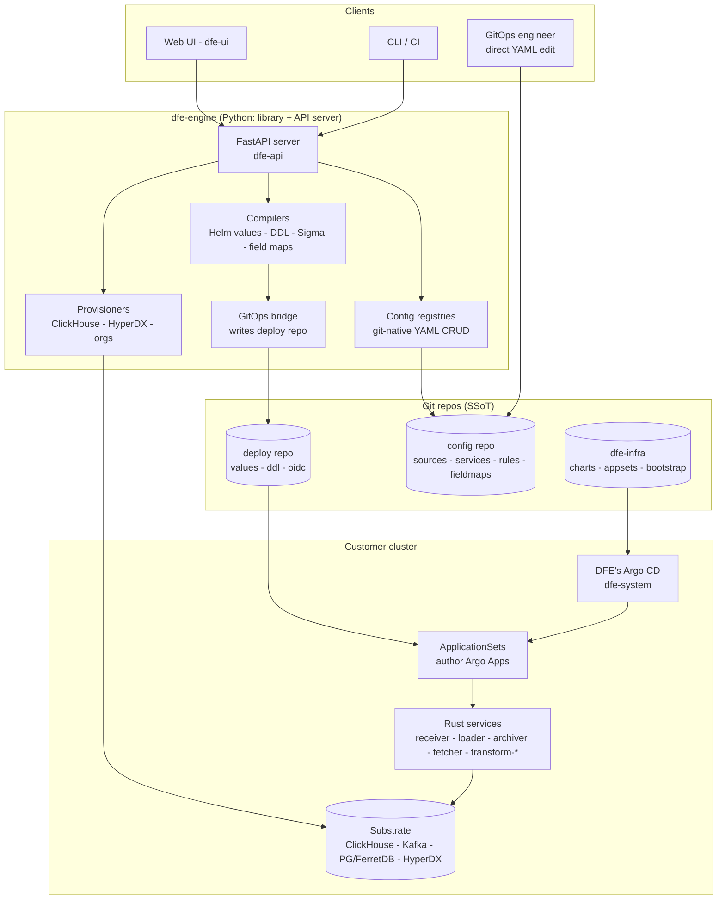
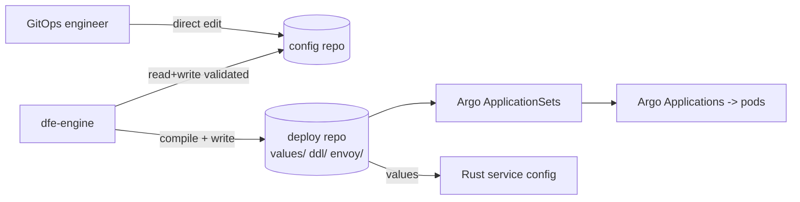
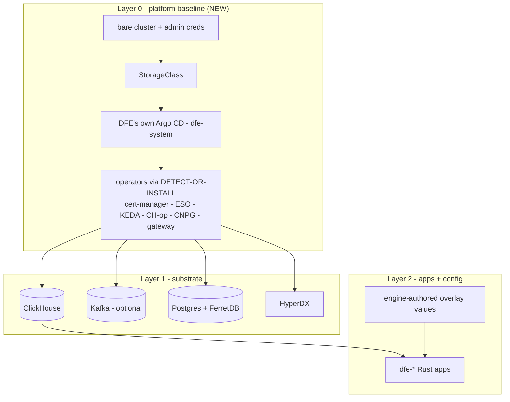
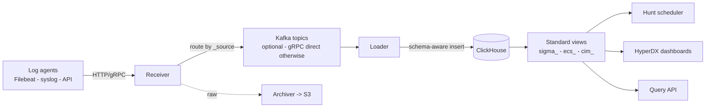

# DFE Architecture

**Status:** Current (supersedes the old DESIGN.md)
**Applies to:** DFE 2.2

This document describes how DFE actually works today, end to end: the engine, the
config and deploy repos, the layered deployment model, the data substrate, and
the runtime data path. It is grounded in the current code, not a proposal.

---

## 1. First principles

These constraints shape every decision below. Read them first.

1. **DFE is a generic product, not an internal tool.** It ships into a
   customer's Rancher / EKS / GKE / AKS cluster that DFE operators will never
   have access to. No code may hardcode anything site-specific (no HyperI
   domains, node names, IPs, or shared infrastructure). HyperI's own clusters
   are just one more deployment.

2. **YAML + git is the single source of truth.** There is no config database.
   Every piece of configuration is a YAML file in a git repo. Rust runtime
   services read their config files directly; the engine reads and writes them
   through an in-memory, git-aware store.

3. **The engine is the config control plane, never the substrate installer.**
   The engine turns dials (writes config). It does NOT deploy ClickHouse, Kafka,
   Postgres, or author Argo Applications. That is the deployment layer's job.
   See section 11, the engine<->infra boundary - it is a hard rule.

4. **Assume only a bare cluster.** The deployment may assume a conformant
   Kubernetes cluster + cluster-admin creds + working CNI + image pulls. It may
   NOT assume a default StorageClass, a LoadBalancer, any operator, Argo CD, or
   gateway CRDs. Everything above the bare cluster, DFE brings and installs
   itself (detect-or-install). See section 7, Layer 0.

5. **Minimum onboarding input.** A deployer should provide the bare minimum (a
   domain DFE owns, an account/creds, optionally a deploy-repo URL + network
   ranges) and the deployment layers do the rest with sensible defaults.

---

## Governed Ops (the operating model)

**Governed Ops** is DFE's term for how every operational change is made. All
change - deployment dials, detection hunts, data-model config, access control - is
a versioned YAML change in a git repo, made through one governed path. The engine
exposes this as the **Governed Ops API**: a uniform CRUD-over-gitops surface where

- everything is YAML in git, so one generic git-native engine handles every
  resource class the same way (no per-resource plumbing);
- access is granted at a high level - by resource class, by a named *action*, or
  by an *operation* - never per individual field, which keeps the security surface
  small and the policy easy to reason about;
- every change is committed to git, which is the single source of truth AND the
  authority; Argo reconciles it to the cluster. The engine never changes the live
  cluster directly.

Because authority lives in git, DFE stays fully operable from the repos alone: if
the engine and UI are unavailable, the running system is unaffected and can still
be managed by editing the repos directly. The engine and UI are convenience and
governance layers over that git-backed model, not a separate source of truth.

Operational tasks fit the same model: a "restart" or "scale" is an ordinary YAML
change, a "rollback" is a git revert, and a "sync" is simply the commit. Curated
*actions* bundle a set of changes behind a single permission (the safe surface for
operators), while raw class-level CRUD is reserved for administrators. Every change
is audited and carries the actor, the permission used, and the resulting commit.

The unified Governed Ops API surface is being rolled out in DFE 2.2; the model and
its principles (YAML+git source of truth, engine as control plane) already describe
how the engine operates today. Commit conventions for this path are in
docs/GITOPS-COMMIT-STANDARD.md.

---

## 2. Component map



**The repos:**

- **config repo** - the engine's own working data: sources, service configs,
  deployment configs, field maps, rules/hunts, OIDC providers, accounts/groups.
  Read-and-written by the engine; also editable directly by a GitOps engineer.
- **deploy repo** - the GitOps hand-off surface. The engine WRITES compiled Helm
  overlay values, ClickHouse DDL, and rendered OIDC config here. Argo CD (via
  ApplicationSets) READS it. Provider-agnostic: GitHub, GitLab, or in-cluster
  Forgejo (section 8).
- **dfe-infra** - the deployment vehicle: Helm charts, ApplicationSets,
  bootstrap. The pinned base every deployment starts from. Not written by the
  engine.

In small/standard deployments the config repo and deploy repo can be the same
repo with different subtrees (`config/` and `values/` + `ddl/`).

---

## 3. The engine: API server

dfe-engine is BOTH a pip-installable Python library and a FastAPI server. (The
old dfe-control-plane is gone; its API was absorbed into the engine.)

- **App factory:** `src/dfe_engine/api/app.py` - `create_app()` bootstraps every
  registry, auth store, and the OIDC provider registry in a lifespan context.
- **Entry point:** `dfe-api` (`pyproject.toml [project.scripts]`) starts uvicorn.
- **Routers:** ~20+ under `src/dfe_engine/api/v1/` covering auth, accounts,
  groups, api-keys, roles, oidc-providers, orgs, sources, services, deployments,
  fieldmaps, rules, alerts, schemas, sigma, hunts, queries, pipeline, tasks,
  discovery, cel, system.
- **Health:** `GET /api/v1/system/health`, port 8000.

### Authentication (four paths)

Implemented in `src/dfe_engine/auth/` and `api/deps.py`:

1. **OIDC** - external IdP. In Kubernetes the OIDC handshake happens at the edge
   (Envoy Gateway / oauth2-proxy) and the engine trusts `X-Oidc-*` headers. The
   engine OWNS the OIDC provider registry (config is engine SSoT). See section 9.
2. **JWT Bearer** - `POST /api/v1/auth/login` (local accounts) issues a PyJWT
   token; `/auth/refresh` renews it.
3. **API key** - hashed short-token + metadata, admin-issued.
4. **Disabled** - for trusted-network / dev.

### RBAC

YAML-defined roles (`auth/roles.py`), with AccountStore, GroupStore,
APIKeyStore, and an OIDCProviderRegistry, all YAML-backed. `require_action()`
does wildcard-matched authorisation. SOC2 audit is emitted as OTel structured
logs (`auth/audit.py`) - no custom audit tables.

---

## 4. The engine: git-native config CRUD

Every config type is a registry backed by `DirectoryConfigStore` (from scalo,
formerly hyperi-pylib): an in-memory cache over a YAML directory, with
dulwich-based git-aware writes, background refresh, and change callbacks.

| Registry | Files | Feeds |
|----------|-------|-------|
| SourceRegistry | `{name}.yaml` | receiver routing, schema, field maps |
| ServiceConfigRegistry | `{service}-{instance}.yaml` | Rust service runtime config |
| DeploymentConfigRegistry | `{service}-{instance}.yaml` | K8s deploy dials (image, replicas, resources, KEDA) |
| FieldMapRegistry | per standard/source | Sigma/ECS/CIM translation |
| Hunt / rule registries | `{namespace}/{name}.yaml` | scheduled detections |
| OIDCProviderRegistry | `oidc-providers/{name}.yaml` | auth federation |
| Org registry | per org | tenant provisioning |

**Write model - read-before-write with blob-SHA ETags.** Git blob SHAs are
natural content-addressable ETags. A read returns `ETag: <blob-sha>`; a write
sends `If-Match: <blob-sha>`; if the file moved underneath, the API returns
`409 Conflict` with a diff rather than clobbering a human or CI edit. The engine
is the preferred writer but never the exclusive one.

**YAML 1.1 gotcha.** DirectoryConfigStore loads via PyYAML (YAML 1.1), where
`off`/`yes`/`no` become booleans. Identity is taken from the FILENAME, never from
a field inside the YAML. (The engine's own serialisation uses ruamel YAML 1.2 via
`dfe_engine.yaml_utils`.)

---

## 5. The engine: compilers and the GitOps bridge

The engine compiles its config into deployment artifacts and writes them to the
deploy repo. It writes config and DDL - NOT Argo Applications.

### Compilers

- **HelmValuesCompiler** (`helm/compiler.py`) - merges the deployment-config
  layer (K8s dials: image, replicas, resources, KEDA) with the service-config
  layer (runtime behaviour) plus source routing, into one Helm overlay per
  service-instance. Output uses `exclude_none` so the overlay only carries
  what the engine actually set, letting base-chart defaults show through.
- **DDL writer** (`schema/ddl_writer.py`) - topology-aware: `single` emits
  MergeTree; `replicated` emits ReplicatedMergeTree `ON CLUSTER`. The engine
  emits the DDL that matches the substrate it was told it is deploying into.
- **Sigma converter** (`sigma/`) - reads Sigma YAML, applies field maps, and
  transpiles to ClickHouse SQL via the pySigma ClickHouse backend.
- **Field-map resolver** (`fieldmap/resolver.py`) - section 8 of the old design,
  still accurate; see section 10 below.

### The GitOps bridge

`gitops/` wraps a deploy-repo round trip:

- `GitopsRepo` (`gitops/repo.py`) - dulwich clone/init/add/commit/push with
  embedded HTTPS auth. Works against any git remote.
- `collect_deploy_artifacts()` (`gitops/artifacts.py`) - a pure function
  returning `{repo_path: content}`:
  - `values/{service}-{instance}-values.yaml` - Helm overlay values
  - `ddl/{table}.sql` - ClickHouse DDL
  - `envoy/oidc-values.yaml` - rendered (non-secret) OIDC config
- `render_envoy_oidc_values()` (`gitops/oidc.py`) - materialises the engine's
  OIDC provider registry into values the envoy-gateway-config chart consumes.
  Client secrets are NOT written here - ESO materialises those from Vault.
- CLI: `dfe-api gitops publish/render` (`cli/gitops.py`).

**Important:** the Helm compiler still GENERATES `argo_applications` /
`argo_appproject` / `argo_rbac_csv` objects, but they are NOT published to the
deploy repo - they are legacy by-products. The ApplicationSets in dfe-infra own
Argo App authorship. This is the boundary in code form.

### Provisioners (opt-in)

Guarded by `DFE_ORG_PROVISIONING_ENABLED`, non-fatal on error:

- `orgs/ch_provisioner.py` - per-org ClickHouse user + database for tenants with
  `dedicated_database=True`.
- `connections/reconciler.py` - ensures static CH users + row policies (tenant
  isolation via a `current_tenant_id` setting on tables with an `org_id` column).
- `hyperdx/` - HyperDX tenant connection provisioning.

---

## 6. Config repo and deploy repo

The engine reads/writes the **config repo** (its working data) and writes the
**deploy repo** (the GitOps hand-off). Consumers:



The deploy repo layout the ApplicationSets expect:

```
deploy/
  values/<service>-<instance>-values.yaml   # one per service instance (deploy: {service, instance} block)
  ddl/<table>.sql                           # ClickHouse schema
  envoy/oidc-values.yaml                    # rendered OIDC config
  config/                                   # engine config subtree (when colocated)
```

A git-files ApplicationSet generator fans out one Argo Application per
`values/*-values.yaml`. Adding or removing a service instance is an engine git
write, not an appset edit - the engine declares instances, the appset deploys
them. Boundary-clean.

---

## 7. Layered deployment model

DFE deploys in three layers. This mirrors 2.1's dfe-core (a TF prep stage + an
operator app-of-apps) but as GitOps.



### Layer 0 - platform baseline

The deployment assumes ONLY a bare cluster. `bootstrap/bootstrap.sh` lays down
the baseline with a **detect-or-install** probe for every dependency: if a
healthy controller + CRDs are present, ADOPT it (create only DFE's own CRs);
if absent, INSTALL a DFE-owned copy. Covered: a default StorageClass
(local-path fallback), cert-manager, External Secrets, and Argo CD itself.

**Two Argo instances coexist.** DFE installs its own Argo into `dfe-system`,
scoped via `--application-namespaces` + an instance label so it reconciles only
`dfe-*` namespaces and DFE-labelled apps. On a bare cluster it is the only Argo;
on a cluster that already runs Argo/Rancher it sits beside the host's untouched.
The hard part is cluster-singleton operators (one CRD, cannot have two
controllers fighting) - that is exactly what detect-or-install handles.

### Layer 1 - substrate

ClickHouse, optionally Kafka, Postgres+FerretDB, and HyperDX, deployed by DFE's
Argo via ApplicationSets (`argocd/appsets/layer2-data.yaml`). DFE deploys its
OWN substrate; it never piggybacks a shared one. See section 8 for modes.

The substrate is **decoupled from the deploy repo**: layer2-data is a single
source (base chart + profile/cloud values only) and does not reference the
deploy repo, so the substrate comes up even before any external git or in-cluster
git host exists. (This decoupling was validated live: the full substrate reaches
Healthy on a bare cluster with no deploy repo present.)

### Layer 2 - apps + config

The dfe-* Rust apps, each as a base chart in dfe-infra plus an engine-authored
overlay from the deploy repo, merged base-then-overlay so the engine's values
win. The layer2-apps ApplicationSet is a matrix of (clusters x git-files over
`values/*-values.yaml`) - one Application per service instance.

### Base + overlay merge (the deployment overlay model)

ONE mechanism: an ApplicationSet whose Applications are multi-source - source 1
is the pinned dfe-infra base chart at a target revision, source 2 is the deploy
repo's overlay file layered last via `$values`. The engine turns dials through
the overlay; it never authors Applications. The crux: base charts must expose
every dial as a Helm value.

App shapes: singleton-scaled (receiver/loader/engine/ui - one values file each)
vs multi-instance (fetcher and optional archiver/transforms - N files, each its
own config). KEDA scaling is folded into each app chart, scaling on the scalo
ScalingPressure composite (gated on downstream health), not raw consumer-group
lag.

### Deployment tiers

Four tiers, smallest to largest. The first is Docker; the rest are Kubernetes
profiles selected by the cluster secret's `dfe.hyperi.io/profile`.

| Tier | Platform | Transport | Kafka | Sizing | Shape |
|------|----------|-----------|-------|--------|-------|
| **dfe-docker** | Docker Compose (NOT k8s) | gRPC | no | minimal | SME / single-host; anything smaller than `slim` |
| **slim** | k8s | gRPC (receiver->loader direct) | **no** | minimum-viable + safety | bare-minimum k8s; smallest |
| **single** | k8s | Kafka | **yes** (single broker) | reliability | one node of everything, with Kafka |
| **scale** | k8s | Kafka | **yes** (multi-broker cluster) | reliability | everything clustered (ReplicatedMergeTree + dedicated Keeper) |

A tier sets defaults; a deployer overrides any single dial.

### Default deployment composition (k8s)

**slim** - the bare minimum. Only the essential pods:

- `dfe-engine` + `dfe-ui` + **HyperDX** (always present - see below), and the
  ingest path: **only** `dfe-receiver` + `dfe-loader`. NO archiver, fetcher, or
  transform workers by default (the slim deploy repo omits their
  `values/*-values.yaml`; add them later).
- gRPC transport, **no Kafka**, no web infra UIs unless cheap (Kafbat off; Argo CD
  runs headless; Forgejo only as the deploy-repo fallback).
- Pods sized to minimum-viable + safety headroom.

**single** - slim's components but **+ Kafka + Kafbat**, all still single-node,
pods sized for reliability. This is the difference from slim: a real Kafka path
(single broker) and the Kafbat UI (default integrated-app auth pattern).

**scale** - the single set, clustered: ReplicatedMergeTree ClickHouse + dedicated
Keeper, multi-broker Kafka, multi-instance CNPG, reliability sizing.

All k8s tiers also bring the **data substrate** (ClickHouse, Postgres+FerretDB)
and **all Layer 0 platform services** (DFE-owned Argo CD + detect-or-install
operators + StorageClass/LB baseline).

**HyperDX is ALWAYS present, in EVERY tier (docker, slim, single, scale) - never
optional.** It serves two purposes, which is why DFE ships an extended fork:

1. **Separate self-monitoring telemetry sink.** It is the default destination for
   the stack's own OTel (see telemetry seam) - deliberately separate so
   monitoring does not depend on the data pipeline working (best practice).
2. **The data-discovery UI over ALL DFE data.** Its UI is embedded in dfe-ui as
   the Kibana-style explore/discovery surface across *all* of DFE's data in
   ClickHouse - not just HyperDX's own OTel telemetry. The extended fork exists
   precisely to point HyperDX at the DFE tables, not only its telemetry schema.

So HyperDX is a core product component (the explore UI), not an add-on.

Implementation: tier behaviour lives in `argocd/values/profile-<tier>.yaml`
(`profile-slim` / `profile-single` / `profile-scale`). Kafka+Kafbat are gated by
those values (`kafka.mode` + kafbat `enabled`). The full app set (which Rust
services deploy) is the deploy repo's `values/*-values.yaml` set, so slim's
omission of archiver/fetcher/transforms is a deploy-repo composition, not a chart
change.

> DESIGN FLAG (2026-06-29): `single`/`scale` enabling Kafka needs the Strimzi
> operator present in those tiers - it is currently installed scale-only
> (`layer-scale.yaml`). Resolve by gating the operator install on (single|scale)
> or adding a non-operator single-broker Kafka path (mirroring ClickHouse single).
> Until then, `single` with `kafka.mode: single` will create a Kafka CR with no
> controller. (Also: the old `standard` profile was renamed - clusters annotated
> `profile=standard` must move to `slim` (gRPC) or `single` (kafka).)

---

## 8. Deploy-repo providers and data-substrate modes

### Deploy-repo providers (provider-agnostic seam)

The deploy repo is just `config_repo_url` + revision + credentials. Expected
mix: GitHub ~85%, GitLab ~10%, in-cluster Forgejo ~5%. There is NO hard
git-server dependency (the substrate does not depend on it).

- **External git PRIMARY** (GitHub / GitLab) - the deployer sets
  `DFE_CONFIG_REPO_URL` + creds (`DFE_CONFIG_REPO_TOKEN`+`_USER` for HTTPS, or
  `DFE_CONFIG_REPO_SSH_KEY`). bootstrap creates the Argo `repo-deploy`
  repository secret. No in-cluster git is deployed.
- **Forgejo FALLBACK** (in-cluster) - deployed ONLY when no external URL is
  given, gated on the cluster label `dfe.hyperi.io/bundled-deploy-repo: "true"`.
  Forgejo (chosen over Gitea for community governance + maintenance; it is
  Gitea-API-compatible) hosts the deploy repo for tyre-kicking / air-gapped use.
  Pulled from the canonical `code.forgejo.org` registry. It is never a hard
  dependency.

All three providers use the same downstream mechanism (an Argo repository
credential + a git-files generator); from Argo's perspective GitLab and GitHub
are identical external remotes.

### Data-substrate modes

DFE deploys its own data layer, mode-driven (`argocd/values/*.yaml` +
cluster-secret annotations):

- **ClickHouse** - `single` (keeperless, MergeTree, small/test), `cluster`
  (DFE-owned Keeper, ReplicatedMergeTree), or `external` (BYO / ClickHouse
  Cloud; connect only, deploy nothing). The admin password is generated
  in-cluster by an ESO Password generator - no external secret backend required.
- **Kafka** - Strimzi by default, Redpanda opt-in (BSL licence gate), or
  external (incl. MSK IAM). In the standard profile with gRPC transport, Kafka
  is omitted entirely.
- **Postgres + FerretDB** - via CloudNativePG; FerretDB provides the Mongo wire
  protocol on a DocumentDB-extension Postgres backend.

---

## 9. Security and identity

### OIDC dual-mode

External OIDC works the same way in two topologies through one universal seam,
the `X-Oidc-*` header contract:

- **Kubernetes** - Envoy Gateway terminates OIDC at the edge (config from the
  engine via the deploy repo; client secret via ESO from Vault) and injects
  `X-Oidc-*` headers.
- **SME / docker** - oauth2-proxy behind Caddy/Traefik does the same, injecting
  the same headers.

One `DFE_OIDC` config feeds both; the engine is the OIDC config SSoT and never
sees the raw IdP handshake in the K8s path. Local auth (JWT) is the first-class
default; OIDC is layered config, not a deploy-time prerequisite.

### Secrets

External Secrets Operator (ESO) is the secret backend abstraction. On a real
cluster ESO pulls from the customer's Vault / cloud secret manager; where no
backend exists (a bare test cluster), ESO's in-cluster generators
(Password, etc.) produce credentials with no external dependency. DFE never
stores long-lived secrets in git.

### Default integrated-app auth pattern (ALL bundled web UIs)

Every integrated web UI DFE bundles - dfe-ui, HyperDX, Argo CD, the deploy-repo
git host (Forgejo/Gitea), Kafbat (Kafka UI), and any future infra UI - follows
ONE auth pattern. Apply it to anything new; do not invent a per-app scheme.

1. **OIDC at the edge.** The Envoy Gateway terminates OIDC for the app's
   HTTPRoute (add the route name to `oidc.targetRoutes` -> a SecurityPolicy is
   generated, one redirectURL per host). The app trusts the injected `X-Oidc-*`
   headers - it never runs its own IdP handshake. Same seam everywhere.
2. **Three RBAC levels, stack-aligned: `ro`, `rw`, `admin`.** Identity (an OIDC
   group/claim, or the local break-glass account) maps to exactly these three
   roles, mirroring the engine's RBAC vocabulary. ro = read/observe, rw =
   read + operate (produce/edit), admin = full control. An app's native RBAC
   (e.g. Kafbat's role definitions) is configured to these three roles and no
   more, so access means the same thing across the stack.
3. **Local break-glass account in the secret store.** Each app keeps ONE local
   admin account for when OIDC is unavailable (IdP outage, bootstrap, air-gap).
   Its credentials live in the secret store (ESO from Vault, or an ESO-generated
   password on a bare cluster) - NEVER in git, NEVER a baked-in default. It maps
   to `admin`. This is the only non-OIDC path and exists purely as the recovery
   door.
4. **Exposure is optional + per-app.** Each UI is reachable only if its
   `routes.<name>.enabled` is set; infra UIs (Argo CD, Kafbat, git host) default
   to internal and are exposed by flipping the flag (DFE's own test deployments
   enable them; a customer chooses). Whether exposed or not, the OIDC + 3-role +
   break-glass contract above still applies.

This is why bundling a new UI is cheap: enable its route, add it to
`oidc.targetRoutes`, configure its native RBAC to ro/rw/admin, and point its
break-glass account at an ESO secret.

---

## 10. Field mapping layer

A generic, standard-agnostic layer translating security/observability standards
(Sigma, Elastic ECS, Splunk CIM) to DFE schema columns. Two-tier resolution:

| Priority | Layer | Description |
|----------|-------|-------------|
| 1 (highest) | source-specific map | per-source field overrides |
| 2 | default table map | standard-wide defaults |
| 3 (lowest) | passthrough | field name used as-is |

Maps are YAML in the config repo (engine-, UI-, or human-editable). Each
standard x source produces a ClickHouse VIEW named `{standard}_{source}` (e.g.
`sigma_windows_audit`) that aliases DFE columns back to the standard's field
names, so a query written in a standard's vocabulary runs transparently against
DFE tables. The Sigma converter is a CONSUMER of this layer, not the owner of
mapping logic.

---

## 11. CEL expression language

CEL is the unified expression standard across all DFE components (Python +
Rust). Python uses `common-expression-language` (PyO3 bindings to the Rust
`cel-interpreter`); Rust uses `cel-interpreter` directly. The DFE profile
restricts CEL to a high-performance subset (no map/filter/exists/all/
timestamp/duration). The engine's CEL classifier (`cel/classify.py`, mirroring
the Rust `classify.rs` byte for byte) sorts expressions into performance tiers so
the receiver/loader know which filters need opt-in guards. A transpiler maps CEL
to ClickHouse SQL (`==`->`=`, `&&`->`AND`, `.contains()`->`position()>0`,
`has()`->`IS NOT NULL`).

---

## 12. The engine <-> infra boundary (HARD RULE)

This is the most important boundary in the system.

- **dfe-infra** = the GitOps SSoT + deployment vehicle. It deploys the core
  substrate (always: engine, HyperDX, PG+FerretDB, ClickHouse, Kafka when not
  using gRPC) and makes the other Rust apps available-but-not-default. It owns
  the charts, the ApplicationSets, and bootstrap.
- **dfe-engine** = the config control plane. It writes config + DDL + OIDC into
  the deploy repo and turns dfe-* app params/scaling dials through overlays. It
  NEVER deploys substrate and NEVER authors Argo Applications.

If you find yourself making the engine install ClickHouse or write an Argo
Application, stop - that work belongs in dfe-infra.

---

## 13. Network model

- **Pod / service CIDRs** are a config value with a sensible non-conflicting
  default: pods `198.18.0.0/16`, services `198.19.0.0/16` (RFC 2544 benchmarking
  space - non-RFC1918, non-CGNAT, low corporate-overlap). The initial deploy can
  accept any other range; CIDRs are immutable once the cluster is started. Canal
  IP-masquerades pod egress to the node IP, so the customer needs no NAT or route
  change.
- **CGNAT `100.64.0.0/10` is reserved SOLELY for the future hyperi-vpn add-on**,
  never for DFE pod/service ranges.
- **Receiver exposure is a values-driven seam.** `receiver.exposure: internal |
  public`. Public renders a second LoadBalancer Service (deployer supplies
  serviceType, annotations, loadBalancerSourceRanges) in a public subnet as the
  only public surface - a single-homed airlock, NOT dual-homing. The receiver
  then talks to internal Kafka (ClusterIP, private); isolation is by
  NetworkPolicy. The deployer applies whatever ingress-path security they prefer.

---

## 14. Runtime data flow



The receiver routes events by their `_source` field (from SourceRegistry); the
loader does schema-aware inserts into topology-correct ClickHouse tables; the
archiver lands raw events in S3. Alert grouping is read-time: ALL matched rows
are written at full fidelity ("suppression = loss of visibility"), and grouping
is a post-insert `SELECT ... GROUP BY` with per-(hunt, rule, customer, group)
cooldown in a ReplacingMergeTree state table, fail-open.

---

## 15. Technology decisions

| Decision | Choice | Rationale |
|----------|--------|-----------|
| Config storage | YAML + git (no DB) | human-readable, versioned, Rust reads directly |
| API host | dfe-engine FastAPI (dfe-api) | dfe-control-plane removed; one artifact |
| Auth | local JWT default; OIDC + API key + disabled | OIDC via X-Oidc-* edge seam |
| Conflict handling | git blob-SHA ETag + 409 | git-native, standard HTTP semantics |
| Deployment | Argo CD + Helm, base+overlay multi-source | engine turns dials, appsets author apps |
| Platform baseline | Layer 0 detect-or-install | assume only a bare cluster |
| Deploy repo | provider-agnostic (GitHub/GitLab/Forgejo) | no hard git-server dependency |
| Substrate | DFE-owned, mode-driven (single/cluster/external) | never piggyback shared infra |
| Secrets | External Secrets Operator (+ generators) | customer Vault, or in-cluster generators on bare |
| Observability | OTel -> ClickHouse -> HyperDX | single storage backend |
| Ingress / OIDC | Envoy Gateway (k8s) / oauth2-proxy (docker) | native OIDC at the edge |
| Expression language | CEL (Python + Rust), DFE subset | one standard, tiered for performance |
| Field mapping | YAML, two-tier (default + source) | human-editable, git-tracked, UI-editable |

---

## 16. Repo map

| Repo | Role |
|------|------|
| dfe-engine | config control plane + API server (this repo) |
| dfe-infra | charts, ApplicationSets, bootstrap - the deployment vehicle |
| dfe-deploy | the deploy/overlay repo (a GitHub external-git example) |
| dfe-schemas | core table/view DDL, deployable with or without the engine |
| dfe-ui | web UI |
| dfe-receiver / loader / archiver / fetcher / transform-* | Rust runtime services (charts live in dfe-infra) |

---

*This document replaces the 2026-03 DESIGN.md, which predated the
control-plane merge, the layered deployment model, and the deploy-repo provider
work, and is intentionally deleted.*
