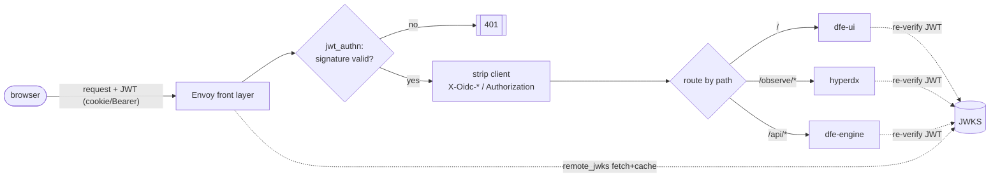

<!--
Project:   DFE (Data Forensics Engine) - product suite
File:      docs/AUTH-ENVOY-TOPOLOGY.md
Purpose:   How the Envoy front auth layer works, and how it differs between
           the Kubernetes and Docker deploy modes.
Language:  Markdown
License:   see repository LICENSE
Copyright: HyperI / DFE contributors
-->

# DFE auth - the Envoy front layer (k8s vs docker)

DFE authenticates every request with **one signed JWT**, verified by **one Envoy
front layer** that behaves **identically** in Kubernetes and Docker. Only the
config delivery and the networking plumbing differ - the auth filter chain,
signature verification and path routing are the same in both. So the auth path
is authored once and tested once, and a token minted in one mode verifies in the
other.

This doc covers the Envoy side. For the identity model (who issues the JWT, the
RBAC/group pivot, local-vs-OIDC), see the auth design notes referenced at the end.

## Where Envoy sits

DFE is served **single-origin**: one host, three upstreams behind it.

- `/` -> dfe-ui (the shell)
- `/observe/*` -> hyperdx (embedded chromeless)
- `/api/*` -> dfe-engine (control plane, PDP, JWT issuer)

Envoy is the single gateway in front of all three. Because it is one origin, the
embed iframe is same-site (no third-party-cookie problem) and the JWT rides every
request - page loads, XHR and streaming alike.

## Request flow (identical in both modes)



There is **one issuer: the engine**. The engine mints every token the apps see -
local logins directly, and external OIDC logins by acting as the relying party (it
validates the IdP's token, then re-mints its own engine token). So Envoy's
`jwt_authn` filter verifies a single provider - the engine JWKS - and the external
IdP's token never travels past the engine.

## What the one Envoy does

1. **Verify** - `jwt_authn` checks the JWT signature (**ES384** - ECDSA P-384
   with SHA-384, `EC` keys) against the engine JWKS, plus issuer and
   expiry. `remote_jwks` fetches and caches each provider's key set.
2. **Sanitise** - strip any client-supplied `Authorization` and `X-Oidc-*`
   headers before they reach an app, so identity cannot be forged by a caller.
3. **Route** - single-origin path routing to the three upstreams.
4. **Forward** - pass the verified JWT upstream; each app re-verifies it
   (defence in depth) and reads `sub` + `groups`.

Envoy never mints a token. Issuance happens elsewhere (see "Issuance" below).

## k8s vs docker

Same binary, same filter chain, same auth behaviour. The differences are where
Envoy sits and how it is configured.

| | Kubernetes | Docker (dfe-docker) |
|---|---|---|
| What Envoy is | the gateway (a Deployment / Gateway-API data plane) behind the cloud load balancer | one `envoy` service in the compose file, on the shared docker network |
| Config delivery | xDS / control plane (or a rendered static config) | a static `envoy.yaml` mounted into the container |
| Upstreams (clusters) | k8s `Service`s (`dfe-engine`, `hyperdx`, `dfe-ui`) | other compose services, by container DNS name |
| JWKS source (`remote_jwks`) | engine `Service` `/.well-known/jwks.json` | engine container `/.well-known/jwks.json` |
| Path routing | Envoy does it (no separate ingress needed) | Envoy does it - this replaces the ingress docker does not have |
| Scale / HA | N Envoy replicas | single container (sufficient for the docker tier) |
| Reachability guard | NetworkPolicy: only Envoy may reach the app pods | docker network isolation: apps not published to the host, only Envoy is |

The single most important consequence: **path routing is free from the ingress in
k8s, but in docker Envoy provides it**. That is why the same component is used in
both - it closes the docker gap rather than adding a second reverse proxy.

## Issuance vs verification

Envoy only verifies, routes, sanitises and forwards. The token is minted by the
identity source:

- **Local auth** - the browser posts to `/api/v1/auth/login` (Envoy routes it to
  the engine); the engine validates the password and signs an **ES384** JWT.
- **External OIDC** - the engine is the **relying party**:
  `/api/v1/auth/oidc/{provider}/login` redirects to the IdP, and the callback
  validates the IdP's token then **re-mints an engine ES384 JWT**. The IdP's token
  stays on the engine<->IdP leg and never reaches the apps.

Either way, the token Envoy (and every app) verifies is the **engine's** ES384
token - one issuer, one JWKS. Merged mode is just both login routes enabled.

## Reference config shape (illustrative)

This is a reference shape of the shared filter chain. The `jwt_authn` provider
block and the route table are identical across modes; the **only** per-mode delta
is the cluster endpoints (Service DNS vs container names).

```yaml
# jwt_authn: one provider - the engine is the single issuer
http_filters:
  - name: envoy.filters.http.jwt_authn
    typed_config:
      providers:
        engine:
          issuer: "https://<origin>/api"           # the engine is the only issuer
          remote_jwks:
            http_uri: { uri: "http://dfe-engine/.well-known/jwks.json", cluster: engine, timeout: 5s }
            cache_duration: 600s
          from_cookies: ["dfe_token"]              # browser flow; also from Bearer
          forward: true                            # pass the verified JWT upstream
      rules:
        # login + JWKS + discovery are public (they issue / expose keys)
        - match: { prefix: "/api/v1/auth/login" }
        - match: { prefix: "/api/v1/auth/oidc/" }
        - match: { prefix: "/.well-known/" }
        # everything else requires a valid engine token
        - match: { prefix: "/" }
          requires: { provider_name: engine }

# route table: single-origin path routing
route_config:
  virtual_hosts:
    - name: dfe
      domains: ["*"]
      request_headers_to_remove: ["x-oidc-subject", "x-oidc-groups"]  # trust boundary
      routes:
        - match: { prefix: "/observe/" }
          route: { cluster: hyperdx }
        - match: { prefix: "/api/" }
          route: { cluster: engine }
        - match: { prefix: "/" }
          route: { cluster: ui }
```

In k8s the `engine` / `hyperdx` / `ui` / `idp` clusters resolve to k8s `Service`s
and the config is delivered by the gateway control plane; in docker they resolve
to compose container names and the same block is mounted as `envoy.yaml`.

## Cryptographic posture (CNSA 2.0)

DFE targets CNSA 2.0 compliance where feasible - national-security deployment is
in scope, so algorithm strength is chosen for compliance, not throughput. The
user base is small and high-value, so signing and cipher CPU cost is not a
constraint.

- **JWT signature: ES384** (ECDSA P-384 + SHA-384) - the CNSA classical /
  CNSA-2.0-transitional algorithm, verifiable across the whole chain (Envoy
  `jwt_authn`, PyJWT, Node `jose`). Ed25519 is deliberately not used: at 128-bit
  security it is below the CNSA target.
- **Post-quantum (roadmap):** CNSA 2.0's target signature is ML-DSA-87 (FIPS
  204), but it is not yet feasible for JWTs - the JOSE binding is an IETF draft,
  Envoy `jwt_authn` cannot verify it, and its ~4 KB signature stresses
  cookie/header limits. The design keeps algorithm agility (kid-tagged keys,
  config-driven `alg`, multi-issuer JWKS) so ML-DSA (or the smaller FN-DSA when
  standardised) is a config change, not a rewrite.
- **Transport:** TLS 1.3, AES-256-GCM, SHA-384, P-384 curves, with hybrid ML-KEM
  key exchange at the Envoy edge where the TLS stack supports it - the CNSA 2.0
  key-establishment step that is feasible today.
- **At rest:** the signing private key is AES-256 wrapped.

Transport, certificate (P-384) and at-rest crypto are handled at the deployment
layer; this document covers the app-signing (ES384 JWT) side.

## Trust boundary

The security root is the **JWT signature** (ES384), verified at Envoy *and* at each
app - forging identity needs the signing key, so it does not depend on the
deployer's network config being perfect. The network controls are defence in
depth:

- apps are reachable **only** via Envoy (NetworkPolicy in k8s; unpublished ports +
  docker network in docker),
- Envoy strips inbound `X-Oidc-*` / `Authorization` so a caller cannot inject
  identity ahead of verification.

## See also

- The DFE auth design (JWT authority, RBAC group pivot, local-vs-OIDC merged) -
  auth design notes / `project_dfe_authz_standard` (agent memory).
- `docs/HYPERDX-FORK-MAINTENANCE.md` - the embedded hyperdx fork.
