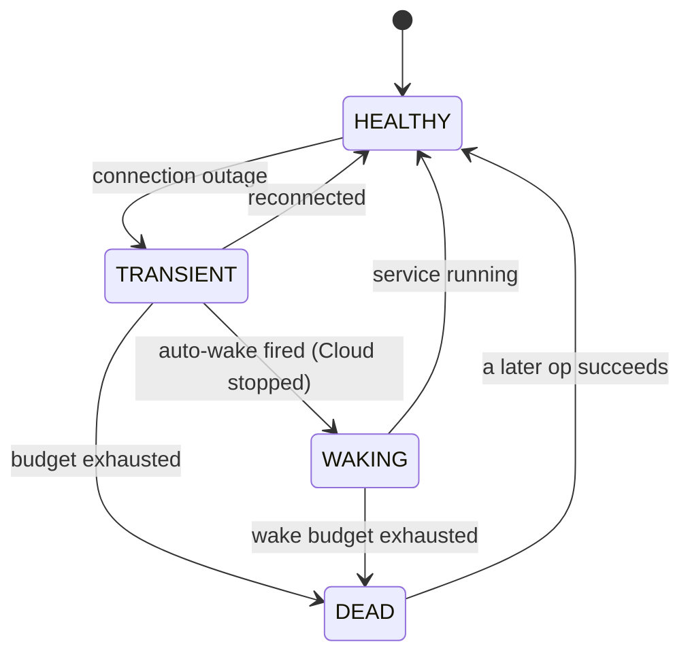
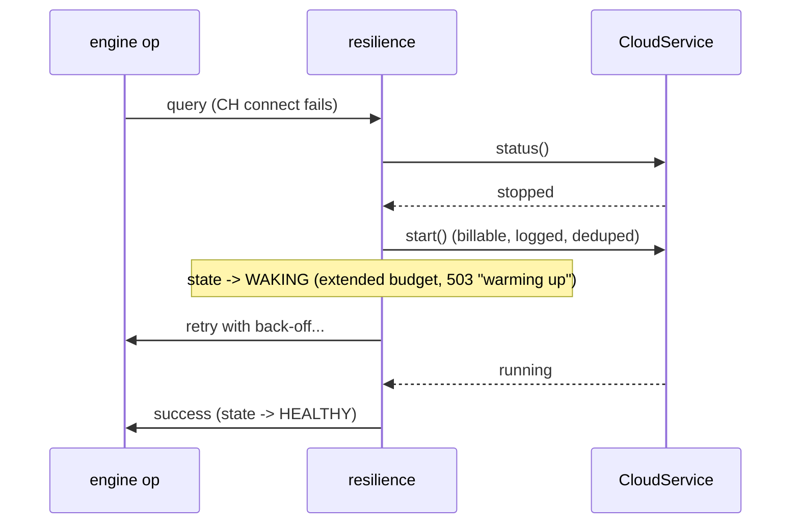

<!--
  Project:      dfe-engine
  File:         docs/CLICKHOUSE-CLOUD.md
  Purpose:      ClickHouse Cloud connection resilience + service lifecycle
  Language:     Markdown
  License:      BUSL-1.1
  Copyright:    (c) 2026 HYPERI PTY LIMITED
-->

# ClickHouse Cloud: resilience + service lifecycle

DFE runs on **self-hosted ClickHouse AND ClickHouse Cloud** unchanged. Two
Cloud-specific concerns get first-class support:

1. **Connection resilience** - the engine survives a CH outage (a network blip, a
   restart, or a Cloud **idle warm-up**) by reconnecting with capped back-off, and
   recovers automatically. Always on; nothing to configure.
2. **Service lifecycle (control plane)** - see / start / stop the Cloud service
   from the API + CLI, plus an opt-in **auto-wake** so a dev pointed at an idle
   service brings it up on demand. Off by default; billable.

The SQL data-plane connection is the regular `clickhouse.*` config pointed at a
`*.clickhouse.cloud` host (`secure=true`). This document covers the CONTROL plane
(`api.clickhouse.cloud`) and the resilience layer - they are separate.

## Connection resilience (Phase 0)

**Bottom line:** every ClickHouse operation retries a CONNECTION outage with
reconnecting exponential back-off up to a GENEROUS, config-cascade budget, and
returns the instant CH is back. A query-level error (syntax, memory, auth)
surfaces immediately - only connection outages are retried.



The layer carries an **outage state** so a known Cloud warm-up is not mistaken
for a dead CH - *"waking, not dead"*:

- **HEALTHY** - last operation succeeded.
- **TRANSIENT** - a short outage; backing off within the normal budget.
- **WAKING** - auto-wake fired: the budget extends to the cold-start window, the
  log line is INFO "warming up", and CH-dependent requests return `503`.
- **DEAD** - the budget was exhausted -> a hard failure (a real outage).

**Readiness reflects this state.** `/health/ready` holds traffic while `WAKING`
(warming up) or `DEAD` (real outage), but keeps serving through a brief blip
(`HEALTHY`/`TRANSIENT`) - the operations retry underneath. The budgets are
config-cascade (`DFE_CLICKHOUSE_RESILIENCE_*`), never hardcoded; size them from
the dependency's real cold-start, not a guessed timer.

## Service lifecycle (control plane)

Manual status / start / stop, via API or CLI. Both drive the same
`CloudService` (`clickhouse/cloud.py`) over the management API with scalo's
`HttpClient`.

```bash
# CLI (acts directly - works even when the engine is not running):
dfe-api ch-cloud status
dfe-api ch-cloud start --wait      # wake, block until running (billable)
dfe-api ch-cloud stop

# API (admin-gated):
GET  /api/v1/system/clickhouse-cloud          # status         (system:read)
POST /api/v1/system/clickhouse-cloud/start    # wake, billable (clickhouse_cloud:manage)
POST /api/v1/system/clickhouse-cloud/stop     # stop           (clickhouse_cloud:manage)
```

### Control-plane permissions the API key needs

**Use a SERVICE-SCOPED key with service read + state-management - NOT an
org-admin key.** The control plane is a billable lever; least privilege matters.
The key needs exactly these calls:

| Call | Purpose |
|---|---|
| `GET /v1/organizations` | discover the org (skip by setting `DFE_CLICKHOUSE_CLOUD_ORGANIZATION_ID`) |
| `GET /v1/organizations/{org}/services` | list + read service state (status) |
| `PATCH /v1/organizations/{org}/services/{id}/state` | start / stop the service |

It does **NOT** need billing, member-management, or org-admin scope. Verified
live: a key with an EMPTY org-role list still performs start/stop/status, i.e.
Cloud grants it via a service-scoped permission - exactly the shape to use. Store
the key as a secret; every start it issues is billable and is logged.

## Auto-wake (Phase 2, opt-in)

On a CH connect failure, if the Cloud service is stopped/idle, the engine can
START it and wait out the cold start. **Off by default; billable.** The cascade
gate: `DFE_CLICKHOUSE_CLOUD_AUTOWAKE=true` **AND** the control-plane key present
**AND** a non-production posture (`DFE_ENV=dev`). A billable auto-start is never
automatic in production.



Concurrent connect failures dedup on an in-flight latch, so only one start is
issued; a later success clears the latch.

## Startup wake on k8s (Phase 3)

Two options, both non-blocking (a multi-minute blocking startup wait would
crash-loop the pod):

1. **Readiness-gate (in-engine)** - a stopped service auto-wakes on first use
   (Phase 2), and the readiness gate holds traffic until it is running. Set
   `DFE_CLICKHOUSE_CLOUD_AUTOWAKE=true` (dev posture).
2. **initContainer (k8s-preferred)** - wake + wait BEFORE the engine starts, so
   the pod is only scheduled once CH is up:

   ```yaml
   initContainers:
     - name: ch-cloud-wake
       image: <dfe-engine image>
       command: ["dfe-api", "ch-cloud", "start", "--wait", "--timeout", "600"]
       envFrom: [{ secretRef: { name: dfe-clickhouse-cloud } }]
   ```

## Cost + safety

- Auto-wake and start are **billable** -> off by default, explicit opt-in, key
  required, non-prod gated, every start logged.
- The engine only ever **wakes**; it never auto-stops (Cloud idle-stops itself;
  stop is manual via API/CLI).

## AI steering

| Don't | Do | Why |
|---|---|---|
| Reach for urllib/httpx for the mgmt API | Use `CloudService` (scalo `HttpClient`) | Pylib policy; retries + observability |
| Hardcode a wake timeout | Use the config-cascade `DFE_CLICKHOUSE_RESILIENCE_*` budgets | "No timing flake" - gate on `state==running`, budget is the backstop |
| Auto-start in production | Gate auto-wake to a dev posture | A billable start must never be automatic in prod |
| Grant an org-admin key | Grant a service-scoped key (read + state) | Least privilege for a billable lever |
