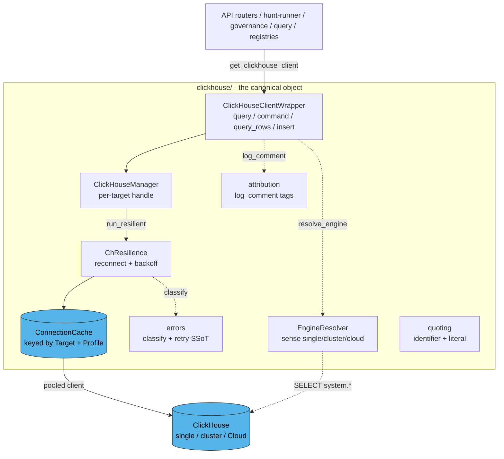
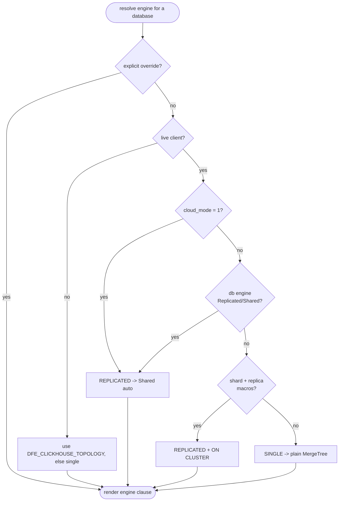

<!--
  Project:      dfe-engine
  File:         docs/CLICKHOUSE.md
  Purpose:      The canonical ClickHouse access object - architecture + rules
  Language:     Markdown
  License:      BUSL-1.1
  Copyright:    (c) 2026 HYPERI PTY LIMITED
-->

# The canonical ClickHouse object

**Every ClickHouse interaction in dfe-engine goes through ONE object in
`src/dfe_engine/clickhouse/`.** Nothing else imports `clickhouse_connect`, hardcodes
a db/table name, builds a bespoke client or retry, or picks a table engine by hand.
That is what makes behaviour consistent and stops the sprawl that produced the
table-engine bug - a CI guard fails the build if the rule is broken.

If you need to touch ClickHouse: acquire a client with
`ClickHouseManager.get_instance(config).get_clickhouse_client()` and use its verbs
(`query` / `command` / `query_rows` / `insert`). That is the whole public surface.

## What routes through it

Solid arrow = the execution path; dotted = a cross-cutting concern consulted along
the way. `quoting` is used by the DDL builders (e.g. governance rendering), not the
hot path.

## Components

| File | Responsibility |
|---|---|
| `clickhouse_manager.py` | `ClickHouseManager` (per-target handle, registered by `Target`) + `ClickHouseClientWrapper` (the verbs) + `get_pooled_client` (raw pooled client for restricted/fixed-user reads). |
| `connection.py` | `Target` (a resolved connection identity) + `ConnectionCache` - one pooled client per `(Target, Profile)`. Retires the first-config-wins singleton bug. |
| `profiles.py` | `Profile` enum (QUERY / INTERNAL / MIGRATE / INSERT / ...) - each a server-settings baseline + transport timeout; part of the cache key. |
| `engines.py` | `EngineResolver` - senses the live topology and renders the right table engine (see below). |
| `resilience.py` | `ChResilience` - the CH binding of the generic `ReconnectingResilience` (in `dfe_engine/resilience.py`): reconnecting back-off on a CONNECTION outage, back-off-only on a 202 (rate-limit), HEALTHY/TRANSIENT/WAKING/DEAD outage state. |
| `migrations.py` | The bootstrap-apply-that-senses runner - numbered migrations applied once at startup, engine resolved per topology, `IF [NOT] EXISTS`-idempotent, tracked in `dfe_meta.schema_migrations`. Opt-in via `clickhouse.migrate_on_startup`. |
| `cloud.py` | `CloudService` - CH Cloud lifecycle (status/start/stop) over the mgmt API; opt-in idle auto-wake. |
| `attribution.py` | `DfeQueryTags` in a ContextVar -> `settings["log_comment"]` on every query. |
| `errors.py` | `ErrorCategory` + `classify` / `is_retryable_error` (the retry SSoT) + `wrap_ch_error`. |
| `quoting.py` | `quote_identifier` / `quote_literal` (one injection-safe seam) + `mask_sensitive`. |
| `kill_switch.py` | The incident brake - clamps user-query resource ceilings to `min(caller, cap)` per a gitops severity dial (off / light / full); ops paths exempt. |
| `metrics.py` | Per-query observability - a structured log event always, plus an opt-in bounded-cardinality counter + duration histogram (profile / operation / outcome). Best-effort; never breaks a query. |
| `query_log_archive.py` | The `system.query_log` -> `dfe_audit.query_log_archive` materialised view (parses the `log_comment` attribution into typed columns) + the `cost_leaderboard` query. Engine form resolved by sensing. Unblocks the hunt-cost leaderboard. |
| `names.py` | Fixed engine-owned db/table name constants. |

## Engine resolution - single vs cluster vs Cloud

The most-capable table engine differs per topology, and you cannot tell which from
the DDL alone. The resolver SENSES the live server (cached per database) and renders
the right form. The path/replica are NEVER in the DDL - they are the server's macros.

Rendered forms (variant + params always preserved):
- single: `MergeTree()` / `ReplacingMergeTree(ver)`
- replicated: argumentless `ReplicatedMergeTree` / `ReplicatedReplacingMergeTree(ver)`
  (the server supplies the path/replica); CH Cloud auto-substitutes `Shared*`.

The explicit-path `ReplicatedMergeTree('/path','{replica}')` form is a BUG - it is
REJECTED by CH Cloud and on-prem Replicated databases - and is never emitted.

## The enforcement guard

`tests/unit/test_clickhouse/test_enforcement_guard.py` fails CI on:
1. a direct `clickhouse_connect` import outside `clickhouse/`;
2. a hardcoded `ENGINE = ...MergeTree(...)` literal in any `.py` (resolve it instead).

## Testing - the 3-target matrix (CANON)

CH integration tests run against a parametrised matrix - **local** (a throwaway,
memory-capped single-node docker CH, 1:1 with CI), **cluster** (`DFE_CLICKHOUSE_*`
when it is a real multi-node target), **cloud** (`DFE_CLICKHOUSE_CLOUD_*`, off by
default - billable). An absent/unreachable target skips; CI with only docker still
covers single-node. This is the net for the single -> cluster -> cloud breakages
that historically bite. See `tests/integration/conftest.py` +
`tests/integration/test_ch_engine_resolver.py`, and CLICKHOUSE-CLOUD.md for the
Cloud lifecycle.
