# DFE Engine — Architecture Design

**Status:** Proposed
**Last Updated:** 2026-03-02

---

## 1. System Overview

DFE Engine is a pip-installable library that owns all business logic: config validation, schema generation, service config management, deployment orchestration. It does NOT expose HTTP endpoints or manage auth — those stay in dfe-control-plane (FastAPI + Typer CLI).

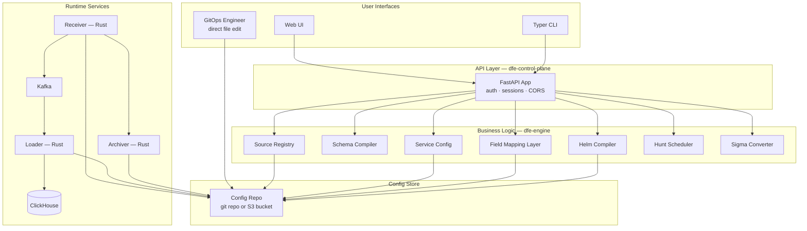

---

## 2. GitOps Config Repo Model

### 2.1 Core Principle: Engine is Preferred but Not Exclusive

The config repo (git repository or S3 bucket on AWS) is the **Single Source of Truth** for all deployment and data configuration. DFE Engine is the **preferred** management layer — it validates, compiles, and writes config files. But it is **not the only writer**. A GitOps engineer can modify YAML files directly and Engine must cope with external changes.

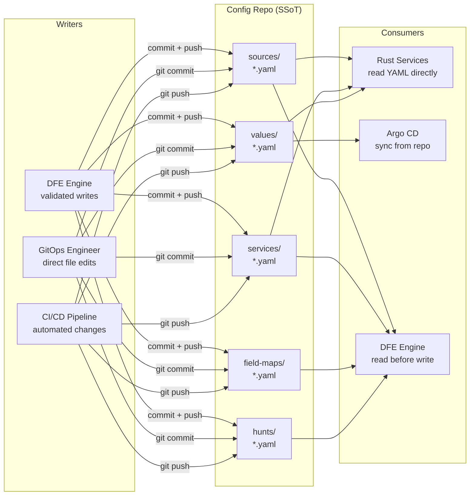

### 2.2 Config Repo Structure

```
dfe-config/                          # git repo (or S3 bucket on AWS)
├── sources/                         # Source definitions (engine-mastered)
│   ├── windows_audit.yaml
│   ├── aws_cloudtrail.yaml
│   └── linux_syslog.yaml
├── services/                        # Service configs (engine-mastered)
│   ├── receiver-production.yaml
│   ├── loader-production.yaml
│   └── archiver-production.yaml
├── environments/                    # Environment configs
│   ├── production.yaml
│   └── staging.yaml
├── values/                          # Compiled Helm values (engine-generated)
│   ├── receiver-production.yaml
│   ├── loader-production.yaml
│   └── vector-receiver.yaml
├── applications/                    # Argo CD Application CRDs (engine-generated)
│   ├── dfe-receiver-production.yaml
│   └── dfe-loader-production.yaml
├── field-maps/                      # Field mapping definitions (engine + human)
│   ├── default.yaml                 # Default table field map
│   ├── sigma/
│   │   ├── windows_audit.yaml
│   │   └── aws_cloudtrail.yaml
│   ├── ecs/
│   │   ├── _default.yaml            # ECS default table map
│   │   └── windows_audit.yaml
│   └── cim/
│       ├── _default.yaml            # CIM default table map
│       └── windows_audit.yaml
├── hunts/                           # Hunt definitions
│   ├── brute_force_login.yaml
│   └── lateral_movement.yaml
└── queries/                         # Query definitions
    └── analytics/
        └── user_activity.yaml
```

### 2.3 Write Model: Read-Before-Write

Engine always reads the current state from the config repo before writing. This prevents blindly overwriting changes made by humans or CI pipelines.

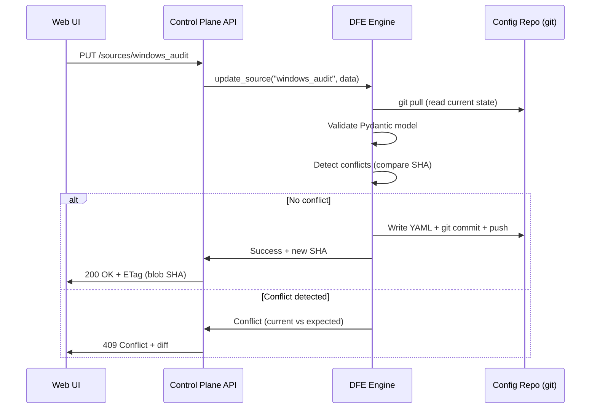

### 2.4 Conflict Resolution: Blob SHA as ETag

Git blob SHAs provide natural content-addressable ETags. The API uses standard HTTP conditional semantics:

1. **Client reads config** → response includes `ETag: <blob-SHA>` header
2. **Client writes config** → request includes `If-Match: <blob-SHA>` header
3. **Server compares** → if SHA matches current file, write proceeds; if stale, return `409 Conflict` with a diff

```python
# Computing blob SHA — same as git's internal object hash
import hashlib

def blob_sha(content: bytes) -> str:
    header = f"blob {len(content)}\0".encode()
    return hashlib.sha1(header + content).hexdigest()
```

**Conflict resolution strategy (last-writer-wins with visibility):**

- Engine never force-overwrites — it always detects conflicts
- Conflicts are surfaced to the caller (UI shows diff)
- Human resolves: accept theirs, accept mine, or merge manually
- For machine-generated files (Helm values, Argo CRDs): engine always regenerates from source, so conflicts self-resolve on next compile

---

## 3. Git-Native CRUD for UI

### 3.1 API Design

The UI needs clean CRUD operations that map naturally to git. The API uses FastAPI with standard REST conventions — no GraphQL.

| Operation | HTTP | Git Equivalent | Notes |
|-----------|------|---------------|-------|
| List | `GET /sources/` | `ls sources/` | Paginated, filterable |
| Read | `GET /sources/{name}` | `cat sources/{name}.yaml` | Returns ETag header |
| Create | `POST /sources/` | `write + git add + commit` | 201 Created |
| Update | `PUT /sources/{name}` | `write + git add + commit` | Requires `If-Match` ETag |
| Delete | `DELETE /sources/{name}` | `git rm + commit` | Requires `If-Match` ETag |
| Preview | `POST /sources/{name}/preview` | `diff` (in-memory) | Returns diff, no commit |
| History | `GET /sources/{name}/history` | `git log -- sources/{name}.yaml` | Audit trail |

### 3.2 Change Preview

Before any write, the UI can request a preview showing exactly what will change:

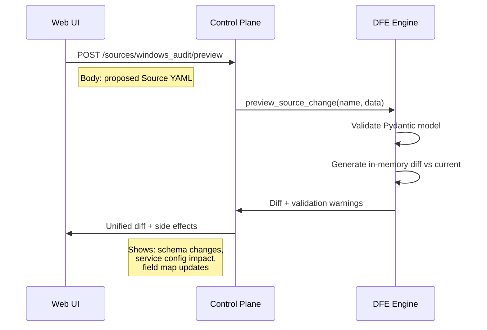

### 3.3 Audit Trail

Every change is a git commit. The UI exposes `git log` per resource:

```json
GET /sources/windows_audit/history

[
  {
    "sha": "abc1234",
    "author": "derek@hyperi.io",
    "timestamp": "2026-03-02T10:30:00Z",
    "message": "Update windows_audit schema: add process_name column",
    "etag": "def5678"
  }
]
```

### 3.4 UI Patterns

The git-backed approach maps well to established UI patterns:

- **Backstage-style catalog**: List view of Sources/Services with metadata cards, click to edit YAML or structured form
- **Diff preview on save**: Like a GitHub PR — show unified diff before committing
- **Version history timeline**: Like GitHub file history — click any commit to see state at that point
- **Conflict modal**: When `409` returned, show side-by-side diff with merge options

---

## 4. API Layer Architecture

### 4.1 FastAPI Auto-Generation

The control plane uses FastAPI with Pydantic models from dfe-engine. Since engine already defines all data models (Source, EnvironmentConfig, etc.), the API layer is thin — mainly auth, validation routing, and git operations.

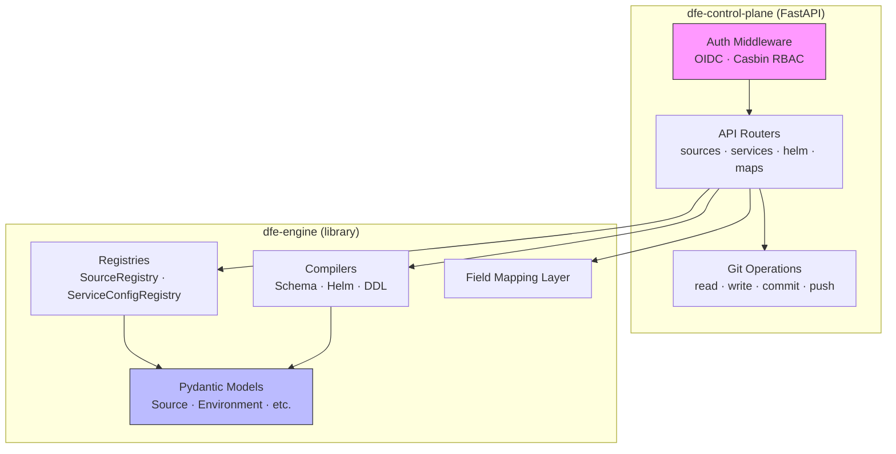

### 4.2 Reducing Bespoke Code

FastAPI best practices to minimise handwritten boilerplate:

1. **Pydantic models as request/response schemas** — engine models are the API schema (no duplication)
2. **Dependency injection** — registries and compilers injected via `Depends()`
3. **Auto-generated OpenAPI docs** — clients generated from spec (TypeScript, Rust)
4. **Generic CRUD router factory** — one function generates standard CRUD endpoints for any registry-backed resource
5. **Middleware stack** — auth, rate limiting, CORS, request logging as composable middleware

```python
# Example: generic CRUD router factory (in dfe-control-plane)
def crud_router(
    prefix: str,
    model_cls: type[BaseModel],
    registry: DirectoryConfigStore,
) -> APIRouter:
    """Generate standard CRUD endpoints for a registry-backed resource."""
    router = APIRouter(prefix=prefix, tags=[prefix.strip("/")])

    @router.get("/")
    async def list_all(): ...

    @router.get("/{name}")
    async def get_one(name: str): ...

    @router.put("/{name}")
    async def update(name: str, data: model_cls, if_match: str = Header(...)): ...

    @router.delete("/{name}")
    async def delete(name: str, if_match: str = Header(...)): ...

    return router
```

### 4.3 Engine vs Control Plane Boundary

**Decision: Engine stays a library. Control plane stays the API host.**

Engine provides the business logic and Pydantic models. Control plane provides:
- FastAPI application setup + middleware
- Authentication (OIDC) and authorisation (Casbin)
- Git operations (DirectoryConfigStore)
- Session management and rate limiting

This boundary means engine can be used by CLI tools, scripts, and tests without running a web server.

---

## 5. Field Mapping Layer

### 5.1 Overview

A generic, standard-agnostic field mapping layer that translates between security/observability standards and DFE schema columns. Supports multiple standards out of the box — not just Sigma.

The field mapping layer replaces the current Sigma-only approach with a two-tier system that works for any standard that maps field names to schema columns.

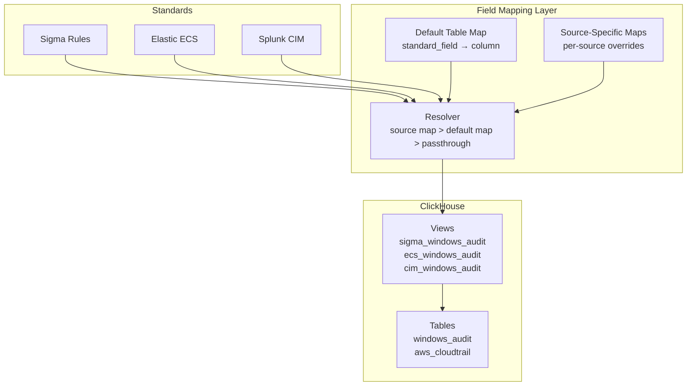

### 5.2 Two-Tier Field Maps

Every field mapping follows a two-tier resolution:

1. **Default table map** — maps standard field names to DFE column names for the default table schema (common header + common fields). Applies to all sources unless overridden.
2. **Source-specific map** — per-source overrides where a source has different column names or additional mappings beyond the default.

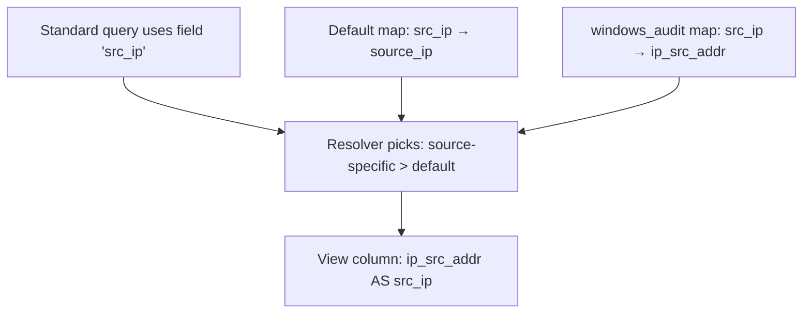

**Priority (highest wins):**

| Priority | Layer | Description |
|----------|-------|-------------|
| 1 (highest) | Source-specific map | Per-source field overrides |
| 2 | Default table map | Standard-wide defaults |
| 3 (lowest) | Passthrough | Field name used as-is if no map exists |

### 5.3 YAML Map Definitions

Field maps are managed YAML files in the config repo — not ephemeral in-memory objects. They can be edited by engine, by the UI via the API, or directly by a GitOps engineer.

```yaml
# field-maps/ecs/_default.yaml
# Default ECS field map for the default table schema
standard: ecs
version: "8.11"
description: "Elastic Common Schema — default table mapping"
mappings:
  source.ip: source_ip
  destination.ip: dest_ip
  user.name: user_name
  process.name: process_name
  event.category: event_category
  event.action: event_action
  host.name: host_name
  "@timestamp": _timestamp
```

```yaml
# field-maps/ecs/windows_audit.yaml
# Source-specific ECS overrides for windows_audit
standard: ecs
source: windows_audit
inherits: _default           # inherits from default, overrides below
mappings:
  source.ip: ip_src_addr     # windows_audit uses different column name
  user.name: account_name    # windows-specific field name
  process.pid: process_id    # additional mapping not in default
```

```yaml
# field-maps/sigma/windows_audit.yaml
# Sigma field map for windows_audit
standard: sigma
source: windows_audit
mappings:
  SourceIP: ip_src_addr
  DestinationIP: ip_dst_addr
  User: account_name
  CommandLine: command_line
  Image: process_name
  ParentImage: parent_process_name
```

### 5.4 Default Table Maps

Most DFE concepts are source-specific — each Source has its own schema, its own table, its own config. But field maps are different: **a default table map applies across all sources for a given standard**.

This is critical for standards like ECS and CIM where the field names are consistent regardless of data source. A default map says "ECS `source.ip` always maps to DFE `source_ip` unless a specific source overrides it."

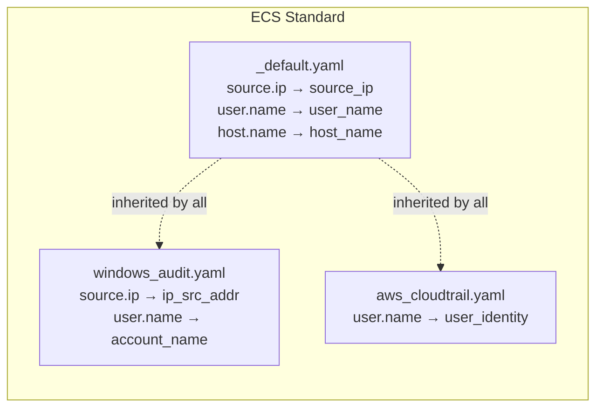

### 5.5 Standard Adapters

Out-of-the-box support for three standards, with the architecture open to more:

| Standard | Field Namespace | Typical Use | Map Source |
|----------|----------------|-------------|------------|
| **Sigma** | Flat names (`SourceIP`, `User`) | Detection rules | Sigma rule → field map → ClickHouse query |
| **Elastic ECS** | Dotted hierarchy (`source.ip`, `user.name`) | Log normalisation, dashboards | ECS schema → field map → ClickHouse view |
| **Splunk CIM** | Flat names (`src_ip`, `user`) | Splunk-compatible queries, migration | CIM data model → field map → ClickHouse view |

Each adapter:
1. Knows the standard's field naming convention
2. Ships a default map covering common fields
3. Generates ClickHouse views from resolved field maps

### 5.6 Sigma Integration

The Sigma converter becomes a **consumer** of the field mapping layer rather than owning its own mapping logic:

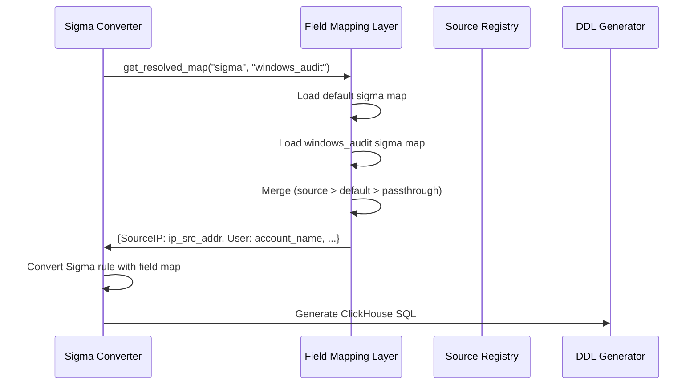

The existing `SigmaSourceMapper` evolves to use the field mapping layer instead of reading `Source.sigma.custom_mappings` directly.

### 5.7 View Table Management

Each standard × source combination produces a ClickHouse view. Views provide a translated schema so queries written in a standard's field names execute against DFE tables transparently.

```sql
-- Generated view: sigma_windows_audit
CREATE VIEW IF NOT EXISTS {db}.sigma_windows_audit AS
SELECT
    ip_src_addr AS SourceIP,
    ip_dst_addr AS DestinationIP,
    account_name AS User,
    command_line AS CommandLine,
    process_name AS Image,
    *
FROM {db}.windows_audit

-- Generated view: ecs_windows_audit
CREATE VIEW IF NOT EXISTS {db}.ecs_windows_audit AS
SELECT
    ip_src_addr AS `source.ip`,
    ip_dst_addr AS `destination.ip`,
    account_name AS `user.name`,
    process_name AS `process.name`,
    *
FROM {db}.windows_audit
```

**View naming convention:** `{standard}_{source}` (e.g. `sigma_windows_audit`, `ecs_aws_cloudtrail`, `cim_linux_syslog`).

**Lifecycle:**
- Views are generated/updated when field maps change
- Views are dropped when a source or field map is removed
- The schema compiler generates view DDL alongside table DDL
- Helm compiler includes view management in DDL output

### 5.8 Field Mapping UI

The field mapping UI is a **structured table editor** — not a raw YAML editor. It presents:

1. **Standard field names** (left column) — from the standard's schema (ECS fields, CIM fields, etc.)
2. **DFE column names** (right column) — auto-populated from the source's schema, selectable via dropdown
3. **Inheritance indicator** — shows whether a mapping comes from default or is source-specific
4. **Validation** — real-time feedback showing unmapped fields, type mismatches, deprecated fields

```
┌─────────────────────────────────────────────────────────┐
│ Field Mapping: ECS → windows_audit                      │
│                                                         │
│ Standard Field        DFE Column          Source        │
│ ─────────────────────────────────────────────────────── │
│ source.ip          → ip_src_addr          override      │
│ destination.ip     → ip_dst_addr          override      │
│ user.name          → account_name         override      │
│ process.name       → process_name         default       │
│ host.name          → host_name            default       │
│ event.category     → event_category       default       │
│ @timestamp         → _timestamp           default       │
│ process.pid        → process_id           source-only   │
│                                                         │
│ [Save]  [Preview Diff]  [Reset to Defaults]             │
└─────────────────────────────────────────────────────────┘
```

---

## 6. Deployment Architecture

### 6.1 Two-Mode Helm/Argo CD

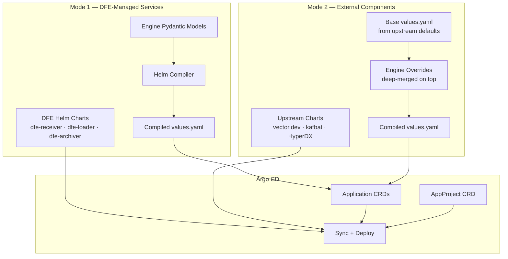

### 6.2 Runtime Data Flow

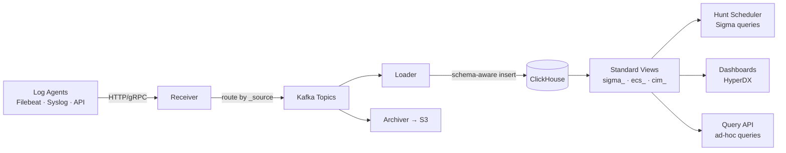

---

## 7. Source Model Integration

The Source model is the top-level entity that ties everything together. Every data stream is a Source YAML file. Field maps, schema, service routing, and deployment all flow from Source.

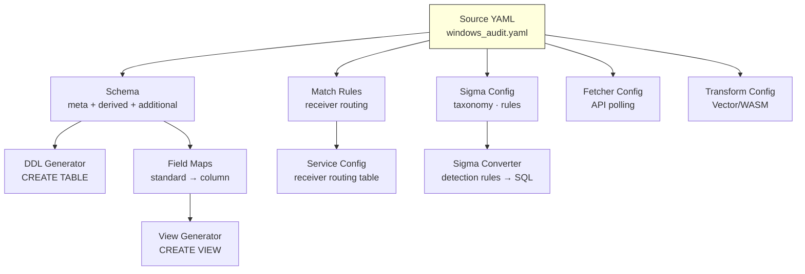

---

## 8. Technology Decisions

| Decision | Choice | Rationale |
|----------|--------|-----------|
| Config storage | YAML + git (or S3 on AWS) | Human-readable, version history, Rust services read directly |
| API framework | FastAPI | Auto OpenAPI, Pydantic native, async, type-safe |
| Auth | OIDC + Casbin RBAC | Standard, stays in control plane |
| Observability | OTEL → ClickHouse → HyperDX | Replaces Prometheus, single storage backend |
| Ingress | Envoy Gateway | Native OIDC, replaces EOL nginx-ingress |
| Deployment | Argo CD + Helm | GitOps sync, two-mode (managed + external) |
| Conflict handling | Blob SHA ETag + 409 Conflict | Git-native, standard HTTP semantics |
| Field mapping | YAML files, two-tier (default + source) | Human-editable, git-tracked, supports UI editing |

---

## 9. Open Questions

- **Config repo identity:** New repo (`dfe-config`) or repurpose `dfe-data-resources`?
- **S3 config store on AWS:** DirectoryConfigStore works with git; S3 variant needs a different backend (versioned S3 objects, no git log for audit)
- **View lifecycle automation:** Should views auto-regenerate on field map change (via DirectoryConfigStore change callback), or require explicit compile step?
- **Field map seeding:** Ship default maps for ECS/CIM/Sigma as package resources (like built-in service configs), seed to config repo on init?
