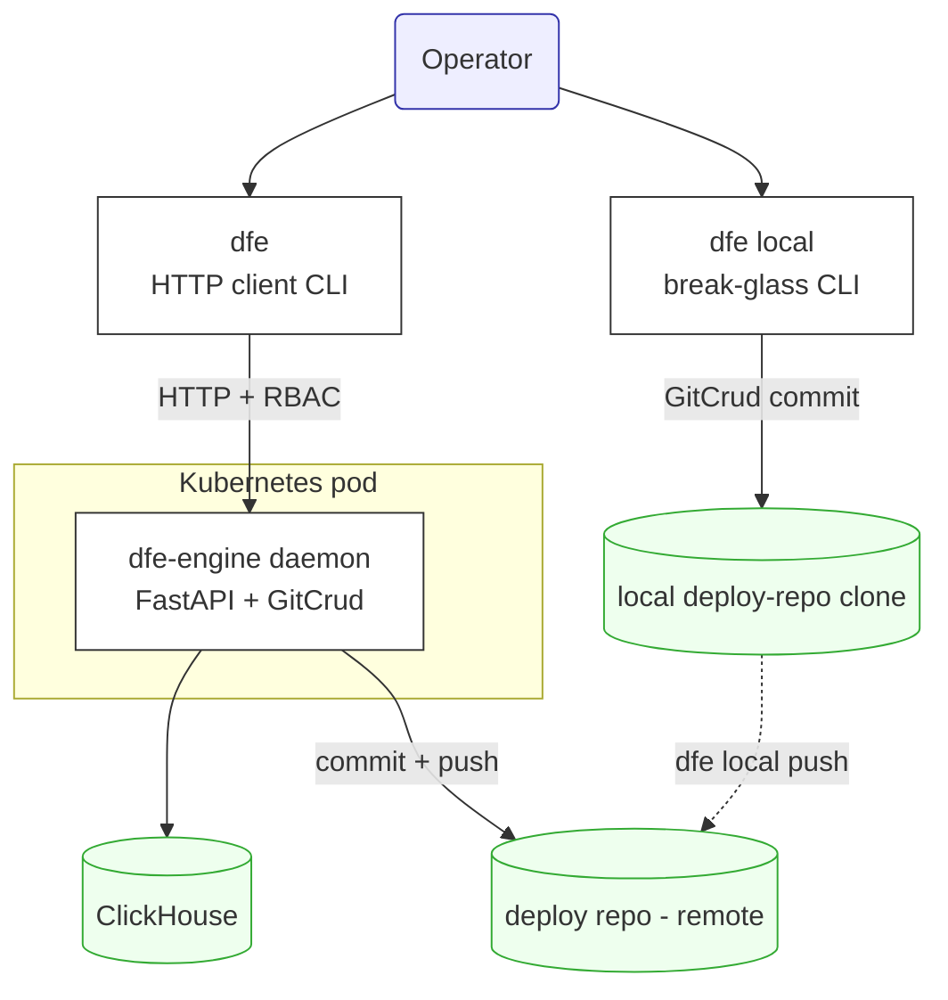
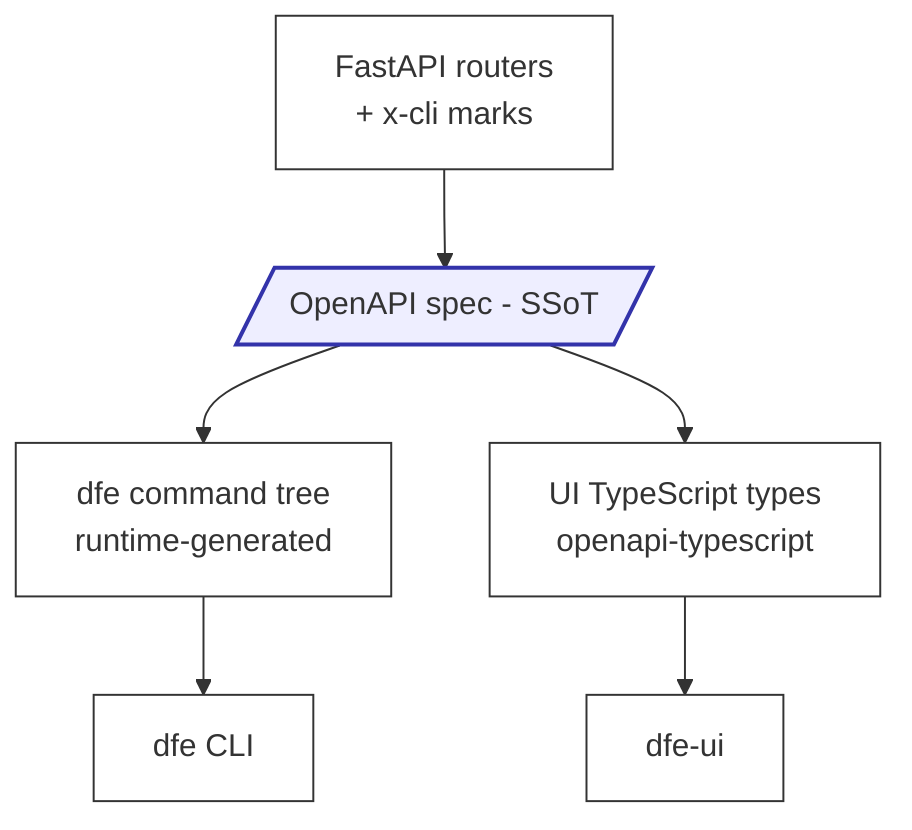

<!--
  Project:   dfe-engine
  File:      docs/DFE-CLI-DESIGN.md
  Purpose:   The dfe-engine daemon + the single `dfe` CLI (HTTP + break-glass)
  License:   BUSL-1.1
  Copyright: (c) 2026 HYPERI PTY LIMITED
-->

# The `dfe-engine` daemon and the `dfe` CLI

DFE ships two console entry points, with a clear division of labour:

- **`dfe-engine`** - the DAEMON. The server that runs in a Kubernetes pod. It is
  not a human tool: `dfe-engine run` starts the FastAPI app, `dfe-engine version`
  and `dfe-engine config-check` round out the base commands. Nothing else lives
  here.
- **`dfe`** - the single human CLI. One binary, two internal modes:
  - **normal** (`dfe <family> <verb>`) - speaks HTTP to a running `dfe-engine`.
    Its whole command tree is GENERATED from the daemon's OpenAPI spec, so it
    tracks the API automatically.
  - **break-glass** (`dfe local <verb>`) - for when the daemon is DOWN. Writes
    the local deploy-repo (gitops) clone DIRECTLY, through the same write-engine
    the API uses.

A third entry point, `dfe-hunt-runner`, is the hunt scheduler/worker and is out of
scope here.

## The three entry points at a glance

| Entry point | What it is | Where its work happens | Authority |
|---|---|---|---|
| `dfe-engine run` | The daemon (server) | In-pod: serves the API, writes ClickHouse + gitops | It IS the control plane |
| `dfe <family> <verb>` | HTTP client CLI | Sends HTTP to a running daemon; the daemon does the work | The daemon's RBAC |
| `dfe local <verb>` | Break-glass CLI | Writes the local gitops clone directly, then pushes | Git write-access to the deploy repo |



Both CLIs are thin windows over ONE write-engine (`GitCrud`): the daemon is
HTTP + RBAC over it, `dfe local` is local-clone context over it. There is no
second implementation to drift.

---

## Why the CLI is shaped this way

Three deliberate choices explain the whole design:

1. **One write-engine, reused.** Every DFE mutation is a YAML-in-git commit over
   the deploy repo, produced by `GitCrud`. The daemon calls it behind RBAC; the
   break-glass path calls the SAME engine against a local clone. A change lands as
   the same commit either way, so the two surfaces cannot diverge.
2. **The CLI is generated from the API.** The OpenAPI spec is the single source of
   truth for BOTH the `dfe` command tree AND the UI's TypeScript types. Extending
   the API extends the CLI automatically, with no CLI code to write and nothing to
   keep in step by hand.
3. **Break-glass is marked and validated, not a bypass.** `dfe local` exists only
   for a dead daemon. It cannot silently masquerade as a normal change: every write
   is flagged `[BREAK-GLASS]`, needs a reason, and reuses the API's value-safety
   checks (as an overridable warning).

---

## `dfe` normal mode: generated from the OpenAPI spec

The command tree is built at runtime from the daemon's own OpenAPI document - the
same contract that types the UI.



- **Generated live from the spec.** The tree is read from the in-process app
  factory (`create_app().openapi()`), so it can never be stale versus the committed
  `openapi-spec/openapi.json`. There is no code-gen step and no checked-in generated
  tree - `dfe` builds the tree on each invocation.
- **Default-on exposure, opt-out via `x-cli`.** Every operation becomes a command
  UNLESS it carries `x-cli: {enabled: false}` (attached in the routers via
  `openapi_extra=CLI_HIDDEN`, see `api/cli_exposure.py`). A new API is a new command
  with no CLI code. The handful of hidden operations are the ones that make no sense
  as a human command: the UI-prefs repository store, the UI client-config bootstrap,
  the KEDA scaler metric (`hunts-due`), and `auth/login` + `auth/refresh` (handled
  specially by the `dfe login` built-in, which stores the returned token).
- **REST maps to noun groups and verbs.** The router/path becomes the group nesting
  and the operation becomes the verb, e.g. `/api/v1/auth/groups` -> `dfe auth groups
  list | create | update | delete`. Path params become command arguments; query
  params and request-body properties become options.
- **Help is the OpenAPI text.** Command help and short-help come straight from the
  operation `summary` / `description`, so there is no separate help copy to drift.
- **Built on `click`.** click supports the fully-dynamic command construction the
  generator needs (minting groups, commands, options and arguments at runtime from
  spec records) - a statically-typed command framework cannot express a tree that
  only exists at runtime.

### Built-in commands (hand-written, not generated)

A small set of commands cannot be generated because they act on the CLI's own
state rather than an API resource:

- `dfe login` / `dfe logout` - authenticate and cache a credential. `login` takes
  `--api-key`, or `--username` / `--password` for the local-auth JWT path
  (`POST /api/v1/auth/login`).
- `dfe auth list` / `dfe auth print-access-token` - inspect configured accounts and
  emit the active token for scripts.
- `dfe config ...` - manage CLI configuration and named profiles.

### Global flags, output and pagination

- **Root global flags:** `--format {json,yaml,table,value,text}`, `--query`
  (JMESPath projection), `--quiet` / `-q`, `--url` (override the engine base URL),
  `--configuration` (select a named profile), `--debug`, `--no-paginate`.
- **Format defaults are verb-aware:** `describe` -> yaml, `list` -> table, else
  json; json when the output is not a TTY.
- **Pagination auto-follows.** For a `list` verb whose response is the paginated
  envelope, the CLI walks the pages accumulating items until exhausted. `--page-size`
  sets the server page size, `--limit` caps the total, `--no-paginate` returns a
  single page.
- **Outbound HTTP** goes through the shared `HttpClient` (one retry / backoff /
  breaker / traceparent policy), never a raw client. An api-key credential is sent
  as `X-API-Key`, a token as `Authorization: Bearer`.

### Configuration and profiles

Credentials and named profiles live under `~/.config/dfe` (override the root with
`$DFE_CONFIG_HOME`):

- `configurations/config_<name>` - one INI file per named profile.
- `active_config` - the pointer to the active profile.
- `credentials.json` - stored credentials (chmod 0600, keyed by account).

Profile selection: `--configuration <name>` overrides the `active_config` pointer.

---

## `dfe local`: break-glass direct gitops CRUD

When the daemon (and therefore the RBAC'd API window over gitops) is down, an
operator still needs to change the deploy repo - the headline case being a rogue
pod: scale a Helm var to 0, fix a KEDA dial. `dfe local` writes the local gitops
clone DIRECTLY, through the SAME `GitCrud` write-engine the API uses.

```mermaid
flowchart TB
    op(Operator):::actor
    cmd[dfe local set / rm / ...]:::comp
    guard[require reason<br/>+ safety-validate<br/>+ diff + confirm]:::comp
    gitcrud[GitCrud write-engine<br/>push disabled]:::comp
    clone[(local deploy-repo clone)]:::store
    deploy[(deploy repo - remote)]:::store
    op --> cmd --> guard --> gitcrud
    gitcrud -->|commit [BREAK-GLASS]| clone
    clone -.->|dfe local push| deploy
    classDef actor fill:#eef,stroke:#33a;
    classDef comp fill:#fff,stroke:#333;
    classDef store fill:#efe,stroke:#3a3;
```

What makes it a break-glass surface rather than an RBAC bypass in disguise:

- **Authority is git, not RBAC.** The daemon that enforces RBAC is dead, so write
  authority here IS git write-access to the clone. Every write first prints the
  target header + a unified diff and asks for a default-No confirmation.
- **Every write is marked.** The commit subject is prefixed `[BREAK-GLASS] ` and
  carries the trailers `DFE-Break-Glass: true`, `DFE-Actor:` and `DFE-Reason:`. A
  `--reason` is REQUIRED (prompted interactively; a hard error under `--yes`).
  `dfe local log` flags these entries so the audit trail plainly shows the change
  went round the daemon.
- **The same safety validation runs.** Before committing, `dfe local` runs the same
  value-safety check the daemon's Helm endpoint runs (e.g. an unpinned image ref, a
  controller-owned KEDA key) - but as an OVERRIDABLE warning, not the API's hard
  block. The RBAC half of the API guard is deliberately dropped; the safety half is
  kept, so a stressed operator still gets the steer.
- **Commit is local; publishing is a separate act.** `GitCrud` is built with push
  DISABLED, so a break-glass write commits LOCALLY only. Pushing to the remote is a
  deliberate second step (`dfe local push`, or the post-write prompt), matching the
  gitops-survivability model: the mutation is a git commit, publishing it is its own
  act.

### Generic verbs over the class registry

`dfe local` exposes GENERIC verbs over the resource-class registry, not per-resource
commands - so it does not grow as the API grows:

- **Read:** `classes`, `ls`, `grep`, `get`, `log`, `versions`, `status`.
- **Write (all marked, all need `--reason`):** `set`, `unset`, `rm`, `revert`,
  `restore`.
- **Publish:** `push`.
- **`ch-cloud`** - the ClickHouse Cloud lifecycle group (status / start / stop),
  mounted here because it too must run daemon-free.

Example - scale a rogue pod's KEDA dial to zero while the daemon is down:

```
dfe local set helmvars receiver-default keda.maxReplicas 0 --reason "rogue pod"
```

Most verbs delegate straight to `GitCrud` (`set_key` / `delete_key` / `delete` /
`put`). `revert` is the one genuinely-new operation - `GitCrud` has no revert, so
it computes the inverse of a target commit's tree diff and commits it back through
the same publish path, marked break-glass.

---

## Distribution

Today `dfe` and `dfe-engine` ship as console-scripts via `pyproject`
(`[project.scripts]`) - contributors and installs run them from the environment.

> **PLANNED, NOT BUILT: a frozen single-binary `dfe`.** A self-contained bundle
> (a frozen Python + all deps, built with PyInstaller) so `dfe` installs without a
> Python on the target, distributed via GitHub Releases, a Homebrew tap, and a
> container image, with SHA-pinned + signed artifacts. This is a future addition,
> not a replacement for the console-script.

Other future ergonomics (also NOT built): the browser / device-code OIDC login
flow, shell completion, and `--cli-auto-prompt` interactive prompting.
