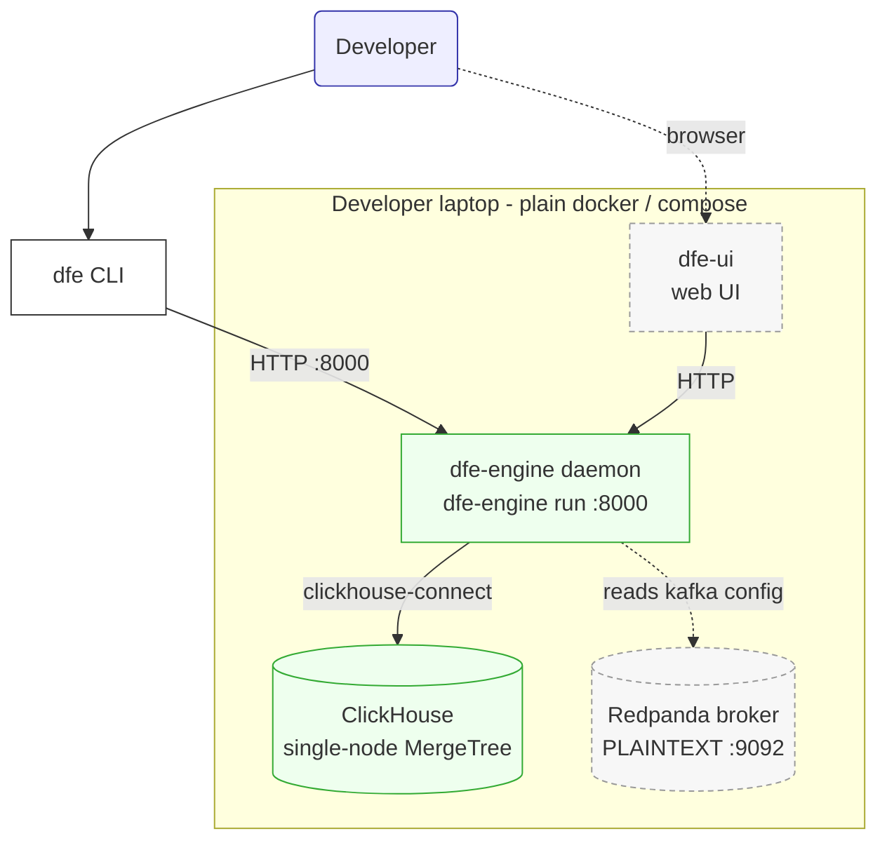
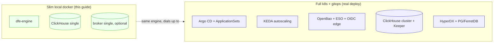

<!--
  Project:   dfe-engine
  File:      docs/DOCKER-DEV.md
  Purpose:   Slim single-laptop docker "tyre-kicking" shape of DFE (local dev only)
  License:   BUSL-1.1
  Copyright: (c) 2026 HYPERI PTY LIMITED
-->

# Slim local docker - tyre-kicking DFE on one laptop

**Status:** Reference (local development only)

This is the smallest useful DFE: a cut-down, single-host shape you run with plain
docker / compose to poke at the product. It is DELIBERATELY not the real thing.
The production deployment is Kubernetes + Argo/gitops (see
[ARCHITECTURE.md](ARCHITECTURE.md)); this drops everything that shape carries and
keeps only what a developer needs to hit the API, write some config, and run a
query.

## What this is / when to use it

- **Use it for:** learning the API, driving the `dfe` CLI, editing config YAML,
  running a query against a real ClickHouse - all on one machine, no cluster.
- **Do NOT use it for:** anything real. It runs single-node backing services,
  plaintext transports, and a placeholder JWT secret. It is a dev fixture, never a
  deployment. If you need reliability, tenancy, autoscaling, or exposure, you want
  the k8s tiers, not this.

This corresponds to the `dfe-docker` tier - the SME / single-host row in the
deployment-tier table - which is Compose, not k8s, and has no Argo/operators layer
(see ARCHITECTURE.md section 7, and the `dfe-docker` column of
[BACKING-SERVICES.md](BACKING-SERVICES.md), where every seam takes its lightest
backend).

## The minimal container set



| Container | Role | Needed for |
|---|---|---|
| **dfe-engine** | The daemon. `dfe-engine run` starts the FastAPI control plane on :8000 - the one thing you actually drive. | Always (this IS DFE). |
| **ClickHouse** (single node) | The only operational store: query results, hunt state, audit. Keeperless plain MergeTree - no cluster, no dfe-keeper. | Always (the engine needs it at startup). |
| **Redpanda** (single broker) | Kafka-compatible bus, PLAINTEXT. Only relevant if you also run the Rust ingest path (receiver -> loader) to push events. | Optional - skip it for pure API/config tyre-kicking. |
| **dfe-ui** | The web UI over the same API. | Optional - the CLI covers everything without it. |

The irreducible core is just **dfe-engine + ClickHouse**. Add the broker (and the
Rust `receiver`/`loader` containers from their own images) only when you want to
exercise the live ingest data path; add `dfe-ui` only if you prefer clicking to the
CLI.

## What is deliberately cut

Everything the real deployment uses to be a *deployment* is gone here. That is the
point - this stack trades every production property for "runs on a laptop in one
command".



| Concern | Full k8s + gitops | Slim local docker |
|---|---|---|
| Orchestration | Kubernetes | plain docker / compose |
| Deploy pipeline | Argo CD + ApplicationSets, deploy repo | none - you `docker compose up` |
| Scaling | KEDA scale-to-zero + HPA | one container each, no autoscaling |
| Secrets | OpenBao + External Secrets Operator | placeholder / env vars (dev only) |
| Auth / identity | OIDC at the edge (Envoy / oauth2-proxy) | auth off, or the seeded local admin |
| Tenancy | per-org provisioning + CH row policies | off (`DFE_ORG_PROVISIONING_ENABLED=false`) |
| ClickHouse | cluster: ReplicatedMergeTree + Keeper | single node: plain MergeTree, keeperless |
| Kafka | Strimzi/Redpanda cluster, SCRAM/TLS | single Redpanda, PLAINTEXT (or none) |
| HyperDX + PG/FerretDB | always present | omitted (opt in only if you want them) |

## Config - the `DFE_*` contract

The engine is configured entirely by `DFE_*` environment variables and a config
directory; there is no config database. See [.env.example](../.env.example) for the
full annotated contract - copy it to `.env` and trim to the handful below. The
settings that make it a *local* shape:

- `DFE_ENV=dev` - a non-production posture, so the placeholder `jwt_secret` is
  accepted. Production refuses it and won't start.
- `DFE_AUTH_ENABLED=false` - simplest tyre-kicking: every request runs as an
  anonymous admin (the daemon logs a loud warning saying exactly that). To exercise
  auth instead, set it `true`; the admin account is auto-seeded from
  `DFE_ADMIN_PASSWORD`, then `dfe login --username admin --password ...` mints a
  JWT, and you can create an API key for the `--api-key` path.
- `DFE_CLICKHOUSE_HOST=clickhouse` `PORT=8123` `SECURE=false` - point at the CH
  container over plain HTTP. `DFE_CLICKHOUSE_DATA_DATABASE=dfe` is where tables
  land.
- `DFE_CONFIG_DIR=/app/config` - the YAML config tree (sources / services / hunts /
  rules / queries). The image ships a built-in `config/`; bind-mount your own to
  edit it live.
- `DFE_KAFKA_BOOTSTRAP_SERVERS=broker:9092` - only if you added the broker.

The single-node CH does NOT need the `custom_settings_prefixes=SQL_` server setting
unless you turn tenant isolation on - which you would not for local tyre-kicking.

### Pinning images

Pin every container by digest, never a floating tag - the same `tag@sha256:<digest>`
pattern `.env.example` already uses for the backing services. Pick the latest
version that satisfies the supply-chain rules, THEN pin its digest. Do not
copy a version out of this doc; resolve the current one yourself
(see [SUPPLY-CHAIN-PINNING.md](SUPPLY-CHAIN-PINNING.md)).

### Illustrative compose sketch (NOT a runnable file)

This shows the shape and the pin pattern only - the digests are placeholders. Fill
in real, currently-resolved digests before using it.

```yaml
# ILLUSTRATIVE SKETCH - placeholder digests, verify before use.
services:
  clickhouse:
    image: clickhouse/clickhouse-server:<tag>@sha256:<digest>
    environment: { CLICKHOUSE_PASSWORD: "" }
    ports: ["8123:8123"]
  engine:
    image: ghcr.io/hyperi-io/dfe-engine:<tag>@sha256:<digest>
    command: ["run"]                 # ENTRYPOINT is dfe-engine
    environment:
      DFE_ENV: dev
      DFE_AUTH_ENABLED: "false"
      DFE_CLICKHOUSE_HOST: clickhouse
      DFE_CLICKHOUSE_PORT: "8123"
      DFE_CLICKHOUSE_SECURE: "false"
    ports: ["8000:8000"]
    depends_on: [clickhouse]
  # broker (Redpanda) and dfe-ui: add only when you need them.
```

## Running and driving it

Bring the stack up with `docker compose up`, then drive it with the **`dfe`** CLI.
`dfe` is the single human CLI - its whole command tree is generated from the
daemon's OpenAPI spec, so it always tracks the API (see
[DFE-CLI-DESIGN.md](DFE-CLI-DESIGN.md)).

```
# point the CLI at your local daemon and cache a credential
dfe login --url http://localhost:8000 --api-key <key>
# ...or, with auth off, just override the URL per call:
dfe --url http://localhost:8000 sources list

# then it is dfe <family> <verb>
dfe sources list
dfe queries describe analytics/user_activity
dfe hunts list
```

You will NOT normally touch the other two entry points locally:

- **`dfe-engine`** is the daemon itself (`dfe-engine run` inside the container) -
  not a human tool.
- **`dfe local`** is the break-glass path for writing the gitops deploy-repo clone
  directly when the daemon is down. With no gitops repo wired locally, you have no
  reason to use it.

## Verify

CLI is present and generated from the spec (real output, trimmed):

```
$ dfe --help
Usage: dfe [OPTIONS] COMMAND [ARGS]...

  dfe - the Data Fusion Engine CLI. Command tree generated from the engine
  OpenAPI spec; speaks HTTP to a running engine.

Commands:
  auth  config  deployments  gitops  governance  helm  hunts  local
  login  queries  rules  schemas  services  sigma  sources  system  ...
```

Daemon entry point exposes the expected commands (real output, trimmed):

```
$ dfe-engine --help
Commands:
  run                 Start the service (default).
  version             Print version information and exit.
  config-check        Validate configuration and exit.
  generate-artefacts  Generate deployment artefacts ...
```

Liveness probe once the container is up (the image's own HEALTHCHECK hits this):

```
curl -sf http://localhost:8000/health/live
```

The daemon serves `/health/live`, `/health/ready`, `/health/startup` on :8000.

> UNVERIFIED: the `curl` health check and the end-to-end `docker compose up` were
> not run for this doc - no local docker daemon or built engine image was available
> in this environment. The container port (8000), the CMD (`run`), and the probe
> paths are taken from the Dockerfile and `api/app.py`; the two `--help` outputs
> above were captured from the real entry points.
