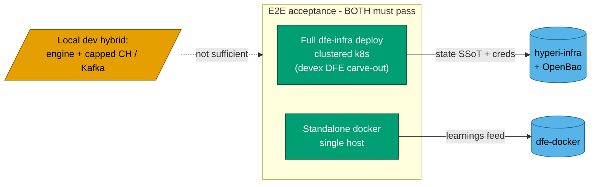

# E2E Acceptance - the two scenarios that sign off a change

**Bottom line:** a change is E2E-verified only when it works at BOTH real
ends of the deployment spectrum - a full clustered Kubernetes deploy AND a
single-host docker deploy. A local dev hybrid (the engine run against capped
local ClickHouse/Kafka) is for fast iteration only. It is a halfway house
between the two ends and proves neither, so it never counts as acceptance.

DFE ships as a product suite that other organisations deploy. It has to hold
up at the full-cluster end (our hosted instance and customer clusters) and at
the single-host end (dfe-docker). Testing only the middle proves neither.

## Scenario 1 - full dfe-infra deploy to clustered k8s

**What it proves:** the product works the way it is actually operated - Argo
CD reconciling the GitOps artifacts, real backing services, real ingress,
RBAC and OIDC in front, running on a multi-node cluster.

**Where:** the devex DFE carve-out. hyperi-infra is the authoritative source
of truth for cluster topology, endpoints and node ownership. Credentials come
from OpenBao/Vault, never from committed files.

Operate strictly to the ops runbook so you never touch a pet (non-DFE)
resource: see `hyperi-io/hyperi-infra` docs and the DFE side at
`dfe-infra/docs/DEVEX-OPERATIONS.md`. The DFE worker nodes and namespace are
yours to (re)deploy on. Pet nodes are off limits without an explicit ask.

**Sign-off:** the deployed stack comes up healthy, the UI is reachable and a
login works, and a smoke path through the API/query surface returns. Finish
with the deploy access summary (URLs, how to log in, where to fetch creds).

## Scenario 2 - standalone docker

**What it proves:** the product works on a single host with no Kubernetes -
the dfe-docker shape. This is the lower bound a new adopter can stand up
quickly, and what we learn here (compose wiring, env, image needs) feeds back
into dfe-docker.

**Where:** a standalone docker / compose bring-up of the engine plus its
backing services, pinned by digest the same way dfe-docker pins them.

**Sign-off:** the stack comes up from a clean state, health is green, and the
same smoke path through the API/query surface returns. Note anything that had
to differ from the k8s path - that difference is the feedback for dfe-docker.

## Why the local hybrid is not acceptance

The capped local ClickHouse/Kafka daemons are for fast unit and integration
iteration. They give neither the clustered-Argo behaviour of Scenario 1 nor
the clean single-host wiring of Scenario 2. A green hybrid run tells you the
code path works. It does not tell you the product deploys. Keep them for
speed, not for sign-off.

## Related

- `dfe-infra/docs/DEVEX-OPERATIONS.md` - how and where to operate on the
  devex carve-out (secret-free; points to the private hyperi-infra SSoT).
- `docs/DFE-INFRA.md` - the dfe-infra architecture (two-layer, Argo).
- dfe-docker - the standalone-docker distribution this scenario informs.
