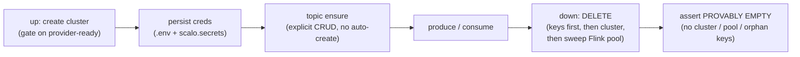

<!--
Project:   dfe-engine
File:      docs/MANAGED-KAFKA-LIFECYCLE.md
Purpose:   The always-on managed-Kafka cost problem (Confluent Cloud, MSK,
           Redpanda Cloud) and DFE's lifecycle response (WS-C / dfe-engine#99).
Language:  Markdown
License:   BUSL-1.1
Copyright: (c) 2026 HYPERI PTY LIMITED
-->

# Managed Kafka: the always-on problem + DFE's lifecycle

**Bottom line:** a managed Kafka cluster (Confluent Cloud, provisioned MSK, Redpanda
Cloud Dedicated) is **always-on** - it bills continuously, has **no pause/stop**, and
**only deletion stops spend**. For devtest that is a cost trap: a forgotten cluster is
an open-ended bill. So DFE's lifecycle treats **"down" as DELETE-to-empty** (never
pause), sweeps the provider's auto-created extras, and deletes credentials before the
cluster - a cycle returns the account to **provably empty and $0**.

This is the design rationale for the managed-Kafka lifecycle (WS-C, dfe-engine#99). It
is NOT a DFE-owned-broker concern (Strimzi/Redpanda in-cluster stop when the pods stop);
it is specific to the managed SaaS/cloud clusters.

## The problem, per provider (verified 2026-07)

| Provider | Billing model | Pause? | Stops spend | Gotchas |
|---|---|---|---|---|
| **Confluent Cloud** | min billing once it has topics (base cost varies by tier) | **No** | delete the cluster only | cluster-create **auto-provisions a Flink compute pool** (a 2nd billable to sweep). Org/env/service-account/mgmt-key survive as $0 objects. API-key **PLAIN over TLS, uniform across all 5 tiers** (Basic/Standard/Enterprise/Freight/Dedicated); Basic = cheapest devtest default, Dedicated = provisioned/always-on-worst. |
| **MSK provisioned** | per broker-hour, 24/7 | **No** | delete the cluster only | create is **tens of minutes** (gate on provider-ready, never a timer). SASL/SCRAM-512 + Secrets Manager (or IAM). |
| **MSK Serverless** | per partition-hour + throughput | n/a (no broker base) | delete + stop traffic | **IAM-ONLY - no SASL/SCRAM** (verified 2026-07); forces the `msk_iam` path (quarantined seam). Fast create. **No username/password to persist** - the ambient IAM role authenticates. |
| **Redpanda Cloud** | Dedicated/BYOC = always-on; Serverless = pay-per-use | Dedicated: no | delete the cluster (Dedicated) | **SASL_SSL + SCRAM-SHA-256/512** (confirmed 2026-07-12) - a SCRAM provider like the DFE-owned brokers, NOT a PLAIN exception. Per-tier cost/teardown specifics still to verify live. |

Common thread: **the managed control plane keeps the cluster alive - and billing -
until you delete it.** "The service is up" is a liability here, not a convenience.

## Serverless vs provisioned - an axis WITHIN managed

"Managed" splits again into **serverless** (elastic, pay-per-use) and
**provisioned** (sized capacity, always-on). It changes auth, create time, and
what the cred-persistence helper stores - so the lifecycle branches on it.

| Provider | Serverless / elastic | Provisioned |
|---|---|---|
| **MSK** | **IAM-ONLY** (no SASL/SCRAM) -> `msk_iam`. Per partition-hour. Fast create. No username/password to persist (ambient IAM role). | SASL/SCRAM-512 or IAM. Per broker-hour. Create = tens of minutes (gate on ready). |
| **Confluent** | Basic/Standard/Enterprise/Freight - elastic. API-key PLAIN (uniform). Basic = cheapest devtest default. | Dedicated - sized CKUs, always-on, priciest. API-key PLAIN (same). |
| **Redpanda Cloud** | Serverless - pay-per-use. SASL_SSL + SCRAM (uniform). | Dedicated/BYOC - always-on. SCRAM (same). |

Impacts on our implementation:

- **MSK Serverless cannot use the username+password contract at all** - IAM is its
  only auth (verified 2026-07). It rides the quarantined `msk_iam` seam, and there
  is no SCRAM secret to persist (the ambient IAM role authenticates). Only
  PROVISIONED MSK is on the SCRAM contract (`provider=msk`).
- **Mechanism is tier-independent** for Confluent (always API-key PLAIN) and
  Redpanda Cloud (always SCRAM). So `provider=confluent-cloud`/`redpanda-cloud`
  derives correctly regardless of tier; tier only shifts cost + always-on profile.
- **The lifecycle up/down/status branches on this axis:** serverless create is fast
  and needs no broker sizing; provisioned create gates on provider-ready (tens of
  minutes for MSK) and teardown reclaims sized capacity. The cred-persistence
  helper stores a username+password for SCRAM/PLAIN, and NOTHING for MSK-Serverless
  IAM (role-based).

> AWS compute has its own serverless/server split (EKS-on-Fargate vs RKE2/EKS-on-EC2)
> - that affects node-affinity, not the Kafka contract, and is tracked in the
> multi-cloud deploy plan, not here.

## DFE's lifecycle response (WS-C)

- **down = DELETE, never pause.** Pause does not exist on these providers; the only
  spend-stop is deletion. The lifecycle's `down` deletes.
- **Teardown to provably empty (checkpoint 4).** Order matters: delete the **API keys
  BEFORE the cluster** (deleting the cluster first orphans the keys), delete the
  cluster, then **sweep the auto-created extras** (Confluent's Flink compute pool), then
  **assert** the account holds no cluster, no compute pool, no orphan keys. The stable
  survivors (org / env / service-account / management key) are $0 and deliberately kept
  so the next `up` is fast.
- **Fast re-create over pause-resume.** Because the cycle is delete-recreate (not
  pause-resume), the **shared cred-persistence helper** (`.env` + `scalo.secrets`,
  shared with the ClickHouse Cloud lifecycle) re-wires credentials immediately on a new
  cluster, so re-create is cheap operationally.
- **Gate on provider-ready, never a guessed timer.** Provisioned-MSK create is tens of
  minutes; Confluent is seconds-to-minutes. Poll the provider's own ready state.

## Cost guardrails (design)

- **Cheapest devtest tier by default:** Confluent **Basic**, MSK **Serverless** (or the
  smallest provisioned), Redpanda **Serverless** (pending). Never a Dedicated/Standard
  cluster for a throwaway test.
- **TTL / auto-teardown safety (CONSIDER):** a forgotten cluster is the failure mode.
  A lifecycle-level TTL - the cluster self-deletes after N idle hours unless renewed - is
  a cost circuit-breaker worth building into the seam. Flagged as a design option for
  #99, not yet decided.
- **Teardown is not optional.** The lifecycle ALWAYS returns the account to
  provably-empty; a test run that leaves a cluster standing is a defect, not a
  convenience.

## The seam

One lifecycle seam (`up` / `down` / `status`) with per-provider implementations. The
always-on / delete-to-stop model and the teardown-sweep discipline are common across
providers; the credential shape differs (`msk_iam` for MSK Serverless; SCRAM-512 for
provisioned MSK + DFE-owned brokers; PLAIN-over-TLS for Confluent Cloud). Provider
selection is config, per the product rule - nothing HyperI-specific.

## See also

- Contract + lifecycle master plan: `docs/superpowers/plans/2026-07-12-kafka-contract-and-confluent-lifecycle.md`
- Confluent dev account facts: memory `reference_confluent_cloud_dev`
- Kafka credential contract: dfe-engine#98
