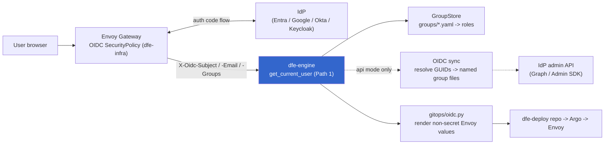
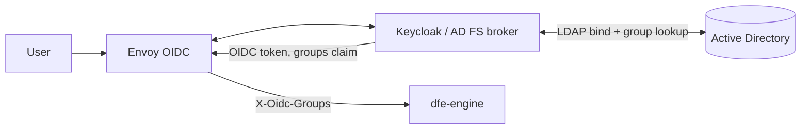

# OIDC Provider Integration

**Scope:** external IdP auth via Envoy Gateway, the dfe-engine provider registry,
group -> role mapping, copy-paste worked examples (EntraID, on-prem AD, Google
Workspace, Okta, Keycloak), and the infra contract (Envoy, secrets, IAM, DNS).

Merges the former `OIDC-PROVIDERS.md` (registry design) and
`OIDC-INFRA-REQUIREMENTS.md` (infra contract). RBAC roles + tenant isolation:
[RBAC.md](RBAC.md).

---

## 1. How it fits together



Two runtime facts drive everything below:
- **Envoy does the OIDC handshake, dfe-engine only reads headers.** Token
  validation, cookies, redirects, discovery - all Envoy. dfe-engine trusts the
  `X-Oidc-*` headers (so it MUST only be reachable via Envoy - section 6.1).
- **dfe-engine is the OIDC config SSoT, not a runtime dependency.** It owns the
  provider registry and renders the NON-SECRET Envoy OIDC values into the deploy
  repo (`gitops/oidc.py render_envoy_oidc_values`); Argo applies them and ESO
  materialises the client secret. If dfe-engine is down, Envoy keeps
  authenticating and existing `groups/*.yaml` keep resolving roles - only
  provider CRUD and group sync pause.

---

## 2. Provider config

One YAML file per provider. The provider NAME is the filename stem (never a body
field, avoids DirectoryConfigStore YAML 1.1 boolean coercion).

**Location:** `{auth_dir}/oidc-providers/{name}.yaml`, default
`config/auth/oidc-providers/{name}.yaml`. `auth_dir` = `DFE_AUTH_DIR`, else
`{DFE_CONFIG_DIR}/auth`. (Note: `DFE_AUTH_OIDC_PROVIDERS_DIR` exists as a setting
but is NOT read by the loader - the path above is fixed. Do not rely on it to
relocate providers.)

### 2.1 Schema

```yaml
# config/auth/oidc-providers/{name}.yaml
type: generic            # generic | google | entra_id | okta
enabled: true
display_name: ""         # UI label
issuer: ""               # OIDC issuer URL
client_id_env: ""        # ENV VAR NAME holding the client ID (never the value)
groups:
  mode: manual           # manual | token_claim | api
  claim_name: groups     # token_claim: the JWT claim carrying group IDs/names
  sync_interval: 3600    # api: seconds between syncs (0 = manual trigger only)
  # --- google (type=google, mode=api) ---
  service_account_json_env: ""   # env var NAME for the SA JSON
  admin_email: ""                # domain-wide delegation subject
  domain: ""                     # Workspace primary domain
  # --- entra_id (type=entra_id, mode=api) ---
  tenant_id_env: ""              # env var NAME for the tenant ID
  client_secret_env: ""          # env var NAME for the app client secret (Graph)
  # --- okta (type=okta, mode=api) ---
  api_token_env: ""              # env var NAME for the Okta API token
  okta_domain: ""                # e.g. example.okta.com
# managed by dfe-engine (do not hand-edit):
created_at: ""
last_sync_at: ""
last_sync_status: ""             # ok | error
sync_error: ""
```

Only env var NAMES live in config; the real secret values stay in the deployment
secrets backend (K8s Secret / OpenBao / cloud SM). There is deliberately NO
top-level `client_secret_env` / `scopes` / `redirect_uri` on the provider - the
client secret is materialised by ESO as Secret `dfe-oidc-<name>` and consumed by
Envoy, never by the engine model. The only `client_secret_env` is the
Entra-specific one INSIDE the `groups` block (for the Graph API call).

### 2.2 Group modes

| Mode | How groups arrive | dfe-engine action |
|------|-------------------|-------------------|
| `manual` | Admin creates group files by hand | No sync. Map group -> roles manually. |
| `token_claim` | In the `X-Oidc-Groups` header (Envoy extracts the token claim named by `claim_name`, default `groups`) | Direct lookup in GroupStore by exact name. No API calls. |
| `api` | IDs in the header now; friendly names fetched from the IdP admin API on a schedule | Periodic sync writes/updates group files with human-readable names + `source_provider`. Auth works immediately with raw IDs; friendly names after the first sync. |

---

## 3. Groups -> roles (interchangeable with internal groups)

The load-bearing idea: **a provider group and an internal DFE group are the SAME
object if they share the filename stem.** The OIDC group identifier (a
`token_claim` value, or an `api`-sync-derived stem) is used DIRECTLY as the
`GroupStore` key. There is no separate alias table.

Roles are NEVER carried by the IdP - they are attached to the DFE group file and
resolved at request time:

```yaml
# config/auth/groups/soc-analysts.yaml  (name = the OIDC group name)
description: "SOC analyst team"
roles: ["data_analyst"]        # <- group -> role mapping lives HERE
members: []
scope: system                  # or org:<name> to make it a tenant group
org_ids: []                    # tenant IDs members inherit (for org scope)
source_provider: "entra-corp"  # set by api-mode sync; "" for manual
source_id: ""                  # provider-native group ID (Entra objectId, ...)
```

Resolution (`api/deps.py _resolve_group_grants`): for each group name, look up
the `Group`; `group.roles` become the principal's roles, each bound at the
group's scope (`org:<name>` -> org scope, else system); `org_ids` accrue from the
owning org + the group's `org_ids`. Unknown group names are silently skipped
(deny-by-omission).

To make ANY group an org-scoped tenant (the `org_analyst` isolation model, see
[RBAC.md](RBAC.md) section 5), set `scope: org:<name>` + `org_ids` and give it the
`org_analyst` role. Auto-created for claimed email domains by the JIT chain (RBAC.md
section 7.3).

### 3.1 `X-Oidc-*` header contract

Envoy injects exactly three headers, consumed in `get_current_user` Path 1:

| Header | Required | Becomes |
|--------|----------|---------|
| `X-Oidc-Subject` | Yes (presence triggers the OIDC path) | `AuthContext.user_id` |
| `X-Oidc-Email` | Optional | `AuthContext.email` |
| `X-Oidc-Groups` | Optional (comma-separated; empty allowed) | `groups` list |

Empty/missing `X-Oidc-Groups` -> the user authenticates but resolves zero roles
from groups (only roles from a matching local shadow account apply). The OIDC path
also runs JIT provisioning and UNIONS the shadow account's store-side group grants
with the header grants (`_merge_group_resolutions`) - so the JIT `org_<domain>`
group's `org_ids` reach the live `AuthContext` even though the IdP only sent header
groups.

---

## 4. Worked examples (copy-paste and tweak)

Each block is a full `{name}.yaml`. After adding a provider, map its groups to
roles on the group files (section 3). The group-sync mode is called out per
provider.

### 4.1 Microsoft Entra ID (Azure AD)

Entra puts group **objectId GUIDs** (not names) in the token's `groups` claim,
and only if the app manifest requests it. Two options:
- `mode: token_claim` - create group files NAMED BY GUID -> roles (unfriendly but
  zero API). Requires the app's `groupMembershipClaims` to emit `groups`.
- `mode: api` (below) - dfe-engine calls Microsoft Graph to resolve GUIDs ->
  `displayName`, writing friendly group files. Needs `GroupMember.Read.All`
  (admin-consented) + tenant ID + client secret.

```yaml
# config/auth/oidc-providers/entra-corp.yaml
type: entra_id
enabled: true
display_name: "Microsoft Entra ID (corp)"
issuer: "https://login.microsoftonline.com/<tenant-guid>/v2.0"
client_id_env: DFE_OIDC_ENTRA_CLIENT_ID
groups:
  mode: api                     # resolve GUID -> displayName via Graph
  sync_interval: 3600
  tenant_id_env: DFE_OIDC_ENTRA_TENANT_ID
  client_secret_env: DFE_OIDC_ENTRA_CLIENT_SECRET
```

**Groups -> roles:** after a sync, Entra groups appear as group files (stem from
`displayName`). Assign roles, e.g. `dfe-api groups update soc-analysts --roles
data_analyst`. For a tenant org, set `scope: org:<name>` + `org_ids` + role
`org_analyst`. **Sync mode:** `api` (friendly names) or `token_claim` (GUID group
files). Graph scope `GroupMember.Read.All` is an app permission, not an OIDC scope.

### 4.2 On-prem Active Directory -> OIDC (broker)

There is NO cloud AD and AD/LDAP is NOT an OIDC provider, so DFE does not talk to
AD directly. The pattern we CODE FOR is an OIDC **broker** in front of AD:
Keycloak (recommended, self-host) or AD FS. The broker binds to AD over LDAP,
authenticates the user, and issues an OIDC token whose `groups` claim is mapped
from AD group membership. DFE treats the broker as a `generic` provider in
`token_claim` mode.



```yaml
# config/auth/oidc-providers/onprem-ad.yaml
type: generic
enabled: true
display_name: "On-prem AD (via Keycloak broker)"
issuer: "https://keycloak.corp.example.com/realms/corp"
client_id_env: DFE_OIDC_ONPREM_AD_CLIENT_ID
groups:
  mode: token_claim             # the broker emits AD groups in the token
  claim_name: groups
```

**Groups -> roles:** in Keycloak add a **Group Membership** (or LDAP group)
protocol mapper so AD group names land in the `groups` claim; create DFE group
files matching those names and assign roles. AD FS is the alternative broker
(issuer `https://adfs.corp/adfs/...`, groups via a claim rule). **Sync mode:**
`token_claim` - dfe-engine has no path to AD; the broker does the LDAP work. There
is no direct-AD adapter by design.

### 4.3 Google Workspace

Google does NOT put groups in the ID token - they come from the Admin SDK
Directory API. So `mode: api` is mandatory, with a service account (domain-wide
delegation), the delegation subject (`admin_email`), and the Workspace `domain`.

```yaml
# config/auth/oidc-providers/google-workspace.yaml
type: google
enabled: true
display_name: "Google Workspace"
issuer: "https://accounts.google.com"
client_id_env: DFE_OIDC_GOOGLE_CLIENT_ID
groups:
  mode: api
  sync_interval: 3600
  service_account_json_env: DFE_GOOGLE_SA_JSON
  admin_email: "admin@customer.com"      # delegation subject
  domain: "customer.com"                 # Workspace primary domain
```

**Groups -> roles:** sync creates a group file per Workspace group (stem from the
group email, e.g. `engineering@customer.com`). Assign roles per group. **Sync
mode:** `api` only (no token groups). The SA needs
`admin.directory.group.readonly` via domain-wide delegation, authorised in the
Google Admin Console.

### 4.4 Okta

Okta natively includes groups (by name) in the ID token via a `groups` claim you
configure on the authorization server. `token_claim` is the simple path; `api`
(Okta Groups API) is optional for a full catalogue sync.

```yaml
# config/auth/oidc-providers/okta.yaml
type: okta
enabled: true
display_name: "Okta"
issuer: "https://<org>.okta.com/oauth2/default"
client_id_env: DFE_OIDC_OKTA_CLIENT_ID
groups:
  mode: token_claim
  claim_name: groups
  # optional catalogue sync instead of token_claim:
  # mode: api
  # api_token_env: DFE_OIDC_OKTA_API_TOKEN
  # okta_domain: "<org>.okta.com"
```

**Groups -> roles:** Okta group names arrive in `X-Oidc-Groups`; create matching
group files -> roles. Add a `groups` claim (filter: matches regex `.*`) to the
authz server. **Sync mode:** `token_claim` (default) or `api` (optional).

### 4.5 Keycloak

Keycloak is a `generic` OIDC provider (and the recommended on-prem AD broker,
section 4.2). It emits groups via a Group Membership mapper.

```yaml
# config/auth/oidc-providers/keycloak.yaml
type: generic
enabled: true
display_name: "Keycloak"
issuer: "https://keycloak.example.com/realms/dfe"
client_id_env: DFE_OIDC_KEYCLOAK_CLIENT_ID
groups:
  mode: token_claim
  claim_name: groups
```

**Groups -> roles:** add a **Group Membership** protocol mapper to the client
(Token Claim Name `groups`, Full group path OFF so names are bare), then create
matching DFE group files -> roles. **Sync mode:** `token_claim`. Keycloak can also
federate to AD/LDAP, SAML IdPs, or social logins upstream - all surface through
the same `groups` claim.

### 4.6 Per-provider summary

| Provider | `type` | Group source | Mode(s) | Notes |
|----------|--------|--------------|---------|-------|
| Entra ID | `entra_id` | token GUIDs / Graph API | `token_claim`, `api` | `api` resolves GUID -> name |
| On-prem AD | `generic` (broker) | broker token claim | `token_claim` | Keycloak/AD FS in front of AD |
| Google | `google` | Admin SDK | `api` | no token groups; `api` mandatory |
| Okta | `okta` | token claim | `token_claim`, `api` | native token groups |
| Keycloak | `generic` | token claim | `token_claim` | Group Membership mapper |

---

## 5. Provider lifecycle (registry API + CLI)

`OIDCProviderRegistry` is YAML-backed CRUD; adapters resolve group names for
`api` mode. All endpoints are admin-only.

```
POST   /api/v1/auth/oidc-providers              # attach
GET    /api/v1/auth/oidc-providers              # list
GET    /api/v1/auth/oidc-providers/{name}       # get (secrets never returned)
PUT    /api/v1/auth/oidc-providers/{name}       # update
DELETE /api/v1/auth/oidc-providers/{name}       # detach + warn orphaned groups
POST   /api/v1/auth/oidc-providers/{name}/sync  # force group sync (api mode)
GET    /api/v1/auth/oidc-providers/{name}/test  # test connectivity
```

CLI mirrors these: `dfe-api oidc-providers create|list|show|test|sync|update|delete`.

**Unfriendly -> friendly upgrade** (Entra/GUID case): attach `mode: manual` or
`token_claim`, create GUID-named group files so auth works Day 0; later switch to
`mode: api` so a sync writes friendly named files. The GUID files keep working
until you migrate roles across and delete them (detach WARNS about orphaned
`source_provider` groups, never deletes them).

**api-mode adapters:** Generic (no API), Google (Admin SDK), Entra (Graph). Okta
uses `token_claim` natively (adapter optional). Adapters are FAILSAFE - a
credential/API failure returns empty results so auth keeps working with the info
already on disk.

---

## 6. Infra contract (what dfe-infra provides)

dfe-engine owns provider config, group resolution, and role mapping. dfe-infra
owns the Envoy handshake, cloud IAM, secrets, DNS, and TLS.

### 6.1 Envoy Gateway SecurityPolicy (per provider)

dfe-infra deploys an Envoy `SecurityPolicy` that runs the OIDC auth-code flow and
forwards claims as `X-Oidc-*` headers. dfe-engine reads the headers; it never
configures Envoy directly.

```yaml
apiVersion: gateway.envoyproxy.io/v1alpha1
kind: SecurityPolicy
metadata:
  name: dfe-oidc-{name}
spec:
  targetRefs:
    - group: gateway.networking.k8s.io
      kind: HTTPRoute
      name: dfe-engine-route
  oidc:
    provider:
      issuer: "{issuer}"
    clientID: "{client_id}"
    clientSecret:
      name: dfe-oidc-{name}      # K8s Secret (ESO from Vault/cloud SM)
      key: client-secret
    redirectURL: "https://{dfe_domain}/oauth2/callback"
    scopes: [openid, email, profile]
```

**Header-trust precondition (HARD):** dfe-engine MUST be reachable ONLY through
Envoy. Block direct pod access with a K8s NetworkPolicy - otherwise any client
with pod access can forge `X-Oidc-*` headers and impersonate any user.

The engine helps here: `gitops/oidc.py render_envoy_oidc_values` renders the
NON-SECRET Envoy OIDC values (enabled, providers, issuer) into the deploy repo so
Argo applies a consistent config; the client secret is never in engine config.

### 6.2 Secrets, IAM, network, DNS

| Provider | K8s Secret keys -> env vars | Cloud IAM (Terraform) |
|----------|------------------------------|-----------------------|
| Google | `client-id`->`DFE_OIDC_GOOGLE_CLIENT_ID`, `service-account-json`->`DFE_GOOGLE_SA_JSON` | OAuth2 client + SA with `admin.directory.group.readonly` (domain-wide delegation) |
| Entra | `client-id`->`DFE_OIDC_ENTRA_CLIENT_ID`, `client-secret`->`DFE_OIDC_ENTRA_CLIENT_SECRET`, `tenant-id`->`DFE_OIDC_ENTRA_TENANT_ID` | App registration + `GroupMember.Read.All` (admin-consented) |
| Okta | `client-id`->`DFE_OIDC_OKTA_CLIENT_ID`, `api-token`->`DFE_OIDC_OKTA_API_TOKEN` | OIDC app + `groups` claim on the authz server |
| Generic (Keycloak / AD broker) | `client-id`->`DFE_OIDC_{NAME}_CLIENT_ID` | Broker owns its own AD/LDAP federation |

- **Secrets:** created by ESO (from OpenBao / cloud SM) or the operator; mounted as
  env vars in the dfe-engine pod (Helm `oidc.providers[].envMappings`). Rotation =
  update the Secret, restart (or hot-reload) the pod.
- **Network:** allow egress 443 to the IdP admin APIs for `api` mode
  (`admin.googleapis.com`, `graph.microsoft.com` + `login.microsoftonline.com`,
  `{org}.okta.com`).
- **DNS/TLS:** dfe-infra manages `https://{dfe_domain}/oauth2/callback`
  (cert-manager + DNS). Envoy handles the callback; dfe-engine never sees it.

### 6.3 Responsibilities

| Concern | dfe-infra | dfe-engine |
|---------|-----------|------------|
| Envoy SecurityPolicy CRD | Applies (from the engine-rendered values) | Renders non-secret values into gitops |
| Cloud IAM (SA / app / Okta app) | Terraform provisions | Reads creds from env vars |
| K8s Secrets for OIDC creds | Creates via ESO | Reads env var NAMES only |
| Token validation / cookies / discovery | Envoy | Trusts headers |
| Provider config (which providers) | Not involved | `oidc-providers/*.yaml` |
| Group resolution (admin API calls) | Allows egress | Adapter modules |
| Group -> role mapping | Not involved | `GroupStore` + `RoleConfig` |

---

## 7. Non-goals

- Envoy SecurityPolicy CRD authoring by hand (engine renders values; Argo applies).
- Cloud IAM provisioning (dfe-infra Terraform).
- Token validation / session / logout (Envoy).
- Multi-provider routing (one SecurityPolicy per HTTPRoute).
- SCIM user-lifecycle provisioning (future).

---

## 8. References

- [Envoy Gateway OIDC SecurityPolicy](https://gateway.envoyproxy.io/docs/tasks/security/oidc/)
- [Microsoft Graph groups](https://learn.microsoft.com/en-us/graph/api/resources/groups-overview)
- [Google Admin SDK Directory - Groups](https://developers.google.com/admin-sdk/directory/reference/rest/v1/groups)
- [Okta OpenID groups claim](https://developer.okta.com/docs/guides/customize-tokens-groups-claim/)
- [Keycloak group membership mapper](https://www.keycloak.org/docs/latest/server_admin/#_protocol-mappers)
