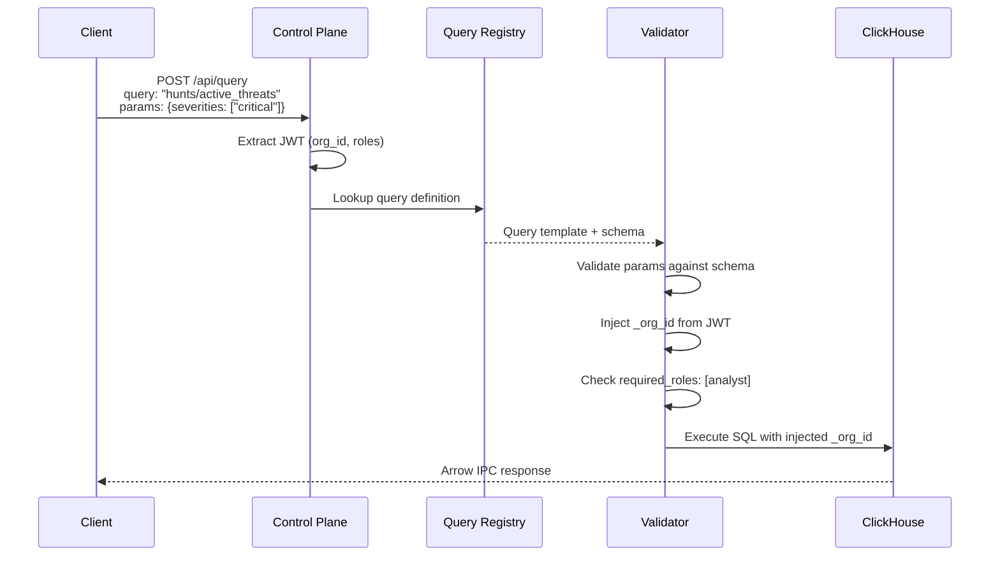
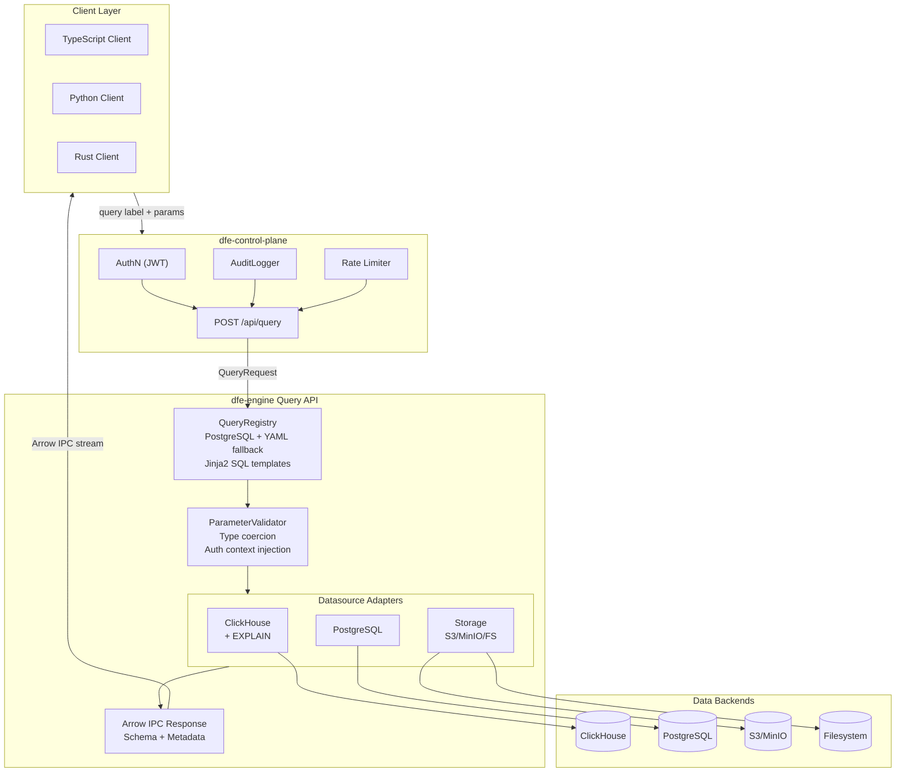
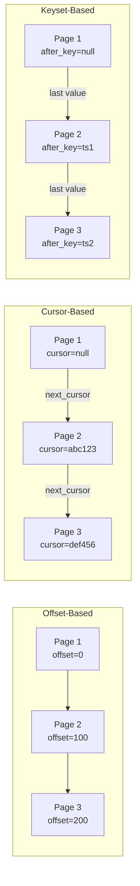
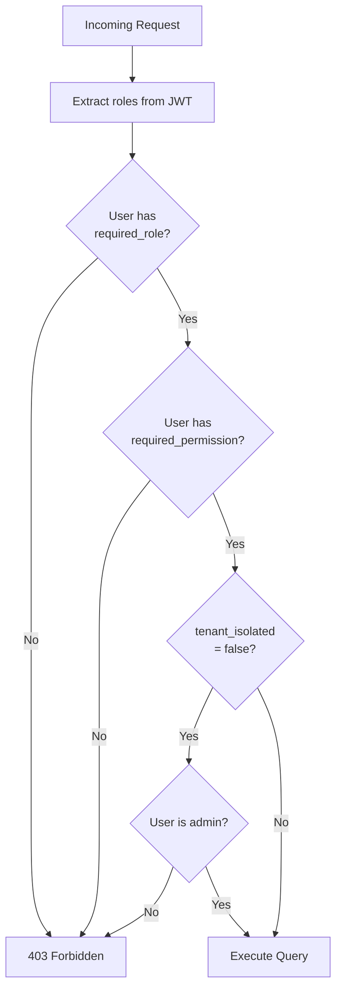

# DFE Query API

**Version:** 2.0.0
**Last Updated:** 2026-01-16

A secure, label-based query interface with multi-tenant isolation, RBAC, and Apache Arrow wire format.

---

## Overview

The Query API provides a **secure, label-based interface** for querying multiple datasources. Key security features:

- **No raw SQL from clients** - Queries are referenced by label, SQL is defined server-side
- **Mandatory tenant isolation** - `_org_id` injected from JWT, cannot be overridden
- **Role-based access control** - Queries can require specific roles/permissions
- **Parameter validation** - All parameters validated against server-side schemas
- **Apache Arrow wire format** - Efficient binary serialization

### Supported Datasources

| Datasource | Description | Wire Format |
|------------|-------------|-------------|
| `clickhouse` | ClickHouse analytics database | Arrow IPC |
| `postgres` | PostgreSQL transactional database | Arrow IPC |
| `prometheus` | Prometheus metrics | Arrow IPC |
| `s3` | S3 bucket directory listing | Arrow IPC |
| `minio` | MinIO (S3-compatible) listing | Arrow IPC |
| `file` | Local filesystem directory listing | Arrow IPC |

---

## Security Model

### Key Principles

1. **Query labels, not SQL** - Clients reference pre-defined queries by label
2. **Server-side SQL** - SQL templates stored in registry, clients cannot modify
3. **Automatic tenant isolation** - `_org_id` extracted from JWT and injected
4. **Parameter validation** - All params validated against schema before execution
5. **Role-based access** - Queries can require specific roles/permissions

### Example Security Flow



**Client Request:**

```json
{
  "query": "hunts/active_threats",
  "params": {"severities": ["critical", "high"]},
  "options": {"limit": 500}
}
```

**Server-side Query Definition (not visible to client):**

```yaml
queries:
  hunts/active_threats:
    datasource: clickhouse:default
    store: events
    sql: |
      SELECT alert_id, severity, timestamp
      FROM {{ store }}.alerts
      WHERE org_id = {{ _org_id }}  -- INJECTED, cannot be overridden
      AND severity IN {{ severities | sql_array }}
      LIMIT {{ limit }}
    parameters:
      severities:
        type: array
        items: string
        required: true
    tenant_isolated: true
    required_roles: [analyst]
```

### Protected Resources

Certain system stores are blocked to prevent access to sensitive metadata:

| Datasource | Protected Stores |
|------------|------------------|
| `clickhouse` | `system`, `information_schema`, `INFORMATION_SCHEMA` |
| `postgres` | `pg_catalog`, `information_schema`, `pg_toast` |

---

## Architecture



---

## API Reference

### Execute Query

```
POST /api/query
Content-Type: application/json
Authorization: Bearer <jwt>
Accept: application/vnd.apache.arrow.stream

Request:
{
  "query": "analytics/user_activity",
  "params": {
    "event_types": ["login", "logout"],
    "severities": ["critical", "high"]
  },
  "options": {
    "limit": 100,
    "offset": 0,
    "time_from": "2024-01-01T00:00:00Z",
    "time_to": "2024-01-31T23:59:59Z",
    "timeout_seconds": 30,
    "include_explain": false,
    "cache": true
  }
}

Response: Arrow IPC stream with metadata headers
X-DFE-Row-Count: 100
X-DFE-Query-Duration-Ms: 42
X-DFE-Query-Label: analytics/user_activity
X-DFE-Datasource: clickhouse:default
X-DFE-Truncated: false
X-DFE-Cached: true
X-DFE-Has-More: true
X-DFE-Next-Offset: 100
```

### Query Request Model

```typescript
interface QueryRequest {
  // Query label (namespace/name format)
  query: string;  // e.g., "analytics/user_activity"

  // Query parameters (validated against schema)
  params?: Record<string, unknown>;

  // Execution options
  options?: QueryOptions;
}

interface QueryOptions {
  // Pagination - offset-based
  limit?: number;      // 1-100000, default from query definition
  offset?: number;     // >= 0, default 0

  // Pagination - cursor-based (mutually exclusive with offset)
  cursor?: string;     // Opaque cursor from previous response

  // Pagination - keyset-based
  after_key?: unknown; // Value to paginate after
  order_by?: string;   // Column to order by
  order_dir?: "asc" | "desc";  // Sort direction

  // Time bounds (for time-series queries)
  time_from?: string;  // ISO8601 datetime
  time_to?: string;    // ISO8601 datetime, defaults to now

  // Execution
  timeout_seconds?: number;  // 1-300, default 30

  // EXPLAIN
  include_explain?: boolean;  // Include query plan
  explain_parallel?: boolean; // Run query and EXPLAIN concurrently

  // Caching
  cache?: boolean;     // Allow cached results, default true

  // Store override (only if query allows store: '*')
  store?: string;      // Target store
}
```

### Query Response Metadata

```typescript
interface QueryMetadata {
  row_count: number;
  query_duration_ms: number;
  query_label: string;
  datasource: string;
  store?: string;
  truncated: boolean;
  cached: boolean;
  cache_key?: string;
  explain_duration_ms?: number;
  request_id?: string;

  // Pagination info
  has_more: boolean;
  next_cursor?: string;
  next_offset?: number;
  total_count?: number;
}
```

---

## Pagination

The API supports three pagination modes:



### 1. Offset-Based Pagination

Simple pagination using `limit` and `offset`. Best for small datasets.

```json
{
  "query": "analytics/events",
  "options": {
    "limit": 100,
    "offset": 0
  }
}
```

**Response includes:**
- `has_more: true` if more rows available
- `next_offset: 100` for next page

### 2. Cursor-Based Pagination

Efficient pagination using opaque cursors. Best for large datasets.

```json
{
  "query": "analytics/events",
  "options": {
    "limit": 100,
    "cursor": "eyJsYXN0X2lkIjogMTIzfQ=="
  }
}
```

**Response includes:**
- `next_cursor` for next page
- More efficient than offset for deep pagination

### 3. Keyset Pagination

Stable pagination using a sort key. Best for ordered data.

```json
{
  "query": "analytics/events",
  "options": {
    "limit": 100,
    "after_key": "2024-01-15T12:00:00Z",
    "order_by": "timestamp",
    "order_dir": "desc"
  }
}
```

**Benefits:**
- Stable results even with concurrent inserts
- Efficient for time-series data

---

## Query Labels

Queries are referenced by labels in `namespace/name` format:

```
analytics/user_activity
analytics/conversion_funnel
hunts/active_threats
hunts/ioc_matches
system/health_check
storage/s3_list
storage/file_list
```

### Namespace Conventions

| Namespace | Description | Typical Datasource |
|-----------|-------------|-------------------|
| `analytics` | Analytics and reporting | ClickHouse |
| `hunts` | Threat hunting queries | ClickHouse |
| `system` | System administration | PostgreSQL |
| `users` | User management | PostgreSQL |
| `metrics` | Infrastructure metrics | Prometheus |
| `storage` | Directory listings | S3/MinIO/File |

---

## Query Registry

### Query Definition Schema

```yaml
queries:
  analytics/user_activity:
    # Datasource and store
    datasource: clickhouse:default
    store: events  # or "events_*" for glob, "/^tenant_\\d+$/" for regex, "*" for client-specified

    # SQL template (Jinja2)
    sql: |
      SELECT user_id, event_type, timestamp
      FROM {{ store }}.events
      WHERE org_id = {{ _org_id }}
      
        AND event_type IN {{ event_types | sql_array }}
      
      ORDER BY timestamp DESC
      LIMIT {{ limit }}
      OFFSET {{ offset }}

    # Parameter definitions
    parameters:
      event_types:
        type: array
        items: string
        required: false
        description: Filter by event types
        max_items: 50

    # Standard parameter overrides
    defaults:
      limit: 1000
      timeout_seconds: 30
    limits:
      max_limit: 10000
      max_timeout: 60

    # Time bounding
    time_column: timestamp
    time_required: false
    max_time_range_days: 90

    # Security
    tenant_isolated: true  # SQL must contain {{ _org_id }}
    required_roles: [analyst, admin]
    required_permissions: []

    # Caching
    cache_ttl_seconds: 300
    cache_namespace: analytics

    # Audit
    audit_level: full  # none, basic, full
    pii_columns: [user_id, email]

    # Metadata
    description: Query user activity events
    tags: [analytics, events]
```

### Jinja2 SQL Filters

| Filter | Description | Example |
|--------|-------------|---------|
| `sql_string` | Escape and quote string | `{{ value \| sql_string }}` → `'escaped''value'` |
| `sql_array` | Convert list to SQL array | `{{ items \| sql_array }}` → `('a', 'b', 'c')` |
| `sql_identifier` | Quote identifier | `{{ table \| sql_identifier }}` → `"table_name"` |

### Reserved Parameters

These parameters are injected by the server and cannot be overridden:

| Parameter | Source | Description |
|-----------|--------|-------------|
| `_org_id` | JWT `org_id` | Tenant organization ID |
| `_user_id` | JWT `user_id` | User ID |
| `_roles` | JWT `roles` | User roles list |
| `_request_id` | Generated | Request tracking ID |

---

## Storage Listing Queries

Built-in queries for directory listing across storage backends.

### S3/MinIO Listing

```yaml
storage/s3_list:
  datasource: s3:default
  store: "*"
  parameters:
    bucket:
      type: string
      description: Bucket name (defaults to target)
    prefix:
      type: string
      description: Path prefix to filter
      default: ""
    delimiter:
      type: string
      description: Path delimiter
      default: "/"
```

**Usage:**
```json
{
  "query": "storage/s3_list",
  "params": {
    "bucket": "my-bucket",
    "prefix": "data/2024/"
  },
  "options": {"limit": 100}
}
```

### Filesystem Listing

```yaml
storage/file_list:
  datasource: file:default
  store: "*"
  parameters:
    path:
      type: string
      description: Subdirectory path to list
      default: ""
    recursive:
      type: boolean
      description: List recursively
      default: false
    pattern:
      type: string
      description: Glob pattern filter
      default: "*"
```

**Usage:**
```json
{
  "query": "storage/file_list",
  "params": {
    "path": "logs/",
    "pattern": "*.json",
    "recursive": true
  }
}
```

### Listing Result Schema

All storage adapters return a consistent Arrow schema:

| Column | Type | Description |
|--------|------|-------------|
| `name` | string | File/directory name |
| `path` | string | Full path |
| `type` | string | "file" or "directory" |
| `size` | int64 | Size in bytes (0 for directories) |
| `modified` | timestamp | Last modified time |
| `etag` | string | ETag (S3 only) |
| `storage_class` | string | Storage class (S3 only) |
| `content_type` | string | MIME type |

---

## EXPLAIN Plans

### Requesting EXPLAIN

```json
{
  "query": "analytics/events",
  "options": {
    "include_explain": true,
    "explain_parallel": true
  }
}
```

### EXPLAIN Response

```json
{
  "steps": [
    {
      "step_type": "read",
      "description": "ReadFromMergeTree (events)",
      "estimated_rows": 10000,
      "estimated_cost": 0.5
    },
    {
      "step_type": "filter",
      "description": "Filter (org_id = 'acme')"
    },
    {
      "step_type": "limit",
      "description": "Limit 100"
    }
  ],
  "total_estimated_cost": 1.5,
  "total_estimated_rows": 100,
  "warnings": ["Consider adding index on timestamp"],
  "raw_plan": "Expression\n  ReadFromMergeTree..."
}
```

### Step Types

| Type | Description |
|------|-------------|
| `read` | Table/index scan |
| `filter` | WHERE/PREWHERE clause |
| `aggregate` | GROUP BY operation |
| `sort` | ORDER BY operation |
| `join` | Join operation |
| `projection` | Column selection |
| `limit` | LIMIT clause |
| `union` | Union operation |

---

## Error Handling

### Error Types

| Error | HTTP Status | Description |
|-------|-------------|-------------|
| `QueryNotFoundError` | 404 | Invalid query label |
| `ParameterValidationError` | 400 | Invalid or missing parameter |
| `AuthorizationError` | 403 | Missing required role/permission |
| `QueryTimeoutError` | 504 | Query execution timeout |
| `StorageListingError` | 500 | Storage listing failed |

### Error Response Format

```json
{
  "error": {
    "type": "ParameterValidationError",
    "message": "Parameter 'severities' must be one of: ['critical', 'high', 'medium', 'low']",
    "param": "severities",
    "request_id": "req_abc123"
  }
}
```

---

## Caching

### Cache Configuration

Queries can enable caching in their definition:

```yaml
queries:
  analytics/summary:
    cache_ttl_seconds: 300  # 5 minutes
    cache_namespace: analytics
```

### Cache Invalidation

```
POST /api/query/cache/invalidate
{
  "query_label": "analytics/summary",  // Optional
  "org_id": "acme"                     // Optional
}
```

### Cache Key Generation

Cache keys are generated deterministically:

```
qc:{org_id}:{query_label}:{params_hash}
```

Where `params_hash` is SHA-256 of sorted parameter JSON.

---

## RBAC Integration

### Query-Level Roles

```yaml
queries:
  system/admin_stats:
    required_roles: [admin]
    required_permissions: [system:read]
    tenant_isolated: false  # Cross-tenant query (requires admin)
```

### Authorization Flow



**Steps:**

1. Extract roles/permissions from JWT
2. Check `required_roles` - user must have at least one
3. Check `required_permissions` - user must have at least one
4. If `tenant_isolated: false`, user must be admin

---

## Wire Format

### Arrow IPC

All responses use Apache Arrow IPC streaming format:

```
Content-Type: application/vnd.apache.arrow.stream
```

**Benefits:**
- Zero-copy deserialization
- Schema embedded in stream
- Efficient for columnar data
- Cross-language support

### Metadata Embedding

Query metadata is embedded in Arrow schema metadata:

| Key | Description |
|-----|-------------|
| `dfe:row_count` | Number of rows |
| `dfe:query_duration_ms` | Query execution time |
| `dfe:query_label` | Query label |
| `dfe:explain:steps` | EXPLAIN steps (JSON) |
| `dfe:explain:warnings` | Performance warnings |

---

## Security Properties

| Property | How Achieved |
|----------|--------------|
| No SQL injection | Server-side SQL with Jinja2 filters |
| Tenant isolation | Mandatory `_org_id` injection from JWT |
| AuthZ | Per-query role/permission requirements |
| Least privilege | Queries specify minimum required roles |
| Resource limits | Per-query timeouts, limits, max time range |
| Audit trail | Full query execution logging |
| No arbitrary queries | Query registry is the allowlist |
| Type safety | Parameter validation with strict schemas |

---

## References

- [Apache Arrow](https://arrow.apache.org/) - Columnar data format
- [Apache Arrow IPC](https://arrow.apache.org/docs/format/Columnar.html#ipc-streaming-format) - Streaming format
- [Jinja2](https://jinja.palletsprojects.com/) - Template engine
- [ClickHouse](https://clickhouse.com/) - Analytics database
