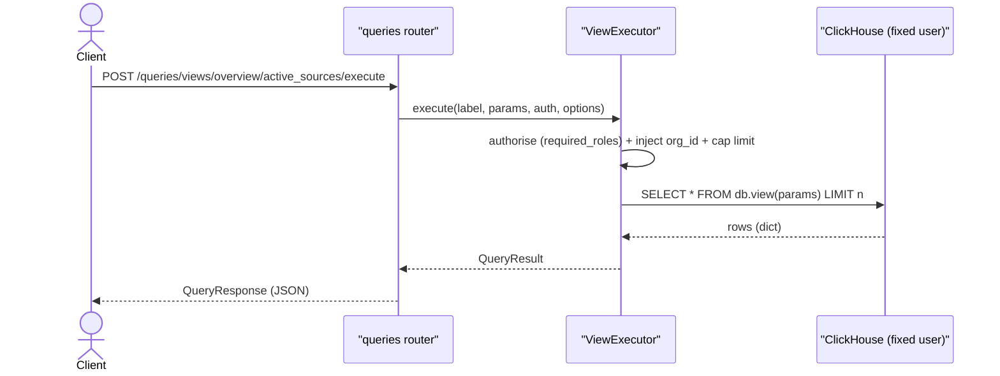

# DFE Query API

Label-based query over ClickHouse: callers execute pre-registered parameterised
VIEWS (or, admin-only, raw SQL) and get JSON back. RBAC-scoped, tenant-isolated
by the resolved ClickHouse connection. Base path `/api/v1/queries`.

There is no `POST /api/query` and no Apache Arrow wire format - responses are
plain JSON (`clickhouse-connect` HTTP, pyarrow removed). Source of truth:
[api/v1/queries.py](../src/dfe_engine/api/v1/queries.py),
[query/executor.py](../src/dfe_engine/query/executor.py).

## Endpoints

| Method + path | Scope | Purpose |
|---|---|---|
| `GET /queries/views` | `query:read` | List view definitions (optionally by namespace) |
| `GET /queries/views/namespaces` | `query:read` | List view namespaces |
| `GET /queries/views/{label}` | `query:read` | One view definition + its parameters |
| `POST /queries/views/{label}/execute` | `query:execute` | Run a parameterised view |
| `POST /queries/raw` | `query:raw` | Ad-hoc SQL against a datasource adapter (admin) |

`{label}` is `namespace/name` (path-encoded), e.g. `overview/active_sources`.

## How a view executes

A view runs as the caller's privilege-appropriate fixed ClickHouse user, and the
executor injects `org_id` + caps the row limit before the query reaches CH -
isolation is enforced server-side, not by the client.



Isolation: for an `org_analyst` the resolved connection authenticates as
`dfe_tenant_reader` carrying the org's `DFE_current_tenant_id`, and one CH row
policy scopes every read. An empty tenant setting fails CLOSED (0 rows). See
[RBAC.md](RBAC.md) section 8. NB the custom-settings mechanism does not enforce
on ClickHouse Cloud - see [BACKING-SERVICES.md](BACKING-SERVICES.md).

## Request + response

`POST /queries/views/{label}/execute` body: view parameters + options.

```json
{
  "params": {"severity": "critical"},
  "options": {"limit": 100, "offset": 0, "order_by": "ts", "after_key": null}
}
```

`QueryResponse` (both the execute and raw paths):

```json
{"rows": [{"col": "v"}], "columns": ["col"], "row_count": 1, "has_more": false}
```

## Pagination

Two modes, both capped at the view's `max_limit`:

- **Offset**: `options.offset` + `options.limit`. The inner view limit is bound to
  `offset + page` (capped at `max_limit`) so page 2+ is not silently empty.
- **Keyset**: `options.order_by` + `options.after_key` - the cursor is a BOUND
  parameter (`WHERE col > {after_key}`), never interpolated.

## Raw query (`POST /queries/raw`)

`query:raw` is a SEPARATE, admin-level scope - it is NOT covered by
`query:execute` and is NOT org-isolated (no `org_id` injection). It runs on the
admin CH user against a named datasource adapter. Hold it away from tenant roles.

## Adapters

The view path targets ClickHouse. `POST /queries/raw` dispatches to a datasource
adapter (`query/datasources/`): `clickhouse`, plus storage-listing adapters
(`s3`, `minio`, `file`) that list objects rather than run SQL. All return the same
JSON `QueryResponse` shape.
