# RBAC, Multi-Tenant ClickHouse, and Auth Architecture

**Scope:** Auth, granular RBAC, multi-tenant CH with row-level security, OIDC group sync, HyperDX integration, Argo CD RBAC export

---

## Implementation Status

| Area | Scope | Status |
|------|-------|--------|
| **RBAC roles** | 7-role model (renamed 2026-07), config-driven `hyperdx:` block, cumulative resolution, back-compat aliases | Done |
| **Tenant isolation** | Fixed CH users + ONE row policy per `_org_id` table + `TenantScopedClient` (custom-settings model) | Done |
| **HyperDX** | GA one-team default + per-org `tenant_reader` connection setting + role-driven scope-gate | Done |
| **Org-domain chain** | email domain -> claimed org -> `org_analyst` group -> `org_ids` -> CH row policy | Done |
| **Auth paths** | OIDC headers + API key + JWT Bearer + disabled; store-side group union on the OIDC path | Done |
| **Schema-less service discovery** | Service-surface YAML + metrics manifest cache | Not started |

OIDC provider config + copy-paste worked examples (EntraID, on-prem AD, Google,
Okta, Keycloak): [OIDC.md](OIDC.md). Sigma detection pipeline: [SIGMA.md](SIGMA.md).

---

## 1. Auth Flow

### 1.1 Four Authentication Paths

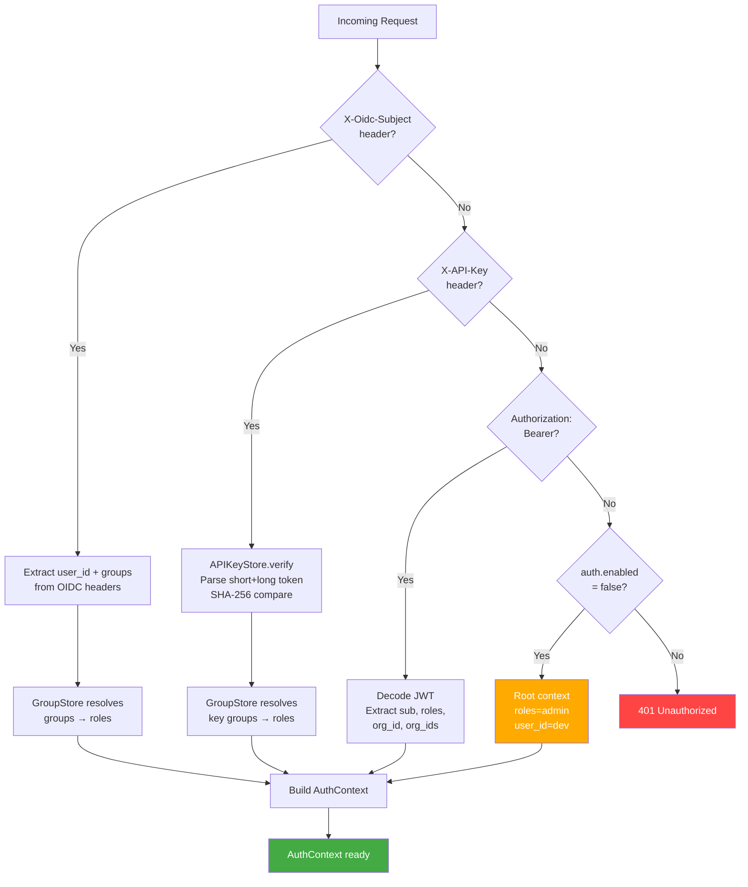

| Path | Use case | Credential storage | Token lifetime |
|------|----------|-------------------|----------------|
| OIDC headers | Production (Envoy Gateway fronted) | IdP (Entra, Google, etc.) | Session cookie (Envoy managed) |
| API key | CI/CD, Terraform, scripts | `config/auth/api-keys/*.yaml` (SHA-256 hash) | Long-lived (revoke by deleting file) |
| JWT Bearer | Standalone UI, dev | Issued by `/api/v1/auth/login` | `jwt_expire_minutes` (default 30) |
| Disabled | Dev/test | N/A | N/A |

OIDC headers injected by Envoy Gateway SecurityPolicy:

| Header | Content |
|--------|---------|
| `X-Oidc-Subject` | User email or unique ID |
| `X-Oidc-Groups` | Comma-separated OIDC group names |

### 1.2 Deployment Modes

Local auth is **always available**. OIDC is additive — headers are checked
first when present, but JWT and API key paths remain active. No explicit
mode toggle; OIDC detection is automatic based on header presence.

| Mode | Setting | What's active | Use case |
|------|---------|--------------|----------|
| **Dev/test** | `auth.enabled=false` | All requests get root admin context | Local development |
| **Standalone** | `auth.enabled=true` | JWT Bearer + API keys + local accounts | Docker, no external IdP |
| **Production** | `auth.enabled=true` + Envoy | OIDC headers (precedence) + JWT + API keys | K8s with Envoy Gateway |

### 1.3 OIDC Header Trust Model

**Security precondition:** When deploying behind Envoy Gateway OIDC,
dfe-engine MUST only be accessible via Envoy. Direct pod access MUST be
blocked by K8s NetworkPolicy. Without this, any client with pod access can
forge OIDC headers and impersonate any user.

### 1.4 Credential Storage Architecture

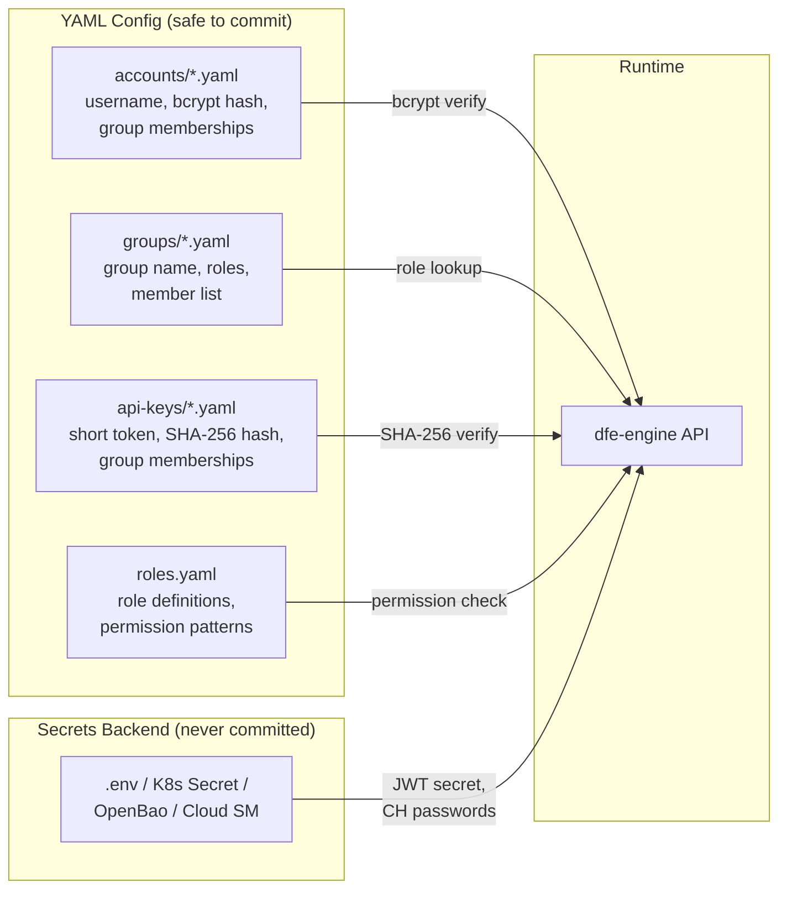

#### What Goes Where

| Data | Where stored | Format | Safe to commit? |
|------|-------------|--------|-----------------|
| Account names | `accounts/{name}.yaml` | Filename stem | Yes |
| Password hashes | `accounts/{name}.yaml` | `$2b$12$...` (bcrypt) | Yes (one-way) |
| API key short token | `api-keys/{name}.yaml` | Plaintext (8 hex chars) | Yes (lookup index) |
| API key long hash | `api-keys/{name}.yaml` | `sha256:{hex}` | Yes (one-way) |
| Full API key | Shown once at creation | `dfe_ak_{short}_{long}` | **NO** (never stored) |
| JWT signing secret | Env var (`DFE_API_JWT_SECRET`) | Random 256-bit | **NO** |
| CH connection passwords | Env var / K8s Secret | Plaintext | **NO** |
| Role definitions | `auth/resources/roles.yaml` | Permission patterns | Yes |
| Group→role mapping | `groups/{name}.yaml` | Role list | Yes |

#### Config Directory Layout

```
config/auth/
    accounts/           # One YAML per local user account
        admin.yaml
        analyst1.yaml
    groups/              # One YAML per group (group → roles)
        dfe-admins.yaml
        soc-analysts.yaml
    api-keys/            # One YAML per API key
        ci-deploy.yaml
```

Account filename = username. Group filename = group name. API key filename =
key name. The filename IS the identity — never stored inside the YAML body
(avoids DirectoryConfigStore YAML 1.1 boolean coercion on values like `off`,
`yes`, `no`).

### 1.5 Password Verification Flow

```python
# AccountStore.verify_password()
account = self.get(username)
if account is None:
    bcrypt.checkpw(password.encode(), _DUMMY_HASH)  # Timing-safe rejection
    return False
return bcrypt.checkpw(password.encode(), account.password_hash.encode())
```

Constant-time rejection for unknown usernames prevents enumeration attacks.

### 1.6 API Key Format

```
dfe_ak_8a3f2c91_7f3b2c4d8e9a1b5f6c7d8e9f0a1b2c3d4e5f6a7b8c9d0e1f
|      |         |
prefix short     long token (shown once, stored as SHA-256 hash)
       token
       (lookup index, shown in UI)
```

- **Prefix** (`dfe_ak_`): enables secret scanning by GitHub, GitGuardian
- **Short token** (8 hex chars): plaintext in YAML, used for lookup and display
- **Long token** (32 hex chars): SHA-256 hashed. Not bcrypt — keys are
  high-entropy random, bcrypt's slowness adds no security value
- Full key shown **once** at creation, never retrievable again
- **Revocation:** Delete the key's YAML file or call the revoke API

### 1.7 API Key Verification Flow

```python
# APIKeyStore.verify()
# Input: "dfe_ak_8a3f2c91_7f3b2c4d8e9a1b5f..."
prefix, short_token, long_token = parse_api_key(submitted_key)

# 1. Scan for matching short_token across key files
key_meta = find_by_short_token(short_token)

# 2. SHA-256 verify (timing-safe)
actual_hash = "sha256:" + hashlib.sha256(long_token.encode()).hexdigest()
if not hmac.compare_digest(key_meta.key_hash, actual_hash):
    raise AuthenticationError("Invalid API key")
```

---

## 2. RBAC Data Model

### 2.1 Identity Resolution Chain

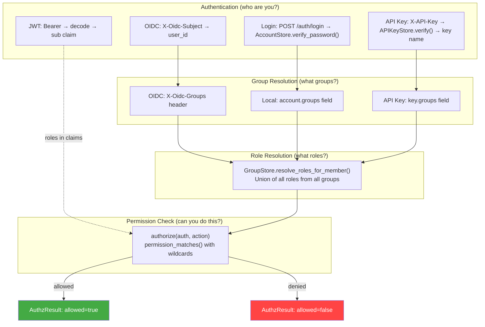

OIDC groups and local groups are unified — an OIDC group name that matches a
group file in `config/auth/groups/` inherits that group's roles.

### 2.2 Role Definitions

Roles are defined in `src/dfe_engine/auth/resources/roles.yaml` (built-in,
shipped with the package; copied to `{auth_dir}/../rbac/roles.yaml` on first
boot if absent). Custom roles load from a separate YAML via `RoleConfig.load(path)`.

7 built-in roles (`resource_type: core`), FLAT (no inheritance). A principal's
effective permissions are the UNION of every role across every group they belong
to. The 2026-07 rename retired the old names (`infra_admin`, `infra_viewer`,
`data_analyst_viewer`, `customer_viewer`); back-compat aliases keep them
resolving (section 2.2.4).

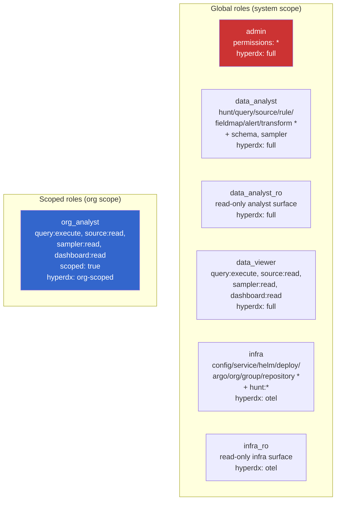

What the rename changed, beyond names:
- `infra` (was `infra_admin`) GAINED `hunt:*` (infra now owns hunts) + `hyperdx: otel` (the HyperDX OTel self-monitoring stream).
- `data_analyst` GAINED `hyperdx: full` (the full HyperDX ClickHouse surface).
- `org_analyst` (was `customer_viewer`) is the ONLY `scoped: true` role; it binds
  per-org and its `hyperdx: org-scoped` drives tenant isolation (sections 5, 8).

#### 2.2.1 Config-driven `hyperdx:` block

Each role carries an OPTIONAL `hyperdx:` block (`HyperdxAccess` model, `roles.py`).
It is the SINGLE config-driven source of a role's HyperDX capability - the
provisioner/reconciler reads it, so adding or changing HyperDX access is a
`roles.yaml` edit, not code:

```yaml
# roles.yaml (excerpt)
org_analyst:
  description: "Org-scoped analyst - own org's data only"
  scoped: true
  resource_type: core
  permissions: [query:execute, source:read, sampler:read, dashboard:read]
  hyperdx:
    access: org-scoped        # full | otel | org-scoped | none
    tenant_scoped: true       # inject the per-org DFE_current_tenant_id setting
```

| Field | Value | Meaning |
|---|---|---|
| `access` | `full` | Every CH db (dfe, otel, system read-only) - the full HyperDX surface |
| | `otel` | The HyperDX OTel self-monitoring stream only (infra) |
| | `org-scoped` | Only the org's tenant-filtered connection (row-policy isolated) |
| | `none` (or block absent) | No HyperDX provisioning at all |
| `tenant_scoped` | bool | Inject the per-org `DFE_current_tenant_id` connection setting |

There is deliberately NO `ch_connection` field - the CH connection is resolved
from the user-privilege precedence (section 5.2), not pinned per role.

Per-role `hyperdx` from `roles.yaml`:

| Role | `access` | `tenant_scoped` |
|---|---|---|
| admin | full | false |
| data_analyst | full | false |
| data_analyst_ro | full | false |
| data_viewer | full | false |
| infra | otel | false |
| infra_ro | otel | false |
| org_analyst | org-scoped | true |

#### 2.2.2 Cumulative resolution (widest-access-wins)

Roles are cumulative, so a principal's effective HyperDX access is resolved
across ALL their roles by `RoleConfig.effective_hyperdx(role_names)`:

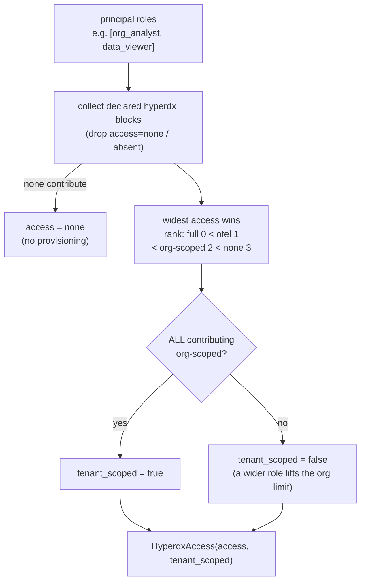

Key rule: `tenant_scoped` is true ONLY if EVERY contributing role is
`org-scoped`. So a user who is both `org_analyst` AND `data_viewer` resolves to
`access=full, tenant_scoped=false` - the wider `data_viewer: full` LIFTS the org
restriction. Give tenant-only users ONLY `org_analyst` (never also a global
HyperDX role) or they escape their tenant boundary at the HyperDX layer.

#### 2.2.3 Default group -> role bindings

`auth/bootstrap.py` seeds four groups on first boot (`_DEFAULT_GROUPS`), only if
the groups dir is empty; the seeded `admin` account joins `dfe-admins`:

| Default group | Role | Intended user |
|---|---|---|
| `dfe-admins` | `admin` | Platform administrators (full access) |
| `dfe-analysts` | `data_analyst` | Detection engineers / analysts (author + run) |
| `dfe-viewers` | `data_viewer` | Dashboard / query consumers (HyperDX) |
| `dfe-infra` | `infra` | Infra / deployment / hunt operators |

`data_analyst_ro`, `infra_ro`, and `org_analyst` ship but bind to no default
group. Attach them to custom groups as needed - or, for `org_analyst`, it is
auto-bound per-org by the JIT org-domain chain (section 7.3).

#### 2.2.4 Back-compat aliases

The rename ships a one-release alias shim (`ROLE_ALIASES`, `roles.py`). A literal
role name always wins; an alias only fills in when the literal is absent:

| Old name | New name |
|---|---|
| `infra_admin` | `infra` |
| `infra_viewer` | `infra_ro` |
| `data_analyst_viewer` | `data_analyst_ro` |
| `customer_viewer` | `org_analyst` |

Both permission resolution (`_lookup`) and the connection registry
(`get_connection_name`) are alias-aware, so an old group file resolving
`customer_viewer` maps to `org_analyst` -> `tenant_reader`, never the admin
fallback. Migrate group files to the new names within the release.

#### 2.2.5 Per-role reference

Each entry lists the exact `roles.yaml` patterns, the HyperDX block, and what a
holder can/cannot reach (wildcards expand via section 2.4).

**admin** - group `dfe-admins`
- Patterns: `*`; hyperdx: `full`
- Can: everything, all orgs. Sole holder of account/group/api-key admin + the
  CH-RBAC reconcile + gitops governance surface.

**data_analyst** - group `dfe-analysts`
- Patterns: `hunt:*`, `query:*`, `source:*`, `sampler:read`, `fieldmap:*`,
  `alert:*`, `rule:*`, `sigma:read`, `sigma:write`, `cel:check`, `schema:read`,
  `schema:write`, `transform:*`, `org:read`; hyperdx: `full`
- Can: full CRUD + execute on hunts/rules/queries (incl `query:raw` via
  `query:*`)/sources/fieldmaps/alerts/transforms; author Sigma rules + browse the
  catalogue, propagate, manage bindings/views + CEL checks; build+read schemas;
  sample; read org metadata; full HyperDX.
- Cannot: `sigma:admin` (registering/deleting a provider - a git-URL/local-dir,
  SSRF/path-reach action is admin-only); config/deployment/helm/argo/infra;
  account/group admin; repository.

**data_analyst_ro** - no default group
- Patterns: `hunt:read`, `query:read`, `query:execute`, `source:read`,
  `sampler:read`, `fieldmap:read`, `alert:read`, `rule:read`, `sigma:read`,
  `schema:read`, `org:read`; hyperdx: `full`
- Can: view every analyst surface (incl the Sigma catalogue), run existing
  queries/views, sample, full HyperDX read. Served by the `dfe_analyst_ro`
  readonly CH user (no tenant filter).
- Cannot: any write/author; `query:raw`; Sigma write.

**data_viewer** - group `dfe-viewers`
- Patterns: `query:execute`, `source:read`, `sampler:read`, `dashboard:read`,
  `org:read`; hyperdx: `full`
- Can: run parameterized views, read sources, sample, and `dashboard:read` (the
  scope the dfe-ui uses for the embedded HyperDX link), full HyperDX. The minimal
  dashboard-consumer role.
- Cannot: author anything; raw SQL; infra.

**infra** - group `dfe-infra` (was `infra_admin`)
- Patterns: `hunt:*`, `config:*`, `service:*:config:*`, `service:*:metrics:read`,
  `helm:*`, `deployment:*`, `argo:*`, `lifecycle:*`, `service:read`, `org:*`,
  `group:*`, `repository:*`; hyperdx: `otel`
- Can: manage service configs/deployments/helm compile+DDL/Argo; drive service
  lifecycle (start/stop/scale via gitops); full org+group+repository admin; run
  hunts; read service configs + metrics; the HyperDX OTel self-monitoring stream.
- Cannot: analyst data authoring (query/source/rule/fieldmap/alert beyond hunts);
  the full HyperDX data surface.

**infra_ro** - no default group (was `infra_viewer`)
- Patterns: `config:read`, `service:*:config:read`, `service:*:metrics:read`,
  `helm:compile`, `deployment:read`, `argo:applications:get`,
  `argo:projects:get`, `lifecycle:read`, `service-surface:read`, `service:read`,
  `org:read`; hyperdx: `otel`
- Can: read infra config/service/deployment/Argo state + service lifecycle state,
  dry-run helm compile, OTel stream.
- Cannot: any infra write.

**org_analyst** - scoped, no default group (was `customer_viewer`; auto-bound per org)
- Patterns: `query:execute`, `source:read`, `sampler:read`, `dashboard:read`;
  `scoped: true`; hyperdx: `org-scoped`, `tenant_scoped: true`
- Can: the same read/execute surface as `data_viewer` but ORG-RESTRICTED.
  `scoped: true` binds it at `org:<name>` scope; only `query:execute` is a
  TENANT_ACTION, so reads resolve org-scoped and the `dfe_tenant_reader` CH user +
  row policy filter rows to the principal's `org_ids`. The tenant dashboard role,
  auto-bound by the org-domain JIT chain (section 7.3).
- Cannot: cross-org; author; infra. NOTE there is still NO org-scoped AUTHOR
  (write) role - `org_analyst` is read/execute only.

#### 2.2.6 Known grant gaps (current-state)

These are known and affect what a role can actually REACH (verify against
`roles.yaml` when they bite):

- `infra` lacks `helmvars:*` and the bare `service:write` / `service:delete` /
  `service:validate` actions (the `service:*:config:*` mid-wildcard requires a
  `config` segment) - some helm-var overrides and service mutations stay admin-only.
- `service-surface` (roles.yaml) vs `service_surface` (router) hyphen/underscore
  mismatch leaves `infra_ro`'s `service-surface:read` grant inert.
- The `API_ENFORCED_ACTIONS` catalogue in `auth/engine.py` can drift from the
  live `require_action` set - treat it as advisory.

### 2.3 Permission Taxonomy

| Domain | Actions | Scoped by service? |
|--------|---------|---------------------|
| `hunt` | `read`, `write`, `execute`, `*` | No |
| `query` | `read`, `execute`, `*` | No |
| `source` | `read`, `write`, `*` | No |
| `fieldmap` | `read`, `write`, `*` | No |
| `alert` | `read`, `write`, `*` | No |
| `schema` | `read`, `write`, `*` | No |
| `dashboard` | `read`, `write`, `*` | No |
| `config` | `read`, `write`, `*` | No |
| `transforms` | `compile`, `test`, `*` | No |
| `service` | `config:read`, `config:write`, `metrics:read`, `*` | Yes (`service:{name}:{action}`) |
| `helm` | `compile`, `execute_ddl`, `create_topics`, `*` | No |
| `deployment` | `read`, `write`, `*` | No |
| `org` | `read`, `write`, `*` | No |
| `argo` | `{resource}:{action}` (open-ended) | No |

### 2.4 Wildcard Permission Matching

```python
def permission_matches(permission: str, action: str) -> bool:
```

| Pattern | Matches | Does NOT match |
|---------|---------|----------------|
| `*` | Everything | — |
| `config:*` | `config:read`, `config:write`, `config:read:sub` | `hunt:read` |
| `service:*:config:*` | `service:loader:config:read` | `service:loader:metrics:read` |
| `service:*:config:read` | `service:loader:config:read` | `service:loader:config:write` |

- `*` alone matches ANY action regardless of segment count
- Trailing `*` matches any remaining segments
- Mid-position `*` matches exactly one segment

### 2.5 Authorization Engine

```python
# engine.py
def authorize(
    auth: AuthContext | None,
    action: str,
    resource: str = "",
    enabled: bool = True,
    role_config: RoleConfig | None = None,
) -> AuthzResult:
```

Decision order:
1. `enabled=False` → allow (dev/test)
2. `auth=None` → root mode, allow
3. Check `role_config.check_roles(auth.roles, action)` → first granting role
4. Return `AuthzResult(allowed, reason)`

### 2.6 RBAC Enforcement in API

```python
# api/deps.py
@router.post("/sources")
async def create_source(
    user: CurrentUser,
    _auth: None = Depends(require_action("source:write")),
): ...
```

`require_action(action)` calls `authorize()` and raises `AuthorizationError` on denial,
which the error handler converts to HTTP 403.

---

## 3. Account, Group, and API Key Stores

### 3.1 Store Architecture

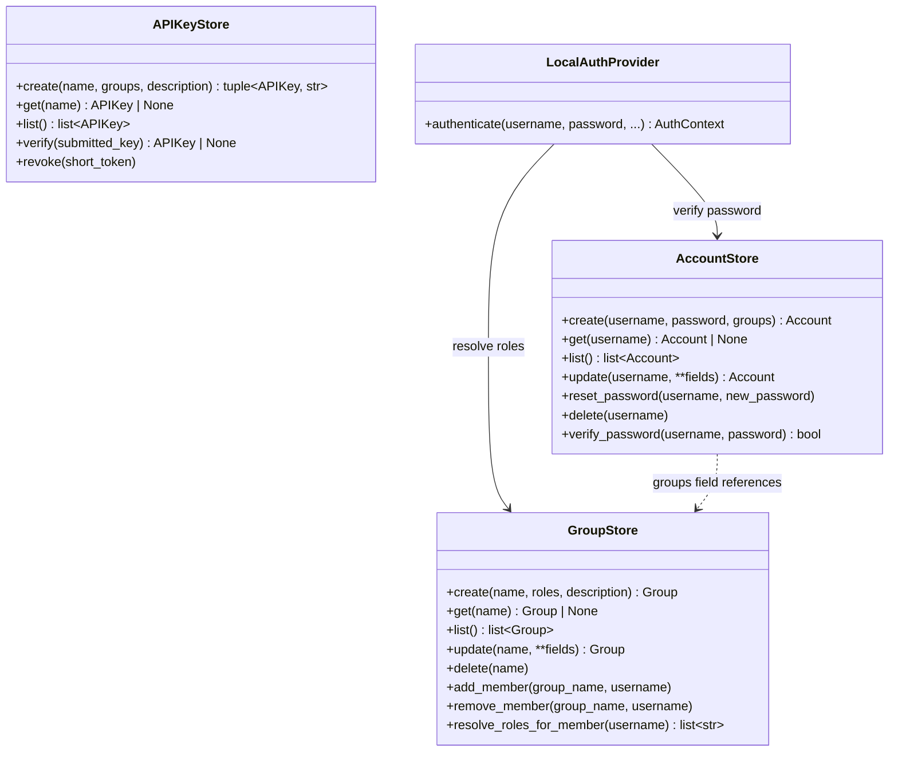

All stores are YAML-backed (one file per entity, filename = identity).

### 3.2 File Formats

```yaml
# config/auth/accounts/analyst1.yaml
enabled: true
password_hash: "$2b$12$LJ3m..."
groups: ["soc-analysts"]
created_at: "2026-03-31T02:00:00Z"
updated_at: "2026-03-31T02:00:00Z"
```

```yaml
# config/auth/groups/soc-analysts.yaml
description: "SOC analyst team"
roles: ["data_analyst"]
members: ["analyst1", "analyst2"]
source_provider: ""              # OIDC provider name (if synced)
source_id: ""                    # Provider-specific group ID
```

```yaml
# config/auth/api-keys/ci-deploy.yaml
enabled: true
short_token: "8a3f2c91"
key_hash: "sha256:e3b0c442..."
groups: ["infra-ops"]
description: "CI/CD pipeline deployer"
created_at: "2026-03-31T02:00:00Z"
```

### 3.3 REST API

```
POST   /api/v1/auth/login                           # JWT login
POST   /api/v1/auth/refresh                          # Refresh JWT
GET    /api/v1/auth/me                               # Current user info + permissions
GET    /api/v1/auth/permissions                      # Current user's resolved permissions
```

Account, group, and API key CRUD endpoints are available via the stores and
CLI. The auth router currently exposes login/refresh/me/permissions.

### 3.4 Bootstrap Defaults

On first startup (empty `config/auth/` directory), `bootstrap_auth()` seeds:

**Groups:**
- `dfe-admins` → roles: `[admin]`
- `dfe-analysts` → roles: `[data_analyst]`
- `dfe-viewers` → roles: `[data_viewer]`
- `dfe-infra` → roles: `[infra]`

**Account:** `admin`, joined to `dfe-admins`. Password sourcing:
- Dev posture (`DFE_ENV=dev|test|...`): default `changeme`; a warning is logged
  while it is still in use.
- Non-dev posture with an EMPTY account store and unset `DFE_ADMIN_PASSWORD`:
  the engine generates a random password (`secrets.token_urlsafe(24)`), logs it
  ONCE at boot, and stores only the bcrypt hash. Capture it from that first log
  line (or pre-seed `DFE_ADMIN_PASSWORD`). This replaces the old baked-in
  `changeme` for production.

---

## 4. OIDC Provider Integration

This section is the in-RBAC summary. For the full provider-config reference, the
infra contract (Envoy SecurityPolicy, secrets, IAM), and COPY-PASTE worked
`{name}.yaml` examples (EntraID, on-prem Active Directory via a broker, Google
Workspace, Okta, Keycloak) plus how each provider's groups map into DFE roles,
see [OIDC.md](OIDC.md).

### 4.1 Architecture

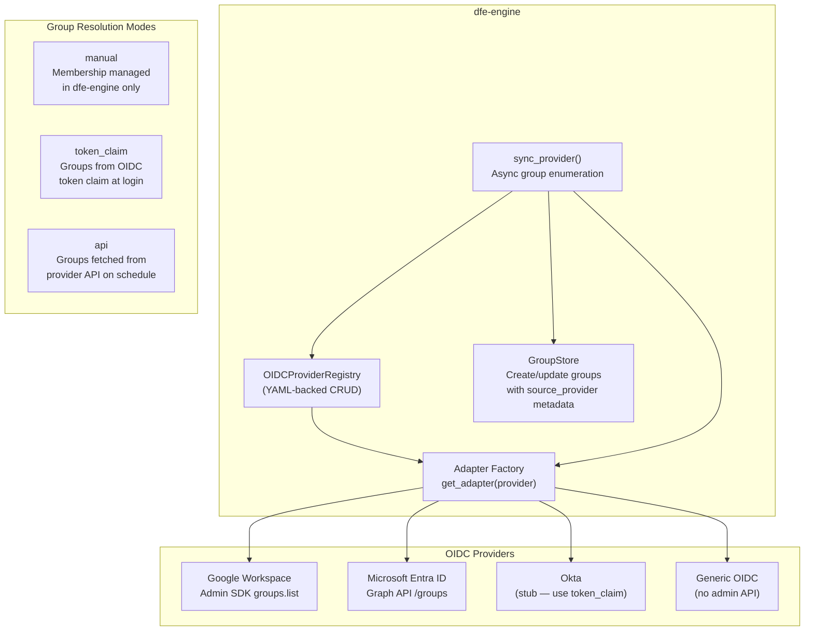

### 4.2 Provider Configuration

```yaml
# config/auth/oidc-providers/{name}.yaml
type: "google"           # generic | google | entra_id | okta
enabled: true
display_name: "Google Workspace"
issuer: "https://accounts.google.com"
client_id_env: "GOOGLE_CLIENT_ID"
groups:
  mode: "api"            # manual | token_claim | api
  sync_interval: 3600
  # Google-specific
  service_account_json_env: "GOOGLE_SA_JSON"
  admin_email: "admin@example.com"
  domain: "example.com"
```

Credential env var *names* are stored in config (not values) — secrets stay
in the deployment's secrets backend.

### 4.3 Adapter Implementations

| Adapter | Status | Admin API | Group sync |
|---------|--------|-----------|------------|
| Generic | Done | None | No (use `token_claim` mode) |
| Google | Done | Admin SDK `groups().list()` | Yes — full pagination |
| Entra ID | Done | Graph API `/groups` | Yes — `$top=999` pagination |
| Okta | Stub | Not implemented | No (Okta natively includes groups in ID token) |

All adapters are failsafe — credential or API failures return empty results
rather than raising exceptions, so auth continues working even if group
resolution degrades.

### 4.4 Group Sync Process

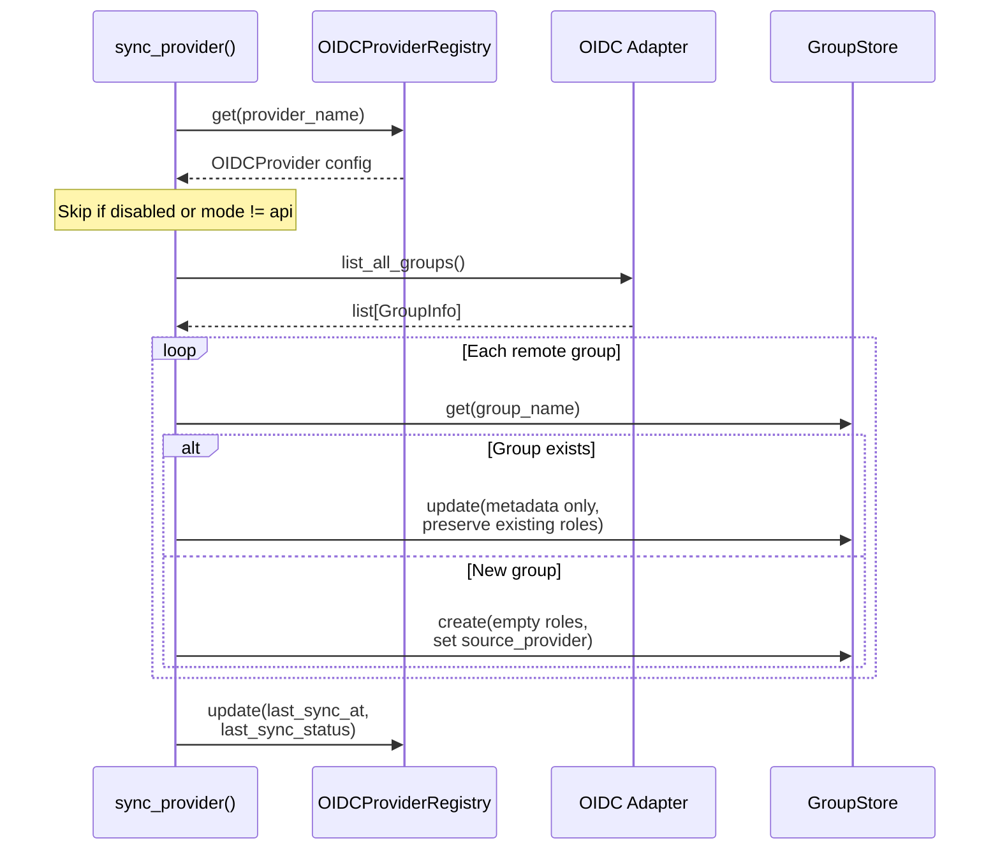

Key behaviour: existing groups keep their roles. Sync only updates
description and source metadata. Admins assign roles to synced groups
manually.

---

## 5. ClickHouse Multi-Tenant Connection Registry

### 5.1 Custom Settings Pattern

Instead of creating a CH user per customer org, use the ClickHouse custom
settings pattern with a small fixed set of users:

```sql
-- ONE RESTRICTIVE row policy per _org_id table, targeting the fixed reader.
-- Multi-org via a comma-joined list; empty setting -> 0 rows (fail closed).
CREATE ROW POLICY OR REPLACE dfe_tenant_filter ON dfe.events
    AS RESTRICTIVE FOR SELECT
    USING has(splitByChar(',', getSetting('DFE_current_tenant_id')), _org_id)
    TO dfe_tenant_reader;

-- dfe-engine injects the tenant per query (TenantScopedClient). The reader is
-- readonly with DFE_current_tenant_id CHANGEABLE_IN_READONLY, so it can set the
-- one setting while staying read-only.
SELECT * FROM dfe.events SETTINGS DFE_current_tenant_id = 'acme';  -- acme rows only
```

**REQUIRED CH SERVER CONFIG (deploy, not reconciler DDL):** the row policy reads
`getSetting('DFE_current_tenant_id')`, a CUSTOM setting, which ClickHouse only
accepts when the server config.xml declares the prefix:

```xml
<custom_settings_prefixes>DFE_</custom_settings_prefixes>
```

Without it, CH rejects every `DFE_*` setting (both `CREATE USER ... SETTINGS` and
each per-query `SETTINGS`) and tenant scoping cannot apply. This is CH server
config owned by the DEPLOYER - dfe-infra (ClickHouse chart values / users.d
overlay) and dfe-docker (container config.xml) - NOT something the engine
reconciler sets. Also surfaced in `.env.example`.

**Benefits:**
- A small fixed set of CH users by privilege, not N per org
- ONE row policy per `_org_id` table, not per (org, table)
- Scales to thousands of orgs without CH user sprawl or per-tenant DDL
- Empty / unset setting -> zero rows (fail closed); the engine sets it to `''`
  for an org-scoped principal with no orgs, never omits it

### 5.2 Connection Architecture

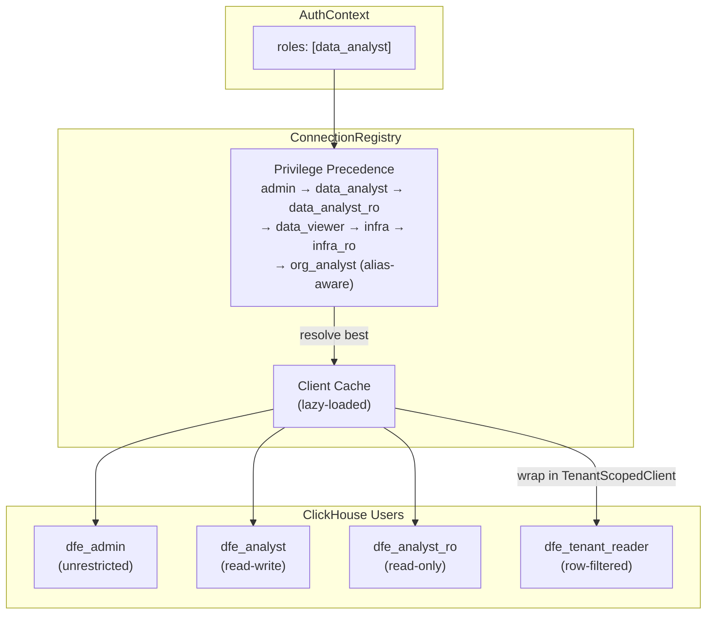

### 5.3 Connection Config (connections.yaml)

```yaml
connections:
  # default = the admin connection. Its user is the deployment's CH superuser
  # (the dfe_admin identity), deliberately NOT minted so it authenticates before
  # the first reconcile. dfe_analyst / dfe_analyst_ro / dfe_tenant_reader ARE
  # minted by the reconciler (secrets seam -> the *_PASSWORD envs).
  default:
    host: clickhouse.clickhouse.svc.cluster.local
    port: 8123
    database: dfe
    user: default
    password_env: CH_DEFAULT_PASSWORD

  analyst:
    user: dfe_analyst
    password_env: CH_ANALYST_PASSWORD

  analyst_ro:
    user: dfe_analyst_ro
    password_env: CH_ANALYST_RO_PASSWORD

  tenant_reader:
    user: dfe_tenant_reader
    password_env: CH_TENANT_READER_PASSWORD

role_connections:
  admin: default
  infra: default
  data_analyst: analyst
  data_analyst_ro: analyst_ro
  data_viewer: analyst_ro
  infra_ro: analyst_ro
  org_analyst: tenant_reader
```

### 5.4 TenantScopedClient

Wraps the clickhouse-connect client to inject `DFE_current_tenant_id` into every
query's settings - ALWAYS (fail closed). For a principal with multiple `org_ids`
the value is the comma-joined list, so queries are scoped to exactly their
permitted orgs; with no org_ids it is `''` (zero rows), never omitted.

```python
class TenantScopedClient:
    def query(self, sql, ...):
        settings = {"DFE_current_tenant_id": ",".join(self.org_ids)}
        return self._client.query(sql, settings=settings, ...)
```

### 5.5 Row Policies

Only tables with an `_org_id` column get the tenant row policy. Discovery:
```sql
SELECT table FROM system.columns
WHERE database = 'dfe' AND name = '_org_id'
```

System, metadata, and audit tables are excluded.

### 5.6 End-to-end tenant isolation chain

This is the whole chain from an external login to filtered ClickHouse rows. It
is the load-bearing isolation path - every link must hold or the org escapes its
tenant.

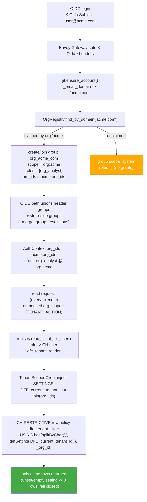

Every link is covered by code: JIT + `find_by_domain` (auth/jit.py, orgs/registry.py),
the OIDC group union (api/deps.py `_merge_group_resolutions`), the CH-user resolution
(connections/registry.py `read_client_for_user`), the per-query setting injection
(connections/tenant.py `TenantScopedClient`), and the row policy (governance/ch/render.py).
`query:execute` is the only `TENANT_ACTION`; every non-tenant action is a plain
system-scope check. The tenant boundary itself is enforced SOLELY at the CH
row-policy layer - see the two boundaries in section 6.

---

## 6. Two Authority Boundaries: Data vs Operations

DFE has TWO independent security boundaries. Conflating them is the classic
mistake, so document both explicitly.

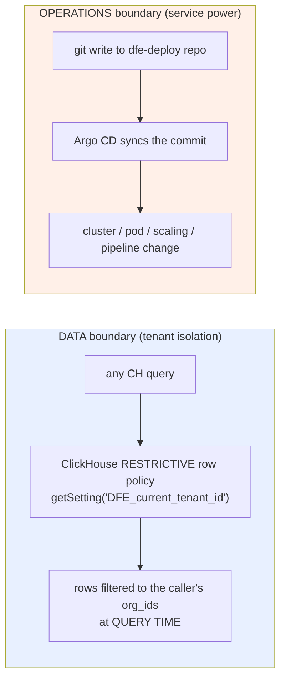

| | DATA boundary | OPERATIONS boundary |
|---|---|---|
| What it governs | Tenant data reads | Infra/service/pod/scaling/pipeline config |
| Enforced by | ClickHouse row policies at query time (section 5) | The dfe-deploy git repo (branch protection, repo access, PR review, the auto-merge posture gate) |
| Engine RBAC role | `org_analyst` etc. + `dfe_tenant_reader` CH user | `infra` (the governed window) |
| Bypass path | none - there is NO query path that omits the setting | direct commit to dfe-deploy BYPASSES engine RBAC entirely |

### 6.1 The deploy-repo is the ultimate operational authority

The `infra` role's power flows: dfe-engine -> commit to the dfe-deploy repo ->
Argo CD -> cluster action. dfe-engine RBAC governs who makes infra/service
changes THROUGH the engine (the governed window). But DIRECT write access to
dfe-deploy bypasses dfe-engine RBAC completely: a hand-edited file -> Argo ->
action. So **dfe-deploy commit access == full operational/service power**
(equal-to-or-exceeding `infra`), regardless of any dfe-engine role. It MUST be
governed at the GIT layer (branch protection, repo access, PR review, the
auto-merge posture gate) - engine RBAC alone does NOT constrain a direct
committer. This is the gitops-survivability principle: the deploy repo is the
source of truth and authority; the engine is a window over it.

### 6.2 Operations is NOT data

CRITICAL distinction: deploy-repo write is OPERATIONAL/service power, NOT tenant
DATA access. There is no ClickHouse query path from a git commit, so deploy-repo
access grants ZERO tenant data reads. Tenant data is isolated by the CH row
policies (the custom-settings model, section 5) at query time, independent of
git. So:
- The deploy-repo boundary governs OPERATIONS (what runs, how it scales).
- The CH row-policy boundary governs DATA (which rows a principal can read).

An operator with full dfe-deploy write can reshape the cluster but still cannot
read another org's rows without going through a tenant-scoped CH query path -
and every such path injects the row-policy setting.

---

## 7. Org Lifecycle

### 7.1 Org Registry

YAML-backed CRUD via `OrgRegistry`. One file per org in `config/orgs/`. An org's
`domains` list (the email domains it claims) drives the JIT org-domain chain
(7.3); it is SEPARATE from `org_ids` (the tenant IDs used in the CH row-policy
filter). `find_by_domain` is case-insensitive and, on multiple claimants,
deterministically picks the name-sorted-first org and logs a warning.

### 7.2 Org Creation Flow

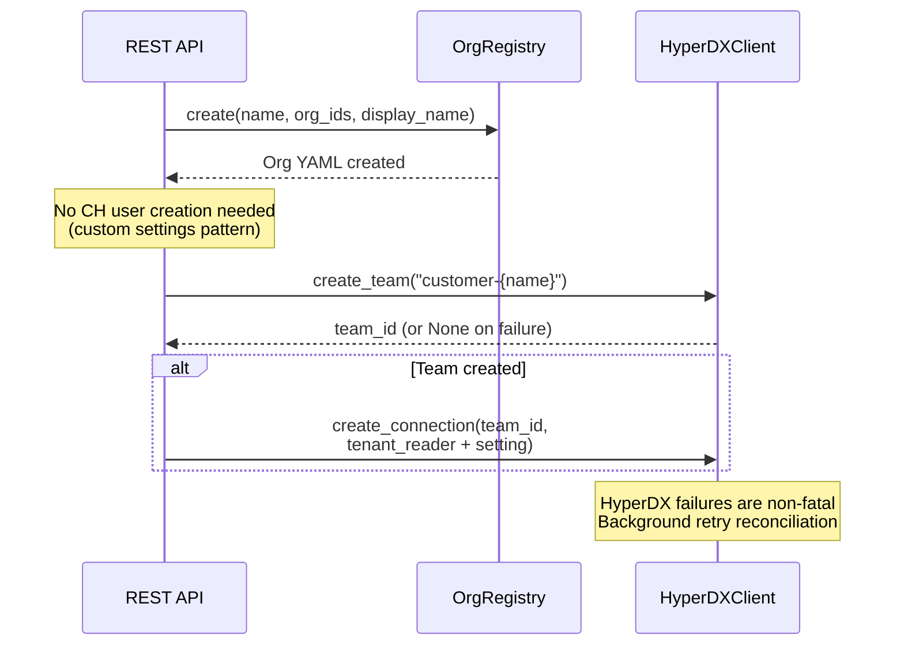

With the custom settings pattern, adding an org does NOT require creating a
CH user or row policy. The existing `tenant_reader` user + existing row
policies handle it. dfe-engine just needs to know the org_ids to inject.

### 7.3 Org-domain association (JIT)

The auth half of the isolation chain (5.6). On an external user's FIRST login,
`jit.ensure_account` derives the email domain (`_email_domain`) and:
- if a managed org CLAIMS the domain (`OrgRegistry.find_by_domain`): create/join
  a group `org_<domain>` (e.g. `org_acme_com`) with `scope = org:<name>`,
  `roles = [org_analyst]`, `org_ids = org.org_ids`;
- if the domain is UNCLAIMED: create the group `scope = system`, `roles = []`,
  `org_ids = []` - the account exists but gets no grants until an org claims the
  domain or an admin assigns roles.

Idempotent: the group is created once per domain; later same-domain users just
`add_member`. The OIDC auth path then UNIONS this store-side group's grants +
`org_ids` into the live `AuthContext` (`_merge_group_resolutions`), so the org
binding reaches the request even though the IdP only sent header groups.

---

## 8. HyperDX Integration

### 8.1 Strategy

- **Bootstrap:** `generate_default_connections_json()` produces the
  `DEFAULT_CONNECTIONS` env var for the HyperDX Helm chart.
- **Runtime:** `HyperDXClient` calls the HyperDX internal API for team/connection CRUD.
- **Failures:** Non-fatal. First failure sets `_connected=False`, subsequent calls
  logged as warnings. Org CRUD still succeeds; provisioning is retried in the
  background.

### 8.2 Team model - GA one-team (default) vs per-group

Two postures, switched by `DFE_HYPERDX_PER_GROUP` (default `false` = GA):

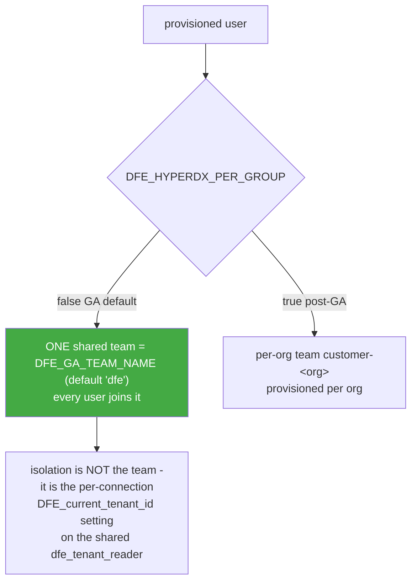

GA rationale: the shared `dfe_tenant_reader` CH user + a per-connection
`DFE_current_tenant_id` isolates orgs WITHOUT a team per org, so it scales to
thousands of orgs with no per-tenant team sprawl. `DFE_HYPERDX_PER_GROUP=true`
is the post-GA richer model.

### 8.3 Scope-gate from the role's hyperdx block

HyperDX provisioning is gated on the role config, NOT hardcoded. `jit.resolve_hyperdx_team`
computes `RoleConfig.effective_hyperdx(roles)` (section 2.2.2); if `access == none`
it returns `""` and NO team/connection/invite is provisioned. So a role's
`hyperdx:` block is the single switch for its HyperDX capability - a YAML edit,
not code.

### 8.4 The per-org connection (tenant_reader + setting)

Per-org HyperDX connections point at the shared `dfe_tenant_reader` CH user and
carry the tenant setting, replacing the retired per-group `dfe_grp_<group>` users:

| DFE principal | HyperDX team | CH user | Connection setting |
|---|---|---|---|
| admin | GA team (`dfe`) | `dfe_admin` | none (unrestricted) |
| data_analyst | GA team (`dfe`) | `dfe_analyst` | none |
| data_viewer | GA team (`dfe`) | `dfe_analyst_ro` | none |
| org_analyst (acme) | GA team (`dfe`) | `dfe_tenant_reader` | `DFE_current_tenant_id=<acme org_ids>` |

`build_hyperdx_connections_json` emits `clickhouseSettings { DFE_current_tenant_id:
join(org_ids) }` per org connection; an empty value fails closed (0 rows).

### 8.5 Two fork dependencies

The upstream HyperDX fork must carry two changes for the per-org setting to take
effect (handover for the fork maintainer):

1. **Merge connection settings into every query.** The fork `ConnectionSchema`
   has no generic settings map (only `hyperdxSettingPrefix`), so
   `connection.clickhouseSettings` is currently INERT - the fork strips unknown
   keys (forward-safe, but the tenant setting never reaches CH). The fork must
   MERGE `connection.clickhouseSettings` into every proxied CH query's
   `clickhouse_settings`. The mechanism exists (`node.ts` accepts per-query
   `clickhouse_settings`); the wiring is the small merge.
2. **Source -> connection fan-out** under per-org connections is a fork concern
   (a source must resolve to the caller's org connection).

Until (1) lands in the fork, HyperDX tenant isolation is enforced only if the
fork applies the setting; the dfe-engine + `TenantScopedClient` path (section 5)
is already proven end to end against real ClickHouse.

---

## 9. Argo CD RBAC

Roles still carry `argo:{resource}:{action}` grants (`infra` holds `argo:*`,
`infra_ro` holds `argo:applications:get` / `argo:projects:get`), and the
`ARGO_ACTION_PREFIX = "argo:"` namespace remains the SSoT for which Argo actions
a role may perform.

The engine no longer GENERATES the `argocd-rbac-cm` policy CSV / AppProject
roles - the `helm/argo_rbac.py` exporter was removed. Argo CD RBAC is now
dfe-infra's deployment concern; the engine's role model only declares the intent.

---

## 10. Audit Logging

Every authorisation decision is logged for compliance (SOC 2, GDPR) via
structured OTel log events (`hyperi_pylib.logger`).

| Event | Log key | Level |
|-------|---------|-------|
| Login success | `auth.login.success` | info |
| Login denied | `auth.login.denied` | warning |
| Permission denied | `auth.permission.denied` | warning |
| Account change | `auth.account.{change}` | info |
| Group change | `auth.group.{change}` | info |
| API key change | `auth.api_key.{change}` | info |

Events flow through the OTel pipeline → JSON → ClickHouse → HyperDX.
No custom ClickHouse audit table — standard OTel log ingestion is used.

---

## 11. AuthContext Model

```python
class AuthContext(BaseModel):
    org_id: str = "default"      # Primary tenant
    user_id: str                 # Required unique identifier
    roles: list[str]             # Resolved DFE roles
    groups: list[str] = []       # OIDC or local groups
    org_ids: list[str] = []      # For customer-scoped roles
    connection_id: str = ""      # Resolved CH connection name
    request_id: str | None = None
    client_ip: str | None = None
    user_agent: str | None = None
```

Permissions are resolved at authorisation time from roles — never stored on
the context.

---

## 12. Settings

```python
class AuthSettings(BaseModel):
    enabled: bool = False         # Off by default (dev/test)
    auth_dir: str = ""            # Path to config/auth/ directory

    oidc: OIDCSettings            # Nested OIDC config

class OIDCSettings(BaseModel):
    providers_dir: str = ""       # Path to OIDC provider config dir
    sync_enabled: bool = True     # Enable background group sync
    sync_on_startup: bool = True  # Sync providers at startup
```

Environment variables: `DFE_AUTH_ENABLED`, `DFE_AUTH_DIR`,
`DFE_AUTH_OIDC_PROVIDERS_DIR`, `DFE_AUTH_OIDC_SYNC_ENABLED`,
`DFE_AUTH_OIDC_SYNC_ON_STARTUP`.

---

## 13. Module Map

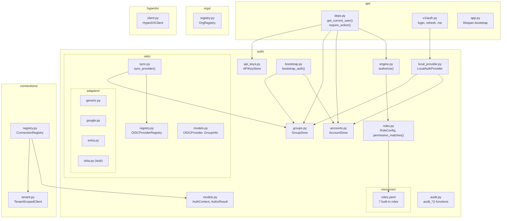

---

## 14. Remaining Work

### Schema-Less Service Discovery

Adding a new `dfe-transform-elastic` should require zero Python code
changes. The current typed plugin system (`plugins.py`, `plugins_builtin/`)
remains in place. Phase 4 replaces it with:

1. **Service surface YAML files** (`config/service-surfaces/{name}.yaml`)
   describing configurable settings and metrics
2. **Metrics manifest caching** from rustlib `/metrics/manifest` endpoint
3. **`/api/v1/service-surfaces/`** API endpoints with RBAC
4. **Removal of typed plugin system** (`plugins.py`, `plugins_builtin/`)

---

## 15. Edge Cases

| Scenario | Behaviour |
|----------|-----------|
| Multi-role user | Highest-privilege connection wins (precedence order) |
| HyperDX unavailable | Non-fatal. Org CRUD succeeds. Sync retried in background |
| ClickHouse unavailable | Degraded mode: API serves cached state, `/health/ready` → 503, retry every 60s |
| Unknown OIDC group | No matching group file → no roles resolved → default deny |
| OIDC adapter failure | Failsafe: returns empty results, auth continues with available info |
| Default password in use | Warning logged at startup |

---

## 16. Non-Goals

- Per-metric RBAC granularity (access is per-service, not per-metric)
- Per-setting RBAC granularity (access is per-service config, not per-key)
- HyperDX per-user RBAC (solved at dfe-engine layer via teams)
- Dynamic K8s service discovery (future enhancement)
- Envoy Gateway SecurityPolicy CRD generation (managed by dfe-infra)
- ClickHouse cluster provisioning (managed by dfe-infra)
- Role hierarchy / inheritance (flat roles sufficient for 7-role set)

---

## 17. Breaking Changes from Pre-2.2

| What | Old | New |
|------|-----|-----|
| JWT library | `python-jose[cryptography]` | `PyJWT[crypto]` |
| Auth model | `AuthContext.permissions` field | Removed — resolved from roles at auth time |
| Role names | `admin`, `operator`, `viewer` | 7 granular roles in `roles.yaml` |
| Role storage | `DEFAULT_ROLE_PERMISSIONS` constant | `auth/resources/roles.yaml` |
| Account storage | Hardcoded dict in `LocalAuthProvider` | `config/auth/accounts/*.yaml` with full CRUD |
| Group mapping | `AuthSettings.group_role_mapping` | `config/auth/groups/*.yaml` |
| Auth paths | JWT Bearer only | OIDC headers + API key + JWT Bearer + disabled |
| CH connections | Single global client | `ConnectionRegistry` (multi-client, tenant-scoped) |
| Deep merge | `deepmerge` pip package | `dfe_engine.yaml_utils.deep_merge()` (vendored) |

---

## 18. References

- [ClickHouse Custom Settings + Row Policy (Highlight)](https://www.highlight.io/blog/row-level-security)
- [API Key Prefix Pattern (Seam)](https://github.com/seamapi/prefixed-api-key)
- [Multi-Tenant RBAC Design (WorkOS)](https://workos.com/blog/how-to-design-multi-tenant-rbac-saas)
- [Envoy Gateway OIDC SecurityPolicy](https://gateway.envoyproxy.io/docs/tasks/security/oidc/)
