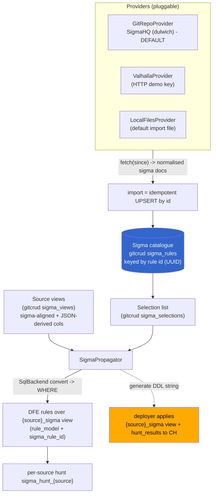
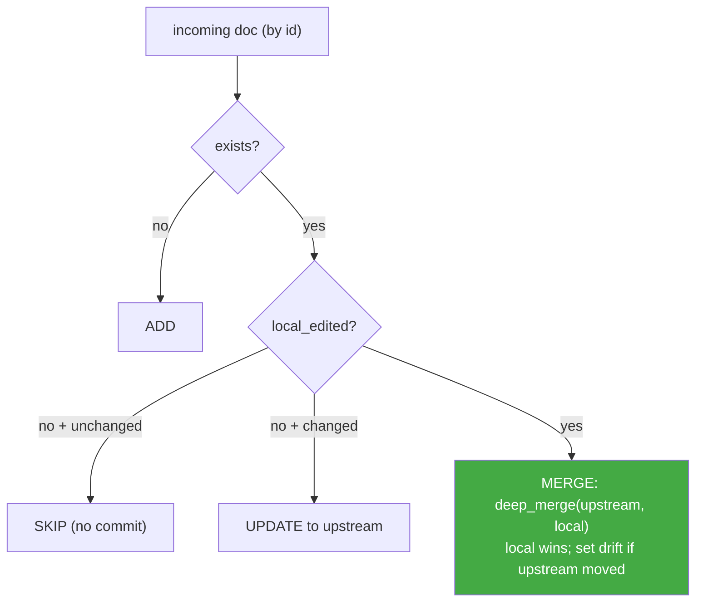
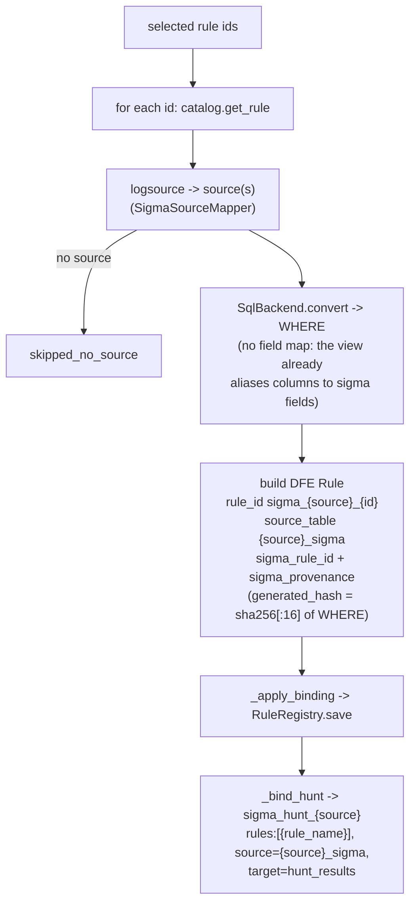
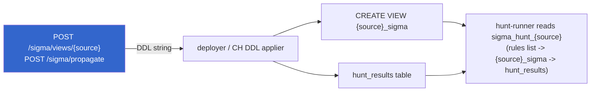

# Sigma Detection Pipeline

**Scope:** the full Sigma pipeline - external providers -> an id-keyed rule
catalogue (CRUD) -> a selection list -> source views (incl JSON-derived columns)
-> propagation into DFE rules -> per-source hunts. Plus the provider adapters, the
import->CRUD merge model, the API surface, and the deploy boundary.

Module layout: `src/dfe_engine/sigma/{providers/, catalog.py, views.py,
propagation.py, source_mapper.py}` + router `src/dfe_engine/api/v1/sigma.py`.
Related: [SOURCE.md](SOURCE.md), [SCHEMA.md](SCHEMA.md), [RBAC.md](RBAC.md).

---

## 1. Pipeline at a glance



Every store is a **gitcrud** class over the deploy repo (versioned YAML docs), so
the whole pipeline is git-survivable + auditable. The catalogue is keyed by the
Sigma rule's mandatory `id` UUID, which makes import an idempotent upsert.

---

## 2. Providers

A pluggable adapter fetches rules from a source, normalises to sigma docs, and
feeds the ONE id-keyed catalogue via the SAME upsert. `SigmaProvider` (ABC,
`providers/base.py`) has one contract method:

```python
async def fetch(self, since: datetime | None = None) -> list[SigmaRuleDoc]:
    """Fetch (optionally only rules changed since `since`) as normalised docs."""
```

Sync orchestration lives in `catalog.py` (`sync_provider`), not on the adapter.
`build_provider(config, ...)` switches on `config.kind`.

**Normalised doc `SigmaRuleDoc`:** `id` (mandatory UUID - the CRUD key), `title`,
`rule` (pySigma `to_dict()`), `modified`, `date`, `origin`, `source_ref`. A rule
with no `id` is DROPPED as a warning, not an error.

**Config `ProviderConfig`:** `name`, `kind` (`git_repo|valhalla|local_files`),
`enabled`, `poll_interval_seconds` (rate-limit budget), `auth`, `options`.
**Auth** (`ProviderAuth`): `kind` (`none|api_key|git_token`) + `secret_path` - a
PATH into the scalo.secrets seam, NEVER a secret value + `username`. The provider
config holds only the secret path.

**Incremental:** `since` is a client-side filter on `change_key` (`modified` else
`date`); a rule with no parseable date is INCLUDED (cannot prove it is old; the
upsert skips it if unchanged).

### 2.1 GitRepoProvider (SigmaHQ default, dulwich)

- Pure-Python git via **dulwich `porcelain`** (no git binary, no new dep - same
  lib as gitcrud/gitops). Clone if absent, else `fetch` + hard `reset` to the
  remote branch tip. The clone is a disposable read-only cache; DFE never commits
  to it.
- `options`: `{url, branch, subdir}`. Scans `subdir/**/*.yml`.
- Auth: `git_token` embeds HTTPS creds in the URL (username default
  `x-access-token`); SSH/local passthrough. Serves SigmaHQ, community repos, and
  private repos alike.
- **Built-in default** (`default_provider_configs`): name `sigmahq`,
  `url=https://github.com/SigmaHQ/sigma.git`, `branch=master`, `subdir=rules`,
  `poll_interval_seconds=86400`. OOTB, no auth, ~3000+ rules - the primary test
  case.

### 2.2 ValhallaProvider (Nextron, HTTP demo path)

The official `valhallaAPI` PyPI package was REJECTED on /deps (null licence -
hard blocker for a BUSL product; a 3.25-year maintenance gap; a hard `requests`
+ py2-era dep against the scalo.http mandate). The adapter instead talks the
documented HTTP JSON endpoint via scalo `AsyncHttpClient` - zero new deps.

- POSTs `{"apikey": ..., "format": "json"}` to `/api/v1/getsigma` on
  `https://valhalla.nextron-systems.com`, with 429 back-off (3 retries, linear).
- The public **demo key** (64 `1` chars) returns the public SigmaHQ set with no
  subscription - live-testable. A configured `api_key` secret (via the seam) uses
  the full feed. Aggressively rate-limited, so honour `poll_interval_seconds`.
- `_fetch_raw` is the documented network seam tests override.

### 2.3 LocalFilesProvider

Models the "default import file" as a provider so it feeds the SAME id-keyed
catalogue via the SAME upsert. `origin` is the literal `"file"`;
`options.directory`; scans `*.yml`/`*.yaml`.

---

## 3. Catalogue: id-keyed CRUD + import merge

`SigmaCatalogStore` (gitcrud class `sigma_rules`) keys each rule by its `id` UUID.
The stores use a sigma-LOCAL gitcrud registry (`sigma_rules`, `sigma_selections`,
`sigma_providers`, `sigma_views`) over the same deploy repo, all under the `sigma`
RBAC prefix.

**Provenance** stamped on every stored rule:

```yaml
provenance:
  origin: "provider:sigmahq"   # or "file"
  upstream_modified: "2026-06-01"
  local_edited: false          # true once an operator edits/adopts
  drift: false                 # true when upstream moved under a local edit
  source_ref: "rules/windows/..."
```

### 3.1 The import upsert (local-edit-wins)



One `put_many` per import = ONE commit. Key details:
- **SKIP** compares canonicalised JSON (`sort_keys`, `default=str`) so the ruamel
  YAML date round-trip does not fake a change on every re-sync.
- **MERGE** (`_merge_local`) uses the same existing-wins `deep_merge` as the
  gitops publish merge: the incoming upstream rule is the base, the operator's
  local edits are the override that WINS. `drift = upstream_modified changed`.
  So a re-import never clobbers a local edit; it just flags drift.
- **`edit_rule`** sets `local_edited=True` (this is what makes a later re-import
  preserve the edit). **`adopt_rule`** pins content by flipping `local_edited=True`
  without changing the rule (detach from upstream). **`delete_rule`** removes it.

This is the same publish-merge-vs-operator-edit pattern as gitops
`collect_deploy_artifacts` - reused, not reinvented.

### 3.2 Selection

`SigmaSelectionStore` (`sigma_selections`) holds ONE `selected` list doc of the
rule ids to implement. `select` / `deselect` mutate the sorted list. Only selected
rules propagate (section 5).

---

## 4. Source views (sigma-aligned columns)

A source view produces standard, Sigma-rule-aligned columns over a DFE data
source, INCLUDING JSON-derived columns pulled from the `_json` blob (which are NOT
in the meta schema). `SigmaViewStore` (`sigma_views`) is CRUD, one YAML doc per
source.

**Column model `SigmaViewColumn`:** `sigma_field` (the view alias),
`source_column | json_path` (exactly one required), optional `type` (CH CAST
type). `SigmaViewDefinition`: `source_name`, `columns[]`, `include_source_columns`
(appends `SELECT *`).

**JSON-derived idiom** (matches `json_promotion_service`):

```sql
assumeNotNull(_json).`user.name`          -- whole dotted path = ONE backtick ident
CAST(assumeNotNull(_json).`event.id` AS UInt64)   -- when a type is set
```

`assumeNotNull` unwraps the `Nullable(JSON)` column so the subcolumn type-checks.
**Injection-safe:** any backtick in a `json_path` or identifier is REJECTED
(defence against breaking out of the backtick quoting); the CAST `type` is
allow-listed to `^[A-Za-z0-9_(), ']+$` (rejects backticks, semicolons, etc.).

**DDL:** `build_sigma_view_ddl` renders `CREATE OR REPLACE VIEW {db}.{source}_sigma
AS SELECT <cols> FROM {db}.{source}`. The view is named **`{source}_sigma`**;
`{db}` is a placeholder the deployer substitutes (consistent with the schema DDL
writer). The generate endpoints return this DDL STRING - they do NOT execute it
(section 7).

---

## 5. Propagation: selection -> rules -> hunts

`SigmaPropagator.propagate(...)` turns selected catalogue rules into DFE rules
over the source view, then binds them into a per-source hunt. It is a GENERATOR
feeding the EXISTING rule/hunt stores - it never reimplements their CRUD.



**Deterministic naming:** binding rule `sigma_{source}_{id-without-dashes}`; hunt
`sigma_hunt_{source}`; view `{source}_sigma`.

**Convert:** `SqlBackend` (the ClickHouse sigma backend) converts the detection to
a plain `WHERE` condition; multi-query rules are OR-combined; an unconvertible rule
is recorded `failed` and skipped. No field map is passed because the view already
aliases every column to its Sigma field name.

**Drift is honoured, not clobbered** (`_apply_binding`, unless `force=True`):
- catalogue drift (`local_edited` OR `drift` on the sigma rule), or
- a hand-edited binding (live `WHERE` hash != stored `generated_hash`)
-> the binding is `skipped_drifted`. A brand-new binding (nothing to clobber) is
always generated. Re-propagating an unchanged rule preserves `created_at` (true
content no-op -> no churn commit).

**Hunt binding:** the generated `sigma_hunt_{source}` seeds
`global_source_table_name = {source}_sigma`, `global_target_table_name =
hunt_results`, and a `rules` list of `{"rule_name": <binding id>}`. An EXISTING
hunt gets only ABSENT bindings appended (mirrors the `PUT /hunts` merge contract).
Deleting a binding unlinks it from the hunt; an emptied generated hunt is deleted
(a hunt needs >= 1 rule).

`Rule.sigma_rule_id` + `Rule.sigma_provenance` (both default `None`, set by the
propagator) carry the back-reference; `list_bindings` / `get_binding` compute a
live `drift` summary (hand-edited OR catalogue-drift OR orphaned).

---

## 6. API surface

Router prefix `/sigma`. RBAC: reads need `sigma:read`, writes need `sigma:write`
(+ every write audits). REGISTERING a provider (register/update/delete - it takes
a git URL / local dir, an SSRF + path-reach action) needs the admin-only
`sigma:admin`, NOT `sigma:write`. `/sigma/*` returns **503 not_configured** when
gitops is off. Long jobs (sync, propagate) use a submit->poll envelope (`task_id`
+ status + optional report), blocking up to a `wait` budget.

| Method | Path | RBAC |
|--------|------|------|
| GET | `/sigma/mappings/{source}` , `/sigma/logsource` | read |
| GET/PUT/DELETE | `/sigma/views` , `/sigma/views/{source}` | read / write |
| POST | `/sigma/views/{source}` , `/sigma/views` | write (generate/preview DDL) |
| GET | `/sigma/providers` , `/sigma/providers/{name}` | read |
| POST/PUT/DELETE | `/sigma/providers` , `/sigma/providers/{name}` | admin (`sigma:admin`) |
| POST | `/sigma/providers/{name}/enable` `/disable` | write |
| POST | `/sigma/providers/{name}/sync` (query `since`, `wait`) | write |
| GET | `/sigma/syncs/{task_id}` | read |
| GET | `/sigma/catalogue` (paginated; `q`, `selected`) , `/sigma/catalogue/{id}` | read |
| PUT/DELETE | `/sigma/catalogue/{id}` , `POST .../adopt` | write |
| GET | `/sigma/selected` ; POST `.../{id}/select` `.../deselect` | read / write |
| POST | `/sigma/propagate` (body `PropagateRequest`, `wait`) | write |
| GET | `/sigma/propagations/{task_id}` , `/sigma/bindings` (paginated; `source`, `drift`) , `/sigma/bindings/{id}` | read |
| DELETE | `/sigma/bindings/{id}` | write |

---

## 7. Deploy boundary (handover)

The generate endpoints RENDER DDL; they never touch ClickHouse. So an out-of-band
deployer must apply two things for a propagated hunt to actually run:



1. **`{source}_sigma` view DDL** must be applied to CH (`{db}` substituted).
2. **`hunt_results` table** (the hunt target) must exist.

The generated `sigma_hunt_{source}` config carries a **`rules` list** of
`{"rule_name": <binding id>}` entries (NOT a single inline query field), with
`global_source_table_name = {source}_sigma` and `global_target_table_name =
hunt_results`. New-hunt defaults (cron `*/15 * * * *`, customers) are placeholders
- adjust via `PUT /hunts`.

The hunt-runner itself is a separate component (outside this repo). It consumes
the generated hunt config; its exact v1 read model lives with that component. NB
some design notes describe hunt-runner v1 as reading "a direct query field" - the
engine-side propagator writes a `rules` list, so treat that phrasing as a
hunt-runner concern to confirm against the runner, not the engine.

---

## 8. Build status + follow-ons

- Providers (SigmaHQ git default + Valhalla HTTP + local), id-keyed catalogue CRUD
  + import merge, selection, source views (incl JSON cols), propagation to rules +
  hunts, and the full API surface are BUILT.
- No new runtime dependency: pySigma + dulwich were already DFE deps; valhallaAPI
  was deliberately not adopted.
- Propagation reports `stale_bindings` (a binding whose sigma rule was deselected
  keeps firing until deleted), and source binding narrows on the rule's
  category/service, not just product (`SourceSigma.category` / `.service`; a source
  declaring neither matches any).
- Commit-diff incremental fetch (vs full-scan + client-side `since`) is a noted
  future optimisation, not a correctness gap.
