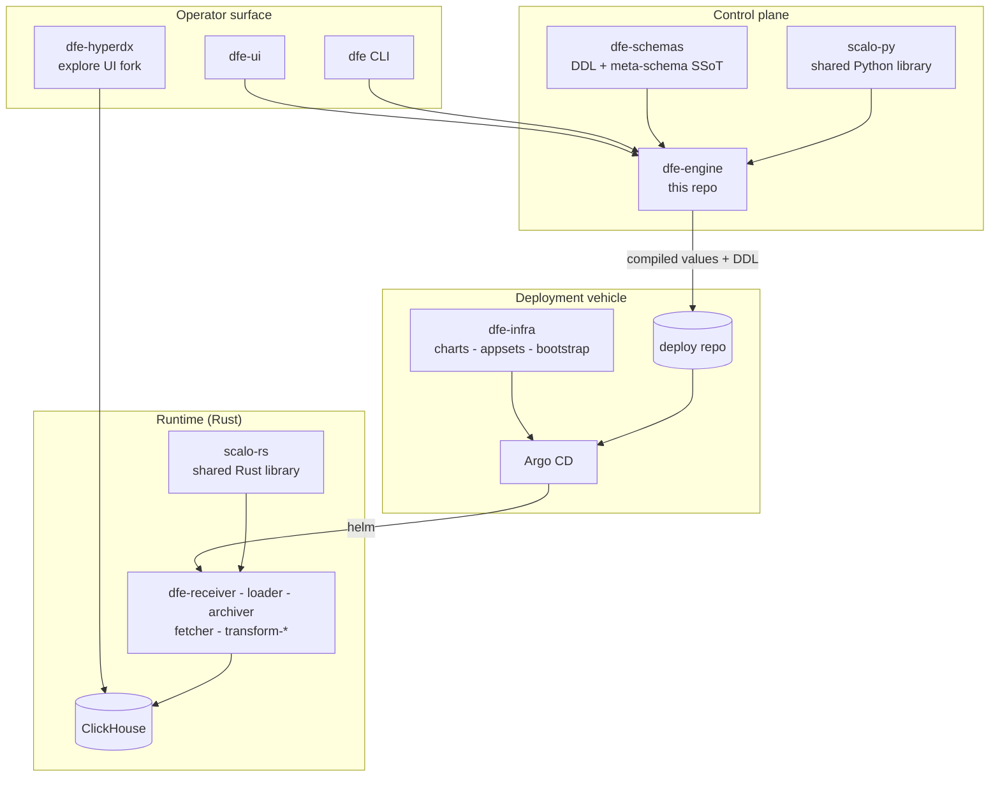
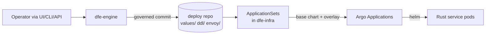
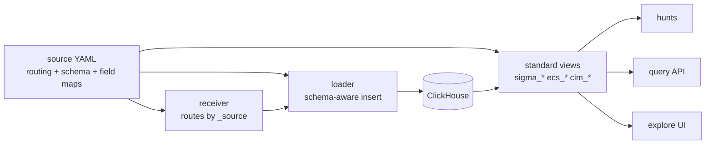
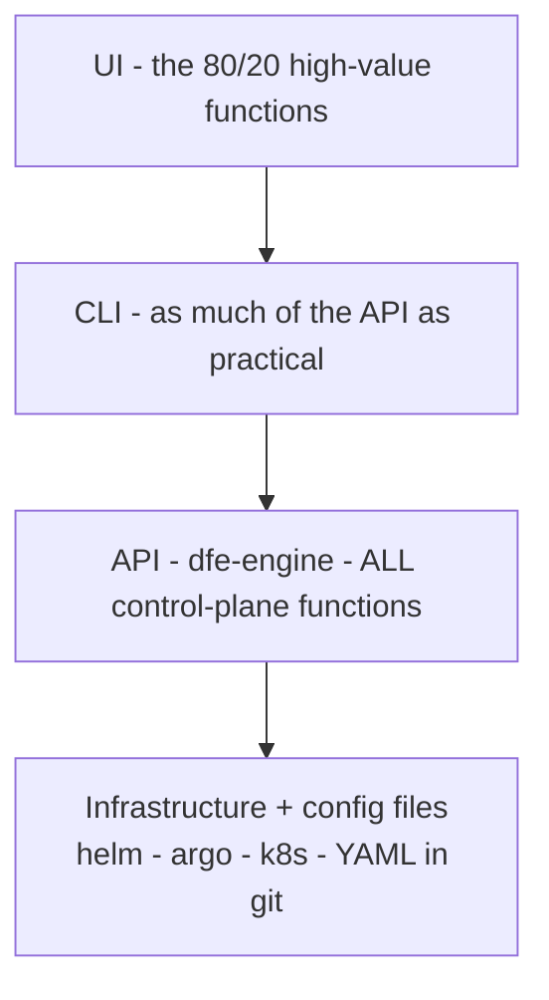
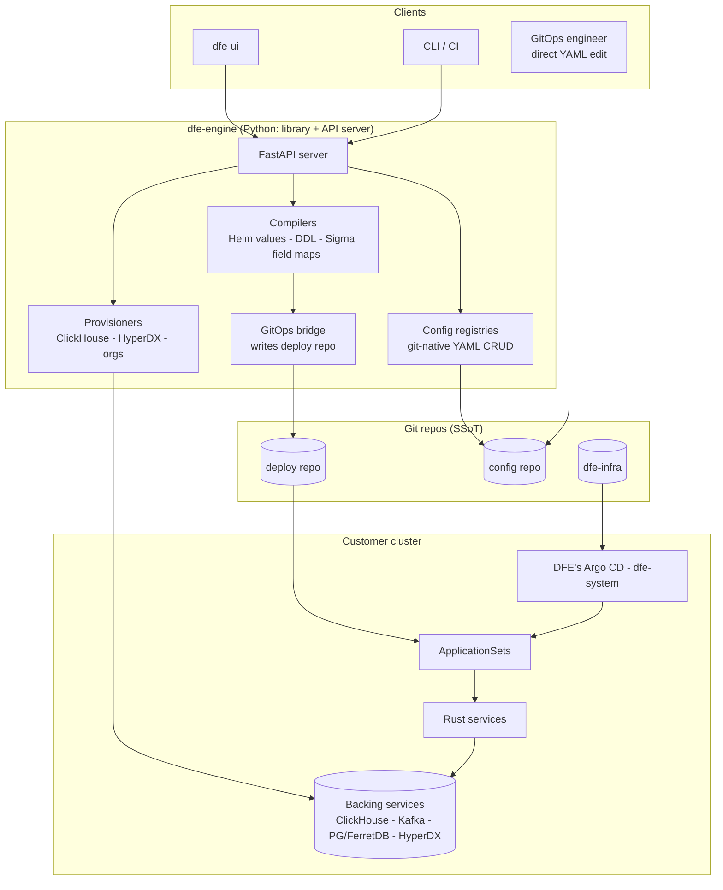
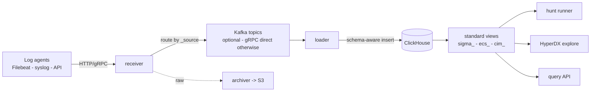

# DFE architecture

DFE is a deployable product suite: event-data ingest, ClickHouse storage,
scheduled detection, and exploration, all governed through one git-backed
control plane. This page is the map - where each repo sits, the two shapes
that define the system, the invariants, and links into the depth docs. It
describes how DFE works today, grounded in code, not a proposal.

## Where this repo sits in the suite

dfe-engine is the control plane: a Python library + FastAPI server that turns
operator intent into governed git commits, which Argo CD reconciles into the
cluster. Everything else either feeds it (schemas, libraries) or consumes what
it writes (infra, runtime services, UIs).

| Repo | Role | Relationship to the engine |
|------|------|---------------------------|
| dfe-engine | config control plane + API server | this repo |
| dfe-infra | charts, ApplicationSets, bootstrap | consumes engine-authored overlays via the deploy repo |
| dfe-ui | web UI | consumes the engine API only |
| dfe-hyperdx | extended HyperDX fork - explore UI + telemetry sink | embedded in dfe-ui; reads ClickHouse |
| dfe-schemas | core table/view DDL + source meta-schemas | SSoT the engine deploys from |
| scalo-py / scalo-rs | shared libraries (neutral-identity OSS) | engine imports scalo-py; Rust services import scalo-rs |
| dfe-receiver/loader/archiver/fetcher/transform-* | Rust runtime services | read YAML config the engine writes |
| dfe-deploy | example deploy/overlay repo | the GitOps hand-off surface |

## The two shapes that define DFE

### 1. Orchestration over infra: helm through Argo, never hands on the cluster

The engine performs every operational change as a governed git commit -
compiled Helm overlay values, ClickHouse DDL, rendered OIDC config - and Argo
CD reconciles the cluster to match. The engine never deploys backing services,
never authors Argo Applications, and never claims a commit is live (an
org-specific approval gate may sit between commit and sync).

Adding a service instance is a git write of one
`values/<service>-<instance>-values.yaml` file - the git-files ApplicationSet
generator fans out one Argo Application per values file. Removing the file
removes the app. The engine declares instances; the appset deploys them.
Depth: [deployment/index.md](deployment/index.md) and
[control-plane/governed-ops-design.md](control-plane/governed-ops-design.md).

### 2. Close-coupled source - ingest - schema - transform (not separate ETL)

Traditional pipelines split ingest, schema management, and transformation
across separate tools with separate config stores that drift apart. DFE keeps
them one artifact: a source definition in the config repo carries the routing
key, the schema binding, and the field-map bindings together, and every
runtime stage reads the same definition.

One definition, enforced end to end: the receiver routes an event by its
`_source`, the loader inserts into the topology-correct table for that
source's schema, and the field-mapping layer projects the same columns back
out as standard vocabularies (Sigma, ECS, CIM) for detection and query. There
is no separate ETL config to fall out of sync. Depth:
[data-plane/index.md](data-plane/index.md).

## The control pyramid

Four layers, each a narrower, more guarded window onto the one below. The API
is the single control plane; the CLI and UI only ever consume it; the API
never reaches past git to the cluster.

## Component map

- **config repo** - the engine's working data: service configs, deployment
  configs, field maps, rules/hunts, OIDC providers, accounts/groups.
  Engine-written AND directly human-editable. Writes are read-before-write
  with git blob-SHA ETags: `If-Match` mismatch returns `409 Conflict` with a
  diff rather than clobbering a human or CI edit.
- **deploy repo** - the GitOps hand-off. Engine writes compiled artifacts;
  Argo reads them. With gitops enabled it also holds the source definitions
  SSoT (`config/sources/`, one attributed commit per mutation via gitcrud);
  standalone deployments fall back to a plain sources directory in the
  config repo. Provider-agnostic: GitHub / GitLab external git, or the
  in-cluster Forgejo fallback (see [deployment/index.md](deployment/index.md)).
- **dfe-infra** - the pinned deployment vehicle. Never written by the engine.

In small deployments the config repo and deploy repo can be one repo with
different subtrees (`config/` and `values/` + `ddl/`).

## First principles (invariants)

1. **Generic product, not an internal tool.** Ships into a customer cluster
   the vendor never sees. Nothing site-specific in code.
2. **YAML + git is the single source of truth.** No config database. Rust
   services read config files directly; the engine reads/writes them through
   a git-aware in-memory store (DirectoryConfigStore from scalo). Identity
   comes from the FILENAME, never a field inside the YAML (the store loads
   YAML 1.1, where `off`/`yes`/`no` become booleans).
3. **Engine writes config, never installs infrastructure.** The hard
   engine<->infra boundary: dfe-infra deploys backing services and owns
   ApplicationSets; the engine writes config + DDL + OIDC values into the
   deploy repo and turns dials through overlays. If the engine is about to
   install ClickHouse or author an Argo Application, the work belongs in
   dfe-infra. (The Helm compiler still generates legacy `argo_*` by-products;
   they are NOT published to the deploy repo.)
4. **Assume only a bare cluster.** Layer 0 detect-or-install brings
   everything else: a default StorageClass, cert-manager, External Secrets,
   and DFE's own Argo CD in `dfe-system`, coexisting with any host Argo.
5. **ClickHouse is the only operational store.** All non-gitops state -
   events, results, watermarks, leases - lives in CH via
   `effective_data_database`. PG/FerretDB/Valkey are bundled-app
   conveniences, never DFE state.
6. **A commit is not a deployment.** The engine reports what it committed;
   Argo (and any org approval gate) decides when it is live.
7. **Fully operable from the repos alone.** Engine and UI down = running
   system unaffected, manageable by editing the repos directly.

## Layered deployment model (summary)

Layer 0 platform baseline (DFE's own Argo + detect-or-install operators) ->
Layer 1 backing services (ClickHouse, optional Kafka, PG+FerretDB, HyperDX) ->
Layer 2 apps + config (Rust services from pinned base charts + engine-authored
overlays). Four tiers select defaults: **dfe-docker** (Compose), **slim**
(gRPC, no Kafka), **single** (+ single-broker Kafka), **scale** (everything
clustered). HyperDX ships in EVERY tier - it is the explore UI over all DFE
data and the self-monitoring sink, not an add-on. Full detail including the
per-tier composition table, deploy-repo providers, backing-service modes, and
the network model: [deployment/index.md](deployment/index.md).

## Runtime data flow

Alert grouping is read-time: ALL matched rows are written at full fidelity
("suppression = loss of visibility"); grouping is a post-insert
`SELECT ... GROUP BY` with per-(hunt, rule, customer, group) cooldown in a
ReplacingMergeTree state table, fail-open.

## Technology decisions

| Decision | Choice | Rationale |
|----------|--------|-----------|
| Config storage | YAML + git (no DB) | human-readable, versioned, Rust reads directly |
| API host | dfe-engine FastAPI | dfe-control-plane removed; one artifact |
| Auth | local JWT default; OIDC + API key + disabled | OIDC via X-Oidc-* edge seam |
| Conflict handling | git blob-SHA ETag + 409 | git-native, standard HTTP semantics |
| Deployment | Argo CD + Helm, base+overlay multi-source | engine turns dials, appsets author apps |
| Platform baseline | Layer 0 detect-or-install | assume only a bare cluster |
| Deploy repo | provider-agnostic (GitHub/GitLab/Forgejo) | no hard git-server dependency |
| Backing services | DFE-owned, mode-driven (single/cluster/external) | never piggyback shared infra |
| Secrets | External Secrets Operator (+ generators) | customer Vault, or in-cluster generators on bare |
| Observability | OTel -> ClickHouse -> HyperDX | single storage backend |
| Ingress / OIDC | Envoy Gateway (k8s) / oauth2-proxy (docker) | native OIDC at the edge |
| Expression language | CEL (Python + Rust), DFE subset | one standard, tiered for performance |
| Field mapping | YAML, two-tier (default + source) | human-editable, git-tracked, UI-editable |

## The docs tree

| Area | Start at | Covers |
|------|----------|--------|
| Control-plane surface | [control-plane/index.md](control-plane/index.md) | governed ops, gitops commit standard, RBAC, OIDC, CLI, UI API, type-safety sync |
| Data plane | [data-plane/index.md](data-plane/index.md) | sources, schemas, field mapping, CEL, query API, hunts |
| Deployment seam | [deployment/index.md](deployment/index.md) | tiers + composition, backing services, KEDA, kafka lifecycle, observability, supply-chain pinning, e2e acceptance |
| Integrations | [integrations/index.md](integrations/index.md) | dfe-ui guide, HyperDX fork maintenance |
| Archive | [archive/index.md](archive/index.md) | superseded research + snapshots, kept for the decision trail |

Edge auth topology notes live in [AUTH-ENVOY-TOPOLOGY.md](AUTH-ENVOY-TOPOLOGY.md).
