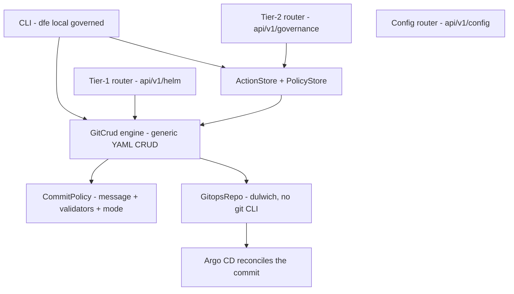
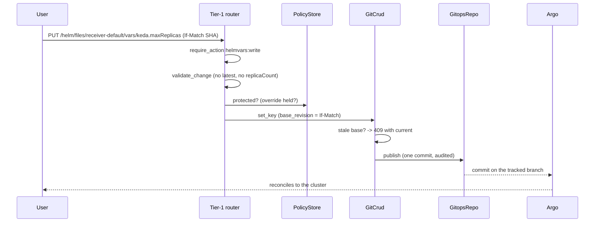
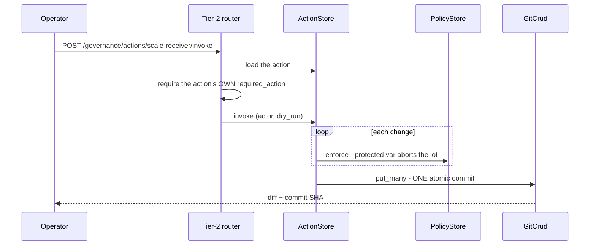
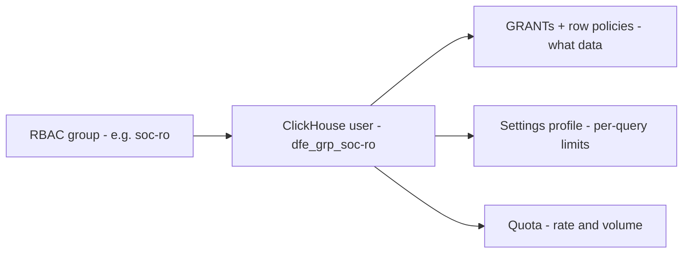
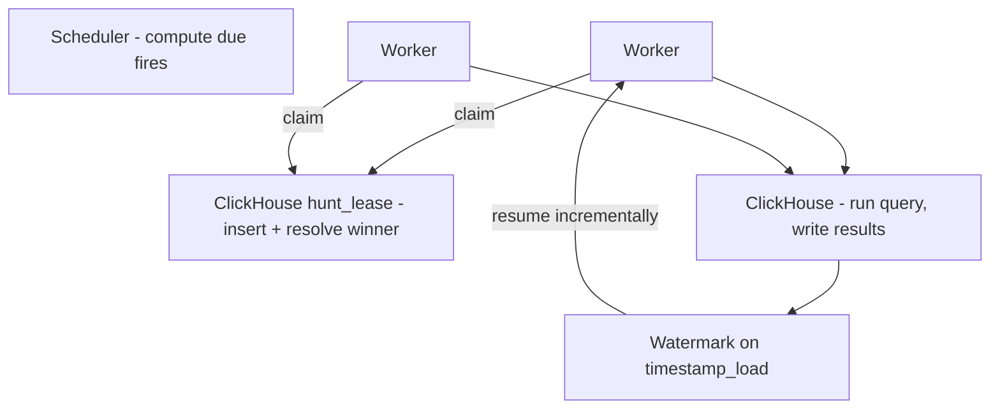
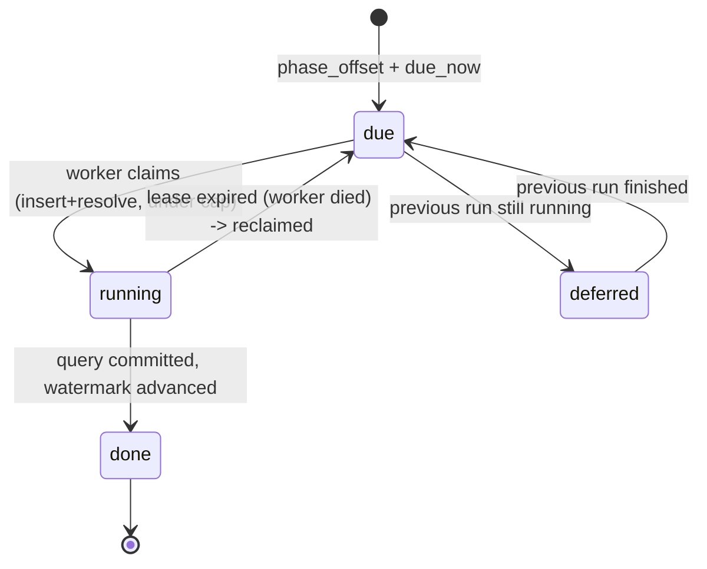
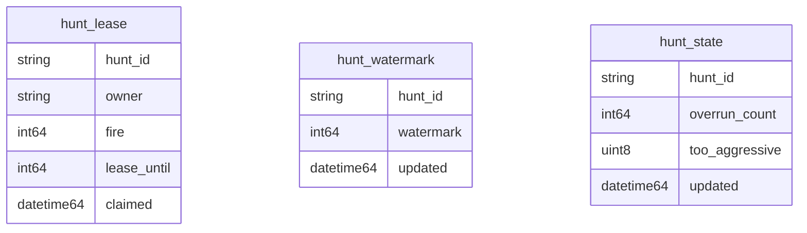
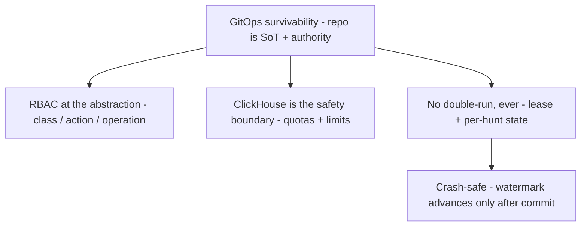

<!-- Project: dfe-engine -->
# Governed Ops and the Hunt Runner

How DFE is operated, and how detection runs. Two subsystems, one idea: the GitOps
repo is the source of truth and the authority, and dfe-engine is a governed window
onto it. Companion to [architecture.md](../architecture.md), the
[commit standard](gitops-commit-standard.md), and the
[observability standard](../deployment/observability-standard.md).

## The one idea

Everything you can change in DFE -- deployment dials, detection hunts, access
control -- is YAML in a git repo. The engine does not hold a config database and
does not touch the live cluster. It reads and writes those YAML files through one
generic, git-native CRUD engine called `GitCrud`, applies RBAC, and commits.
Argo reconciles the commit. Kill the engine and the UI and DFE keeps running --
you can still drive it by editing the repo by hand. That survivability is the
whole point, and it is the acceptance test for every piece below.

## Layering

Two tiers sit on the one engine:

- **Tier-1** is raw, generic var CRUD over the overlay files. Powerful, so it is
  admin-grade.
- **Tier-2** is curated *actions* -- named bundles of changes, each behind its own
  permission. This is the safe surface an operator gets. They can run
  "scale-receiver" without holding the keys to edit any var.

RBAC binds at the high level only -- a resource class, a named action, an operation
-- never per field. One permission check per request. That keeps the security
surface small and the policy readable.

## GitCrud -- the generic engine

`src/dfe_engine/gitcrud/`. One engine handles every resource class the same way,
because every resource is just YAML in git. A `ResourceClass` says where a class
lives (a directory) and which RBAC prefix governs it. The default registry covers
the deploy repo: `helmvars` (the overlays under `values/`) and the `governance`
class (`accounts`, `groups`, `roles`, `actions`, `policies` under `governance/`).

The engine is small on purpose. Read, flatten to dot-paths, set or delete a path,
write a whole doc, delete a resource -- every mutation ends in one commit via
`GitopsRepo` (which uses dulwich, so there is no shell-out to `git`). Two extras
earn their keep:

- `put_many` writes several resources in ONE commit, so an action that touches N
  files is atomic.
- The HEAD commit SHA is the optimistic-concurrency token. A read returns it, a
  write may require it, and a stale one raises `ConcurrencyConflictError` carrying
  the current doc -- so two editors never silently clobber each other.

`commit_policy.py` enforces the [commit standard](gitops-commit-standard.md) in
code: it builds every message and its audit trailers (callers cannot hand-write
them), rejects `latest`/unpinned image refs and controller-owned fields like
`replicaCount`, and resolves direct-commit vs PR from the environment and class.

## Writing a helm var, end to end

The router is thin. The work -- validation, the protected-var check, the commit --
lives in the engine and the policy store, so the CLI and the API take the identical
path.

## Defined actions and protected vars

`src/dfe_engine/governance/`. An `ActionDef` is a name, the permission needed to run
it (`required_action`), and a list of `VarChange`s. `ActionStore.invoke` applies them
all in one commit, honours the protected-var policy (a single violation aborts the
whole action -- it is atomic), and `dry_run` returns the diff without writing.

A `ProtectedPolicy` is the one thing that reaches below a class -- a list of locked
`cls:name:path` globs that even Tier-1 must respect unless the caller holds the
override grant. It is a policy object, not a per-var ACL.

Two more governance pieces keep authz itself in git: `rbac_source` loads roles and
groups FROM the gitops tree, and `auth_sync` mirrors them back INTO it. Accounts and
API keys hold secret material, so they stay out of git (that is an ESO job).

## ClickHouse data RBAC -- one user per group

`governance/ch_rbac.py`. Access control in HyperDX's app layer cannot contain a bad
query. Quotas and resource limits can, and those live on the ClickHouse user. So a
group maps to exactly one ClickHouse user carrying three controls:

`build_group_sql` renders the `CREATE USER` + `GRANT` + `CREATE SETTINGS PROFILE` +
`CREATE QUOTA` (identifiers backtick-quoted, so a hyphenated group name is a valid
CH name). The primary path is `ddl_artifact`, which emits that as a gitops DDL file
under `ddl/ch-rbac/<group>.sql` -- applied by the same migration runner as the schema
DDL, with the read-only core tiers supplied from dfe-schemas. The imperative
`GroupChProvisioner` is the secondary, direct path. HyperDX then selects the
connection bound to the user's group, so every query runs as that user and CH itself
is the enforcing boundary.

This applies to **hunts too**, and it is the same mechanism. A hunt worker does not
connect to ClickHouse as an unbounded account -- it runs its query as a CH user
carrying a quota and a settings profile. The primary job there is a cost guard: a
dumb or runaway hunt query (a full-table scan, an unbounded join) is killed by the
quota or the `max_memory_usage`/`max_execution_time`/`max_rows_to_read` limits
rather than taking the cluster down. The grants are a security scope on top if a
hunt should only ever see certain data. So the per-group CH user has two consumers --
interactive queries through HyperDX, and hunt execution -- and CH is the safety
boundary for both.

## The hunt runner

`src/dfe_engine/hunt_runner/`. A hunt is a rule query on a schedule that writes
matched rows to a table. One pod proved it cannot service them all, so the runner is
a pool -- but hunts are never *assigned* to pods. Workers pull due runs from a
ClickHouse lease table. Add a pod and it just starts pulling. Kill one and its leases
expire and get reclaimed. There is no shard map to rebalance and nothing to go
split-brain over.

ClickHouse is the ONLY operational store -- no Postgres. Making hunts (the
mission-critical path) depend on a second database purely for coordination is not
worth the operational surface, so the same CH the hunts already query holds the
lease, watermark, and state. CH has no row locks, so the claim is optimistic:
insert-a-lease-then-resolve, not `SELECT ... FOR UPDATE`.

The smarts are deterministic, not random. `spread.phase_offset` gives each hunt a
stable offset inside its interval from a hash of its id, so hunts on the same
schedule fan out evenly and never stampede ClickHouse at the boundary. `due_now`
asks whether this interval's fire has arrived. A global cap hard-limits how much hits
CH at once.

A run never doubles up. To claim, a worker INSERTs a lease row for `(hunt, fire)`
then reads the rows back for that key and settles on one deterministic winner (claim
time, then owner id) after a short window -- so a single worker is exactly-once, and
the rare multi-worker race is absorbed because the windowed INSERT is idempotent (the
same window written twice is the same rows). Per-hunt state means an overrun defers
rather than starting a second copy -- and flags `too_aggressive` so the UI can tell
the user their schedule is too tight.

Each run is incremental and crash-safe. The query carries a `{window}` placeholder;
the worker substitutes `timestamp_load >= start AND < end`, runs it, and advances the
watermark ONLY after the query commits. A pod killed mid-run re-runs the same window
from the last committed watermark -- no gap, no loss. The watermark field is fixed to
`timestamp_load`, the common-header column that is always present.

The three coordination tables (ReplacingMergeTree, in the effective data database):

`HuntRunner.tick(now)` is one cycle -- find due hunts that are not already active,
then claim up to the cap and execute each at its scheduled window. The daemon is
`while: tick(); sleep`. Validated end to end against real ClickHouse: concurrent
disjoint claims, lease reclaim, and incremental resume with no duplicate rows.

## The smaller pieces

- **Runtime config** -- `GET /api/v1/config/client` (public, no secrets) hands the UI
  its API base, HyperDX URL, auth mode, and feature flags at runtime. This is what
  lets one UI image run in every environment instead of baking the URLs in at build
  time.
- **Alerting** -- a scaffold only, deferred by design. A rule model (threshold over a
  window, severity to a channel) and a pluggable dispatcher. The real senders and the
  library choice wait until we reach that phase.
- **CLI** -- `dfe local governed helm ...` and `action invoke` wrap the same services
  the API uses, for CI and break-glass. A CLI is a thin window over the API, not a
  second way of doing things.

## What holds it together

If a change cannot be made by committing YAML to the repo, it does not belong in the
engine. That rule is what keeps DFE operable without us.
