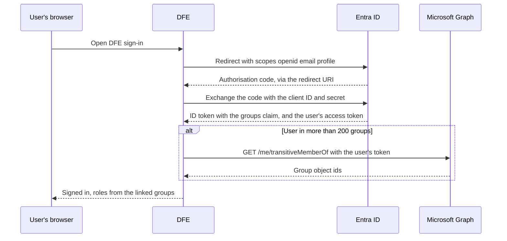

# Microsoft Entra ID sign-in for DFE

DFE asks for two things from your Microsoft Entra ID tenant: your users sign in to DFE with their work account, and DFE reads which security groups each user is in, so your groups decide their DFE roles. You set this up once as an app registration. Nothing is needed per user.

Console paths checked 2026-10-10 against Microsoft's documentation.

The DFE operator who sent you this page gives you the redirect URI. It has this shape, and you paste it exactly as given:

```text
https://<your DFE console host>/api/v1/auth/oidc/<provider-name>/callback
```

You need at least the Cloud Application Administrator role in the Microsoft Entra admin center, <https://entra.microsoft.com>.

## How DFE reads groups

Once you turn on the groups claim, Entra puts each user's group object ids in the ID token, and DFE reads them at sign-in. A user in more than 200 groups, nested groups included, gets a pointer instead of the list. DFE then reads that user's groups from Microsoft Graph `/me/transitiveMemberOf` with the user's own sign-in token. The User.Read permission every new app registration gets is enough for that call.



## Set it up

1. Go to **Entra ID > App registrations** and select **New registration**. Name it (for example `DFE`). Under **Supported account types** pick **Single tenant only - <your tenant>**. Select **Register**.
2. On the **Overview** page, copy the **Application (client) ID** and the **Directory (tenant) ID**.
3. Under **Manage**, select **Authentication**. Select **Add Redirect URI**, pick the **Web** tile, paste the redirect URI and select **Configure**. Leave the **ID tokens (used for implicit and hybrid flows)** box unticked: DFE uses the authorisation code flow.
4. Select **Certificates & secrets > Client secrets > New client secret**. Add a description, pick an expiry of 24 months or less and select **Add**. Copy the **Value** column now, not the **Secret ID**. Entra never shows the value again. DFE authenticates with a client secret, not a certificate. Diary the expiry: sign-in stops the day the secret lapses.
5. Under **Manage**, select **Token configuration**, then **Add groups claim**. Tick **Security groups** and select **Save**. Leave each token's value at the default, the group ID. Switching it to sAMAccountName, cloud display names or role claims breaks DFE's group links.
6. Do not add a `groups` permission or scope. Entra adds the claim from step 5, and asking for a `groups` scope fails the sign-in.

Two optional extras, only if the operator asks:

- Group names on the Graph path, which otherwise returns each group's id with a blank name: **API permissions > Add a permission > Microsoft Graph > Delegated permissions > GroupMember.Read.All**, then **Grant admin consent for <tenant>**. DFE links on the id, so sign-in works without it.
- An app-only fallback: the Microsoft Graph application permission **GroupMember.Read.All** with admin consent. DFE then reads a user's groups with the app's own secret when Graph refuses the user's token, and the operator can run a group sync.

## Send these to the operator

| Value | Where it comes from |
|---|---|
| Application (client) ID | Step 2 |
| Client secret | Step 4, the **Value**. Send it over a channel fit for a password, never plain email |
| Directory (tenant) ID | Step 2. The issuer is `https://login.microsoftonline.com/<tenant-id>/v2.0` |
| Group object ids | One per group that should hold a DFE role, with the role it should get. See the next section |

## Find the group ids

DFE links an Entra group on its object id, a GUID. Renaming the group does not break the link. Go to **Entra ID > Groups > All groups**, open the group and copy its **Object ID** from the **Overview** or **Properties** page. The check below also lists the ids of every group the signed-in user is in.

## Check it worked

Once the operator confirms the provider is in place, open this URL in a private browser window and sign in as a user in a mapped group:

```text
https://<your DFE console host>/api/v1/auth/oidc/<provider-name>/login
```

The page answers with JSON. `email` is the user, and `groups` lists their group object ids. The JSON also holds an `access_token`: it is a live DFE session, so do not paste it anywhere.

## Common failures

| What you see | Cause | Fix |
|---|---|---|
| Microsoft page: `AADSTS50011` | The redirect URI on the app differs from the one DFE sent | Add the operator's URI exactly under the **Web** platform |
| Microsoft page: `AADSTS700016` | DFE holds the wrong client ID, or the issuer names the wrong tenant | Resend the client ID and tenant ID from step 2 |
| DFE page: `OIDC login failed: invalid_client: AADSTS7000215 ...` | DFE holds the **Secret ID**, or a mistyped value | Send the secret's **Value** |
| DFE page: `OIDC login failed: invalid_client: AADSTS7000222 ...` | The client secret expired | Create a new secret and send its value |
| Microsoft page: `AADSTS50105` | The enterprise application requires assignment and this user is not assigned | Assign the user, or a group they are in, to the application |
| The check shows `"groups": []` | No groups claim, or the user is in no security group | Redo step 5, and check the user's memberships |
| Signed in, but no DFE role | The groups arrived but none is linked yet | Send the operator the ids from the check |

## For the DFE operator

Create the provider with `POST /api/v1/auth/oidc-providers`. The `name` becomes `<provider-name>` in the redirect URI, so set it before the admin starts:

```json
{
  "name": "<provider-name>",
  "type": "entra_id",
  "display_name": "Microsoft",
  "issuer": "https://login.microsoftonline.com/<tenant-id>/v2.0",
  "client_id": "<application (client) id>",
  "client_secret": "<client secret value>",
  "groups": {"mode": "token_claim", "tenant_id": "<tenant-id>"}
}
```

`token_claim` reads the `groups` claim, and the overage lookup runs on its own. `groups.tenant_id` is needed only for the app-only fallback, which uses the login client secret unless `groups.client_secret` is set. Leave `scopes` unset: the default is `openid email profile`. The client secret goes to the secret store and the provider keeps only its path.

Link each DFE group by setting its `source_id` to an object id the admin sent: see [rbac.md, section 4.4](../rbac.md#44-group-sync-process). Behind a TLS-terminating proxy, set `api.forwarded_allow_ips` (`DFE_API_FORWARDED_ALLOW_IPS`), or the engine builds the redirect URI with `http://` and Entra refuses it.

## Vendor references

- Register an app: <https://learn.microsoft.com/en-us/entra/identity-platform/quickstart-register-app>
- Add a redirect URI: <https://learn.microsoft.com/en-us/entra/identity-platform/how-to-add-redirect-uri>
- Add a client secret: <https://learn.microsoft.com/en-us/entra/identity-platform/how-to-add-credentials>
- Groups claim and the 200-group limit: <https://learn.microsoft.com/en-us/entra/identity-platform/optional-claims>
- Issuer and discovery: <https://learn.microsoft.com/en-us/entra/identity-platform/v2-protocols-oidc>
- `transitiveMemberOf` permissions: <https://learn.microsoft.com/en-us/graph/api/user-list-transitivememberof>
- Error codes: <https://learn.microsoft.com/en-us/entra/identity-platform/reference-error-codes>
- Find a group's object id: <https://learn.microsoft.com/en-us/entra/fundamentals/how-to-manage-groups>
