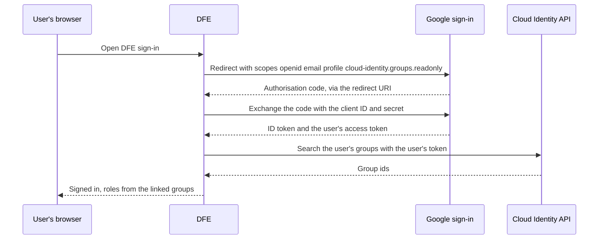

# Google Workspace sign-in for DFE

DFE asks for two things from your Google Workspace: your users sign in to DFE with their Google account, and DFE reads which Google groups each user is in, so your groups decide their DFE roles. You set this up once in Google Cloud. Nothing is needed per user.

Console paths checked 2026-10-10 against Google's documentation.

The DFE operator who sent you this page gives you the redirect URI. It has this shape, and you paste it exactly as given:

```text
https://<your DFE console host>/api/v1/auth/oidc/<provider-name>/callback
```

You need a Google Cloud project inside your Workspace organisation, where you can enable APIs and create OAuth clients.

## How DFE reads groups

Google puts no groups in its sign-in token. So DFE asks for a read-only groups scope at sign-in, then asks the Cloud Identity API for that user's groups with the user's own token. There is no service account, no domain-wide delegation and no admin role to grant.



DFE asks for nested (transitive) membership first. Google serves that only on Workspace Enterprise Standard, Enterprise Plus, Enterprise for Education and Cloud Identity Premium. On other editions DFE falls back to direct membership, so map the groups users are directly in.

Google documents the Cloud Identity Groups API for apps acting for users who are not administrators. The check at the end confirms it works in your organisation: run it as a user who is not an admin.

## Set it up

1. Enable the Cloud Identity API in the project: <https://console.cloud.google.com/apis/enableflow?apiid=cloudidentity.googleapis.com>. It must be the same project as the OAuth client in step 4.
2. Go to **Menu > Google Auth Platform > Branding**. If the project is not configured yet, click **Get Started**. Enter an **App name** (for example `DFE`) and a **User support email**. Under **Audience** pick **Internal**, which limits sign-in to your organisation's accounts. Add a contact email, accept the User Data Policy and click **Create**.
3. Open **Data Access** and click **Add or Remove Scopes**. Add `https://www.googleapis.com/auth/cloud-identity.groups.readonly`, pasting it in as a manual scope if it is not listed. Click **Save**.
4. Open **Clients** and click **Create client**. Set **Application type** to **Web application** and give it a name. Under **Authorized redirect URIs**, add the redirect URI from the operator. Leave **Authorized JavaScript origins** empty. Click **Create**.
5. Copy the client ID and the client secret now. Google shows the secret only at creation. Afterwards it shows the last four characters, and a lost secret means rotating it.
6. If your organisation restricts apps under **Admin console > Security > Access and data control > API controls**, trust this client there. **Trust internal apps** covers it.

## Send these to the operator

| Value | Where it comes from |
|---|---|
| Client ID | Step 5. It ends in `.apps.googleusercontent.com` |
| Client secret | Step 5. Send it over a channel fit for a password, never plain email |
| Issuer | Always `https://accounts.google.com` |
| Group ids | One per group that should hold a DFE role, with the role it should get. See the next section |

## Find the group ids

DFE links a Google group on its Cloud Identity id: the part after `groups/` in the group's resource name. It never links on the group's email, because an admin can rename that. Get the id with gcloud:

```bash
gcloud identity groups describe <group-email>
```

The `name` field reads `groups/<id>`. Send the `<id>` part. The check below also lists the ids of every group the signed-in user is in.

Google leaves a group out of the answer when the group's **Who can view members** setting does not include its own members. For each group that maps to a DFE role, open **Admin console > Directory > Groups**, pick the group, open **Access Settings** and let group members view members.

## Check it worked

Once the operator confirms the provider is in place, open this URL in a private browser window and sign in as a user who is not a Google admin and is in a mapped group:

```text
https://<your DFE console host>/api/v1/auth/oidc/<provider-name>/login
```

The page answers with JSON. `email` is the user, and `groups` lists their group ids. The JSON also holds an `access_token`: it is a live DFE session, so do not paste it anywhere.

## Common failures

| What you see | Cause | Fix |
|---|---|---|
| Google page: `Error 400: redirect_uri_mismatch` | The redirect URI on the client differs from the one DFE sent | Paste the operator's URI exactly: scheme, host, case and trailing slash all count |
| Google page: `Error 403: org_internal` | The account is outside your organisation and the audience is Internal | Sign in with an account in your organisation |
| DFE page: `OIDC login failed: invalid_client: ...` | DFE holds the wrong client secret | Rotate the secret and send the new one |
| The check shows `"groups": []` | The Cloud Identity API is off in the client's project, the groups scope was not granted, API controls block the client, or the user's groups hide their members | Recheck steps 1, 3 and 6 and the group's **Who can view members**. The operator's log names Google's reason: `Google Cloud Identity refused the user-token group lookup (403)` |
| Signed in, but no DFE role | The groups were found but none is linked yet | Send the operator the ids from the check |

## For the DFE operator

Create the provider with `POST /api/v1/auth/oidc-providers`. The `name` becomes `<provider-name>` in the redirect URI, so set it before the admin starts:

```json
{
  "name": "<provider-name>",
  "type": "google",
  "display_name": "Google",
  "issuer": "https://accounts.google.com",
  "client_id": "<client id>",
  "client_secret": "<client secret>",
  "groups": {"mode": "api"}
}
```

A `google` provider accepts only `api` mode, and DFE turns on `enrich_on_login` for it. Leave `scopes` unset: the default carries the Cloud Identity scope. The client secret goes to the secret store and the provider keeps only its path. A service account (`groups.service_account_json`) holding a groups admin role is optional: it runs the group sync and answers a sign-in the user's token could not.

Link each DFE group by setting its `source_id` to an id the admin sent: see [rbac.md, section 4.4](../rbac.md#44-group-sync-process). Behind a TLS-terminating proxy, set `api.forwarded_allow_ips` (`DFE_API_FORWARDED_ALLOW_IPS`), or the engine builds the redirect URI with `http://` and Google refuses it.

## Vendor references

- Cloud Identity API setup: <https://docs.cloud.google.com/identity/docs/how-to/setup>
- OAuth consent screen: <https://developers.google.com/workspace/guides/configure-oauth-consent>
- OAuth clients: <https://support.google.com/cloud/answer/15549257>
- Transitive group search: <https://docs.cloud.google.com/identity/docs/reference/rest/v1/groups.memberships/searchTransitiveGroups>
- Direct group search: <https://docs.cloud.google.com/identity/docs/reference/rest/v1/groups.memberships/searchDirectGroups>
- App access control: <https://knowledge.workspace.google.com/admin/apps/control-which-apps-access-google-workspace-data>
- Sign-in error codes: <https://support.google.com/accounts/answer/16668185>
