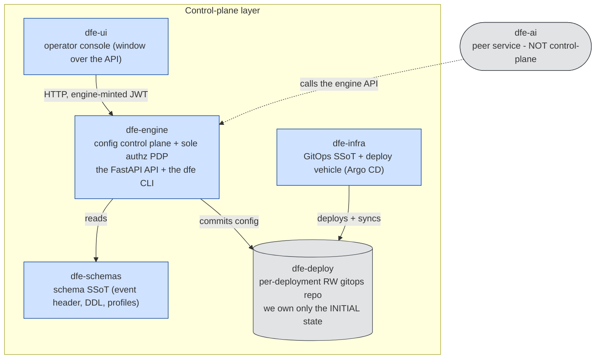
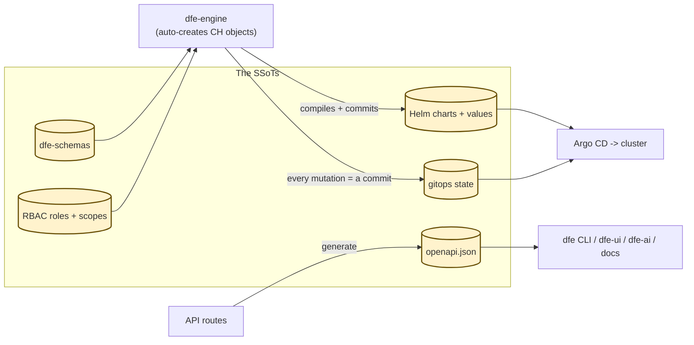
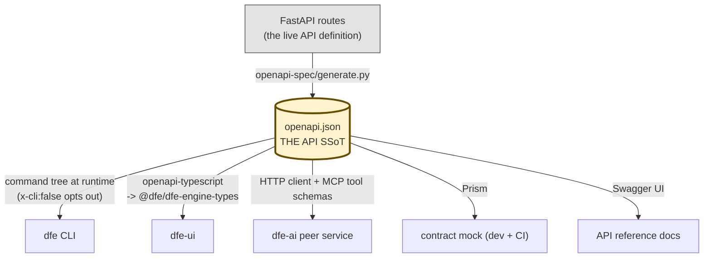

# The DFE Control-Plane Layer

The **control-plane layer** is the small set of repos that own the DFE control
plane - configuration, RBAC, schema, the operator UI, and the deploy target.
When a doc says "the control-plane layer" it means exactly these repos. Anything
that interacts directly, or one level removed, with the dfe-engine API or what
it does is reasoning about this layer.

## The layer

| Repo | Role in the layer |
|---|---|
| **dfe-engine** | The config control plane + the sole authorisation PDP. Hosts the FastAPI API and the generated `dfe` CLI. Everything else in the layer keys off its API. |
| **dfe-schemas** | The schema SSoT (common event header, hunt-results DDL, profiles). The engine reads it (the version-pinned `dfe-schemas` wheel) and auto-creates from it. |
| **dfe-ui** | The operator console. A window over the engine API - it holds no authority of its own; it verifies the engine-minted JWT. |
| **dfe-infra** | The GitOps SSoT and deploy vehicle (Argo CD). Deploys the suite; never a config authority. |
| **dfe-deploy** | The per-deployment read-write gitops repo the running engine commits to. We own only its **initial** state; after handover the deployment owns it. |

## The controlling SSoTs

The layer is organised around a handful of **single sources of truth**. The SSoTs
are how everything works: each holds one kind of authoritative state, every other
component reads from it (or from a generated artefact of it), and each has exactly
ONE write path - so a change is auditable and consumers can never diverge.

| SSoT | Lives in | Consumed by | Only written by |
|---|---|---|---|
| **API surface** - `openapi.json` | dfe-engine `openapi-spec/` | dfe CLI, dfe-ui types, dfe-ai, contract mock, reference docs | the FastAPI routes via `generate.py` (never hand-edited) |
| **Schema** - event header, hunt-results DDL, profiles | dfe-schemas (the `dfe-schemas` wheel, pinned in `uv.lock`) | the engine (auto-creates the CH objects at startup), the CLI, dfe-ui | dfe-schemas commits |
| **Deployment shape** - Helm charts + values | dfe-infra `helm/` (base charts) + the deploy-repo overlays | Argo CD, the cluster | base charts by dfe-infra; the overlays by the engine, one `values/<service>-<instance>-values.yaml` per app instance, each write a gitops commit. Where no chart runs (Compose), `appmgmt/appconfig.py` merges an overlay's `config:` over the deployment's base config into the app's config file |
| **Deployed state** - the gitops YAML | dfe-deploy (per deployment) | Argo CD (syncs to the cluster), the engine (reads current state) | the engine API - every mutation is a git commit (governed ops); `dfe local` break-glass when the daemon is down |
| **AuthZ** - RBAC roles + scopes | dfe-engine `auth/` (YAML) | the API (`require_action`), the CLI | the engine (governed writes) |

To change any of them you go through its one writer: edit the API routes and
regenerate the spec, commit to dfe-schemas, turn the engine's dials (which writes
Helm values + gitops state as commits), or edit the RBAC YAML. Never hand-edit a
generated artefact (openapi.json, compiled Helm values) - change the source and
let it regenerate. The next section walks the `openapi.json` case in full as the
worked example.

## dfe-engine, never "dfe-api"

The API is **the dfe-engine API**. `dfe-api` was the old server entry-point name
and is retired: the daemon binary is now `dfe-engine` (`dfe-engine run`), the
human CLI is `dfe`. Anything talking to the API is talking to the dfe-engine API --
do not call it "the dfe-api". (The `DFE_API_*` env prefix stays, purely to keep
settings resolution and the Helm chart stable.)

## openapi.json is the API SSoT

`openapi-spec/openapi.json` is the **single source of truth for the API surface**.
It is generated from the FastAPI app (`uv run python openapi-spec/generate.py`)
and committed. Every consumer keys off it, never off a hand-maintained copy:

The spec is the hub; everything radiates out of it. The FastAPI routes feed it,
and every downstream consumer keys off it - never off a hand-kept copy:

- The **`dfe` CLI** generates its whole command tree from the spec at runtime -
  add an endpoint and the CLI grows a command, with no CLI code. An endpoint
  opts out via the `x-cli` extension.
- **dfe-ui** generates its TypeScript types from the same spec.
- **dfe-ai** (the peer service) reads the spec for its client + MCP tool schemas.

So when the API changes: change the routes, regenerate `openapi.json`, and every
consumer follows. Never edit `openapi.json` by hand or let a consumer drift from
it.

## What is NOT in this layer

- **dfe-ai** is a **peer service**, not control-plane - a single modular service
  (all AI capability + an MCP layer in one deployable, sharing the scalo
  foundation with the engine). It is a compute peer the control plane
  orchestrates; it owns no config and calls the engine API for data. See the
  dfe-ai service spec.
- The data-plane repos (receivers, loaders, transforms, fetchers, archiver,
  hunt-runner) are downstream services the control plane configures - not part
  of it.

## Documents in this area

| Doc | Covers |
|---|---|
| [governed-ops-design.md](governed-ops-design.md) | GitCrud + governance layer + curated actions |
| [gitops-commit-standard.md](gitops-commit-standard.md) | machine-commit conventions for gitops repos |
| [oidc-rbac-architecture.md](oidc-rbac-architecture.md) | OIDC + RBAC SSoT - auth model, the two RBAC planes, provider registry + adapters, management API, infra requirements, test emulation |
| [rbac.md](rbac.md) | auth paths, RBAC model, multi-tenant ClickHouse, stores |
| [rbac-vocabulary.md](rbac-vocabulary.md) | SSoT for role + group names and terms across engine, ui, infra, deploy, schemas and test envs |
| [synthetic-data.md](synthetic-data.md) | synthetic data generation - reference packs, lookalike scrub, standing demo streams |
| [ui-api-guide.md](ui-api-guide.md) | frontend integration guide (endpoint reference) |
| [type-safety-sync.md](type-safety-sync.md) | OpenAPI + RBAC-scope typegen sync to dfe-ui |
| [dfe-cli-design.md](dfe-cli-design.md) | the `dfe` client CLI design (AWS CLI v2 model) |

The system map is [../architecture.md](../architecture.md).
