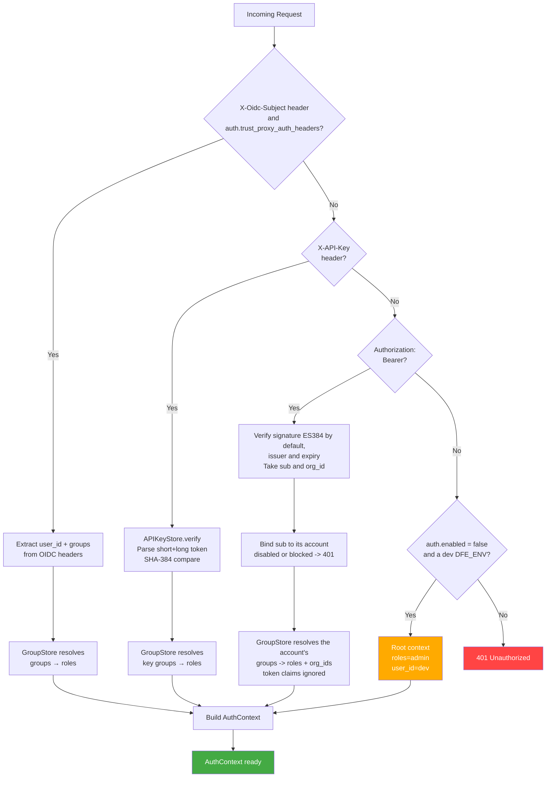
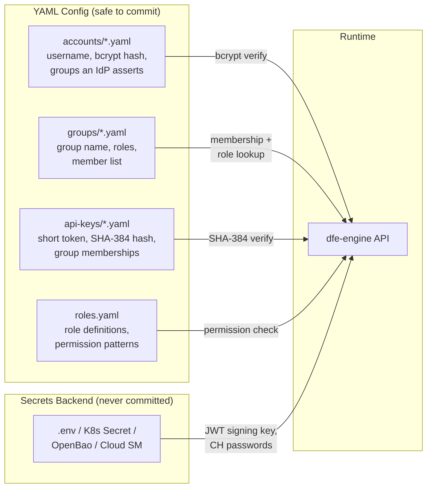
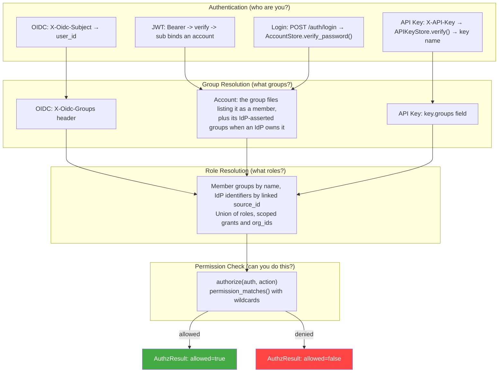
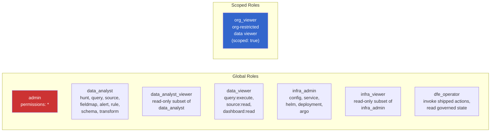
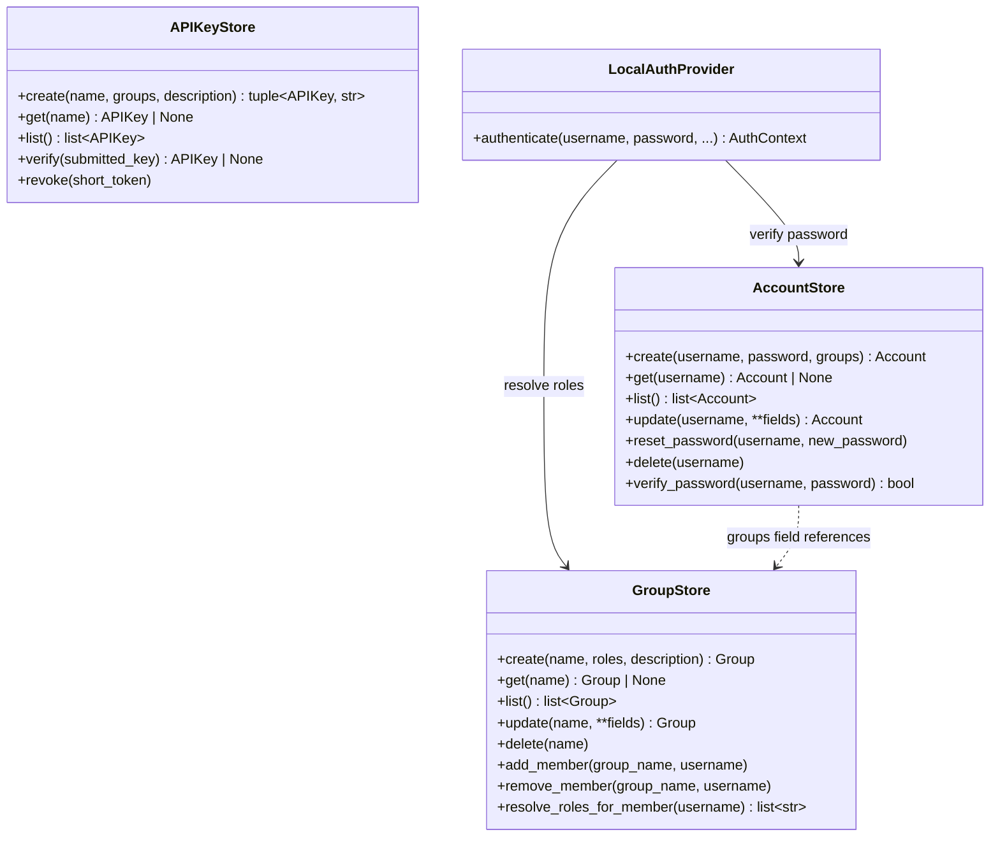
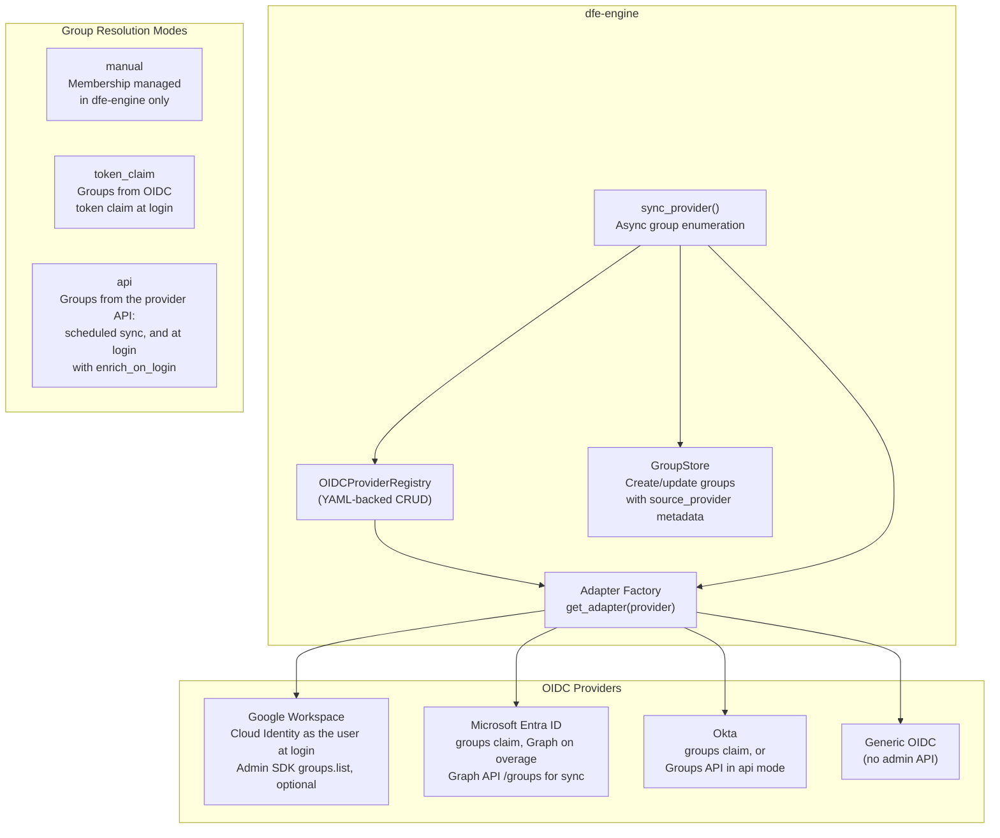
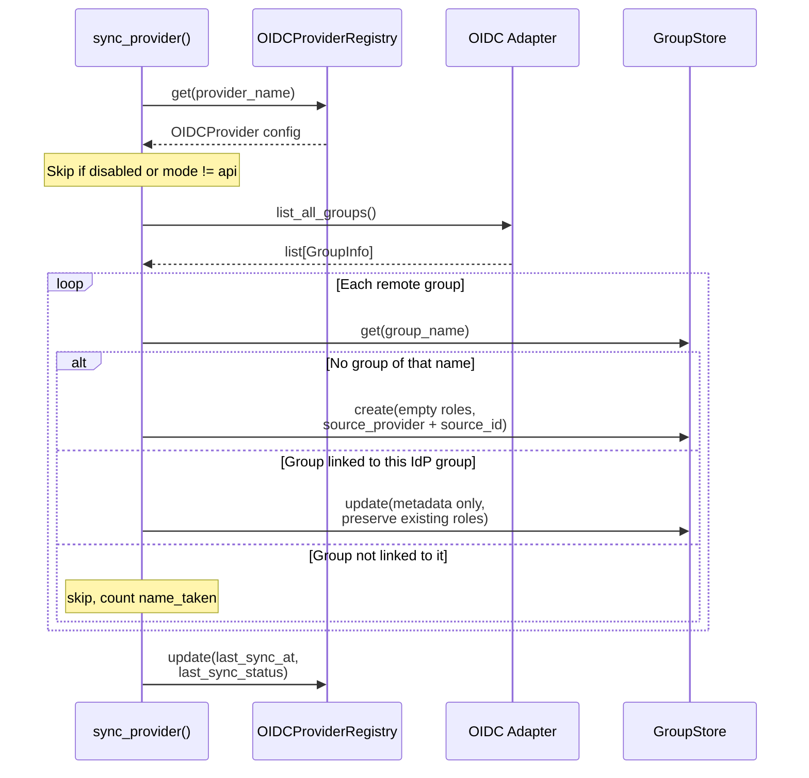
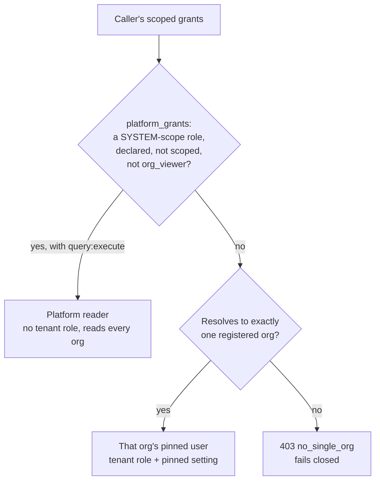
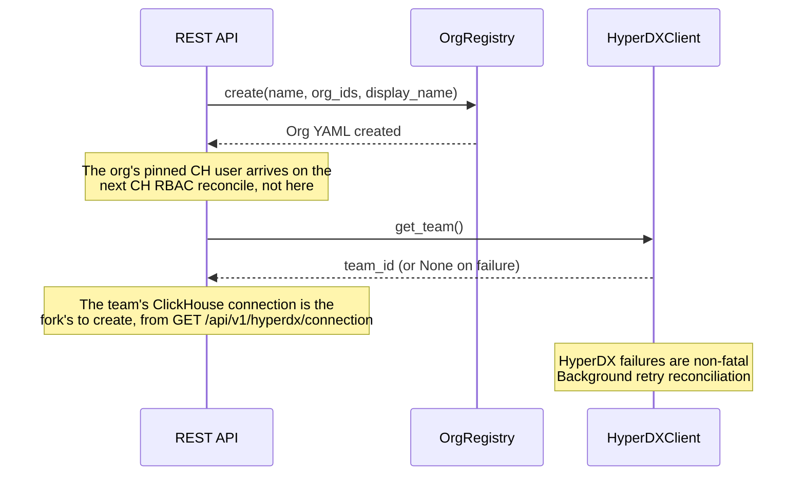
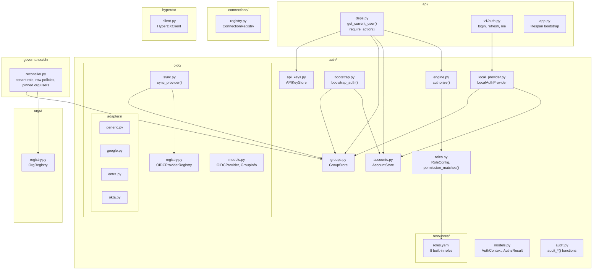

# RBAC, Multi-Tenant ClickHouse, and Auth Architecture

**Scope:** Auth, granular RBAC, multi-tenant CH with row-level security, OIDC group sync, HyperDX integration, Argo CD RBAC export

---

## Implementation Status

| Phase | Scope | Status |
|-------|-------|--------|
| **Phase 1** | RBAC foundation, account/group/API key CRUD, 4 auth paths, audit | Done |
| **Phase 2** | Per-org pinned ClickHouse users, shared tenant row policies, quota tiers | Done |
| **Phase 3** | OrgRegistry, HyperDX team/connection sync | Done |
| **Phase 4** | Schema-less service discovery | Not pursued - see section 13 |

---

## 1. Auth Flow

### 1.1 Four Authentication Paths



| Path | Use case | Credential storage | Token lifetime |
|------|----------|-------------------|----------------|
| OIDC headers | Production (Envoy Gateway fronted) | IdP (Entra, Google, etc.) | Session cookie (Envoy managed) |
| API key | CI/CD, Terraform, scripts | `config/auth/api-keys/*.yaml` (SHA-384 hash) | `expires_at` if set, else `auth.api_key_default_ttl_days` from creation (default 90, `0` for no expiry). Revoke by deleting the file |
| JWT Bearer | Console sessions, standalone, dev | Issued by `POST /api/v1/auth/login`, the OIDC login callback and `POST /api/v1/auth/refresh` | `api.jwt_expire_minutes` (`DFE_API_JWT_EXPIRE_MINUTES`, default 60) |
| Disabled | Dev/test | N/A | N/A |

A JWT carries identity, not authority. Its `roles`, `groups` and `org_ids` claims grant nothing: every request re-resolves them from the account the `sub` binds to, so a role or org taken away is gone from the next request. A `sub` that binds no account holds nothing -- an API-key subject, a deleted account -- and with auth enabled `POST /api/v1/auth/refresh` answers 401 for it, since each refresh issues a new expiry.

OIDC headers injected by Envoy Gateway SecurityPolicy, read only when `auth.trust_proxy_auth_headers` (`DFE_AUTH_TRUST_PROXY_AUTH_HEADERS`) is true:

| Header | Content |
|--------|---------|
| `X-Oidc-Subject` | User email or unique ID |
| `X-Oidc-Email` | User email, optional |
| `X-Oidc-Groups` | Comma-separated OIDC group identifiers |

### 1.2 Deployment Modes

Local auth is **always available**. OIDC headers are additive -- checked
first when present and `auth.trust_proxy_auth_headers` is true, but JWT and
API key paths remain active. With the flag off (the default) the engine ignores
the headers and falls through to API key and JWT.

| Mode | Setting | What's active | Use case |
|------|---------|--------------|----------|
| **Dev/test** | `auth.enabled=false` with a dev `DFE_ENV` | Requests with no credential get root admin context. Any other `DFE_ENV` refuses to start | Local development |
| **Standalone** | `auth.enabled=true` (the default) | JWT Bearer + API keys + local accounts | Docker, no external IdP |
| **Production** | `auth.enabled=true` + `auth.trust_proxy_auth_headers=true` + Envoy | OIDC headers (precedence) + JWT + API keys | K8s with Envoy Gateway |

### 1.3 OIDC Header Trust Model

**Security precondition:** When deploying behind Envoy Gateway OIDC,
dfe-engine MUST only be accessible via Envoy. Direct pod access MUST be
blocked by K8s NetworkPolicy. Without this, any client with pod access can
forge OIDC headers and impersonate any user.

### 1.4 Credential Storage Architecture



#### What Goes Where

| Data | Where stored | Format | Safe to commit? |
|------|-------------|--------|-----------------|
| Account names | `accounts/{name}.yaml` | Filename stem | Yes |
| Password hashes | `accounts/{name}.yaml` | `$2b$12$...` (bcrypt) | Yes (one-way) |
| API key short token | `api-keys/{name}.yaml` | Plaintext (8 hex chars) | Yes (lookup index) |
| API key long hash | `api-keys/{name}.yaml` | `sha384:{hex}` (legacy `sha256:` keys still verify) | Yes (one-way) |
| Full API key | Shown once at creation | `dfe_ak_{short}_{long}` | **NO** (never stored) |
| JWT signing key | Secrets backend at `api.jwt_key_path` (default `jwt/signing-key`), minted on first boot when absent | ECDSA private key, PEM (P-384 for the default ES384) | **NO** |
| OIDC login session cookie key | `DFE_API_SESSION_SECRET`, else `DFE_API_JWT_SECRET` | Random, `DFE_API_JWT_SECRET` at least 32 bytes | **NO** |
| CH connection passwords | Env var / K8s Secret | Plaintext | **NO** |
| Role definitions | `rbac/roles.yaml` beside the auth directory, seeded from `auth/resources/roles.yaml` on first boot | Permission patterns | Yes |
| Group→role mapping | `groups/{name}.yaml` | Role list | Yes |

#### Config Directory Layout

```text
config/auth/
    accounts/           # One YAML per local user account
        admin.yaml
        analyst1.yaml
    groups/              # One YAML per group (group → roles)
        dfe-admins.yaml
        soc-analysts.yaml
    api-keys/            # One YAML per API key
        ci-deploy.yaml
    oidc-providers/      # One YAML per OIDC provider (see 4.2)
```

Account filename = username. Group filename = group name. API key filename =
key name. The filename IS the identity — never stored inside the YAML body
(avoids DirectoryConfigStore YAML 1.1 boolean coercion on values like `off`,
`yes`, `no`).

### 1.5 Password Verification Flow

```python
# AccountStore.verify_password()
account = self.get(username)
if account is None:
    bcrypt.checkpw(password.encode(), _DUMMY_HASH)  # Timing-safe rejection
    return False
return bcrypt.checkpw(password.encode(), account.password_hash.encode())
```

Constant-time rejection for unknown usernames prevents enumeration attacks.

### 1.6 API Key Format

```text
dfe_ak_8a3f2c91_7f3b2c4d8e9a1b5f6c7d8e9f0a1b2c3d4e5f6a7b8c9d0e1f
|      |         |
prefix short     long token (shown once, stored as SHA-384 hash)
       token
       (lookup index, shown in UI)
```

- **Prefix** (`dfe_ak_`): enables secret scanning by GitHub, GitGuardian
- **Short token** (8 hex chars): plaintext in YAML, used for lookup and display
- **Long token** (32 hex chars): SHA-384 hashed. Not bcrypt -- keys are
  high-entropy random, bcrypt's slowness adds no security value
- Full key shown **once** at creation, never retrievable again
- **Expiry** (`expires_at`, optional ISO-8601 stored as UTC): enforced on every
  verify, so a lapsed key stops authenticating with no sweeper running. The
  file stays until revoked, and `list` reports `expired: true`. A key created
  through the API without one expires after `auth.api_key_default_ttl_days`
  (default 90, `0` for no expiry)
- **Revocation:** Delete the key's YAML file or call the revoke API

### 1.7 API Key Verification Flow

```python
# APIKeyStore.verify()
# Input: "dfe_ak_8a3f2c91_7f3b2c4d8e9a1b5f..."
prefix, short_token, long_token = parse_api_key(submitted_key)

# 1. Scan for matching short_token across key files
key_meta = find_by_short_token(short_token)

# 2. Hash verify, timing-safe (SHA-384; legacy sha256: keys still verify)
actual_hash = "sha384:" + hashlib.sha384(long_token.encode()).hexdigest()
if not hmac.compare_digest(key_meta.key_hash, actual_hash):
    raise AuthenticationError("Invalid API key")

# 3. Status checks run only AFTER possession is proven, so the specific
#    reason cannot confirm a key the caller does not already hold
if not key_meta.enabled:
    raise AuthenticationError("API key disabled")
if key_meta.is_expired():
    raise AuthenticationError("API key expired")
```

---

## 2. RBAC Data Model

### 2.1 Identity Resolution Chain



An identifier an IdP asserts, in a token's groups claim, `X-Oidc-Groups` or a SCIM record, takes a group only when that group's `source_id` is the identifier and its `source_provider` is empty or the provider the login came through (or one `auth.source_provider_bindings` joins to it). A group's name links nothing, so an IdP group that happens to be called `dfe-admins` gets no roles until an admin links it. Logins through `X-Oidc-Groups` count as the provider named in `auth.proxy_provider` (default `oidc`).

For a local account the group files are the authority. The account's own `groups` list is kept in step by the API routes, but it grants nothing. A member removed from a group file in the live store loses that group's roles and orgs at its next engine request, whether the API removed it, someone edited the file in the engine's auth directory, or the Helm chart's `authConfig.groupsConfigMap` copied a new file in at pod start. The deploy repo's `governance/rbac` classes are neither read nor written at runtime, so an edit there changes nothing. An account an IdP owns (JIT or SCIM) also holds the groups its record says the IdP asserts, so a group an operator adds it to by hand sits beside those.

dfe-hyperdx decides on the `role` claim of the token it holds, so there a role taken away lasts until that token expires or is refreshed (`api.jwt_expire_minutes`).

### 2.2 Role Definitions

The built-in roles ship in `src/dfe_engine/auth/resources/roles.yaml`. On first
boot the engine copies that file to `rbac/roles.yaml` beside the auth directory
and loads roles from the copy. Custom roles are added to it through
`/api/v1/auth/roles`.

The copy is never rewritten once it exists, and the API refuses edits to a built-in role. A built-in grant changed in a later engine release therefore reaches an existing deployment only when `rbac/roles.yaml` is edited by hand.

8 built-in roles, flat hierarchy (no inheritance):



### 2.3 Permission Taxonomy

| Domain | Actions | Scoped by service? |
|--------|---------|---------------------|
| `hunt` | `read`, `write`, `delete`, `execute`, `*` | No |
| `query` | `read`, `execute`, `*` | No |
| `source` | `read`, `write`, `delete`, `deploy`, `*` | No |
| `fieldmap` | `read`, `write`, `delete`, `*` | No |
| `alert` | `read`, `write`, `delete`, `*` | No |
| `schema` | `read`, `write`, `delete`, `*` | No |
| `dashboard` | `read`, `*` | No |
| `config` | `read`, `write`, `*` | No |
| `transform` | `compile`, `test`, `*` | No |
| `service` | `read`, `write`, `delete`, `validate`, and per service `config:read`, `config:write`, `metrics:read`, `*` | The `config` and `metrics` actions (`service:{name}:{action}`) |
| `helm` | `compile`, `execute_ddl`, `create_topics`, `*` | No |
| `deployment` | `read`, `write`, `*` | No |
| `org` | `read`, `write`, `*` | No |
| `argo` | `{resource}:{action}` (open-ended) | No |

The routes enforce more domains than this table lists (accounts, groups, API keys, roles, OIDC providers, governance, and others). The full catalogue is `src/dfe_engine/auth/rbac_scopes/scope_constants.py`.

### 2.4 Wildcard Permission Matching

```python
def permission_matches(permission: str, action: str) -> bool:
```

| Pattern | Matches | Does NOT match |
|---------|---------|----------------|
| `*` | Everything | — |
| `config:*` | `config:read`, `config:write`, `config:read:sub` | `hunt:read` |
| `service:*:config:*` | `service:loader:config:read` | `service:loader:metrics:read` |
| `service:*:config:read` | `service:loader:config:read` | `service:loader:config:write` |

- `*` alone matches ANY action regardless of segment count
- Trailing `*` matches any remaining segments
- Mid-position `*` matches exactly one segment

### 2.5 Authorization Engine

```python
# engine.py
def authorize(
    auth: AuthContext | None,
    action: str,
    resource: str = "",
    *,
    scope: Scope | None = None,
    enabled: bool = True,
    role_config: RoleConfig | None = None,
) -> AuthzResult:
```

Decision order:

1. `enabled=False` → allow (dev/test)
2. `auth=None` → root mode, allow
3. For each of the caller's scoped grants (`auth.grants`, else `auth.roles` as system grants): allow when the grant's scope covers the requested scope and its role's permissions match the action. `scope=None` is a system-scope check
4. Return `AuthzResult(allowed, reason)`

### 2.6 RBAC Enforcement in API

```python
# api/deps.py
@router.post("/sources")
async def create_source(
    user: CurrentUser,
    _auth: None = Depends(require_action("source:write")),
): ...
```

`require_action(action)` calls `authorize()` and raises `AuthorizationError` on denial,
which the error handler converts to HTTP 403.

---

## 3. Account, Group, and API Key Stores

### 3.1 Store Architecture



All stores are YAML-backed (one file per entity, filename = identity).

### 3.2 File Formats

```yaml
# config/auth/accounts/analyst1.yaml
enabled: true
password_hash: "$2b$12$LJ3m..."
groups: ["soc-analysts"]        # kept in step with the group files; grants nothing for a local account
created_at: "2026-03-31T02:00:00Z"
updated_at: "2026-03-31T02:00:00Z"
```

```yaml
# config/auth/groups/soc-analysts.yaml
description: "SOC analyst team"
roles: ["data_analyst"]
members: ["analyst1", "analyst2"]
source_provider: ""              # OIDC provider the group is linked to (see 4.4)
source_id: ""                    # Provider-specific group ID
```

```yaml
# config/auth/api-keys/ci-deploy.yaml
enabled: true
short_token: "8a3f2c91"
key_hash: "sha384:38b060a7..."
groups: ["infra-ops"]
description: "CI/CD pipeline deployer"
created_at: "2026-03-31T02:00:00Z"
```

### 3.3 REST API

```text
POST   /api/v1/auth/login                           # JWT login
POST   /api/v1/auth/refresh                          # Refresh JWT
POST   /api/v1/auth/logout                           # End the session
GET    /api/v1/auth/me                               # Current user info + permissions
GET    /api/v1/auth/permissions                      # Current user's resolved permissions
GET    /api/v1/auth/setup-status                     # First-login state (see 3.5)
POST   /api/v1/auth/setup/retire-admin               # Retire the bootstrap admin
GET    /api/v1/auth/oidc/{provider}/login            # OIDC sign-in (see 4)
GET    /api/v1/auth/oidc/{provider}/callback         # OIDC callback, mints the engine JWT
```

Account, group, API key, role and OIDC provider CRUD sit under
`/api/v1/auth/accounts`, `/api/v1/auth/groups`, `/api/v1/auth/api-keys`,
`/api/v1/auth/roles` and `/api/v1/auth/oidc-providers`. `openapi-spec/openapi.json`
lists every route.

### 3.4 Bootstrap Defaults

On first startup (empty `config/auth/` directory), `bootstrap_auth()` seeds:

**Groups:**

- `dfe-admins` → roles: `[admin]`
- `dfe-analysts` → roles: `[data_analyst]`
- `dfe-viewers` → roles: `[data_viewer]`
- `dfe-infra` → roles: `[infra_admin]`

**Accounts:** `admin` and `breakglass`, both in `dfe-admins`. See 3.5.

---

### 3.5 First Login: the two seeded accounts

The deploy mints the credentials, the engine refuses defaults, the UI never holds
a password.

**`admin`** takes its password from `DFE_AUTH_LOCAL_ADMIN_PASSWORD`, filled by the deployment's own secret store, issued with a forced change at first login. Every boot reasserts it until the admin replaces it, and after that only on a rotation.

**`breakglass`** is the recovery admin, verified against a bcrypt hash committed
at `governance/settings/auth.yaml` in the deploy repo, so it survives losing the
engine, the UI and the secret store:

```yaml
breakglass:
  password_hash: $2b$12$...   # minted once, never the plaintext
  enabled: true               # false locks the account out
```

`DFE_AUTH_BREAKGLASS_PASSWORD` mints that hash on the first boot with none
committed and is ignored afterwards. Gitops off means no hash and no break-glass
account. Every attempt is audit-logged (`auth.breakglass.login`); with
`enabled: false` the login returns 403 naming the setting.

**No `changeme` outside dev.** The engine refuses to start on an unset or default
admin password unless `DFE_ENV` is a dev posture -- the predicate gitops
auto-merge gates on (`settings.is_dev_posture`), and the error names the variable
and the fix. A dev posture running the default reports `default_credentials: true` on setup-status, login and refresh, for the UI to banner and force a change. Each reads the admin account at the request, so the forced change clears it with no restart.

**The predicate other repos copy** is `auth.bootstrap.default_credentials_in_use`:
strip surrounding whitespace, then treat empty and `changeme` as the default. An
exact comparison reads the `"changeme\n"` a Secret or `.env` line delivers as a
minted password.

**Reading the minted password.** setup-status carries `deploy_kind` (`docker` |
`kubernetes` | `local`, from `DFE_DEPLOYMENT_TARGET` else scalo's runtime
detection) and `credential_fetch_command`: `make creds` for docker, `kubectl -n
<ns> get secret <name> -o jsonpath='{.data.<key>}' | base64 -d` for kubernetes,
the environment file for local. Both survive setup completion (#301) -- that is
when an operator has lost the password.

**Rotation.** `POST /auth/accounts/{admin}/rotate-password` writes through the
scalo secrets seam when `DFE_AUTH_LOCAL_ADMIN_PASSWORD_SECRET_PATH` is set, else
returns 501 with `context.store_command`. The engine never writes the password
into its own YAML store. The new password faces the two rules that gate startup
-- 12 characters minimum, never the default -- so a rotation cannot lock the
deployment out of its own next boot. Either is a 422 naming the field.

---

## 4. OIDC Provider Integration

### 4.1 Architecture



### 4.2 Provider Configuration

```yaml
# config/auth/oidc-providers/{name}.yaml
type: "google"           # generic | google | entra_id | okta
enabled: true
display_name: "Google Workspace"
issuer: "https://accounts.google.com"
client_id: "1234.apps.googleusercontent.com"   # not secret
client_secret_path: "oidc/google-workspace/client_secret"
groups:
  mode: "api"            # manual | token_claim | api (google: api only)
  sync_interval: 3600
  enrich_on_login: true  # required for google: its tokens carry no groups
  # Google, optional: a service account holding a groups admin role, for sync
  service_account_json_path: "oidc/google-workspace/groups_service_account_json"
  domain: "example.com"
```

A Google login reads the user's groups from Cloud Identity with that login's own token (scope `cloud-identity.groups.readonly`, Cloud Identity API enabled in the OAuth client's project). A group file links on `source_id`, the id after `groups/` in the group's resource name.

The customer's IdP admin sets up their side from [idp-setup/google.md](idp-setup/google.md), [idp-setup/entra.md](idp-setup/entra.md) or [idp-setup/okta.md](idp-setup/okta.md), and sends back the client credentials, the issuer and the group identifiers each provider links on.

Config holds a secret PATH into the `DfeSecrets` seam, or the NAME of an env var
(`client_id_env`, `client_secret_env`, `service_account_json_env`) — never a
secret value. Resolution reads the store first, so a credential sent to
`POST /api/v1/auth/oidc-providers` takes effect without a restart, then the
environment, so an ESO-mounted variable keeps working.

### 4.3 Adapter Implementations

| Adapter | Status | Admin API | Group sync |
|---------|--------|-----------|------------|
| Generic | Done | None | No (use `token_claim` mode) |
| Google | Done | Cloud Identity as the user at login; Admin SDK `groups().list()` as an optional service account | Only with a service account |
| Entra ID | Done | Graph `/me/transitiveMemberOf` with the user's token on a >200 group overage, falling back to app-only `/users/{oid}/transitiveMemberOf` when Graph refuses that token. Graph `/groups` for sync | Yes, api mode with app credentials -- `$top=999` pagination |
| Okta | Done | Groups API `/api/v1/groups` with an API token, api mode only. `token_claim` calls nothing | Yes, api mode -- `Link` header pagination |

All adapters are failsafe — credential or API failures return empty results
rather than raising exceptions, so auth continues working even if group
resolution degrades.

### 4.4 Group Sync Process



The sync updates a stored group only when it is already linked to that IdP group: its `source_id` is the IdP group's id. The directory assigns that id, so a user cannot choose it the way they choose a display name. A group the sync creates is linked in the same write. A linked group keeps its roles, and the sync refreshes only its description and source metadata. Admins assign roles to synced groups by hand.

A name match links nothing. Directory display names are not unique, and in a tenant where users can create groups anyone can pick one, so an IdP group named `DFE Admins` would otherwise take the seeded `dfe-admins` and its `admin` role. A stored group of the same name with no `source_id`, or carrying another IdP group's id, is left untouched and counted as `name_taken`.

Linking an IdP group to the stored group that holds its name is an admin's act. Set `source_id` to the IdP group's id in that group's file, in the live store or through the chart's `authConfig.groupsConfigMap`; the next sync fills in `source_provider`. The groups API sets neither field. `PUT /api/v1/scim/v2/Groups/{name}` sets `source_id` from `externalId`, which links the group for logins and for the sync alike.

One bad group never aborts the sync. A provider group whose email, name or id makes no valid group name, whose name is held by a stored group that does not load, or whose name is held by a stored group not linked to it, is skipped and counted on `auth_oidc_sync_groups_skipped_total{reason}` (`invalid_name`, `stored_unloadable`, `name_taken`), and the provider's `last_sync_status` reads `partial` with each reason.

---

## 5. ClickHouse Tenant Isolation

### 5.1 Pinned Org Users, One Shared Policy Set

Every registered org gets its own ClickHouse user, and that user is what fences it in. The reconciler in `governance/ch/` renders the whole model from the org registry and the tier catalogue. The role, setting and user names come from the dfe-schemas catalogue, not from engine code.

- **One shared tenant role.** Every org-pinned user holds it and nothing else does.
- **One RESTRICTIVE row policy per table that carries `_org_id`**, on that role. Its predicate is `has(splitByChar(',', getSetting('<tenant setting>')), _org_id)`.
- **The tenant setting, pinned READONLY on each org user**, listing that org's `_org_id` values. A `SETTINGS` clause in query text cannot override it: ClickHouse answers 452 (SETTING_CONSTRAINT_VIOLATION).

A platform identity does not hold the tenant role, so no policy targets it and it reads every row. RESTRICTIVE-only is deliberate. A PERMISSIVE policy would flip the table to default-deny for everyone. A holder of the tenant role with no pinned setting makes `getSetting` throw, so a bad grant fails closed.

A tenant-reachable table with no `_org_id` column gets a `USING 0` policy, so a tenant reads nothing from it. The tables are found in `system.columns`.

Adding an org adds one pinned user. The policy set does not change.

### 5.2 Who Reads As Whom



`platform_grants` (`auth/models.py`) is the one filter for "every org". The ClickHouse group bindings, the sampler, the HyperDX connection read, the fork's role claim and JIT team assignment all go through it. A role bound at an org's scope covers that org alone, a role marked `scoped` in `roles.yaml` is held to its holder's orgs wherever it is bound, a role `roles.yaml` does not declare unfences nothing, and `org_viewer` never unfences anyone.

Group bindings (`governance/ch/bindings.py`) follow the same rule. An org-scoped group binds to its org's pinned user whatever roles it holds. A system group holding a platform role reads unrestricted, and an `admin` or `infra_admin` group also reads the otel database. A group's claimed org markers resolve to a registered org by name or, failing that, by the one org that declares the marker as a tenant id (`orgs/tenant_scope.py::resolve_orgs`); a marker no org declares, or a tenant id two orgs both declare, resolves to none, so the group gets no ClickHouse user at all -- the alternative is an unrestricted one.

### 5.3 The Engine's Own Reads

`connections.yaml` names the engine's own ClickHouse connections, and the engine asks for them by name. Only `default` is asked for, by schema discovery. The query API does not lean on a ClickHouse user for tenancy: the executor injects the caller's `org_id` as a reserved bind parameter that a client cannot override (`query/executor.py`, `RESERVED_PARAMS`).

The row reads the engine makes for a caller with no platform grant -- the sampler, the transform dry run, and the schema routes `sample-rows`, `json-paths` and `promote-field` -- bind `_org_id` to the tenant ids of the caller's registered orgs, the same ids each org's pinned user carries (`orgs/tenant_scope.py`). Each org marker the caller carries resolves the same way as a group's (`resolve_orgs`): by name, or failing that by the one org declaring it as a tenant id; a marker no org declares, or a tenant id two orgs share, binds nothing, and a caller left with no tenant id, or a table with no `_org_id`, is refused before any row is read. `/tasks` shows such a caller only the tasks held to its orgs.

---

## 6. Org Lifecycle

### 6.1 Org Registry

YAML-backed CRUD via `OrgRegistry`. One file per org in `config/orgs/`.

### 6.2 Org Creation Flow



Creating an org does not create its ClickHouse user. The CH RBAC reconcile does, and it runs at engine startup, in the background after every org or group change, and on `POST /api/v1/governance/ch-rbac/reconcile` (the console's "Reconcile Clickhouse RBAC" drawer). Until one of those runs, the org's users get `503 org_unprovisioned` from `GET /api/v1/hyperdx/connection`. The row policies need no change for a new org.

A reconcile that raises, ClickHouse unreachable being the usual cause, is logged with the cause and run again in the background on a jittered back-off from 5 seconds up to 5 minutes, until one gets through. That includes the startup run, so a ClickHouse that comes up after the engine still gets every service user the dfe-schemas role catalogue mints without a restart. With tenant isolation off only the service roles reconcile, and they retry the same way. A successful `POST` stands a waiting retry down. Each retry adds 1 to `ch_rbac_reconcile_retries_total` (`reconcile`: `rbac` or `service_roles`), and every run counts on `ch_rbac_reconciles_total` (`outcome`). None of it gates readiness.

`create` and `update` both refuse a name or tenant id that collides with another org's name or tenant ids -- `409 conflict` naming the other org -- because a shared marker would let their pinned ClickHouse users read each other's rows. An org keeping its own name among its own tenant ids is not a collision.

---

## 7. HyperDX Integration

### 7.1 Strategy

- **Connections:** the fork asks `GET /api/v1/hyperdx/connection` with the user's own token and seeds that one per-org credential on their team; the engine writes none itself
- **Runtime:** `HyperDXClient` calls the HyperDX internal API for the team and for per-DFE-source CRUD
- **Failures:** Non-fatal. First failure sets `_connected=False`, subsequent calls logged as warnings

### 7.2 Teams and Connections

- **Team name.** JIT picks it from the caller's grants (`auth/jit.py`, `resolve_hyperdx_team`): `dfe-admin` for `admin` or `infra_admin` at system scope, `dfe-analysts` for `data_analyst` at system scope, else `customer-<org>` for the caller's first org, else none.
- **Connection.** A team's ClickHouse connection is whatever `GET /api/v1/hyperdx/connection` returned to the user whose token seeded it (section 5.2): the platform reader, or that user's org's pinned user.

---

## 8. Argo CD Permissions

Roles carry `argo:{resource}:{action}` permissions in `roles.yaml`, and the scope catalogue publishes the `argo:` prefix (`auth/rbac_scopes`). The engine does not export them: it writes no `argocd-rbac-cm` policy and no AppProject roles.

---

## 9. Audit Logging

Logins, denied authorisation decisions and admin changes are logged for compliance (SOC 2, GDPR) via structured OTel log events (`scalo.logger`). An allowed decision is not logged.

| Event | Log key | Level |
|-------|---------|-------|
| Login success | `auth.login.success` | info |
| Login denied | `auth.login.denied` | warning |
| Break-glass login | `auth.breakglass.login` | warning |
| Permission denied | `auth.permission.denied` | warning |
| Account change | `auth.account.{change}` -- `created`, `updated`, `deleted`, `password_reset`, `password_changed` (the owner's own), `attributes_updated`, `sensitive_attributes_updated`, a password rotation, ending sessions, retiring the bootstrap admin | info |
| Group change | `auth.group.{change}` -- `created`, `updated`, `deleted`, `member_added`, `member_removed`, `attributes_updated`, `sensitive_attributes_updated` | info |
| API key change | `auth.api_key.{change}` -- `created`, `revoked` | info |
| Role change | `auth.role.{change}` -- `created`, `updated`, `deleted` | info |
| JIT provisioning | `auth.jit.{event}` -- account created, groups updated, login refused, team assigned, HyperDX invite, failure | info / warning |
| Org change | `org.{change}` | info |
| Resource change | `resource.{type}.{change}` -- OIDC providers, sources, fieldmaps and other config resources | info |

Every account, group, API key and role write through `/api/v1/auth` emits one event naming the actor (`admin_id`), the change and the target. Its `details` carry the roles, groups, members or permissions the write set, and the names of contact fields changed, never their values. No event carries a password, a hash, an attribute value or an API key's secret half.

Events flow through the OTel pipeline → JSON → ClickHouse → HyperDX.
No custom ClickHouse audit table — standard OTel log ingestion is used.

---

## 10. AuthContext Model

```python
class AuthContext(BaseModel):
    org_id: str = "default"  # Primary tenant
    user_id: str  # Required unique identifier
    email: str | None = None  # From the OIDC/JWT claim, for git author attribution
    roles: list[str]  # Resolved DFE roles
    grants: list[ScopedGrant] = []  # Roles with the scope each was bound at
    groups: list[str] = []  # OIDC or local groups
    org_ids: list[str] = []  # For customer-scoped roles
    connection_id: str = ""  # Resolved CH connection name
    request_id: str | None = None
    client_ip: str | None = None
    user_agent: str | None = None
```

Permissions are resolved at authorisation time from roles — never stored on
the context.

---

## 11. Settings

```python
class AuthSettings(BaseModel):
    enabled: bool = True  # Off needs a dev DFE_ENV, else the engine refuses to start
    auth_dir: str = ""  # Path to config/auth/, OIDC providers in its oidc-providers/
    trust_proxy_auth_headers: bool = False  # Read the X-Oidc-* headers (Path 1)
    oidc_group_sync_enabled: bool = True  # Background sync of api-mode providers
    oidc_group_sync_tick_seconds: int = 60  # How often the sync checks which providers are due
    proxy_provider: str = "oidc"  # Provider name the header path stamps on accounts it provisions
    source_provider_bindings: dict[str, str] = {}  # e.g. {"scim": "entra"}
    api_key_default_ttl_days: int = 90  # 0 = keys created without expires_at never expire
```

Environment variables: `DFE_AUTH_ENABLED`, `DFE_AUTH_DIR`,
`DFE_AUTH_TRUST_PROXY_AUTH_HEADERS`, `DFE_AUTH_PROXY_PROVIDER`,
`DFE_AUTH_SOURCE_PROVIDER_BINDINGS` (a JSON object),
`DFE_AUTH_API_KEY_DEFAULT_TTL_DAYS`, `DFE_AUTH_OIDC_GROUP_SYNC_ENABLED`,
`DFE_AUTH_OIDC_GROUP_SYNC_TICK_SECONDS`. OIDC provider files always live in the
auth directory's `oidc-providers/`.

---

## 12. Module Map



---

## 13. Phase 4 status - schema-less service discovery

Not pursued. An app's shape is data in `dfe-infra/apps.yaml`, served through
`/api/v1/apps`, so there is no per-service surface registry and no
`/api/v1/service-surfaces` endpoint. The typed plugin system (`plugins.py`,
`plugins_builtin/`) still backs `/api/v1/services`.

---

## 14. Edge Cases

| Scenario | Behaviour |
|----------|-----------|
| Multi-role user | A platform grant with `query:execute` reads as the platform user; otherwise the caller must resolve to exactly one org, or gets `403 no_single_org` (section 5.2) |
| HyperDX unavailable | Non-fatal. Org CRUD succeeds. Sync retried in background |
| ClickHouse unavailable | `/readyz` reports NotReady while its ping fails. Liveness is untouched, so the pod is not restarted. The CH RBAC reconcile retries in the background (section 6.2) |
| Unknown OIDC group | No matching group file → no roles resolved → default deny |
| OIDC adapter failure | Failsafe: returns empty results, auth continues with available info |
| Default password in use | Dev `DFE_ENV`: warning at startup and `default_credentials: true` on setup-status. Any other `DFE_ENV`: the engine refuses to start (section 3.5) |

---

## 15. Non-Goals

- Per-metric RBAC granularity (access is per-service, not per-metric)
- Per-setting RBAC granularity (access is per-service config, not per-key)
- HyperDX per-user RBAC (solved at dfe-engine layer via teams)
- Dynamic K8s service discovery (future enhancement)
- Envoy Gateway SecurityPolicy CRD generation (managed by dfe-infra)
- ClickHouse cluster provisioning (managed by dfe-infra)
- Role hierarchy / inheritance (flat roles sufficient for 8-role set)

---

## 16. Breaking Changes from Pre-2.2

| What | Old | New |
|------|-----|-----|
| JWT library | `python-jose[cryptography]` | `PyJWT[crypto]` |
| Auth model | `AuthContext.permissions` field | Removed — resolved from roles at auth time |
| Role names | `admin`, `operator`, `viewer` | 8 granular roles in `roles.yaml` |
| Role storage | `DEFAULT_ROLE_PERMISSIONS` constant | `auth/resources/roles.yaml` |
| Account storage | Hardcoded dict in `LocalAuthProvider` | `config/auth/accounts/*.yaml` with full CRUD |
| Group mapping | `AuthSettings.group_role_mapping` | `config/auth/groups/*.yaml` |
| Auth paths | JWT Bearer only | OIDC headers + API key + JWT Bearer + disabled |
| CH connections | Single global client | `ConnectionRegistry` (multi-client, tenant-scoped) |
| Deep merge | `deepmerge` pip package | `dfe_engine.yaml_utils.deep_merge()` (vendored) |

---

## 17. References

- [ClickHouse Custom Settings + Row Policy (Highlight)](https://www.highlight.io/blog/row-level-security)
- [API Key Prefix Pattern (Seam)](https://github.com/seamapi/prefixed-api-key)
- [Multi-Tenant RBAC Design (WorkOS)](https://workos.com/blog/how-to-design-multi-tenant-rbac-saas)
- [Envoy Gateway OIDC SecurityPolicy](https://gateway.envoyproxy.io/docs/tasks/security/oidc/)
