# RBAC, Multi-Tenant ClickHouse, and Auth Architecture

**Scope:** Auth, granular RBAC, multi-tenant CH with row-level security, OIDC group sync, HyperDX integration, Argo CD RBAC export

---

## Implementation Status

| Phase | Scope | Status |
|-------|-------|--------|
| **Phase 1** | RBAC foundation, account/group/API key CRUD, 4 auth paths, audit | Done |
| **Phase 2** | ConnectionRegistry, TenantScopedClient, multi-tenant CH | Done |
| **Phase 3** | OrgRegistry, HyperDX team/connection sync | Done |
| **Phase 4** | Schema-less service discovery, service surfaces | In progress - service surfaces shipped (`services/surfaces/registry.py`, `/api/v1/service-surfaces`); typed plugin removal pending |

---

## 1. Auth Flow

### 1.1 Four Authentication Paths

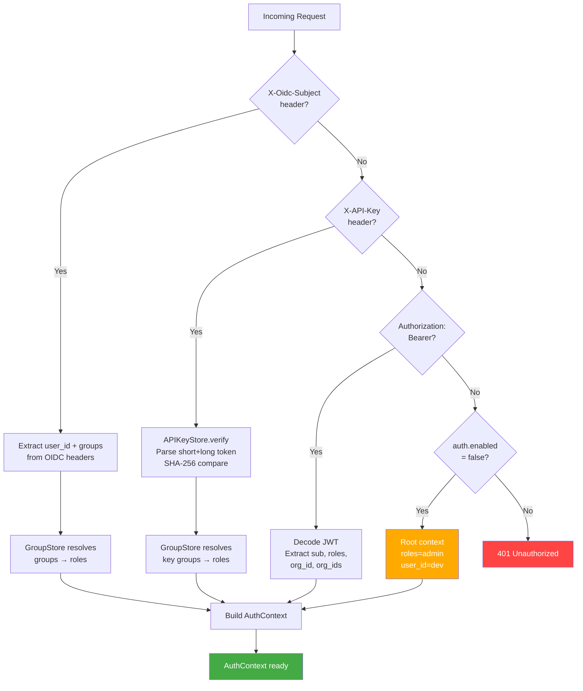

| Path | Use case | Credential storage | Token lifetime |
|------|----------|-------------------|----------------|
| OIDC headers | Production (Envoy Gateway fronted) | IdP (Entra, Google, etc.) | Session cookie (Envoy managed) |
| API key | CI/CD, Terraform, scripts | `config/auth/api-keys/*.yaml` (SHA-256 hash) | Long-lived (revoke by deleting file) |
| JWT Bearer | Standalone UI, dev | Issued by `/api/v1/auth/login` | `jwt_expire_minutes` (default 30) |
| Disabled | Dev/test | N/A | N/A |

OIDC headers injected by Envoy Gateway SecurityPolicy:

| Header | Content |
|--------|---------|
| `X-Oidc-Subject` | User email or unique ID |
| `X-Oidc-Groups` | Comma-separated OIDC group names |

### 1.2 Deployment Modes

Local auth is **always available**. OIDC is additive — headers are checked
first when present, but JWT and API key paths remain active. No explicit
mode toggle; OIDC detection is automatic based on header presence.

| Mode | Setting | What's active | Use case |
|------|---------|--------------|----------|
| **Dev/test** | `auth.enabled=false` | All requests get root admin context | Local development |
| **Standalone** | `auth.enabled=true` | JWT Bearer + API keys + local accounts | Docker, no external IdP |
| **Production** | `auth.enabled=true` + Envoy | OIDC headers (precedence) + JWT + API keys | K8s with Envoy Gateway |

### 1.3 OIDC Header Trust Model

**Security precondition:** When deploying behind Envoy Gateway OIDC,
dfe-engine MUST only be accessible via Envoy. Direct pod access MUST be
blocked by K8s NetworkPolicy. Without this, any client with pod access can
forge OIDC headers and impersonate any user.

### 1.4 Credential Storage Architecture

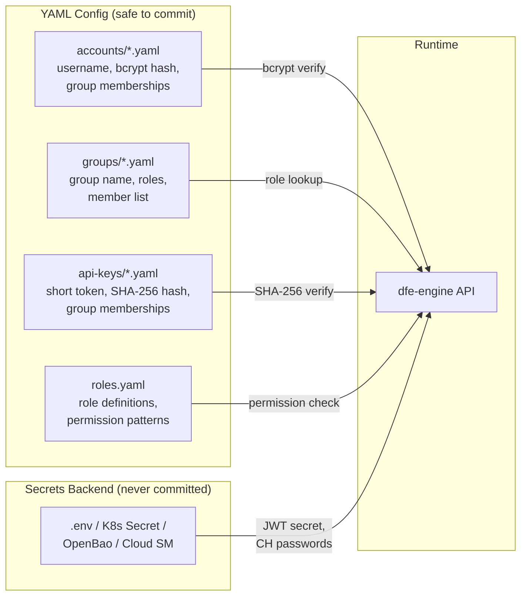

#### What Goes Where

| Data | Where stored | Format | Safe to commit? |
|------|-------------|--------|-----------------|
| Account names | `accounts/{name}.yaml` | Filename stem | Yes |
| Password hashes | `accounts/{name}.yaml` | `$2b$12$...` (bcrypt) | Yes (one-way) |
| API key short token | `api-keys/{name}.yaml` | Plaintext (8 hex chars) | Yes (lookup index) |
| API key long hash | `api-keys/{name}.yaml` | `sha256:{hex}` | Yes (one-way) |
| Full API key | Shown once at creation | `dfe_ak_{short}_{long}` | **NO** (never stored) |
| JWT signing secret | Env var (`DFE_API_JWT_SECRET`) | Random 256-bit | **NO** |
| CH connection passwords | Env var / K8s Secret | Plaintext | **NO** |
| Role definitions | `auth/resources/roles.yaml` | Permission patterns | Yes |
| Group→role mapping | `groups/{name}.yaml` | Role list | Yes |

#### Config Directory Layout

```
config/auth/
    accounts/           # One YAML per local user account
        admin.yaml
        analyst1.yaml
    groups/              # One YAML per group (group → roles)
        dfe-admins.yaml
        soc-analysts.yaml
    api-keys/            # One YAML per API key
        ci-deploy.yaml
```

Account filename = username. Group filename = group name. API key filename =
key name. The filename IS the identity — never stored inside the YAML body
(avoids DirectoryConfigStore YAML 1.1 boolean coercion on values like `off`,
`yes`, `no`).

### 1.5 Password Verification Flow

```python
# AccountStore.verify_password()
account = self.get(username)
if account is None:
    bcrypt.checkpw(password.encode(), _DUMMY_HASH)  # Timing-safe rejection
    return False
return bcrypt.checkpw(password.encode(), account.password_hash.encode())
```

Constant-time rejection for unknown usernames prevents enumeration attacks.

### 1.6 API Key Format

```
dfe_ak_8a3f2c91_7f3b2c4d8e9a1b5f6c7d8e9f0a1b2c3d4e5f6a7b8c9d0e1f
|      |         |
prefix short     long token (shown once, stored as SHA-256 hash)
       token
       (lookup index, shown in UI)
```

- **Prefix** (`dfe_ak_`): enables secret scanning by GitHub, GitGuardian
- **Short token** (8 hex chars): plaintext in YAML, used for lookup and display
- **Long token** (32 hex chars): SHA-256 hashed. Not bcrypt — keys are
  high-entropy random, bcrypt's slowness adds no security value
- Full key shown **once** at creation, never retrievable again
- **Revocation:** Delete the key's YAML file or call the revoke API

### 1.7 API Key Verification Flow

```python
# APIKeyStore.verify()
# Input: "dfe_ak_8a3f2c91_7f3b2c4d8e9a1b5f..."
prefix, short_token, long_token = parse_api_key(submitted_key)

# 1. Scan for matching short_token across key files
key_meta = find_by_short_token(short_token)

# 2. SHA-256 verify (timing-safe)
actual_hash = "sha256:" + hashlib.sha256(long_token.encode()).hexdigest()
if not hmac.compare_digest(key_meta.key_hash, actual_hash):
    raise AuthenticationError("Invalid API key")
```

---

## 2. RBAC Data Model

### 2.1 Identity Resolution Chain

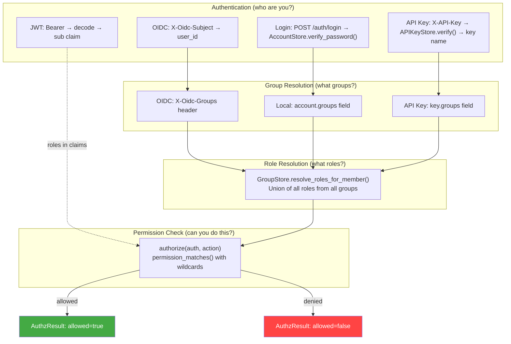

OIDC groups and local groups are unified — an OIDC group name that matches a
group file in `config/auth/groups/` inherits that group's roles.

### 2.2 Role Definitions

Roles are defined in `src/dfe_engine/auth/resources/roles.yaml` (built-in,
shipped with the package). Custom roles can be loaded from a separate YAML
file via `RoleConfig.load(path)`.

7 built-in roles, flat hierarchy (no inheritance):

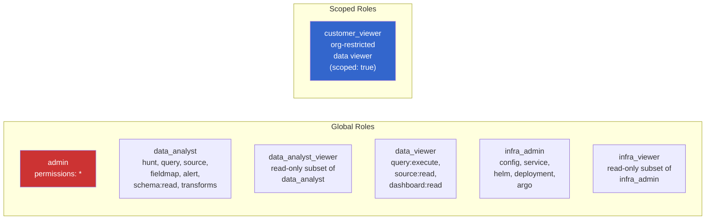

### 2.3 Permission Taxonomy

| Domain | Actions | Scoped by service? |
|--------|---------|---------------------|
| `hunt` | `read`, `write`, `execute`, `*` | No |
| `query` | `read`, `execute`, `*` | No |
| `source` | `read`, `write`, `*` | No |
| `fieldmap` | `read`, `write`, `*` | No |
| `alert` | `read`, `write`, `*` | No |
| `schema` | `read`, `write`, `*` | No |
| `dashboard` | `read`, `write`, `*` | No |
| `config` | `read`, `write`, `*` | No |
| `transforms` | `compile`, `test`, `*` | No |
| `service` | `config:read`, `config:write`, `metrics:read`, `*` | Yes (`service:{name}:{action}`) |
| `helm` | `compile`, `execute_ddl`, `create_topics`, `*` | No |
| `deployment` | `read`, `write`, `*` | No |
| `org` | `read`, `write`, `*` | No |
| `argo` | `{resource}:{action}` (open-ended) | No |

### 2.4 Wildcard Permission Matching

```python
def permission_matches(permission: str, action: str) -> bool:
```

| Pattern | Matches | Does NOT match |
|---------|---------|----------------|
| `*` | Everything | — |
| `config:*` | `config:read`, `config:write`, `config:read:sub` | `hunt:read` |
| `service:*:config:*` | `service:loader:config:read` | `service:loader:metrics:read` |
| `service:*:config:read` | `service:loader:config:read` | `service:loader:config:write` |

- `*` alone matches ANY action regardless of segment count
- Trailing `*` matches any remaining segments
- Mid-position `*` matches exactly one segment

### 2.5 Authorization Engine

```python
# engine.py
def authorize(
    auth: AuthContext | None,
    action: str,
    resource: str = "",
    enabled: bool = True,
    role_config: RoleConfig | None = None,
) -> AuthzResult:
```

Decision order:
1. `enabled=False` → allow (dev/test)
2. `auth=None` → root mode, allow
3. Check `role_config.check_roles(auth.roles, action)` → first granting role
4. Return `AuthzResult(allowed, reason)`

### 2.6 RBAC Enforcement in API

```python
# api/deps.py
@router.post("/sources")
async def create_source(
    user: CurrentUser,
    _auth: None = Depends(require_action("source:write")),
): ...
```

`require_action(action)` calls `authorize()` and raises `AuthorizationError` on denial,
which the error handler converts to HTTP 403.

---

## 3. Account, Group, and API Key Stores

### 3.1 Store Architecture

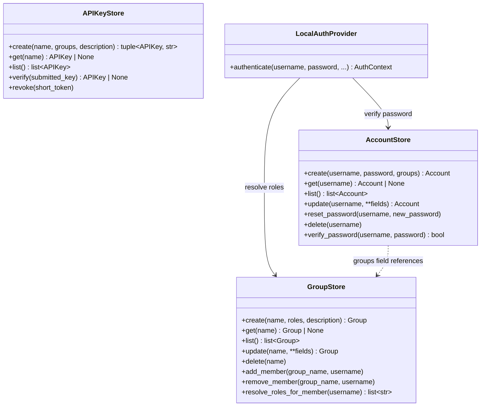

All stores are YAML-backed (one file per entity, filename = identity).

### 3.2 File Formats

```yaml
# config/auth/accounts/analyst1.yaml
enabled: true
password_hash: "$2b$12$LJ3m..."
groups: ["soc-analysts"]
created_at: "2026-03-31T02:00:00Z"
updated_at: "2026-03-31T02:00:00Z"
```

```yaml
# config/auth/groups/soc-analysts.yaml
description: "SOC analyst team"
roles: ["data_analyst"]
members: ["analyst1", "analyst2"]
source_provider: ""              # OIDC provider name (if synced)
source_id: ""                    # Provider-specific group ID
```

```yaml
# config/auth/api-keys/ci-deploy.yaml
enabled: true
short_token: "8a3f2c91"
key_hash: "sha256:e3b0c442..."
groups: ["infra-ops"]
description: "CI/CD pipeline deployer"
created_at: "2026-03-31T02:00:00Z"
```

### 3.3 REST API

```
POST   /api/v1/auth/login                           # JWT login
POST   /api/v1/auth/refresh                          # Refresh JWT
GET    /api/v1/auth/me                               # Current user info + permissions
GET    /api/v1/auth/permissions                      # Current user's resolved permissions
```

Account, group, and API key CRUD endpoints are available via the stores and
CLI. The auth router currently exposes login/refresh/me/permissions.

### 3.4 Bootstrap Defaults

On first startup (empty `config/auth/` directory), `bootstrap_auth()` seeds:

**Groups:**
- `dfe-admins` → roles: `[admin]`
- `dfe-analysts` → roles: `[data_analyst]`
- `dfe-viewers` → roles: `[data_viewer]`
- `dfe-infra` → roles: `[infra_admin]`

**Account:** `admin` (password: `changeme`, group: `dfe-admins`)

Startup logs a warning if the default password is still in use.

---

## 4. OIDC Provider Integration

### 4.1 Architecture

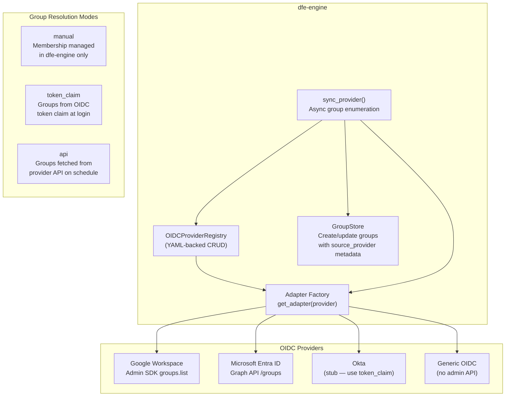

### 4.2 Provider Configuration

```yaml
# config/auth/oidc-providers/{name}.yaml
type: "google"           # generic | google | entra_id | okta
enabled: true
display_name: "Google Workspace"
issuer: "https://accounts.google.com"
client_id_env: "GOOGLE_CLIENT_ID"
groups:
  mode: "api"            # manual | token_claim | api
  sync_interval: 3600
  # Google-specific
  service_account_json_env: "GOOGLE_SA_JSON"
  admin_email: "admin@example.com"
  domain: "example.com"
```

Credential env var *names* are stored in config (not values) — secrets stay
in the deployment's secrets backend.

### 4.3 Adapter Implementations

| Adapter | Status | Admin API | Group sync |
|---------|--------|-----------|------------|
| Generic | Done | None | No (use `token_claim` mode) |
| Google | Done | Admin SDK `groups().list()` | Yes — full pagination |
| Entra ID | Done | Graph API `/groups` | Yes — `$top=999` pagination |
| Okta | Stub | Not implemented | No (Okta natively includes groups in ID token) |

All adapters are failsafe — credential or API failures return empty results
rather than raising exceptions, so auth continues working even if group
resolution degrades.

### 4.4 Group Sync Process

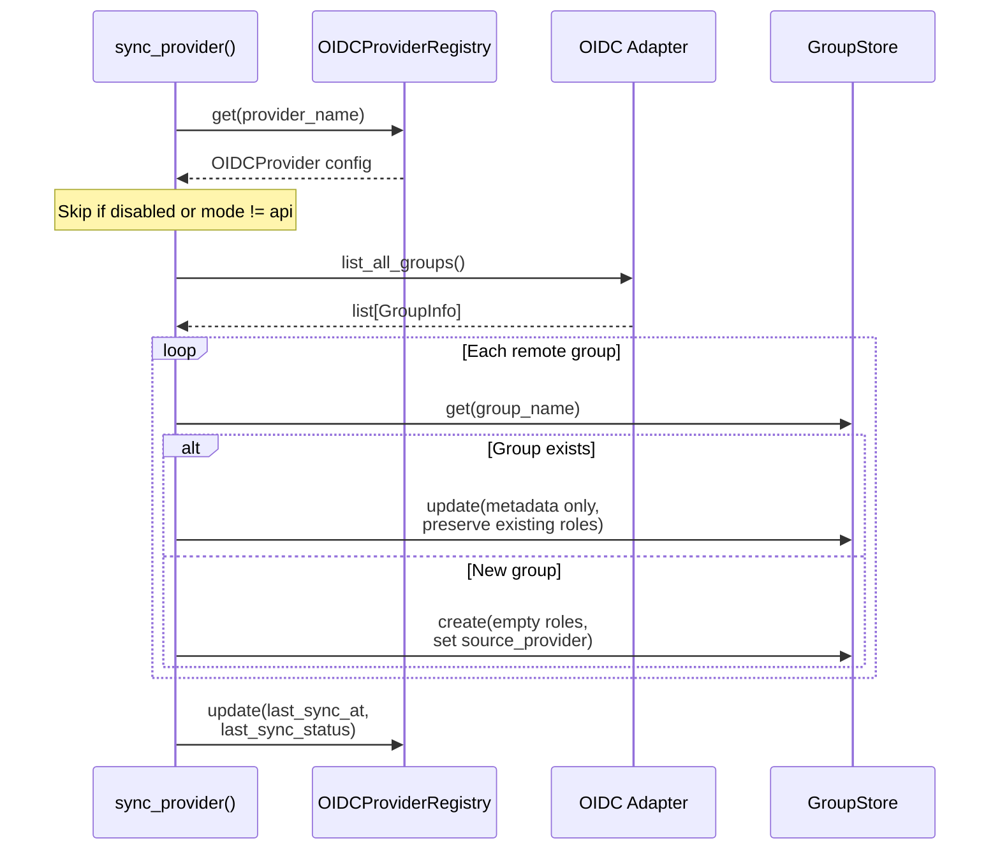

Key behaviour: existing groups keep their roles. Sync only updates
description and source metadata. Admins assign roles to synced groups
manually.

---

## 5. ClickHouse Multi-Tenant Connection Registry

### 5.1 Custom Settings Pattern

Instead of creating a CH user per customer org, use the ClickHouse custom
settings pattern with a small fixed set of users:

```sql
-- ONE row policy per tenant-scoped table
CREATE ROW POLICY tenant_filter ON dfe.events
    FOR SELECT USING org_id = getSetting('current_tenant_id')
    TO dfe_reader;

-- dfe-engine injects tenant per query via connection setting
SET current_tenant_id = 'acme';
SELECT * FROM dfe.events;  -- automatically filtered to acme rows
```

**Benefits:**
- 3-5 CH users total (by privilege level), not N per org
- One row policy per tenant-scoped table, not per org
- Scales to thousands of orgs without CH user sprawl
- If the setting is omitted, the query fails (fail-closed)

### 5.2 Connection Architecture

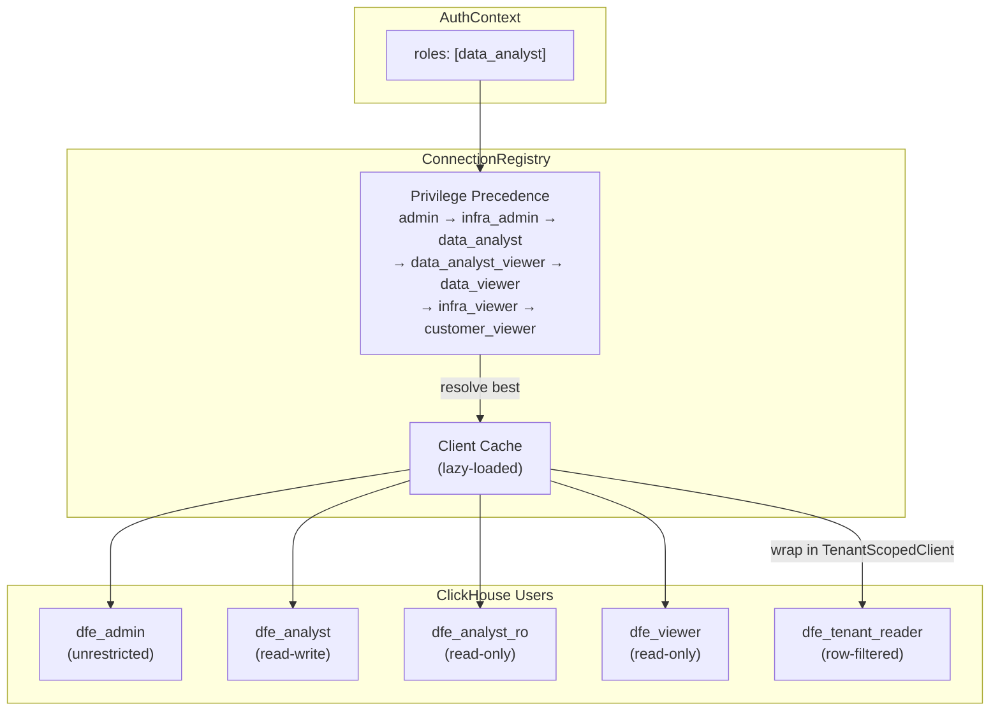

### 5.3 Connection Config (connections.yaml)

```yaml
connections:
  default:
    host: clickhouse.clickhouse.svc.cluster.local
    port: 8123
    database: dfe
    user: dfe_admin
    password_env: CH_ADMIN_PASSWORD

  analyst:
    user: dfe_analyst
    password_env: CH_ANALYST_PASSWORD

  analyst_ro:
    user: dfe_analyst_ro
    password_env: CH_ANALYST_RO_PASSWORD

  viewer:
    user: dfe_viewer
    password_env: CH_VIEWER_PASSWORD

  tenant_reader:
    user: dfe_tenant_reader
    password_env: CH_TENANT_READER_PASSWORD

role_connections:
  admin: default
  data_analyst: analyst
  data_analyst_viewer: analyst_ro
  data_viewer: viewer
  infra_admin: default
  infra_viewer: analyst_ro
  customer_viewer: tenant_reader
```

### 5.4 TenantScopedClient

Wraps the clickhouse-connect client to inject `current_tenant_id` into every
query's settings. For users with multiple `org_ids`, all queries are scoped
to their permitted orgs.

```python
class TenantScopedClient:
    def query(self, sql, ...):
        settings = {"current_tenant_id": self.tenant_id}
        return self._client.query(sql, settings=settings, ...)
```

### 5.5 Row Policies

Only tables with an `org_id` column get row policies. Discovery:
```sql
SELECT table FROM system.columns
WHERE database = 'dfe' AND name = 'org_id'
```

System, metadata, and audit tables are excluded.

---

## 6. Org Lifecycle

### 6.1 Org Registry

YAML-backed CRUD via `OrgRegistry`. One file per org in `config/orgs/`.

### 6.2 Org Creation Flow

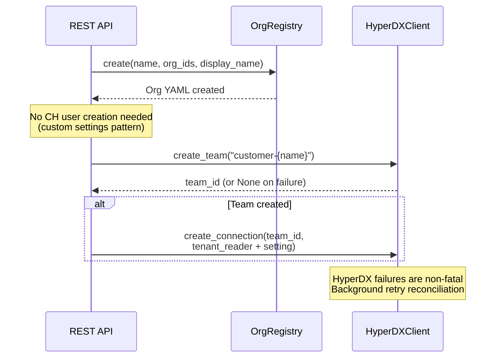

With the custom settings pattern, adding an org does NOT require creating a
CH user or row policy. The existing `tenant_reader` user + existing row
policies handle it. dfe-engine just needs to know the org_ids to inject.

---

## 7. HyperDX Integration

### 7.1 Strategy

- **Bootstrap:** `generate_default_connections_json()` produces `DEFAULT_CONNECTIONS` env var for HyperDX Helm chart
- **Runtime:** `HyperDXClient` calls HyperDX internal API for team/connection CRUD
- **Failures:** Non-fatal. First failure sets `_connected=False`, subsequent calls logged as warnings

### 7.2 Team Mapping

| DFE Role Scope | HyperDX Team | CH Connection | Tenant Setting |
|----------------|-------------|---------------|----------------|
| admin | `dfe-admin` | `default` | None (unrestricted) |
| data_analyst | `dfe-analysts` | `analyst` | None |
| data_viewer | `dfe-viewers` | `viewer` | None |
| customer_viewer (acme) | `customer-acme` | `tenant_reader` | `current_tenant_id=acme` |

---

## 8. Argo CD RBAC Export

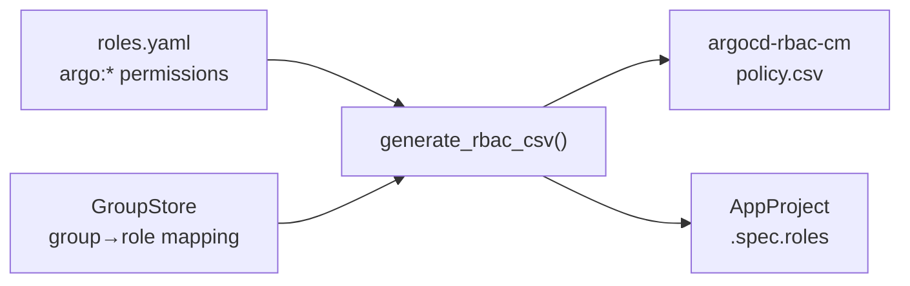

`helm/argo_rbac.py` maps DFE roles with `argo:{resource}:{action}`
permissions to Argo CD Casbin policy lines. Handles wildcards and OIDC group
bindings. Unknown argo actions logged as warnings (not errors).

---

## 9. Audit Logging

Every authorisation decision is logged for compliance (SOC 2, GDPR) via
structured OTel log events (`scalo.logger`).

| Event | Log key | Level |
|-------|---------|-------|
| Login success | `auth.login.success` | info |
| Login denied | `auth.login.denied` | warning |
| Permission denied | `auth.permission.denied` | warning |
| Account change | `auth.account.{change}` | info |
| Group change | `auth.group.{change}` | info |
| API key change | `auth.api_key.{change}` | info |

Events flow through the OTel pipeline → JSON → ClickHouse → HyperDX.
No custom ClickHouse audit table — standard OTel log ingestion is used.

---

## 10. AuthContext Model

```python
class AuthContext(BaseModel):
    org_id: str = "default"      # Primary tenant
    user_id: str                 # Required unique identifier
    roles: list[str]             # Resolved DFE roles
    groups: list[str] = []       # OIDC or local groups
    org_ids: list[str] = []      # For customer-scoped roles
    connection_id: str = ""      # Resolved CH connection name
    request_id: str | None = None
    client_ip: str | None = None
    user_agent: str | None = None
```

Permissions are resolved at authorisation time from roles — never stored on
the context.

---

## 11. Settings

```python
class AuthSettings(BaseModel):
    enabled: bool = False         # Off by default (dev/test)
    auth_dir: str = ""            # Path to config/auth/ directory

    oidc: OIDCSettings            # Nested OIDC config

class OIDCSettings(BaseModel):
    providers_dir: str = ""       # Path to OIDC provider config dir
    sync_enabled: bool = True     # Enable background group sync
    sync_on_startup: bool = True  # Sync providers at startup
```

Environment variables: `DFE_AUTH_ENABLED`, `DFE_AUTH_DIR`,
`DFE_AUTH_OIDC_PROVIDERS_DIR`, `DFE_AUTH_OIDC_SYNC_ENABLED`,
`DFE_AUTH_OIDC_SYNC_ON_STARTUP`.

---

## 12. Module Map

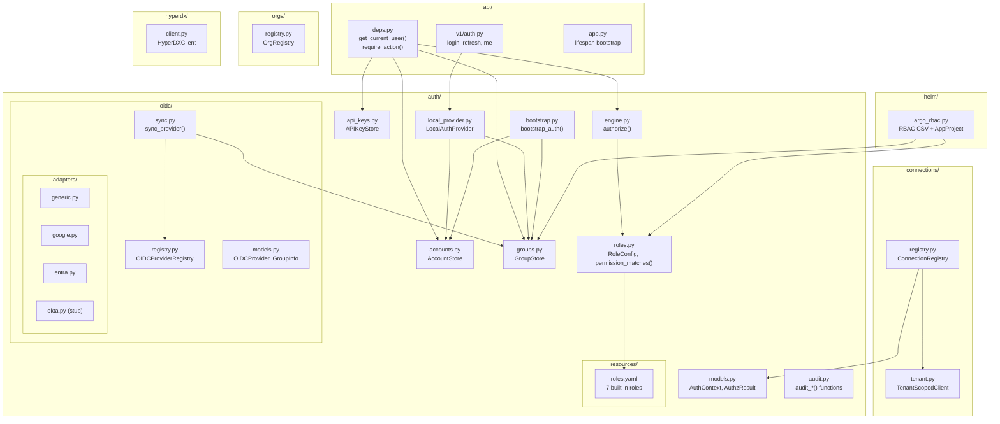

---

## 13. Phase 4 status - schema-less service discovery

Adding a new `dfe-transform-elastic` should require zero Python code
changes. Shipped so far:

1. **Service surface YAML files** (`config/service-surfaces/{name}.yaml`)
   describing configurable settings and metrics - SHIPPED
   (`services/surfaces/registry.py`)
2. **`/api/v1/service-surfaces/`** API endpoints with RBAC - SHIPPED

Remaining:

3. **Metrics manifest caching** from the scalo-rs `/metrics/manifest`
   endpoint
4. **Removal of the typed plugin system** (`plugins.py`,
   `plugins_builtin/` - still present, still the live path)

---

## 14. Edge Cases

| Scenario | Behaviour |
|----------|-----------|
| Multi-role user | Highest-privilege connection wins (precedence order) |
| HyperDX unavailable | Non-fatal. Org CRUD succeeds. Sync retried in background |
| ClickHouse unavailable | Degraded mode: API serves cached state, `/health/ready` → 503, retry every 60s |
| Unknown OIDC group | No matching group file → no roles resolved → default deny |
| OIDC adapter failure | Failsafe: returns empty results, auth continues with available info |
| Default password in use | Warning logged at startup |

---

## 15. Non-Goals

- Per-metric RBAC granularity (access is per-service, not per-metric)
- Per-setting RBAC granularity (access is per-service config, not per-key)
- HyperDX per-user RBAC (solved at dfe-engine layer via teams)
- Dynamic K8s service discovery (future enhancement)
- Envoy Gateway SecurityPolicy CRD generation (managed by dfe-infra)
- ClickHouse cluster provisioning (managed by dfe-infra)
- Role hierarchy / inheritance (flat roles sufficient for 7-role set)

---

## 16. Breaking Changes from Pre-2.2

| What | Old | New |
|------|-----|-----|
| JWT library | `python-jose[cryptography]` | `PyJWT[crypto]` |
| Auth model | `AuthContext.permissions` field | Removed — resolved from roles at auth time |
| Role names | `admin`, `operator`, `viewer` | 7 granular roles in `roles.yaml` |
| Role storage | `DEFAULT_ROLE_PERMISSIONS` constant | `auth/resources/roles.yaml` |
| Account storage | Hardcoded dict in `LocalAuthProvider` | `config/auth/accounts/*.yaml` with full CRUD |
| Group mapping | `AuthSettings.group_role_mapping` | `config/auth/groups/*.yaml` |
| Auth paths | JWT Bearer only | OIDC headers + API key + JWT Bearer + disabled |
| CH connections | Single global client | `ConnectionRegistry` (multi-client, tenant-scoped) |
| Deep merge | `deepmerge` pip package | `dfe_engine.yaml_utils.deep_merge()` (vendored) |

---

## 17. References

- [ClickHouse Custom Settings + Row Policy (Highlight)](https://www.highlight.io/blog/row-level-security)
- [API Key Prefix Pattern (Seam)](https://github.com/seamapi/prefixed-api-key)
- [Multi-Tenant RBAC Design (WorkOS)](https://workos.com/blog/how-to-design-multi-tenant-rbac-saas)
- [Envoy Gateway OIDC SecurityPolicy](https://gateway.envoyproxy.io/docs/tasks/security/oidc/)
