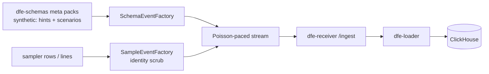

# Synthetic Data

Realistic synthetic events on demand, for two jobs: a continuous live-looking
inbound stream for sales demos, and repeatable data for testing. Never a load
generator - every knob is a ceiling, and the shipped defaults generate
nothing until an operator or caller asks.

Every synthetic event carries `tags.synthetic: true` (overridable per
request), which the common header lands in `_tags` - synthetic data is always
identifiable downstream.

## Modes

| Mode | Input | Realism source |
|------|-------|----------------|
| Reference packs (default) | A dfe-schemas meta schema (`meta/syslog`, `meta/otel/logs`, `meta/beats/filebeat`, the cyber sets) | `@source:` exprs give the event shape; name/type heuristics pick typed generators; schema-authored `synthetic:` hints and scenarios carry vocabularies and message templates |
| Lookalike | A sample's parsed `rows` or raw `lines` (the sampler's output) | The sample's own shape - enums replay weighted, numerics fit the observed range, free text keeps structure with identity tokens substituted in place |

Both draw from a seeded **entity pool**: a generated host keeps its
FQDN/IP/MAC and its users across the whole stream, and an identical seed
reproduces the identical stream. Lookalike mode never replays sample
identities - IPs, MACs, UUIDs, emails and name-identified user/host keys are
synthesised, so it doubles as a scrub.

## Coherence: scenarios

Correlated columns must not draw independently (an sshd message under
`appname: cron` reads as fake). A pack's version entry may declare
`synthetic.scenarios` - one weighted scenario is drawn per event and pins the
correlated columns together. Format reference: the dfe-schemas repo, at
<https://github.com/hyperi-io/dfe-schemas/blob/main/docs/meta-schema.md> in that tree.

## API surface

`GET /synthetic-data/packs`, `POST /synthetic-data/generate`,
`POST /synthetic-data/lookalike`, and the stream task endpoints
(`POST /synthetic-data/stream`, `GET/DELETE /synthetic-data/streams...`).
Reads need `synthetic-data:read`; generating or streaming needs
`synthetic-data:run` (write-grade - it injects data into the pipeline).
Full contract: `openapi-spec/openapi.json`.

## Ceilings and the standing demo stream

`SyntheticDataSettings` (`DFE_SYNTHETIC_DATA_*`) caps inline counts, stream
rate and stream duration. The **autostart** knobs are the sales-demo posture:
name pack refs and a receiver URL (chart values
`config.synthetic_data.autostart_*`) and the engine keeps those streams
running for the pod's lifetime - bounded segments, retry while the receiver
is away, cancelled at shutdown. Default empty = off.
