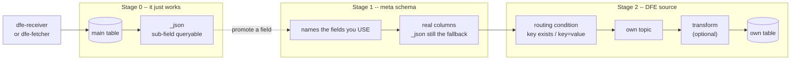
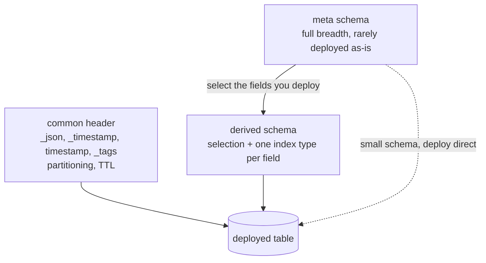
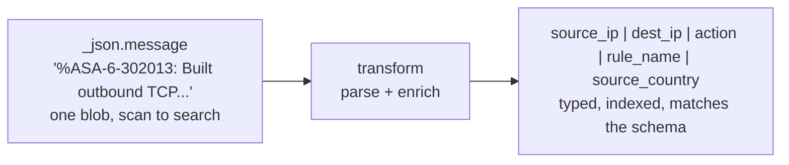

# Data evolution

DFE is a data evolution platform by design. Data lands by default and it just
works. You improve and evolve from there.

## Why it is built this way

There are two ways the industry handles incoming data, and both make you pay up
front.

At one end, Elastic and Splunk. Decide the shape before the data arrives, index
it all, query it fast. Change the shape later and you are reindexing. Send a
field you did not plan for and it is either dropped, mapped wrong, or it breaks
the mapping for everyone.

At the other end, data lakes. Land everything cheaply, decide later. Queries are
slow, the schema work is deferred forever, and 'later' rarely comes.

DFE takes the landing behaviour of a lake and the query behaviour of a search
platform, and lets you move between them one field at a time. No migration, no
reindex, no reingest. That is the best of both without the limitation of either.

## The path

Nothing forces you rightwards. A source can sit in stage 0 forever.

## Stage 0 -- ground zero

Send data to dfe-receiver, or let dfe-fetcher pull it.

It is ingested as JSON and lands in the `main` table as `_json`.

`_json` is sub-field queryable at reasonable performance, so `fred.nerk.frog`
answers today. No schema, no mapping, no decision, no ceremony.

That is the whole of stage 0. Many sources never leave it. Fine.

## Stage 1 -- give a source a meta schema

A meta schema names the fields you want out of `_json` and into real columns.

You write one, or you import one. DFE ships fully expansive meta schemas for
common sources, starting with Elastic in 2.2.0.

What makes it different from traditional ETL and from a data lake's schema
work:

- **Cover what you USE, not everything you receive.** You are never forced to
  model the full breadth, because `_json` is still there as the slower fallback
  for anything off the hot path. Partial is a valid answer.
- **Written at the primitive level**, in the types the engine can actually
  store.
- **Written at the use-case level.** A column declares the question it answers
  -- `dimension`, `range`, `word_search` -- and DFE picks the ClickHouse index.
  The label never names the engine primitive.
- **Readable by the SME who owns the data.** Whoever understands the source and
  the workflow can write one. It does not require a data engineer, a ClickHouse
  expert or a Kafka expert.
- **Narrowable to ClickHouse specifics** where you do want that control.

A large meta schema is normally NOT deployed as it stands. It is the base a
derived schema selects from.

A meta schema may carry its own opinionated indexes beyond the common header,
but that is unusual and worth a second look when you see it.

### How a table gets built

### Two shapes, and every table has a common header

Every schema is built for one of two shapes:

- **Time-series** -- logs, a large fact table, observability data.
- **Time-stamped** -- a database or REST dump from dfe-fetcher, which is a
  point-in-time context or dimension table.

And every table is built on a **common header**. It is not boilerplate. It
carries the mandatory fields, indexes, partitioning and TTL that the rest of the
DFE machinery depends on:

- `_json` is the fallback that makes stage 0 work and keeps partial meta schemas
  honest.
- `_timestamp` and `timestamp` drive partitioning, retention and every
  time-bounded query.
- `_tags` carries contextual divisions and data routing.

Remove a header field and something concrete breaks: no `_timestamp` and the
table cannot partition or expire, no `_json` and a partial meta schema silently
loses every field it did not model. That is why the header is enforced rather
than suggested.

## Stage 2 -- make it a DFE source

A source gets its own Kafka topic, where the deployment has Kafka, and its own
table.

**Routing.** A source declares the condition that selects its records, in
`key exists` or `key=value` form. It is deliberately not CEL. That condition is
evaluated against EVERY inbound record, and we have not found a way to make CEL
fast enough at that position. When we do, it goes in.

**What is mandatory.** The source name, which is both the topic and the table
name, and the routing condition when the origin is the receiver. A source
landing anywhere other than `main` also needs a meta schema or a derived schema,
because that is what defines its table.

**Derived schemas.** This is where a large meta schema usually gets one. A
derived schema is a sub-selection of fields from its parent meta schema, plus
which of those fields carry which index type -- one index type per field, added
and removed as a CRUD operation on both the definition and the deployed table.

**Transforms, optional.** A source may carry one transform in 2.2. Chaining is
a 2.3 question and only if there is demand for it. 2.2 ships transform-elastic,
transform-vrl and transform-vector. Later versions add transform-wasm, which
lets you write the transform in your preferred language, and transform-splack
for Splunk CIM-compatible transforms.

### What a transform is actually for

Most transforms do two jobs, and about 95% of the time the result maps onto the
meta schema:

1. **Parse.** Take a line of text encoded in `message`, `msg`, `description` or
   similar, and pull it out into dedicated performant columns.
2. **Enrich.** Add what the line itself does not carry -- geoip, IP reputation,
   asset and identity lookups, a timezone resolved from an abbreviation, and so
   on.

That is the bridge between stage 0 and stage 2. A Cisco syslog line arriving as
one opaque blob is queryable only by scanning it. The same line after a
transform has `source_ip`, `action` and `rule_name` as real indexed columns,
plus the fields the enrichment added.

The schema says which columns exist. The transform is what fills them.

## Stage 3 -- drop the safety net

At some point you know the source. Every field you need is in the derived
schema, indexed the way you want it, and `_json` has become dead weight you are
still paying to store.

Stage 3 is a derived schema that tells dfe-loader **not to populate** `_json`
and `_raw`.

The columns stay. The common header is retained exactly as it is, because the
header is what the rest of DFE depends on. What changes is one instruction to
the loader, so the blob is never written.

That matters: the schema is unchanged, so the decision is reversible. Turn
population back on and new records carry `_json` again. What you do not get back
is the period it was off -- a field you did not model, for rows loaded while the
net was down, is gone rather than slow.

It is a maturity statement. Never a default. Nothing pushes you here and most
tables should never arrive.

**The data plane already does this.** dfe-loader's `MetadataConfig` carries
`capture_json` / `capture_raw` with `disable_json_tables` and
`disable_raw_tables` for per-table control, and the column directive framework
reaches the same end with `@skip` on `_json`. What is missing is the control
plane: a derived schema cannot yet say it, so the engine never compiles it.

### Column comments carry loader instructions

Worth knowing before writing a schema, because it explains what a column's
`expr` is really doing. dfe-loader reads directives out of ClickHouse column
COMMENTs, and every one has an exact config-cascade equivalent. Config wins over
the DDL comment.

| Annotation | Meaning |
|---|---|
| `@skip` | Omit the column from the insert entirely |
| `@default:value` | Substitute when the column is null or absent |
| `@source:path` | Source field path, with an optional `\| fallback` |
| `@computed:expr` | A CEL expression producing this column's value |
| `@coerce:category` | Override the type category for coercion |

`@source` is the vocabulary dfe-schemas emits -- so a meta schema's
`expr: "@source: host.name"` becomes a column comment, which is what tells the
loader where to read that field from. This is why a derived schema carries its
base's `expr` unchanged and only overrides the index.

CEL does appear in the pipeline, at `@computed` on a column. It is the routing
decision that stays `key=value`, because that one runs against every record.

## Promote: see it, then shape it

Meta schema development does not have to start from a blank page.

Select real data in the UI, find a field inside `_json`, and promote it to a
dedicated column. The field you just looked at becomes part of the schema.

Traditional schema management asks you to be theoretical and exhaustive about
data you have not seen yet, which is slow and usually wrong. Promotion inverts
it: you work on what is arriving, one field at a time, and the schema grows to
match reality.

**It does not backfill.** A promoted column is filled by the records that arrive
after it, and is empty for every row already in the table. The value is still
there for those rows -- it is in `_json`, where it always was, at `_json` speed.
Promote a field you want a year of history on and you get the column plus a year
of nulls, so the query that spans the change has to read both.

## Proving it

Every claim above has a step that proves it:
[data-evolution-acceptance.md](data-evolution-acceptance.md).

A claim with no step is marketing.

None of it is a one-way door. Stage 3 costs you only the rows that landed while
the net was off.
