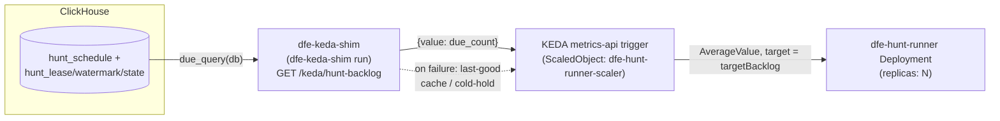

<!--
  Project:   dfe-engine
  File:      docs/data-plane/hunt-runner-scaling.md
  Purpose:   How the pull-based hunt runner scales out and to zero (KEDA)
  License:   BUSL-1.1
  Copyright: (c) 2026 HYPERI PTY LIMITED
-->

# Hunt-runner scaling: deterministic-due, no engine dependency

The hunt runner is pull-based and multi-pod (see auto-memory
`project_hunt_runner_architecture`). **Default deployment is ONE steady pod**
(no ScaledObject at all) - the runner is a thin orchestrator (all hunt load
runs in ClickHouse), so one pod covers the large majority of deployments.
Autoscaling is **BETA and opt-in** (`huntRunner.autoscaling.enabled`); when
turned on, KEDA scales the pod count on the deterministic-due backlog this doc
explains, via the fail-safe `dfe-keda-shim` - never the engine, and no longer
a MySQL-on-ClickHouse scaler (retired, see "KEDA ScaledObject" below).

This doc is the SCALING contract: how the due backlog is computed with zero
ambiguity, how the beta ScaledObject wakes/grows/shrinks the pod count from
it, and the property that matters most - the runner has NO operational
dependency on dfe-engine.

## The one hard requirement: due-detection with zero workers

This is the contract the BETA autoscaling relies on (see "Default posture,
beta autoscaling, and disable" below for when it applies - it also governs
correctness if you opt into `minReplicaCount: 0`, i.e. scale-to-zero). KEDA
can only wake the first worker if "is any hunt due right now?" is answerable
with no worker running - i.e. as a query KEDA itself (via the shim) runs
against ClickHouse. But the per-hunt schedule (interval + stable phase offset)
otherwise lives only in a running worker's memory (loaded from the gitops
hunt configs). At zero workers there is nobody to ask.

So the schedule is MATERIALISED into a small ClickHouse table, `hunt_schedule`, at
config-deploy time. The scaler then reads it directly. Three tables already exist
for coordination (`ch_coordinator.py`): `hunt_lease`, `hunt_watermark`,
`hunt_state`. `hunt_schedule` is the fourth, and the only one written outside the
worker loop.

```
hunt_schedule(hunt_id, interval_seconds, phase_offset, enabled, updated)
  ReplacingMergeTree(updated) ORDER BY hunt_id
```

`enabled` is a soft tombstone: a deleted hunt is written `enabled=0` so it stops
waking KEDA, without a DELETE.

## The scaler query (deterministic-due)

KEDA runs `schedule.due_query(db)` against ClickHouse (via the fail-safe
`dfe-keda-shim`'s `/keda/hunt-backlog` endpoint - see "KEDA ScaledObject"
below) - the count of hunts that are due-and-unclaimed. It uses the EXACT
arithmetic the worker uses (`spread.latest_fire`):

```
boundary = intDiv(now(), interval) * interval      -- start of this interval
current  = boundary + phase_offset                  -- this interval's scheduled fire
fire     = if(now() >= current, current,            -- the latest fire at or before now
              current - interval)
due      = watermark < fire                          -- that fire not already completed
           AND lease_until <= now()                  -- not currently running
```

`due_count > 0` -> scale up; `== 0` -> scale down (to zero only where
`minReplicaCount: 0` has been opted in - the default floor is 1 pod). The
`enabled=1` filter is applied in an inner subquery so a tombstone
(interval=0) can never reach the `intDiv` (no divide-by-zero).

### Why the watermark comparison is exact

The worker writes `watermark = scheduled_start` (the fire time) after a run commits
(`worker.py`: `window(...)` returns `end = scheduled_start`, then
`set_watermark(end)`). So the watermark is in the SAME epoch-fire scale as the
boundary arithmetic - `watermark < fire` means precisely "this fire has not been
completed". No unit mismatch, no data-time-vs-fire-time skew.

## Why it is RELIABLE (the property the decision hinged on)

Autoscaling (when the BETA is enabled) is only safe if KEDA's view of "due"
never diverges from a worker's. It cannot, because both compute the same
thing from the same inputs:

1. **Parity, proven.** `tests/hunt_runner/test_schedule.py` asserts the scaler
   predicate equals `runner.tick`'s own gate (via `spread.latest_fire` +
   the watermark + lease checks) across a full matrix of (hunt_id, interval, now,
   watermark, lease). `tests/integration/test_hunt_schedule_scaler.py` then proves
   the SQL string implements that predicate against real ClickHouse - counting
   exactly the runnable hunts, excluding tombstoned / future-watermark / leased
   hunts, and returning 0 when every hunt is caught up.
2. **Single source of truth for the offset.** The materialiser computes
   `phase_offset` with the same `spread.phase_offset` the worker uses, so the two
   can never drift. Change the offset algorithm once and both move together.
3. **Gate on the signal, not a timer.** KEDA polls the backlog query (via the
   shim - a real readiness signal), it does not race a clock. Worst-case wake
   latency is
   `pollingInterval + pod-start`; for hunts (minute-plus intervals) that is
   immaterial. This is the "gate on the real condition" rule from the testing
   standard applied to autoscaling.
4. **Self-healing.** If a worker claims a hunt then dies before writing the
   watermark, its lease expires (`lease_seconds`, default 300) and the fire is
   still owed (`watermark < fire`), so the scaler keeps >=1 worker and the hunt is
   reclaimed. Nothing is lost; nothing double-runs (the lease gives mutual
   exclusion, and a rare settle-window race is absorbed by the idempotent windowed
   INSERT).
5. **No thundering herd.** The phase offset spreads same-interval hunts across the
   interval, so `due_count` rises gradually and KEDA scales out smoothly rather
   than all-at-once at the boundary.

Bounded catch-up: a fire stays owed until its watermark is written, so a worker
that ticks inside `[boundary, boundary+offset)` runs the previous interval's fire
if nothing ran it, and the scaler counts it the same way. Without that, a hunt
whose offset sits between two poll ticks (a 46s offset polled at :00/:15/:30/:45)
never fires at all. Max lateness for any fire is under one interval - inherent
to the phase-offset design, and identical whether the decision is made by KEDA
or a resident worker.

## No operational dependency on dfe-engine

This is the point of the pull-based design. Once deployed, the running system needs
only ClickHouse:

- **Workers** read hunt defs from the gitops config (mounted / cloned), coordinate
  through the four CH tables, and execute queries against CH. No engine call on the
  hot path.
- **KEDA** reads `hunt_schedule` + the coordination tables from CH via the
  `dfe-keda-shim` - a separate, distinctly-labelled pod running the SAME
  engine container image under a different entrypoint (`dfe-keda-shim run`,
  not the live `dfe-engine` API service). No call to the running engine API.
- **The engine's only role is at CONFIG-DEPLOY time**, not runtime: materialise
  `hunt_schedule` when the hunt config changes. That runs as an Argo `PostSync` hook
  Job on the deploy (see below) - a one-shot, idempotent `publish_schedule`. It is
  invoked by the GitOps sync, not as a live service call.

So if the engine pod is down, hunts keep firing and KEDA keeps scaling. The only
thing you lose while the engine is down is the ability to CHANGE configs - which
needs the engine anyway. ClickHouse is DFE's single operational store; the runner
holds to that (no Postgres, no engine, no convenience store on the hot path), which
is also what lets the same runner work on a non-k8s single deploy (dfe-docker) where
only ClickHouse is guaranteed present.

### Coordination needs a SINGLE LOGICAL ClickHouse (scale-tier requirement)

The four coordination tables are the shared source of truth every worker and KEDA
read/write. That only works if all of them see the SAME tables. On a single-node CH
(docker / slim / single tiers) that is automatic. On the **scale tier's multi-node
cluster behind a round-robin load balancer, it is NOT**: a plain
`ReplacingMergeTree` (and a plain `CREATE DATABASE`) lands on one node, so workers
whose connections land on other nodes see an empty/absent table - coordination
silently breaks (surfaced as `UNKNOWN_DATABASE` / missing leases). So on a clustered
CH the coordination tables MUST be either:

- **Replicated** - `ReplicatedReplacingMergeTree` in a `Replicated`/`ON CLUSTER`
  database, so lease/watermark/schedule state is shared across nodes; or
- **pinned to a single endpoint** - point the runner + KEDA + the materialiser at one
  CH node (or a sticky service), so every connection hits the same tables.

`ensure_schema` currently creates plain engines (correct for the single-node tiers);
the scale-tier variant (Replicated engines, chosen by the data-substrate mode) is a
follow-up. The synthetic multi-pod integration test detects this and skips on a
multi-node endpoint rather than flaking (see tests/integration/test_hunt_synthetic).

### Materialisation trigger (config-deploy time)

`schedule.publish_schedule(ch, db, specs)` is the ONLY writer of `hunt_schedule`. It
is idempotent and diff-aware (tombstones hunts that vanished from config). Wire it
as an Argo `PostSync` hook Job in the hunt-runner app, so every deploy-repo sync
that changed the hunt config refreshes the schedule BEFORE (or as) the workers roll.
Because it runs at deploy time, a brand-new hunt added while scaled to zero still
gets a `hunt_schedule` row, so KEDA can wake a worker for it - no chicken-and-egg.

## KEDA ScaledObject (shape)

**KEDA has no native ClickHouse scaler.** The earlier approach - KEDA's `mysql`
scaler pointed at ClickHouse's MySQL-compatible interface (`mysql_port`, 9004) -
has been **RETIRED**: KEDA's only failure knob for a DB scaler is a fixed
`fallbackReplicas` count, not "hold at current", so a broken metric could scale
the wrong way and blow cloud spend. It is replaced by a small OWNED, fail-safe
adapter: the **`dfe-keda-shim`** (folded into the engine chart as its own pod,
`dfe-infra helm/charts/dfe-engine/templates/keda-shim.yaml`, running the engine
container image as `dfe-keda-shim run`, distinct labels so the engine Service
never routes to it). KEDA's `metrics-api` scaler polls the shim over HTTP; the
shim runs `schedule.due_query(db)` against ClickHouse - the SAME SQL the worker
gate uses (see "The scaler query" above, imported directly from
`dfe_engine.hunt_runner.schedule.due_query`, so it cannot drift) - and hands
back one integer.



Ships in the engine chart, gated by `huntRunner.autoscaling.enabled` (default
`false`, **BETA**). When enabled, the Deployment's `replicas` field is OMITTED
(the ScaledObject owns the count instead) and a `dfe-hunt-runner-scaler`
`ScaledObject` is rendered alongside it
(`dfe-infra helm/charts/dfe-engine/templates/hunt-runner.yaml`):

```yaml
apiVersion: keda.sh/v1alpha1
kind: ScaledObject
metadata:
  name: dfe-hunt-runner-scaler
spec:
  scaleTargetRef:
    name: dfe-hunt-runner
  minReplicaCount: 1     # default 1, NOT 0 - set 0 via values to opt into scale-to-zero
  maxReplicaCount: 5     # default; huntRunner.autoscaling.maxReplicaCount
  cooldownPeriod: 300
  pollingInterval: 30
  triggers:
    - type: metrics-api
      metricType: AverageValue     # ceil(due / targetBacklog) workers
      metadata:
        targetValue: "10"          # huntRunner.autoscaling.targetBacklog
        url: "http://dfe-keda-shim.dfe.svc.cluster.local:8080/keda/hunt-backlog"
        valueLocation: "value"
```

**The fail-safe** (`dfe_engine/keda_shim/shim.py`, `QueryShim.run`): every query
caches its last-good integer per (query, params). On ANY failure - CH
unreachable, timeout, a bad query - the shim returns the CACHED value, so KEDA
sees no change and the pod count FREEZES at current; it can never run
replicas up on a broken metric. A cold start with no cache yet, plus a
failure, falls back to a conservative `cold_hold` (0 for the backlog query -
hold at `minReplicaCount`). This cache-or-cold-hold behaviour is exactly why
the shim replaced the zero-code MySQL-on-ClickHouse route: KEDA's native DB
scalers cannot express "hold at current", only a fixed fallback count.

Other notes: the shim is a separate, distinctly-labelled pod
(`app.kubernetes.io/name: dfe-keda-shim`) running the same engine container
image under a different entrypoint - it is NOT the live engine API, so
hunt-runner scaling still has no dependency on the engine service being up.
Queries (including the backlog query's clamp/cold-hold/timeout) are
config-driven (`keda_shim/queries.yaml` + an optional mounted override), so a
schema change or a tuning change is a config edit, not a shim rebuild.

### Proving it: the artificial scale test

`bootstrap/keda-scale-test.sh` (dfe-infra) is the mechanised proof that the
shim -> KEDA scale-out/scale-in path actually works, rather than an
aspirational claim: it forces the path on demand with a disposable target
instead of waiting for real hunt load - stand up a throwaway Deployment +
ScaledObject wired to the shim's pressure query for a test `ServiceName`,
INSERT a high `dfe_scaling_pressure` row into `otel_metrics_gauge` (any
`<prefix>_scaling_pressure` spelling matches - see
[keda-scaling](../deployment/keda-scaling.md)), poll
(bounded, 120s) for scale-OUT to >= 2 replicas, drag the rolling average back
down, poll (bounded, 180s) for scale-IN to 1, then self-clean. It rides the
SAME shim endpoint and metrics-api mechanism the hunt-runner's
`/keda/hunt-backlog` trigger uses, so a pass proves the mechanism the
hunt-runner beta relies on, not a mock. Wired into
`bootstrap/run-all-smoke-tests.sh` (gated `DFE_KEDA_SCALE_TEST`, default on).

## Default posture, beta autoscaling, and disable

The hunt runner is a thin orchestrator - virtually all hunt load runs IN
ClickHouse (the queries + coordination), so the pod itself is rarely
resource-bound. Its real ceiling is architectural (how many hunts one pod can
submit and coordinate concurrently and reliably), not CPU/memory - and the
large majority of deployments need exactly one pod. So the default is
deliberately simple:

- **`huntRunner.enabled` (default `true`, except the `slim` tier - see docs
  deployment-tiers):** deploys `dfe-hunt-runner` as ONE steady pod
  (`replicas: 1`, no ScaledObject at all). This is the resting state for the
  large majority of deployments - a single always-on pod, not scale-to-zero.
- **`huntRunner.autoscaling.enabled` (default `false`, BETA):** opts into the
  ScaledObject described above. `replicas` is then omitted from the
  Deployment (KEDA owns the count) and the pod count floats between
  `minReplicaCount` (default **1**, not 0 - set it to `0` explicitly via
  values to additionally opt into scale-to-zero) and `maxReplicaCount`
  (default 5), driven by the due backlog. Work still divvies up safely across
  N pods via the existing `hunt_lease` mutual exclusion - KEDA picks the pod
  count, the leases decide who does what, so nothing double-runs.
- **Disabled (operator choice):** set `huntRunner.enabled: false` in the
  deploy overlay. No pod and no ScaledObject are rendered; hunts do not fire.
  Re-enable by restoring the dial - the schedule + watermarks are still in
  ClickHouse, so the runner resumes cleanly from the last committed window.

Either way the mechanism is a values dial, turned through the gitops overlay,
never a live cluster mutation.
