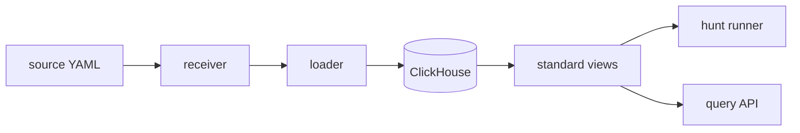

# Data plane

The close-coupled source - ingest - schema - transform path. One source
definition carries routing, schema binding, and field-map bindings together;
the receiver, loader, views, hunts, and query API all read the same
definition, so there is no separate ETL config to drift. The system map is
[../architecture.md](../architecture.md).

## Documents in this area

| Doc | Covers |
|---|---|
| [source.md](source.md) | Source as the top-level data abstraction |
| [source-definition.md](source-definition.md) | the source YAML field by field, and what a write is validated against |
| [source-registry.md](source-registry.md) | states, storage backends, CRUD, topics on deploy, the API surface |
| [source-flow.md](source-flow.md) | INPUT, optional TRANSFORM, OUTPUT on the Kafka or gRPC transport; what compiles from a source; how a change reaches a pod |
| [source-routing.md](source-routing.md) | the exact receiver and loader config a source compiles into |
| [topic-contract.md](topic-contract.md) | the Kafka topics a source implies: ensure, converge, status, remove, and the dials |
| [source-detections.md](source-detections.md) | rules, hunts and Sigma views on a source |
| [schema.md](schema.md) | schema type system: primitives, attributes, use cases, DDL |
| [schema-classes.md](schema-classes.md) | engine class reference for the schema system (SchemaLoader, SchemaBuilderV2, DDL generation) |
| [schema-sync.md](schema-sync.md) | engine<->loader runtime schema contract |
| [field-mapping.md](field-mapping.md) | standards translation layer (Sigma / ECS / CIM views) |
| [sigma.md](sigma.md) | Sigma rule-provider pipeline (feeds -> catalogue -> propagation -> source-views) + query cost leaderboard |
| [expressions-cel.md](expressions-cel.md) | CEL profile, classifier tiers, SQL transpile |
| [query-api.md](query-api.md) | query API surface + [python](query-api-python.md) / [rust](query-api-rust.md) / [typescript](query-api-typescript.md) consumption |
| [hunt-runner-scaling.md](hunt-runner-scaling.md) | pull-based runner, deterministic-due scaling, keda-shim fail-safe |
| [hunt-schedule-smoothing.md](hunt-schedule-smoothing.md) | phase-drift load smoothing (incl. the reference derivation) |
