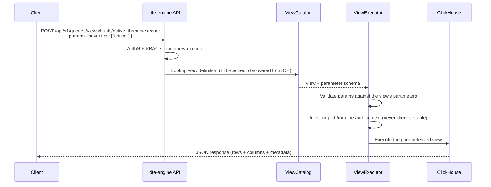
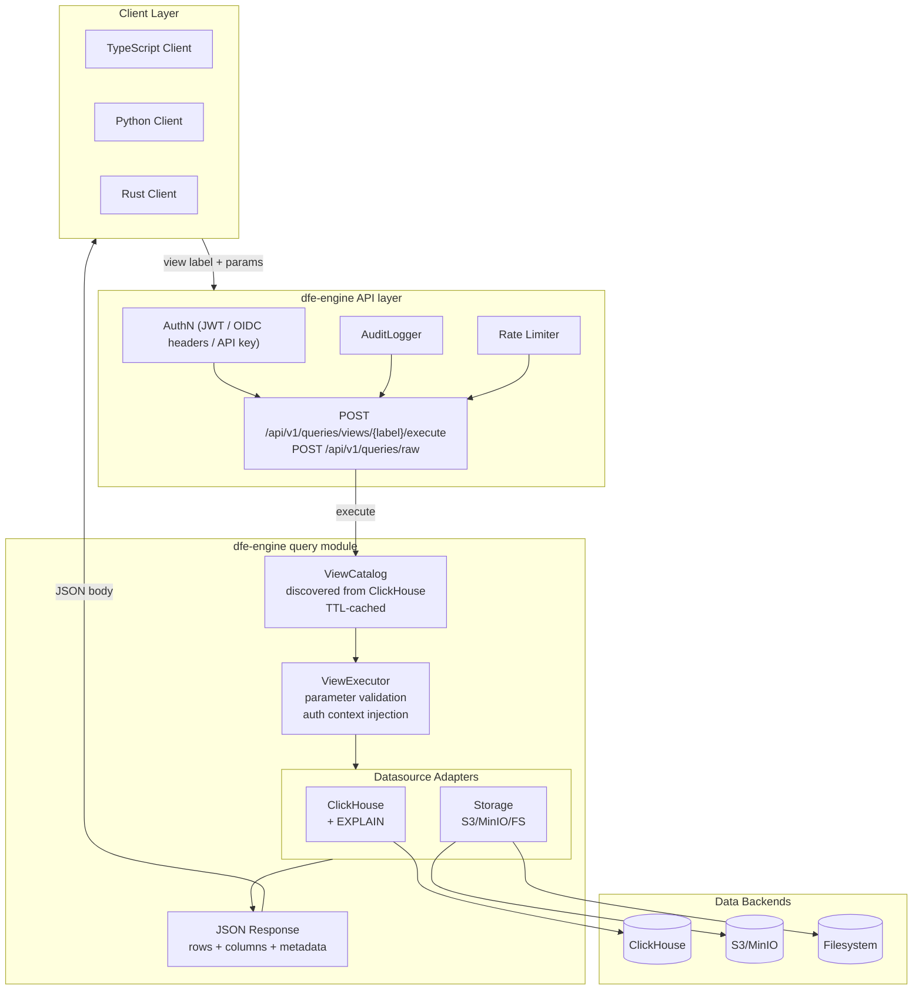
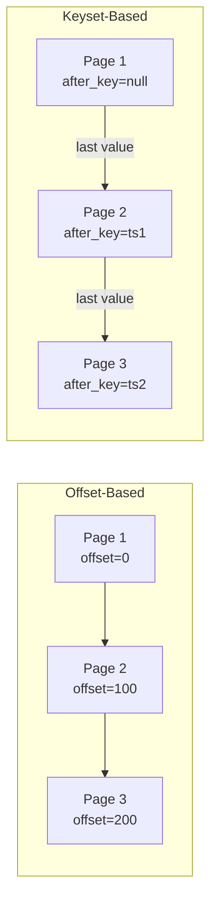
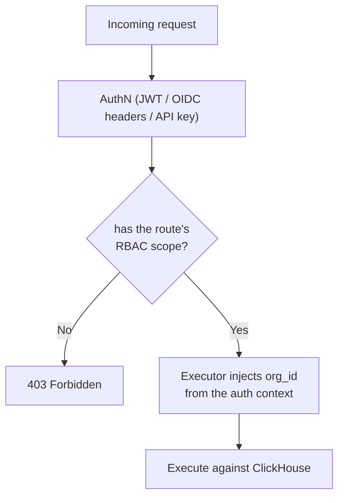

# DFE Query API

**Version:** 2.0.0
**Last Updated:** 2026-07-13

A secure, label-based query interface with multi-tenant isolation, RBAC, and native JSON responses.

---

## Overview

The Query API provides a **secure, label-based interface** for querying multiple datasources. Key security features:

- **No raw SQL from clients** - Queries are referenced by label, SQL is defined server-side
- **Mandatory tenant isolation** - `_org_id` injected from JWT, cannot be overridden
- **Role-based access control** - Queries can require specific roles/permissions
- **Parameter validation** - All parameters validated against server-side schemas
- **Native JSON responses** - dict rows via clickhouse-connect, no intermediate wire format

### Supported Datasources

| Datasource | Description | Wire Format |
|------------|-------------|-------------|
| `clickhouse` | ClickHouse analytics database | JSON |
| `postgres` | PostgreSQL transactional database | JSON |
| `prometheus` | Prometheus metrics | JSON |
| `s3` | S3 bucket directory listing | JSON |
| `minio` | MinIO (S3-compatible) listing | JSON |
| `file` | Local filesystem directory listing | JSON |

---

## Security Model

### Key Principles

1. **Query labels, not SQL** - Clients reference pre-defined queries by label
2. **Server-side SQL** - SQL templates stored in registry, clients cannot modify
3. **Automatic tenant isolation** - `_org_id` extracted from JWT and injected
4. **Parameter validation** - All params validated against schema before execution
5. **Role-based access** - Queries can require specific roles/permissions

### Example Security Flow



**Client Request** (the view label lives in the URL path):

```json
{
  "params": {"severities": ["critical", "high"]},
  "options": {"limit": 500}
}
```

**Server-side definition:** a ClickHouse parameterized VIEW, deployed
through the governed DDL path (gitops) and discovered by the engine's
`ViewCatalog` at runtime - there is no separate YAML query registry in the
engine. The view's parameter placeholders define the schema the executor
validates against, and `org_id` is injected from the auth context.

### Access control on the raw path

`POST /api/v1/queries/raw` executes against a registered datasource adapter (`clickhouse:...`, `s3:...`, `minio:...` or `file:...`). The SQL runs as the engine's own ClickHouse user, not a tenant's, so the route needs `raw_query:execute`. That action sits outside `query:*`, and no built-in role but `admin` holds it.

ClickHouse runs the query with `readonly=1`. That refuses every write and DDL statement, every `INSERT INTO FUNCTION` (`url()`, `file()`, `s3()`), a read through `url()`, and any `SETTINGS` clause in the query. The request's timeout still applies. The `s3`, `minio` and `file` adapters only list objects and never write, so `readonly` does not apply to them.

### The identity a view runs as

A view runs as `dfe_query_reader` (`query_views.restricted_user`), which holds `SELECT` on the data database and ClickHouse's introspection tables and no `SOURCES` grant, so `url()`, `s3()` and `remote()` are refused. Its password is `DFE_QUERY_VIEWS_RESTRICTED_PASSWORD` when set, else the minted user's own: `DFE_CLICKHOUSE_QUERY_READER_PASSWORD` when the deployment provides one, else `ch/service/query_reader` in the engine's secrets store. Its profile pins `readonly=2`, so the executor sends no `readonly` setting. Until the reader has a password, the view routes answer 503 `reader_unprovisioned`.

---

## Architecture



---

## API Reference

All routes live under `/api/v1/queries`:

| Route | Scope | Purpose |
|---|---|---|
| `GET /api/v1/queries/views` | `query:read` | list parameterized views (optional `?namespace=`) |
| `GET /api/v1/queries/views/namespaces` | `query:read` | list view namespaces |
| `GET /api/v1/queries/views/{label}` | `query:read` | one view definition with parameters |
| `POST /api/v1/queries/views/{label}/execute` | `query:execute` | execute a parameterized view |
| `POST /api/v1/queries/raw` | `raw_query:execute` | ad-hoc read-only query against a datasource adapter, as the engine's own ClickHouse user |

### Execute a view

```text
POST /api/v1/queries/views/analytics/user_activity/execute
Content-Type: application/json
Authorization: Bearer <jwt>

Request:
{
  "params": {
    "event_types": ["login", "logout"],
    "severities": ["critical", "high"]
  },
  "options": {
    "limit": 100,
    "offset": 0,
    "time_from": "2024-01-01T00:00:00Z",
    "time_to": "2024-01-31T23:59:59Z",
    "timeout_seconds": 30,
    "cache": true
  }
}

Response: JSON body (metadata embedded alongside rows, no custom headers)
{
  "rows": [ { "...": "..." } ],
  "columns": ["event_type", "timestamp"],
  "row_count": 100,
  "query_duration_ms": 42,
  "has_more": true,
  "next_offset": 100,
  "request_id": "req_abc123"
}
```

### Request models

```typescript
interface ViewExecuteRequest {
  // View parameters (validated against the view's parameter schema)
  params?: Record<string, unknown>;

  // Execution options
  options?: QueryOptions;
}

interface RawQueryRequest {
  datasource: string;  // e.g. "clickhouse:default"
  query: string;
  params?: Record<string, unknown>;
  options?: QueryOptions;
}

interface QueryOptions {
  // Pagination - offset-based
  limit?: number;      // 1-100000, default from query definition
  offset?: number;     // >= 0, default 0; not combinable with after_key

  // Pagination - keyset-based
  order_by?: string;            // Column to order and page by
  order_dir?: "asc" | "desc";   // Sort direction
  after_key?: string | number;  // order_by value of the previous page's last row
  tiebreak_by?: string;         // Second column ordering rows that tie on order_by
  after_tiebreak?: string | number;  // tiebreak_by value of that last row

  // Time bounds (for time-series queries)
  time_from?: string;  // ISO8601 datetime
  time_to?: string;    // ISO8601 datetime, defaults to now

  // Execution
  timeout_seconds?: number;  // 1-300, default 30

  // Caching
  cache?: boolean;     // Allow cached results, default true

  // Store override (only if query allows store: '*')
  store?: string;      // Target store
}
```

### Query Response Metadata

```typescript
interface QueryMetadata {
  row_count: number;
  query_duration_ms: number;
  query_label: string;
  datasource: string;
  store?: string;
  truncated: boolean;
  cached: boolean;
  cache_key?: string;
  explain_duration_ms?: number;
  request_id?: string;

  // Pagination info
  has_more: boolean;
  next_cursor?: string;
  next_offset?: number;
  total_count?: number;
}
```

---

## Pagination

The API supports two pagination modes:



### 1. Offset-Based Pagination

Simple pagination using `limit` and `offset`. Best for small datasets.

```json
{
  "query": "analytics/events",
  "options": {
    "limit": 100,
    "offset": 0
  }
}
```

**Response includes:**

- `has_more: true` if more rows available
- `next_offset: 100` for next page

### 2. Keyset Pagination

Stable pagination on a sort key. Send `order_by` from the first page, then `after_key` set to the previous page's last `order_by` value.

```json
{
  "query": "analytics/events",
  "options": {
    "limit": 100,
    "order_by": "timestamp",
    "order_dir": "desc",
    "after_key": "2024-01-15T12:00:00"
  }
}
```

The rules a keyset page follows:

- `after_key` is a string or a number, compared as the `order_by` column's type. Send a timestamp as `2024-01-15T12:00:00`, with a fraction if the column has one. A cursor that does not parse as the column's type is refused with 400 `invalid_options`.
- The key must be non-NULL: a row whose key is NULL is never returned.
- Without a tiebreak the key must be unique: a row tying with the cursor is skipped. For a key that is not unique, add `tiebreak_by` (a unique, non-NULL second column) and send `after_tiebreak` with `after_key`.
- `after_key` and `offset` cannot be combined.
- A view that declares its own `limit` parameter caps its rows before any outer paging, so `order_by`, `after_key` and `offset` on it are refused with 400. Page it with `limit` only.

---

## Query Labels

Queries are referenced by labels in `namespace/name` format:

```text
analytics/user_activity
analytics/conversion_funnel
hunts/active_threats
hunts/ioc_matches
system/health_check
storage/s3_list
storage/file_list
```

### Namespace Conventions

| Namespace | Description | Typical Datasource |
|-----------|-------------|-------------------|
| `analytics` | Analytics and reporting | ClickHouse |
| `hunts` | Threat hunting queries | ClickHouse |
| `system` | System administration | PostgreSQL |
| `users` | User management | PostgreSQL |
| `metrics` | Infrastructure metrics | Prometheus |
| `storage` | Directory listings | S3/MinIO/File |

---

## Query Registry

### Query Definition Schema

```yaml
queries:
  analytics/user_activity:
    # Datasource and store
    datasource: clickhouse:default
    store: events  # or "events_*" for glob, "/^tenant_\\d+$/" for regex, "*" for client-specified

    # SQL template (Jinja2)
    sql: |
      SELECT user_id, event_type, timestamp
      FROM {{ store }}.events
      WHERE org_id = {{ _org_id }}
      
        AND event_type IN {{ event_types | sql_array }}
      
      ORDER BY timestamp DESC
      LIMIT {{ limit }}
      OFFSET {{ offset }}

    # Parameter definitions
    parameters:
      event_types:
        type: array
        items: string
        required: false
        description: Filter by event types
        max_items: 50

    # Standard parameter overrides
    defaults:
      limit: 1000
      timeout_seconds: 30
    limits:
      max_limit: 10000
      max_timeout: 60

    # Time bounding
    time_column: timestamp
    time_required: false
    max_time_range_days: 90

    # Security
    tenant_isolated: true  # SQL must contain {{ _org_id }}
    required_roles: [analyst, admin]
    required_permissions: []

    # Caching
    cache_ttl_seconds: 300
    cache_namespace: analytics

    # Audit
    audit_level: full  # none, basic, full
    pii_columns: [user_id, email]

    # Metadata
    description: Query user activity events
    tags: [analytics, events]
```

### Jinja2 SQL Filters

| Filter | Description | Example |
|--------|-------------|---------|
| `sql_string` | Escape and quote string | `{{ value \| sql_string }}` → `'escaped''value'` |
| `sql_array` | Convert list to SQL array | `{{ items \| sql_array }}` → `('a', 'b', 'c')` |
| `sql_identifier` | Quote identifier | `{{ table \| sql_identifier }}` → `"table_name"` |

### Reserved Parameters

These parameters are injected by the server and cannot be overridden:

| Parameter | Source | Description |
|-----------|--------|-------------|
| `_org_id` | JWT `org_id` | Tenant organization ID |
| `_user_id` | JWT `user_id` | User ID |
| `_roles` | JWT `roles` | User roles list |
| `_request_id` | Generated | Request tracking ID |

---

## Storage Listing Queries

Built-in queries for directory listing across storage backends.

### S3/MinIO Listing

```yaml
storage/s3_list:
  datasource: s3:default
  store: "*"
  parameters:
    bucket:
      type: string
      description: Bucket name (defaults to target)
    prefix:
      type: string
      description: Path prefix to filter
      default: ""
    delimiter:
      type: string
      description: Path delimiter
      default: "/"
```

**Usage:**

```json
{
  "query": "storage/s3_list",
  "params": {
    "bucket": "my-bucket",
    "prefix": "data/2024/"
  },
  "options": {"limit": 100}
}
```

### Filesystem Listing

```yaml
storage/file_list:
  datasource: file:default
  store: "*"
  parameters:
    path:
      type: string
      description: Subdirectory path to list
      default: ""
    recursive:
      type: boolean
      description: List recursively
      default: false
    pattern:
      type: string
      description: Glob pattern filter
      default: "*"
```

**Usage:**

```json
{
  "query": "storage/file_list",
  "params": {
    "path": "logs/",
    "pattern": "*.json",
    "recursive": true
  }
}
```

### Listing Result Schema

All storage adapters return a consistent JSON schema:

| Column | Type | Description |
|--------|------|-------------|
| `name` | string | File/directory name |
| `path` | string | Full path |
| `type` | string | "file" or "directory" |
| `size` | integer | Size in bytes (0 for directories) |
| `modified` | string \| null | Last modified time (ISO8601), null for directories |
| `etag` | string \| null | ETag (S3 only) |
| `storage_class` | string \| null | Storage class (S3 only) |
| `content_type` | string \| null | MIME type |

---

## EXPLAIN Plans

The API does not return EXPLAIN plans. In Python, the ClickHouse datasource adapter's `explain()` returns this structure, running every EXPLAIN with `readonly=1`.

### EXPLAIN Response

```json
{
  "steps": [
    {
      "step_type": "read",
      "description": "ReadFromMergeTree (events)",
      "estimated_rows": 10000,
      "estimated_cost": 0.5
    },
    {
      "step_type": "filter",
      "description": "Filter (org_id = 'acme')"
    },
    {
      "step_type": "limit",
      "description": "Limit 100"
    }
  ],
  "total_estimated_cost": 1.5,
  "total_estimated_rows": 100,
  "warnings": ["Consider adding index on timestamp"],
  "raw_plan": "Expression\n  ReadFromMergeTree..."
}
```

### Step Types

| Type | Description |
|------|-------------|
| `read` | Table/index scan |
| `filter` | WHERE/PREWHERE clause |
| `aggregate` | GROUP BY operation |
| `sort` | ORDER BY operation |
| `join` | Join operation |
| `projection` | Column selection |
| `limit` | LIMIT clause |
| `union` | Union operation |

---

## Error Handling

### Error Types

| Error | HTTP Status | Description |
|-------|-------------|-------------|
| `QueryNotFoundError` | 404 | Invalid query label |
| `ParameterValidationError` | 400 | Invalid or missing parameter |
| `AuthorizationError` | 403 | Missing required role/permission |
| `QueryTimeoutError` | 504 | Query execution timeout |
| `StorageListingError` | 500 | Storage listing failed |

### Error Response Format

```json
{
  "error": {
    "type": "ParameterValidationError",
    "message": "Parameter 'severities' must be one of: ['critical', 'high', 'medium', 'low']",
    "param": "severities",
    "request_id": "req_abc123"
  }
}
```

---

## Caching

Two distinct things, one implemented, one wire-format-only:

- **View catalog cache (implemented).** The `ViewCatalog` discovers view
  definitions from ClickHouse and caches them with a TTL (default 60s,
  `cache_ttl` on the catalog). A newly deployed view appears within one TTL;
  there is no invalidation endpoint - expiry is the mechanism.
- **Result caching (wire format only).** `QueryOptions.cache` and the
  `cached`/`cache_key` metadata fields exist in the request/response models,
  but no server-side result cache is implemented - the flag currently has no
  effect. Treat result caching as a client-side concern until the engine
  grows one.

---

## RBAC Integration

Authorisation is scope-based, enforced by `require_action` on every route -
there is no per-query role list:

| Scope | Grants |
|---|---|
| `query:read` | browse the view catalog (list/get views, namespaces) |
| `query:execute` | execute views |
| `raw_query:execute` | run raw datasource queries; only `admin` holds it |



Tenant isolation is structural, not per-query config: the executor injects
`org_id` from the authenticated context (never client-settable), and the
ClickHouse user's GRANTs + row policies bound what any deployment exposes.

---

## Wire Format

### Native JSON

All responses are a single native JSON body:

```text
Content-Type: application/json
```

**Benefits:**

- No client-side deserialization library required
- Human-readable, easy to debug (curl, browser devtools)
- Universal cross-language support
- Rows arrive as plain dicts/objects, ready to consume

### Metadata Embedding

Query metadata is returned as top-level fields alongside `rows` and `columns` in
the JSON response body - not in headers or a separate schema:

| Field | Description |
|-------|-------------|
| `row_count` | Number of rows |
| `query_duration_ms` | Query execution time |
| `has_more` | Whether more rows are available |
| `next_offset` | Offset for the next page (if `has_more`) |
| `request_id` | Request correlation ID |

---

## SDK Documentation

- [Python SDK](query-api-python.md) - Python client with pandas integration
- [TypeScript SDK](query-api-typescript.md) - TypeScript client with React Query
- [Rust SDK](query-api-rust.md) - Rust client (native JSON; optional local Arrow conversion for DataFusion/Polars)

---

## Security Properties

| Property | How Achieved |
|----------|--------------|
| No SQL injection | Server-side SQL with Jinja2 filters |
| Tenant isolation | Mandatory `_org_id` injection from JWT |
| AuthZ | Per-query role/permission requirements |
| Least privilege | Queries specify minimum required roles |
| Resource limits | Per-query timeouts, limits, max time range |
| Audit trail | Full query execution logging |
| No arbitrary queries | Query registry is the allowlist |
| Type safety | Parameter validation with strict schemas |

---

## References

- [Jinja2](https://jinja.palletsprojects.com/) - Template engine
- [ClickHouse](https://clickhouse.com/) - Analytics database
