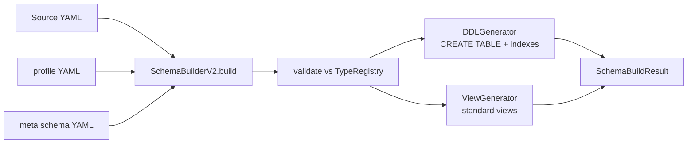

# Schema system - engine class reference

The engine classes that turn schema YAML (from the dfe-schemas repo) into
ClickHouse DDL. The YAML FORMAT itself (version tree, column fields, types,
attributes, use cases, @directives) is documented in the dfe-schemas repo
(`docs/meta-schema.md` there); this page is the code-side lookup. Concept
overview: [schema.md](schema.md).

## File map

| File | What it contains |
|------|-----------------|
| `src/dfe_engine/source/models.py` | `SchemaColumn`, `SourceSchema`, `SourceHeader`, `Source` Pydantic models |
| `src/dfe_engine/source/type_registry.py` | `TypeRegistry` class, `ResolvedType` dataclass |
| `src/dfe_engine/source/type_registry.yaml` | 13 primitives, use_case constraints, attribute constraints, ch_override catalogue |
| `src/dfe_engine/schema/schema_loader.py` | `SchemaLoader` - YAML loading, composition, validation |
| `src/dfe_engine/schema/schema_ddl.py` | `DDLGenerator`, `DDLConfig` - column/index/view DDL generation |
| `src/dfe_engine/schema/schema_builder_v2.py` | `SchemaBuilderV2`, `SchemaBuildResult` - Source -> DDL orchestration |
| `src/dfe_engine/schema/schema_manager.py` | `SchemaManager` - version write operations (add, clone, create) |
| `src/dfe_engine/schema/ddl_writer.py` | `DDLFileWriter` - reference SQL file generation |
| `src/dfe_engine/schema/engine_resolver.py` | table-engine choice (MergeTree / Replicated / cloud) resolved from the CH server |
| `src/dfe_engine/fieldmap/view_generator.py` | `ViewGenerator` - standard field map -> view DDL |
| `src/dfe_engine/schema/profiles/*.yaml` | bundled fallback copies of the dfe-schemas common-header profiles |

## Build pipeline



## Key classes

### SchemaColumn (`source/models.py`)

```python
from dfe_engine.source.models import SchemaColumn

col = SchemaColumn(
    name="user_name",
    type="string",
    attribute=["lowcardinality"],
    use_case="dimension",
    expr="@source: first(user_id/uid/id)",
    comment="User identifier",
)
errors = col.validate_against_registry(TypeRegistry.default())
```

### TypeRegistry (`source/type_registry.py`)

```python
from dfe_engine.source.type_registry import TypeRegistry

registry = TypeRegistry.default()  # loads type_registry.yaml
resolved = registry.resolve("string", attributes=["lowcardinality"])
# ResolvedType(ch_type='LowCardinality(Nullable(String))', codec='ZSTD(1)')
registry.validate_use_case("integer", "dimension")  # OK
registry.validate_use_case("integer", "fulltext")  # raises ValueError
registry.validate_attribute("json", "lowcardinality")  # raises ValueError
```

### SchemaLoader (`schema/schema_loader.py`)

```python
from dfe_engine.schema.schema_loader import SchemaLoader

columns = SchemaLoader.load_columns("meta/syslog.yaml", version="1.0.0")
profile = SchemaLoader.load_profile("timeseries", version="1.0.0")
columns = SchemaLoader.apply_derived_schema(columns, "derived.yaml")
columns = SchemaLoader.apply_additional_fields(columns, "additional.yaml")
full = SchemaLoader.compose(profile, columns)
errors = SchemaLoader.validate_columns(full, TypeRegistry.default())
order_cols = SchemaLoader.get_order_by_columns(full)
meta = SchemaLoader.load_version_metadata("meta/syslog.yaml")
```

### SchemaBuilderV2 (`schema/schema_builder_v2.py`)

```python
from dfe_engine.schema.schema_builder_v2 import SchemaBuilderV2
from dfe_engine.source.models import Source

builder = SchemaBuilderV2(
    registry=TypeRegistry.default(),
    schemas_base_dir=Path("schemas/"),
)
result = builder.build(source)
result.create_table_ddl  # CREATE TABLE statement
result.columns  # list[SchemaColumn]
result.validation_errors  # list[str]
result.view_ddls  # {"sigma": "CREATE VIEW ...", ...}

ddl = builder.build_ddl_only(columns, "my_table", DDLConfig(ttl_days=90))
add_ddl = builder.generate_alter_add(source, new_column, after="existing_col")
modify_ddl = builder.generate_alter_modify(source, modified_column)
```

### DDLGenerator (`schema/schema_ddl.py`)

```python
from dfe_engine.schema.schema_ddl import DDLGenerator, DDLConfig

gen = DDLGenerator(TypeRegistry.default())
ddl = gen.generate_create_table("my_table", columns, DDLConfig(ttl_days=90))
add_ddl = gen.generate_alter_add_column("my_table", column, after="prev_col")
view_ddl = gen.generate_view("my_table", {"SourceIP": "source_ip"}, "sigma")
```

### SchemaManager (`schema/schema_manager.py`)

Version WRITE operations - published versions are immutable, so all changes
create new version entries:

```python
from dfe_engine.schema.schema_manager import SchemaManager

SchemaManager.create_meta_schema(
    "meta/new_source.yaml",
    columns=[{"name": "event_type", "type": "string"}],
    initial_version="1.0.0",
    summary="Initial schema",
)
SchemaManager.add_version(
    "meta/syslog.yaml",
    "1.1.0",
    columns=[...],  # complete column snapshot
    type="addition",
    summary="Added geo_country column",
)
SchemaManager.clone_version(
    "meta/syslog.yaml",
    "2.0.0",
    source_version="1.1.0",
    type="model",
    summary="Changed message type",
    column_modifications=[
        {"action": "update", "name": "message", "column": {"type": "string"}},
        {"action": "add", "column": {"name": "new_field", "type": "integer"}},
        {"action": "remove", "name": "old_field"},
    ],
)
```

### DDLFileWriter (`schema/ddl_writer.py`)

```python
from dfe_engine.schema.ddl_writer import DDLFileWriter

writer = DDLFileWriter()
files = writer.generate_all()  # {relative_path: sql_content}
written = writer.write_all(Path("out/"))  # writes + returns paths
```

> **Note:** the writer's output layout is the contract for the dfe-schemas
> repo's committed `argocd/ddl/` tree and its kustomization - change one,
> change both.

## Validation rules

1. Primitive must exist in TypeRegistry (one of 13 values).
2. Use case must be valid for the primitive (e.g. `fulltext` is not valid
   for `integer`).
3. Attributes must be valid for the primitive (e.g. `lowcardinality` is not
   valid for `json`).
4. `ch_override` must match the supported ClickHouse types catalogue.
5. Duplicate column names are rejected (normalised: dots and hyphens become
   underscores).
6. Published versions are immutable - SchemaManager refuses to modify them.

## Gotchas

- **`expr` vs `comment`**: both end up in the ClickHouse COMMENT clause,
  separated by ` — ` (that separator is part of the wire format the loader
  parses - do not "fix" it). `expr` carries the `@directive`; `comment` is
  the human description. Never put directives in `comment`.
- **`default` does triple duty**: `DEFAULT expr` normally,
  `MATERIALIZED expr` with the `materialized` attribute, `ALIAS expr` with
  `alias`.
- **Profile columns win**: `SchemaLoader.compose()` drops source columns
  that duplicate profile names.
- **`timestamp` vs `datetime`**: both map to `DateTime64(3,'UTC')`, but
  `timestamp` is NOT nullable and uses `Delta, LZ4`. Use `timestamp` for
  ORDER BY time columns.
- **Nullable ORDER BY**: ORDER BY columns should carry `not_null`; the
  engine warns but does not reject.
- **Shipped schemas are read-only**: `is_shipped_schema()` detects paths
  inside the submodule or bundled profiles - custom schemas live outside
  those directories (`DFE_SCHEMAS_DIR`).
- **Profile name matches the FILENAME**: use `timeseries` / `minimal` /
  `passthrough` in `header.type`, matching the YAML filenames.
- **type_registry.yaml loads via YAML 1.1** (PyYAML through
  DirectoryConfigStore semantics): `off`/`yes`/`no` become booleans. Meta
  schemas load via ruamel (YAML 1.2) and are unaffected.
