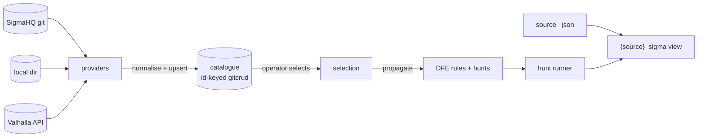

<!--
  Project:      dfe-engine
  File:         docs/data-plane/sigma.md
  Purpose:      Sigma rule-provider pipeline - feeds, catalogue, propagation, views
  Language:     Markdown
  License:      BUSL-1.1
  Copyright:    (c) 2026 HYPERI PTY LIMITED
-->

# Sigma detection pipeline

DFE turns community + commercial Sigma rules into live DFE detections. External
feeds are pulled into an operator-curated catalogue; the operator SELECTS the
rules they want; propagation then generates a DFE detection rule and a per-source
hunt for each selection, running against a per-source Sigma VIEW that exposes the
Sigma-aligned columns. Everything is stored in the deploy repo via gitcrud, so
every change is one attributed commit (survivable + audited).

## Providers - pull external feeds

A provider fetches Sigma rules from an external feed and normalises each via
pySigma into a `SigmaRuleDoc` (a mandatory UUID `id` plus `modified`/`date` change
signals, tagged with a provenance `origin`). Three kinds ship:

| Kind | Source | Auth |
|---|---|---|
| `git_repo` | any git repo of `*.yml` (default: `github.com/SigmaHQ/sigma`), cloned via dulwich | git token via the scalo.secrets seam |
| `local_files` | a directory of `*.yml/*.yaml` under the config dir | none |
| `valhalla` | the Nextron Valhalla JSON feed | api key via the secrets seam |

A provider config holds only a secret PATH, never a value. Reach is confined at
register time (`_validate_provider_reach`): a `local_files` directory must resolve
under the config dir; a `git_repo` url / `valhalla` base_url must be http(s), must
not target a loopback/link-local host (the `169.254.169.254` metadata endpoint is
link-local), and - when `DFE_SIGMA_ALLOWED_HOSTS` is set - must be allow-listed.

## Catalogue + selection

`sync_provider` fetches a provider and UPSERTs its docs by `id` into the id-keyed
gitcrud catalogue (`catalog.py`). The upsert is idempotent and local-edit
preserving: an operator can edit a catalogued rule and a later re-sync keeps that
edit (via `deep_merge(replace_lists=True)`), reporting drift when the upstream
changed. The operator then SELECTS the rules to activate; selection is its own
gitcrud object.

## Propagation - selection to live detections

`SigmaPropagator.propagate()` walks the selection and, for each selected rule,
generates a DFE detection `Rule` (the Sigma detection converted to a ClickHouse
WHERE over the source's `{source}_sigma` view) plus a per-source hunt. The
generated rule carries a `sigma_rule_id` back-reference and a `sigma_provenance`
marker (the upstream change signal + a hash of the generated WHERE) so drift and
hand-edits are detected. Deselecting a rule leaves its binding STALE until pruned.

## Source-views - Sigma-aligned columns

A Sigma rule references fields (`Image`, `EventID`) that may not be real columns.
A `SigmaViewDefinition` (`views.py`, one per source) declares each Sigma field as
either a real column OR a path inside the source's `_json` payload, and generates
a `CREATE OR REPLACE VIEW {source}_sigma` that extracts JSON-derived columns with
the `assumeNotNull(_json).path` idiom (optionally CAST). Identifiers + CAST types
are validated (`_safe_ident` / `_safe_type` / parens-balance) so a definition
cannot inject into the DDL.

## API + RBAC

The `/api/v1/sigma` router exposes provider CRUD + sync, catalogue browse/edit/
adopt, selection, view-definition CRUD + generate, and propagate + bindings.
Reads need `sigma:read`, mutations `sigma:write`, and the URL/path-accepting
provider register/update/delete need `sigma:admin` (admin-only via the `*`
wildcard - the SSRF/path-reach surface). See [rbac.md](../control-plane/rbac.md).

## Query cost attribution + the cost leaderboard

Every ClickHouse query the engine issues carries a JSON `DfeQueryTags` `log_comment`
(service / feature / tenant / kind / id), stamped by the `ClickHouseClientWrapper`
from a request-scoped `tags_context` (feature = the API route) or, for a hunt run,
directly by the worker (feature=hunts, id=the hunt). A materialised view over
`system.query_log` (`clickhouse/query_log_archive.py`) lifts the tagged rows into
`dfe_audit.query_log_archive`, exploding the JSON into typed columns. `GET
/api/v1/queries/cost-leaderboard` ranks the heaviest cost consumers (query count,
read rows/bytes, duration, peak memory) grouped by the attribution id - the
hunt-cost leaderboard for `feature=hunts`.

## Operator overview dashboards

Six built-in views (`query/builtin_views/dfe_v_overview_*.sql`) give an at-a-glance
operator picture: active sources, ingest volume by source, pipeline lag (p95),
detections over time, hunt-fleet health, and storage growth. They are applied
automatically by the builtin-view loader on bootstrap.
