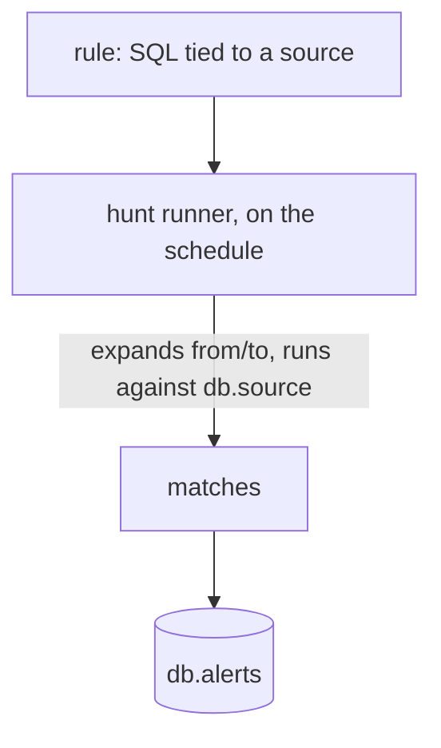

<!--
  Project:   dfe-engine
  File:      docs/data-plane/source-detections.md
  Purpose:   Rules, hunts and Sigma views -- the detection half of a source
  License:   BUSL-1.1
  Copyright: (c) 2026 HYPERI PTY LIMITED
-->

# Detections on a source

A source owns its detections the same way it owns its schema: the SQL runs
against that source's table, so it sees exactly the columns the source
declared. The source itself is [source.md](source.md).

## Rules

A rule is one SQL detection query tied to a source.

```yaml
# rules/brute_force_login.yaml
rule: brute_force_login
source: winaudit                        # Tied to this source's table
display_name: Brute Force Login Attempt
severity: high

query: |
  SELECT
    _timestamp,
    _org_id,
    user_name,
    source_ip,
    count() AS attempt_count
  FROM {db}.{source}
  WHERE event_id = 4625
    AND _timestamp >= {from}
    AND _timestamp < {to}
  GROUP BY _timestamp, _org_id, user_name, source_ip
  HAVING attempt_count >= {threshold}

parameters:
  threshold: 5

schedule: "*/5 * * * *"                 # Cron schedule for hunt execution
```

`{db}`, `{source}`, `{from}` and `{to}` are templated at execution time.

## Hunts

A hunt is a scheduled batch execution of rules, and its matches are written to
the alerts table.



The alerts table is itself a source (`_source = "alerts"`, `header.type:
timeseries`), so it gets the same schema management, retention and query
surface as any other -- including rules written against alerts, which is how
correlation is expressed. How the runner scales is
[hunt-runner-scaling.md](hunt-runner-scaling.md).

## Sigma views

Sigma rules reference fields by standardised names (`SourceIP`, `CommandLine`,
`EventID`). Rather than carrying those names in the base schema, a source
declares a Sigma view and the engine generates it:

```sql
-- Auto-generated from the source schema + the sigma field mapping
CREATE VIEW {db}.{source}_sigma AS
SELECT
    source_ip AS SourceIP,
    dest_ip AS DestinationIP,
    user_name AS User,
    command_line AS CommandLine,
    event_id AS EventID,
    *
FROM {db}.{source}
```

The rules query the view, the base schema stays ClickHouse-native, and the
mapping is per-source because different sources map differently. A view costs
no storage.

```yaml
# In the source definition (a views entry with standard: sigma)
views:
  - standard: sigma
    taxonomy: windows                   # Sigma logsource product binding
    custom_mappings:                    # Per-source overrides (win over field_map)
      CommandLine: command_line
      ParentCommandLine: parent_cmd
```

A converted Sigma rule becomes a DFE rule tied to the source, querying the
`{source}_sigma` view. The provider pipeline that keeps the rule catalogue
current is [sigma.md](sigma.md); the mapping layer itself is
[field-mapping.md](field-mapping.md).
