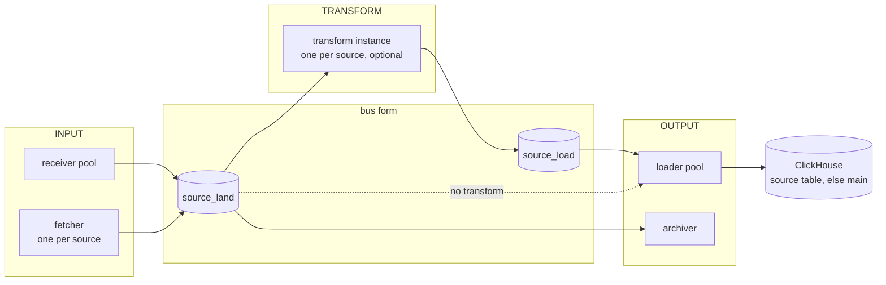
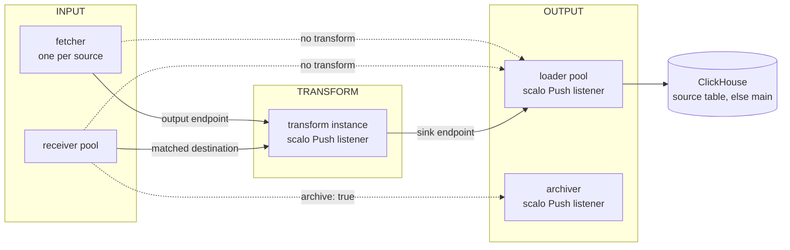
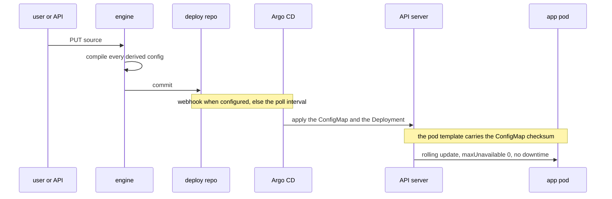

<!--
  Project:   dfe-engine
  File:      docs/data-plane/source-flow.md
  Purpose:   The source flow - INPUT, optional TRANSFORM, OUTPUT - on the bus or direct
  License:   BUSL-1.1
  Copyright: (c) 2026 HYPERI PTY LIMITED
-->

# The source flow - one definition, two transports

A source names where its records come in, whether they are transformed, and where they land. Everything else - topics, routing rules, endpoints, the instances that run the stages - is compiled from that definition by the engine and deployed through gitops. A record's path is predictable from the source alone, and a hand edit to a compiled artefact is drift the engine reports and re-syncs.

## The flow in one diagram

Two transports carry the same three stages. The bus (Kafka on the `single` and `scale` profiles) holds records between stages, so a stage can be down and nothing is lost. Direct gRPC (`slim`, `mesh`) stores nothing between stages, so the receiver's and the fetcher's own buffers are the only slack.

The archiver keeps the RAW record as it arrived, before any transform. On the bus it reads the landing topic; on direct the receiver fans the record out to it beside the stage that loads it.

The second diagram is the shape a transform takes once it declares `direct` - which transforms do, and how one gains it, is under [Adding a transform](#adding-a-transform).

## Two transports, one per deployment

A source declares `transport: bus` or `transport: direct`. Left unset, it takes the deployment's own, which follows the profile's `kafka.mode`: `disabled` means direct, anything else means bus. Every stage is bound to that one at deploy, so it is the only transport the deployment carries and a source naming the other is refused at save with the reason - `GET /api/v1/system/deployment` reports the same one transport, so a console never offers the other. Separately, a flow is never mixed: every stage of one source runs on the same transport.

| Profile | Transport | Between stages | Balancing between pools |
|---|---|---|---|
| dfe-docker slim | direct | gRPC | one replica of each |
| dfe-docker single | bus | Kafka topics on one broker | one replica of each |
| slim | direct | gRPC | one replica; the KEDA ceiling of two would pin senders to pods |
| single | bus | Kafka topics on one broker | consumer groups |
| scale | bus | Kafka topics on a broker cluster | consumer groups |
| mesh | direct | gRPC | a listener per stage pool, see [../deployment/transports.md](../deployment/transports.md) |

The source records bus-versus-direct only. Which bus (Kafka today) and which direct protocol (gRPC) are deployment facts, so a second bus provider joins behind the same `transport: bus` value without a change to the source model.

## Naming is generated, never typed

| Thing | Name | Source |
|---|---|---|
| landing topic | `<label>_land` on the landing label, so `main_land` for a main-pushing fetcher | apps.yaml `source_binding` |
| transformed topic | `<source>_load` | apps.yaml `source_binding` |
| app instance (per-source apps only) | `dfe-<component>-<source>`, for example `dfe-transform-vrl-auth` | the app's chart `component`; stack-wide apps such as the receiver carry no suffix |
| Service and port per app | manifest `endpoints` | apps.yaml |
| unmatched records | source `main`, table `main` | the main flow |

The engine sets `<source>_load` only when the source has a transform, and the loader's topic discovery suppresses `_land` whenever a `_load` topic for the same source exists. So a `_load` topic left on the broker after a transform is removed starves the source until the topic is deleted; the engine deletes it on the same reconcile. Deployers never type a topic or an endpoint into an app's values file.

Those topics are the engine's for the source's whole life, and nothing depends on the broker's `auto.create.topics.enable`: [topic-contract.md](topic-contract.md) covers ensure, converge, status and remove.

## What the engine compiles

| Source field | Compiles into |
|---|---|
| `match` (field, operator, value) | the receiver `routing.source_rules` entry; on direct also a `destinations.rules` entry sending the match to the source's transform instance, else to the loader |
| `fetcher` (source_type, config, topic, routes) | one fetcher instance overlay; on direct its `output` endpoint, and one `output.destinations` entry plus the `output.routes` rule naming it per data-match route |
| `transform` (engine, variant, config) | one transform instance overlay: `_land` in and `_load` out on the bus; a Push listener in and the loader's endpoint out on direct |
| landing label | loader routing, source to table |
| `archive: true` | the archiver's topic list on the bus; on direct a second destination on the source's own rule |

A fetcher's composed config carries ONE connector type, because its source does: the composition refuses a second type, naming the source and the types, unless `DFE_SOURCE_ALLOW_MIXED_FETCHER_TYPES` says otherwise (see [source-definition.md](source-definition.md)).

Every compiled block lands in the deploy repo under `values/`, Argo CD applies it on Kubernetes, and a hand edit to any of them is reported as drift and re-synced on the next source write. A block carries only the keys the sources derive, so the deployment's own settings survive it. A Compose deployment has no consumer for those blocks yet: its apps read the static config files the stack mounts, so a source written there compiles but does not reach the receiver, and `GET /api/v1/system/deployment` reports `applies_routing: false`. The receiver's destinations are a named set: every transform instance and the loader are destinations, and a rule sends a matched record to one by name. The fetcher carries the same shape as `output.routes` over its default destination, and the transform sinks use the same gRPC sender, so there is one sink implementation in scalo for all three.

## How a change reaches a pod

Without a webhook Argo polls every 300 s with up to 60 s jitter, so a routing change takes 5 to 9 minutes to reach a pod; with the Forgejo-to-Argo webhook it takes seconds plus the kubelet's ConfigMap sync of about a minute.

Every app rolls on every config change, so nothing depends on which app can reload which key: the apps that also apply a change in place (the receiver's routing, Vector's transform files) gain nothing extra from it, and apps.yaml records `hot_reload` only as a fact for the console.

## Asking what the deployment is, and what a source is doing

Two reads carry the facts a console would otherwise have to guess at. `GET /api/v1/system/deployment` answers what this deployment IS: the profile the deployer injected as `DFE_PROFILE`, the one transport it carries a source on - which is both the only one a source may name and the one a source that names none takes - whether the stage pools sit behind mesh listeners and where, whether compiled routing reaches its running apps (`applies_routing`), and the stack, engine, dfe-ui and per-app pinned versions (`apps`, name to version tag, from the deploy repo's pins). `GET /api/v1/system/version` serves the version half from the same function, so the footer and the deployment card cannot disagree, and `GET /api/v1/apps` judges each app's `offered` against the deployment's own profile when the caller names none.

`GET /api/v1/sources/{name}/signals` answers what one source is doing: `records_per_min` and `last_seen` over a bounded five-minute window, read from the loader's `loader_messages_by_table_total` counter in the otel database, plus `landed_in_default`. The counter is per TABLE, so `landed_in_default` says the number covers the whole shared landing table rather than this source alone - which is the case for a fetcher pushing to the main topic. Either reading is null where no series answers, and the route still returns 200: a source only just defined has nothing to report, and a zero would claim a measurement nobody took.

## The main flow

With no sources defined, every record the receiver accepts is stamped `_source: main`, lands in the `main` table, and can be searched. The `main` source is a normal source whose match rule is `operator: always`: it has the deployment's transport, may carry a transform, and may be archived on the bus form. It is read and written at `/api/v1/sources/main` like any other source and the console gives it a card of its own; nothing about it is special code.

## Adding a transform

A transform is an apps.yaml entry with a `source_binding` and its `transports`, a chart that exposes the transport dial and the Push Service, and optionally a source catalogue the engine offers through the API. No engine release is involved. dfe-transform-vrl and dfe-transform-vector run a Push listener beside their bus consumer and list both transports, so a direct source may name either; dfe-transform-elastic lists the bus alone until its listener ships, and a direct source that names it is refused at save with that reason. dfe-transform-elastic is also the worked example for the catalogue: its `sources.yaml` is the catalogue and `source.name` selects the compiled-in transform.

A catalogue is declared in apps.yaml under the app that ships it - the filename, the key its entries sit under, and how an entry names the program it selects - and reaches a deployment from that app's own image, which prints it with `emit-catalogue`, mounted where `DFE_SOURCE_CATALOGUE_FILE` points. The engine lists it at `GET /api/v1/sources/catalogue` and `POST /api/v1/sources/from-catalogue/{entry}` compiles one entry into an ordinary source: the entry says how its data can arrive, and the intake chosen becomes the receiver match rule or the fetcher stanza. A deployment that mounts no catalogue offers none, and the transform still takes a hand-written source.

## Content another repo ships

A transform ships two sorts of file the engine serves rather than owns: the reference pipelines the library and the console's copy-paste view show, and the source catalogue above. The pipelines are pinned in dfe-infra `versions.yaml` under `content:`, the catalogue rides on the `dfe-transform-elastic` app pin, and the engine chart materialises each into `/etc/dfe-engine/content` with one init container running the pinned app image. Neither a ConfigMap nor a Helm value carries the files: the elastic catalogue alone is 344 KB, and either form re-serialises it into etcd on every Argo sync.

The engine reads that directory through two variables. `DFE_LIBRARY_SEED_DIR` points at `<mount>/library`, laid out by artefact kind, and every file under it becomes a library artefact at startup: created when absent, published as a new version only when the pinned content differs from every version already in the series, and tagged `stack`. Seeded artefacts carry the group `stack` and the label `origin=stack`, so shipped content lists apart from authored content, and a version somebody published themselves stays where it is. `DFE_SOURCE_CATALOGUE_FILE` points at `<mount>/catalogue/sources.yaml` and is set only where a pin materialises one. Both are idempotent across restarts, so a deployment that restarts for unrelated reasons writes nothing.
