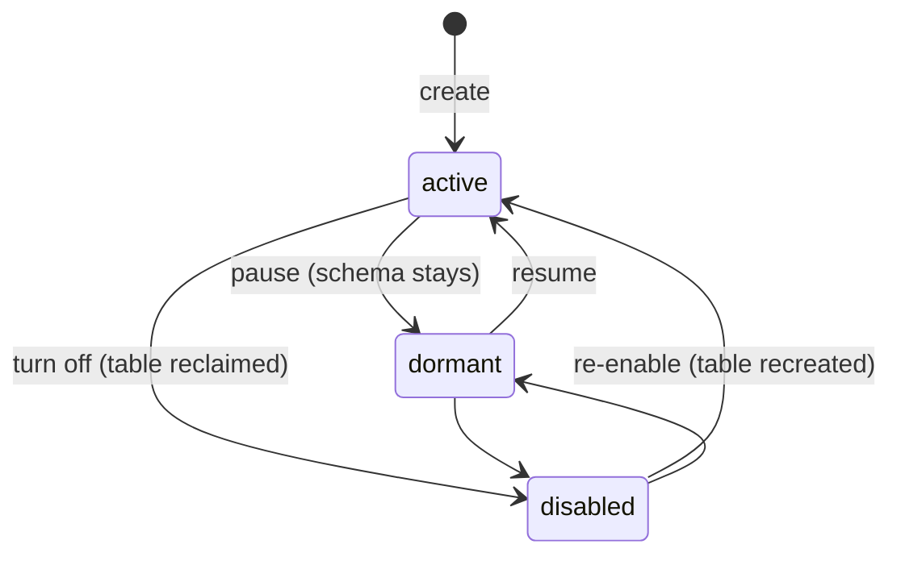

<!--
  Project:   dfe-engine
  File:      docs/data-plane/source-registry.md
  Purpose:   Source states, where the definitions are stored, CRUD, and the API surface
  License:   BUSL-1.1
  Copyright: (c) 2026 HYPERI PTY LIMITED
-->

# Storing and operating a source

Where a source definition lives, what its state means for the table and the
deployed apps, and the surface that changes it. The file itself is
[source-definition.md](source-definition.md).

## States

A source has a tri-state lifecycle, not a boolean toggle:

| State | Schema (table) | Receiver routing + transform | Receiver match |
|-------|----------------|------------------------------|----------------|
| `active` | materialised (idempotent CREATE) | on | held (conflict-checked) |
| `dormant` | retained -- pre-positioned, never dropped | off | held (conflict-checked -- it may activate later) |
| `disabled` | reclaimed (guarded DROP) | off | released -- another source may claim it |



Materialisation derives from the declared state alone: CREATE on active, LEAVE
on dormant, guarded RECLAIM on disabled. Creates are idempotent and a dormant
source's table is never dropped.

The deployed apps follow the same declaration. Every source write ends by
reconciling the deploy repo: the receiver's rules and the loader's table map
are recompiled from the active sources, and a fetcher-based source has a
fetcher instance named for it while it is active and deployed, and none
otherwise. The write reports what it changed (`apps_synced`); a failed
reconcile never fails the write, and `POST /api/v1/sources/reconcile-apps`
retries it.

`enabled` remains as a compat accessor: `enabled == (state == active)`. It is
serialised on API responses, and writes accept either field -- `state` wins
when both are sent, `enabled: true` maps to `active`, `enabled: false` to
`disabled`. A PUT that omits both keeps the existing state, so editing a
description never silently re-activates a dormant source. `PATCH
/api/v1/sources/{name}` changes the state without creating a new version.

## Where the definitions live

One YAML file per source, managed by `SourceRegistry` over two backends:

- **gitcrud** (preferred, active whenever gitops is enabled): the all-in-one
  source YAML IS the gitcrud doc in the deploy repo's `config/sources/`
  (ResourceClass `sources`). Every mutation is one git commit attributed to the
  caller, and the stored doc carries the universal gitcrud `metadata` block.
- **DirectoryConfigStore** (standalone fallback): a plain YAML directory as
  SSoT -- the same git-aware, cached, callback-driven store `ServiceConfigRegistry`
  uses.

```
# gitcrud backend                   # DirectoryConfigStore backend
<deploy_repo>/                      <config_directory>/
  config/                             sources/
    sources/                            filebeat.yaml
      filebeat.yaml                     syslog.yaml
      syslog.yaml                       ...
```

## What each operation does

| Operation | Effect |
|-----------|--------|
| **Create** | Validates the definition and updates receiver match rules. No topics, no DDL -- those land on deploy |
| **Create from catalogue** | Compiles one entry of a transform's shipped catalogue into that same write body -- the match rule or fetcher family for the intake chosen, the transform variant, and the shipped meta schema when one exists -- then takes the ordinary create path |
| **Deploy** | Runs the schema DDL, then creates that source's Kafka topics for the version being deployed |
| **Read** | Definition plus status overlay (topic exists, table exists, transform running) |
| **Update** | Validates, migrates the schema if fields changed, recompiles receiver and transform config |
| **Delete** | Removes the definition (one attributed git commit on the gitcrud backend) and the topics its deploys created; table and data preserved. To pause instead, set `state: dormant` or `disabled` |
| **List** | All sources with status overlay (healthy, degraded, disabled) |

**Topics are created on deploy.** DFE creates `<source>_land` (unless the source
lands on the shared topic, which the landing source owns) and
`<source>_load` when that version has a transform, rather than leaving them to
the broker's `auto.create.topics.enable`, which yields mis-partitioned
unmanaged topics and on Confluent Cloud non-Dedicated is not available at all.
The step never fails a deploy: the schema is already live, and a topic that
could not be created comes back in `topics_failed`. Width comes from
`DFE_KAFKA_TOPIC_PARTITIONS` and `DFE_KAFKA_TOPIC_REPLICATION_FACTOR`, and the
message size from `DFE_KAFKA_TOPIC_MAX_MESSAGE_BYTES`, the same size the
bootstrap topics carry. A
brokerless profile (`DFE_TRANSPORT_BUS_PRESENT=false`) skips it, since reaching
for a broker that is not there costs every deploy the admin timeout;
`DFE_KAFKA_ENSURE_TOPICS=false` turns it off where a broker does exist.

**And removed on delete.** The same dial governs both ends: a deployment whose
engine creates a source's topics also deletes that pair when the source is
deleted, because a topic nothing can write to still costs a partition assignment
in every loader. Deleting a topic destroys what is on it, so the removal is in
the audit record; turn `DFE_KAFKA_ENSURE_TOPICS` off to keep the topics and reap
them yourself.

## The API surface

Sources are the primary API entity (see
[ui-api-guide.md](../control-plane/ui-api-guide.md)):

```
GET    /api/v1/sources                  # List sources (paginated)
POST   /api/v1/sources                  # Create source (flat write body; views/transform/fetcher inline)
GET    /api/v1/sources/catalogue        # Sources a deployed transform already handles (filter: intake, search)
POST   /api/v1/sources/from-catalogue/{entry}  # Create a source from a catalogue entry on one of its intakes
GET    /api/v1/sources/{name}           # Get source (deployed-version accessors + state + enabled)
GET    /api/v1/sources/{name}/versions/{version}  # One immutable version snapshot
GET    /api/v1/sources/{name}/columns   # Composed schema columns for a version
POST   /api/v1/sources/{name}/build     # Build DDL from a source version
POST   /api/v1/sources/{name}/plan      # Dry-run deploy plan (not persisted)
POST   /api/v1/sources/{name}/deploy    # Apply plan DDL to ClickHouse, set deployed_version
PUT    /api/v1/sources/{name}           # Update source (bumps major version when a deployed pin changes)
PATCH  /api/v1/sources/{name}           # Set lifecycle state (state or enabled) - no new version
DELETE /api/v1/sources/{name}           # Delete the definition
POST   /api/v1/sources/bulk             # Bulk action: enable | disable | dormant | delete
POST   /api/v1/sources/seed             # Seed built-in sources (non-destructive)
```

Transform, fetcher and views are sections of the source write body, not
sub-resources. The global service configs (receiver, loader, archiver) live
under the service-config API and carry infrastructure concerns only -- their
per-source routing is compiled, and a hand edit to it is drift. Adding a data
source is one POST; the engine handles the topics, the DDL and the wiring.
