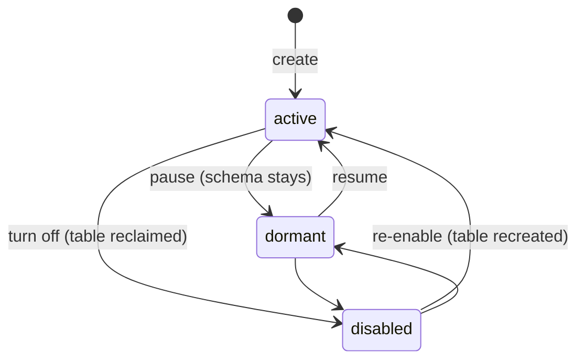

# Source - The Top-Level Data Abstraction

**Status:** Shipped (`SourceRegistry` + the Source model are the live path).

---

## Problem

Without a Source entity, routing a data source through the DFE pipeline
requires configuring four independent systems that have no shared concept of
"this is one source":

1. **Receiver** — field-match routing rules scattered in `category_to_topic`
2. **Transform** — separate vector/wasm source config with input/output topics
3. **Loader** — `category_to_table` routing with separate field lookups
4. **Schema** — per-table CSV definitions with no link back to the source

Adding a new data source (e.g. Filebeat, Syslog, CrowdStrike) means touching
all four systems independently and hoping the naming stays consistent. The API
and UI have no single entity to CRUD — they operate on disconnected config
fragments.

## Solution

Introduce **Source** as the top-level entity that the entire pipeline,
API, and UI revolve around.

A Source is a **data source** — a distinct stream of events entering the
platform (e.g. `filebeat`, `syslog`, `crowdstrike_edr`, `windows_audit`).
Everything flows from the source label.

---

## Two-Tier Architecture

The DFE platform splits cleanly into two tiers:

### Global Services (infrastructure — shared across all sources)

| Service | Role | Configured once |
|---------|------|-----------------|
| **receiver** | HTTP/gRPC ingestion, match routing, `_source` injection | Yes — one receiver config handles all sources |
| **loader** | Kafka → ClickHouse, schema-aware insert | Yes — one loader config handles all sources |
| **archiver** | Kafka → S3/file archive | Yes — one archiver config handles all sources |

These are infrastructure services. They scale horizontally but their
configuration is **not per-source** — a single receiver handles every source
via its match table.

### Source (data — one per data stream)

A Source **contains** all source-scoped components:

| Component | Required | Purpose |
|-----------|----------|---------|
| **identity** | Yes | `_source` label, display name |
| **origin** | Yes | Exactly one of a receiver `match` rule or a `fetcher` |
| **schema** | Yes | ClickHouse table definition (starts as common header only). See [SCHEMA.md](schema.md) |
| **transform** | No | Enrichment/normalisation stage (vector or wasm) |
| **rules** | No | SQL detection queries against this source's table |
| **views** | No | Naming-standard views (sigma, ecs, cim, ocsf) with per-source field overrides |

Instead of configuring fetchers, transforms, schemas, and detection rules
as independent systems, they are **nested inside the Source they belong to**.
The API and UI revolve around Sources — not around services.

```
Global (configure once)         Source (one per data stream)
┌─────────────────────┐         ┌─────────────────────────────┐
│ receiver            │         │ source: filebeat            │
│ loader              │         │   ├── match rule            │
│ archiver            │         │   ├── schema (mandatory)    │
└─────────────────────┘         │   ├── transform (optional)  │
                                │   ├── rules (optional)      │
                                │   └── views (optional)      │
                                ├─────────────────────────────┤
                                │ source: crowdstrike-edr     │
                                │   ├── fetcher (no match)    │
                                │   ├── schema (mandatory)    │
                                │   ├── transform (optional)  │
                                │   └── rules (optional)      │
                                ├─────────────────────────────┤
                                │ source: syslog              │
                                │   ├── match rule            │
                                │   ├── schema (mandatory)    │
                                │   └── rules (optional)      │
                                └─────────────────────────────┘
```

---

## Source Definition

```yaml
# Example: sources/filebeat.yaml
source: filebeat                        # The _source label — immutable identifier
display_name: Filebeat
description: Elastic Filebeat log collector
state: active                           # Lifecycle: active | dormant | disabled (see Lifecycle)

# --- Header ---
# Common schema header. When a source is first created, the schema starts
# as JUST this header — the common fields for the selected type + version.
# Source-specific fields are added incrementally.
header:
  type: timeseries                      # Profile name (timeseries, minimal, passthrough)
  version: 1.0.0                        # Common header version (semver)

# --- Origin: receiver match OR fetcher (exactly one) ---
# A receiver-based source is identified by the always-present receiver pool:
# the receiver evaluates match rules and sets _source in the JSON payload.
match:
  field: tags.collector.type            # JSON field to inspect
  operator: equals                      # equals (default) | exists - the receiver-evaluable set
  value: filebeat                       # Operand (unused when operator is exists)
  # The model also defines not_equals / includes / starts_with / ends_with,
  # but the receiver's hot-path router cannot evaluate them (a documented
  # receiver gap) - saves reject them for any non-disabled source.

# A fetcher-based source has no match rule. The engine deploys one dfe-fetcher
# instance named for the source, with this stanza compiled into it, when the
# source is active and deployed, and removes it when the source is not.
# fetcher:
#   source_type: okta                   # A family the deployed fetcher ships (apps.yaml source_types)
#   topic: own                          # own: this source's topic and table | default: the platform default table
#   config:                             # The fetcher's own per-type stanza, verbatim
#     tenant_url: https://example.okta.com
#     credential_secret: vault:secret/dfe/okta:token   # credentials are env:/vault: references, never literals
#     services:
#       - name: system_log
#     interval_secs: 300

# --- Topics (derived, not configured) ---
# topic_land: filebeat_land             # Auto: {_source}_land
# topic_load: filebeat_load             # Auto: {_source}_load (only if transform exists)

# --- Transform (optional) ---
# If present, data flows: _land → transform → _load
# If absent, data flows: _land → loader directly
transform:
  engine: vector                        # vector | wasm
  config_file: /etc/vector/filebeat.yaml
  # engine-specific fields follow the existing VectorSourceConfig / WasmSourceConfig
  env: {}                               # Per-transform ENV overrides
  files: []                             # Enrichment files (CSV, MMDB)

# --- Views (optional) ---
# Naming-standard views this source exposes (sigma, ecs, cim, ocsf).
# One entry per standard; inline custom_mappings WIN over the field_map pin.
views:
  - standard: sigma
    field_map: sigma/windows            # FieldMap registry pin ("standard/name" or bare name)
    taxonomy: windows                   # Sigma logsource product binding (sigma views only)
    custom_mappings:                    # Per-source overrides (win over field_map)
      CommandLine: command_line

# --- Schema (mandatory) ---
# The source owns its ClickHouse table schema.
# One source = one table = one schema.
# On creation, the schema is just the common header for the selected type+version.
# Source-specific fields are added over time.
schema:
  meta_schema: logs_beats_filebeat      # Base field definitions (YAML)
  meta_schema_version: 1.0.0
  derived_schema: filebeat/derived      # Source-specific field overrides (optional)
  additional_fields: filebeat/add       # Extra fields, indexes (optional)
  ttl_days: 90                          # Data retention
  engine: MergeTree                     # Base variant only (MergeTree, ReplacingMergeTree(...), ...)
                                        # Topology (Replicated/Shared/Cloud) resolves at DDL time
```

`ttl_days` is optional. A source that leaves it unset gets the deployment
default (`DFE_CLICKHOUSE_DEFAULT_TTL_DAYS`, 90 days shipped, 0 = none); a
value here wins over that default and over the table's dfe-schemas
definition. The next schema apply moves an existing table onto a changed
value with `ALTER TABLE ... MODIFY TTL`, and shortening it expires the rows
older than the new value.

The legacy 2.1 keys `sigma`, `mapping_standards`, and `field_mappings` were
removed in 2.2 - writes carrying them are rejected with a "removed in 2.2"
error. Declare naming-standard views via the `views` list instead.

### Minimal Source (just match + common header)

A source can be created with almost nothing — the schema starts as just the
common header fields for the selected type:

```yaml
source: syslog
display_name: Syslog
match:
  field: tags.collector.type
  value: syslog
header:
  type: timeseries
  version: 1.0.0
schema:
  ttl_days: 90
```

No fetcher, no transform. The receiver matches and routes to `syslog_land`,
the loader picks it up and inserts into `{db}.syslog` using the common
timeseries header schema. Fields can be added incrementally later.

---

## Lifecycle

A source has a tri-state lifecycle (`state`), not a boolean toggle:

| State | Schema (table) | Receiver routing + transform | Receiver match |
|-------|----------------|------------------------------|----------------|
| `active` | Materialised (idempotent CREATE) | On | Held (conflict-checked) |
| `dormant` | Retained - pre-positioned, never dropped | Off | Held (conflict-checked - it may activate later) |
| `disabled` | Reclaimed (guarded DROP) | Off | Released - another source may claim it |



Materialisation derives from the declared state alone (gitops-declarative):
CREATE on active, LEAVE on dormant, guarded RECLAIM on disabled. Creates are
idempotent and a dormant source's table is never dropped.

The deployed apps follow the same declaration. Every source write ends by
reconciling the deploy repo: the receiver's rules and the loader's table map
are recompiled from the active sources, and a fetcher-based source has a
fetcher instance named for it while it is active and deployed, and none
otherwise. The write reports what it changed (`apps_synced`); a failed
reconcile never fails the write, and `POST /api/v1/sources/reconcile-apps`
retries it.

`enabled` remains as a compat accessor: `enabled == (state == active)`. It is
serialised on API responses, and writes accept either field - `state` wins
when both are sent, `enabled: true` maps to `active`, `enabled: false` to
`disabled`. A PUT that omits both keeps the existing state (editing a
description never silently re-activates a dormant or disabled source).
`PATCH /api/v1/sources/{name}` changes the state without creating a new
source version.

---

## The `_source` Label

The `_source` label is the **single identifier** that ties everything together.
It is a fixed, lowercase, hyphen-separated string (e.g. `filebeat`,
`crowdstrike-edr`).

The receiver **sets `_source` in the JSON payload** at ingestion time. From
that point, everything is derived automatically:

```
_source = "filebeat"

Kafka topics:
  filebeat_land     — raw data from receiver
  filebeat_load     — transformed data (only if transform exists)

ClickHouse:
  Table: {db}.filebeat
  _source column value: "filebeat"
```

### Naming Rules

- A Kubernetes DNS-1123 label starting with a letter: `[a-z]([a-z0-9-]*[a-z0-9])?`
- Hyphens, never underscores. A source-bound app (a transform, a fetcher) deploys
  one instance per source named for the source, and that name becomes an Argo
  Application and a set of Kubernetes object names, so the source charset has to
  be a subset of what a label allows.
- Max 40 characters, the same cap the instance name carries
- Must be unique across all sources

A hyphenated name has to be quoted in a ClickHouse identifier position. The DDL
generator does not quote it yet, so a hyphenated source cannot have its table
DDL generated -- see `schema/schema_ddl.py`.

---

## Data Flow

### With Transform

```
Data Source (e.g. Filebeat agent)
  │
  ▼
Receiver
  │  Matches: tags.collector.type == "filebeat"
  │  Sets: _source = "filebeat"
  │  Produces to: filebeat_land
  │
  ▼
Kafka: filebeat_land
  │
  ▼
Transform (vector or wasm)
  │  Consumes: filebeat_land
  │  Enriches, normalises, maps fields
  │  Produces to: filebeat_load
  │
  ▼
Kafka: filebeat_load
  │
  ▼
Loader
  │  Consumes: filebeat_load
  │  Routes by _source → {db}.filebeat table
  │  Applies schema, coercion, metadata injection
  │
  ▼
ClickHouse: {db}.filebeat
```

### Without Transform (direct load)

```
Data Source
  │
  ▼
Receiver
  │  Sets: _source = "syslog"
  │  Produces to: syslog_land
  │
  ▼
Kafka: syslog_land
  │
  ▼
Loader
  │  Consumes: syslog_land
  │  Routes by _source → {db}.syslog table
  │
  ▼
ClickHouse: {db}.syslog
```

When no transform is configured for a source, the loader consumes directly
from `{_source}_land`. The `_load` topic is never created.

---

## How the Receiver Routes

The engine compiles Source `match` rules into the dfe-receiver's native
`routing` contract (`compile_receiver_routing` emits the exact serde the
receiver deserialises - `SourceRule`/`RoutingConfig` in the receiver's
`src/config/mod.rs`):

1. The engine iterates ACTIVE sources (dormant and disabled are excluded)
2. Each `match` becomes one `source_rules` entry - first match wins
3. A matching rule stamps `_source` in the JSON payload
4. Topic = `source_to_topic[_source]` if overridden, else `{_source}{topic_suffix}`
5. Unmatched events get `default_source`

```yaml
routing:
  source_rules:                   # Compiled from Source.match, first match wins
    - field: tags.collector.type  # JSON field path (dot notation for nested)
      mode: key_value_set         # key_present | key_value_set | key_value_use
      match_value: filebeat       # key_value_set only
      source: filebeat            # _source to stamp
  default_source: default         # _source when no rule matches
  topic_suffix: _land             # Topic derives as {_source}{topic_suffix}
  source_to_topic: {}             # Per-source topic overrides (rarely needed)
```

Operator translation:

| Source `match.operator` | Receiver `mode` |
|-------------------------|-----------------|
| `equals` | `key_value_set` |
| `exists` | `key_present` |

The other four operators (`not_equals`, `includes`, `starts_with`,
`ends_with`) have no receiver mode - a documented receiver gap. The registry
rejects them at save time for any non-disabled source; if a legacy stored doc
still carries one, the compile skips that source with a loud warning rather
than failing the whole receiver config.

The `_source` field becomes a **first-class field in every event**, injected
by the receiver before the data hits Kafka. Downstream services (transform,
loader) consume it directly — no independent routing config needed. Match
rules come from the Source definitions, not from hand-written receiver
config.

---

## How the Loader Routes

The loader takes the target table from the first `table_fields` hit, and its
default is `_source` — the very field the receiver stamps. So the two halves
meet with no lookup at all:

1. Loader reads `_source` from the JSON payload (set by receiver)
2. `_source` is the target table: `{default_db}.{_source}`
3. `source_to_table` only carries the sources whose table name differs
4. Schema for that table is defined in the Source definition

```yaml
# The compiled loader block (dfe-loader RoutingConfig):
routing:
  table_fields: [_source]         # The field the receiver stamped
  default_db: dfe                 # Database (or per-org via db_fields + org_routes)
  default_table: default          # Where an event with no _source lands
  source_to_table: {}             # ACTIVE sources whose table name differs
```

Every key the engine emits must exist in dfe-loader's `RoutingConfig`
(`src/config/pipeline.rs`): serde drops an unknown key without complaint, so an
invented one silently leaves the loader on its own default. The engine model is
pinned to that struct by a test that reads the Rust source.

---

## Schema Ownership

Each Source owns exactly one ClickHouse table schema. The relationship is 1:1:

```
Source: filebeat
  └── Schema: logs_beats_filebeat
        ├── meta_schema.yaml       (base columns, types, use cases)
        ├── derived_schema.yaml    (source-specific overrides)
        └── additional_fields.yaml (enrichment fields)
```

The global **type registry** (`type_registry.yaml`) maps primitives to
ClickHouse types — it's shared across all sources, not per-source.

The schema section in the Source definition feeds directly into the existing
`SchemaBuilder` / `ClickHouseSchema` pipeline. The only change is that schema
lifecycle (create, migrate, drop) is triggered from the Source, not from a
standalone schema config.

### Schema Metadata

Schema definitions are YAML. See [SCHEMA.md](schema.md) for the full
type system, primitive-to-ClickHouse mapping, and use case definitions.

```yaml
# meta_schema.yaml example (excerpt)
columns:
  - name: user_name
    type: string
    use_case: dimension
    comment: "@source: first(user_id/uid/id)"
  - name: source_ip
    type: ip
    use_case: range
    comment: "@source: src_ip"
  - name: severity
    type: string
    attribute: lowcardinality
    use_case: dimension
  - name: message
    type: text
    use_case: fulltext
```

Loader directives in the `comment` field are preserved through to
ClickHouse column comments in DDL.

### Schema Lifecycle

| Source Event | Schema Action |
|-------------|---------------|
| Source created / active | `CREATE TABLE IF NOT EXISTS` (idempotent) |
| Schema YAML updated | `ALTER TABLE` via SchemaModifier (add/modify columns) |
| Source dormant | No action - table retained, pre-positioned for reactivation |
| Source disabled | Guarded reclaim - the table is dropped behind the caller's guard |
| Source deleted | Table retained (data preservation) — manual DROP if needed |

---

## Source Registry

Sources are managed as YAML files - one file per source - by
`SourceRegistry`, which has two storage backends:

- **gitcrud** (preferred - active whenever gitops is enabled): the
  all-in-one source YAML IS the gitcrud doc in the deploy repo's
  `config/sources/` (ResourceClass `sources`). Every mutation is one git
  commit, attributed to the caller, and the stored doc carries the universal
  gitcrud `metadata` block.
- **DirectoryConfigStore** (standalone fallback): a plain YAML directory as
  SSoT - the same git-aware, cached, callback-driven store used by
  `ServiceConfigRegistry`.

```
# gitcrud backend                   # DirectoryConfigStore backend
<deploy_repo>/                      <config_directory>/
  config/                             sources/
    sources/                            filebeat.yaml
      filebeat.yaml                     syslog.yaml
      syslog.yaml                       ...
      ...
```

### CRUD Operations

| Operation | Effect |
|-----------|--------|
| **Create** | Validates the source definition and updates receiver match rules. No topics, no DDL - those land on deploy |
| **Deploy** | Runs the schema DDL, then creates that source's Kafka topics for the version being deployed |
| **Read** | Returns source config + status (topic exists, table exists, transform running) |
| **Update** | Validates changes, applies schema migration if fields changed, updates receiver/transform config |
| **Delete** | Removes the source definition (one attributed git commit on the gitcrud backend); table + data preserved. To pause instead, set `state: dormant` or `disabled` |
| **List** | All sources with status overlay (healthy, degraded, disabled) |

**Topics on deploy.** DFE creates `<source>_land` (and `<source>_load` when that
version has a transform) rather than leaving them to the broker's
`auto.create.topics.enable`, which yields mis-partitioned unmanaged topics and on
Confluent Cloud non-Dedicated is not available at all. The topic step never fails
a deploy: the schema is already live by then, and any topic that could not be
created comes back in `topics_failed` on the response. Width comes from
`DFE_KAFKA_TOPIC_PARTITIONS` / `DFE_KAFKA_TOPIC_REPLICATION_FACTOR`. On the
Kafka-less profile (receiver -> loader over direct gRPC) set
`DFE_KAFKA_ENSURE_TOPICS=false` - there is no broker, and leaving it on costs
every deploy the admin timeout before it gives up.

### Validation Rules

- `_source` label must be unique
- `_source` label must match naming rules (`[a-z]([a-z0-9-]*[a-z0-9])?`, max 40 chars)
- Match rules must not conflict across non-disabled sources (same
  field+operator+value); a dormant source HOLDS its match, only disabling
  releases it
- Match operator must be receiver-evaluable (`equals` or `exists`) for any
  non-disabled source
- If transform is specified, engine must be `vector` or `wasm`
- Schema YAML files must exist and pass SchemaBuilder validation
- Schema must include `_source` as a column (injected if missing)

---

## What Changes

### Global services (receiver, loader, archiver)

These services get **simpler** — their per-source routing config is replaced
by the Source registry:

| Service | Before (per-service config) | After (source-driven) |
|---------|---------------------------|----------------------|
| **Receiver** | `routing.category_to_topic` dict | Compiled `routing.source_rules` from Source definitions |
| **Loader** | `routing.category_to_table` dict | `_source` field → `{db}.{_source}` table (direct) |
| **Archiver** | No change | No change (archives all topics) |

Global service configs still own infrastructure concerns: Kafka brokers,
ClickHouse connection, TLS, SASL, buffer sizes, KEDA scaling. Source-specific
routing moves out.

### Source-scoped components (fetcher, transform, schema)

These move **into the Source definition** — no longer configured as
standalone service-level sources:

| Before | After |
|--------|-------|
| `transform-vector` service config with `sources: [...]` list | Each Source's `transform:` section (if needed) |
| `transform-wasm` service config with `sources: [...]` list | Each Source's `transform:` section (if needed) |
| `fetcher` service config with `sources: [...]` list | Each Source's `fetcher:` section (if needed) |
| Standalone schema definitions in `dfe_package.yaml` | Each Source's `schema:` section (mandatory, YAML) |

The service-level config for transform/fetcher reduces to just infrastructure:
Kafka brokers, resource limits, IPC settings. The per-source config (what to
transform, what to fetch) lives in the Source.

### dfe-engine (this repo)

- New `Source` Pydantic model + `SourceRegistry` (CRUD, validation, git-backed)
- Schema lifecycle tied to Source (create/migrate on source change)
- Config generators: Source definitions → receiver match table, loader routing,
  transform source entries, fetcher source entries
- Sources become the primary entity for the API and UI

### API and CLI surface (shipped in this repo)

The control-plane surface landed IN the engine (the separate
dfe-control-plane repo was retired before it existed):

- REST API and CLI expose Sources as the primary entity
- Source CRUD endpoints replace per-service config editing for routing
- UI navigates by Source - not by service

---

## Relationship to Services

### Two tiers, not two systems

**Global services** (receiver, loader, archiver) are infrastructure —
configured once, shared across all sources. Their configs define *how*
(scaling, resources, connection strings, Kafka brokers).

**Sources** define *what* — each data stream and its scoped components
(fetcher, transform, schema). A source's fetcher and transform are
**contained within the source**, not managed as standalone service instances.

```
                    Global (shared infra)
                    ┌──────────────────────┐
                    │ receiver-1           │◄── all match rules from sources
                    │ loader-1             │◄── all _source → table mappings
                    │ archiver-1           │◄── all topics
                    └──────────────────────┘

Source: filebeat                Source: crowdstrike_edr        Source: syslog
┌────────────────────┐          ┌────────────────────┐        ┌─────────────────┐
│ match: tags...=fb  │          │ match: tags...=cs  │        │ match: tags...  │
│ schema: timeseries │          │ fetcher: oauth2    │        │ schema: timeser │
│ transform: vector  │          │ schema: timeseries │        │ (no transform)  │
└────────────────────┘          │ transform: vector  │        │ (no fetcher)    │
  filebeat_land ──▶ transform   └────────────────────┘        └─────────────────┘
  filebeat_load ──▶ loader        cs_edr_land ──▶ transform     syslog_land ──▶ loader
                                  cs_edr_load ──▶ loader
```

### How source components map to service instances

Source-scoped fetchers and transforms are **logical config** — they describe
what needs to happen. The actual execution happens on shared service instances:

| Source component | Runs on | How |
|-----------------|---------|-----|
| `source.match` | Global receiver | Compiled into receiver `source_rules` |
| `source.fetcher` | Shared fetcher instance(s) | Fetcher loads source configs, polls each |
| `source.transform` | Shared transform instance(s) | Transform loads source configs, processes each |
| `source.schema` | dfe-engine | Schema DDL generated and applied by engine |
| `source.rules` | Hunt scheduler | SQL queries executed on cron, matches → alerts |
| `source.views` | dfe-engine | Generates naming-standard compatibility views (sigma, ecs, cim, ocsf) |

A single transform-vector deployment may process transforms for 20 different
sources. The source definition says *this source needs a vector transform
with this config* — the deployment layer decides *which transform instance
runs it*.

---

## Rules

A **Rule** is a SQL detection query tied to a Source. It runs against the
source's ClickHouse table and produces matches (detections).

```yaml
# rules/brute_force_login.yaml
rule: brute_force_login
source: windows_audit                   # Tied to this source's table
display_name: Brute Force Login Attempt
severity: high

query: |
  SELECT
    _timestamp,
    _org_id,
    user_name,
    source_ip,
    count() AS attempt_count
  FROM {db}.{source}
  WHERE event_id = 4625
    AND _timestamp >= {from}
    AND _timestamp < {to}
  GROUP BY _timestamp, _org_id, user_name, source_ip
  HAVING attempt_count >= {threshold}

parameters:
  threshold: 5

schedule: "*/5 * * * *"                 # Cron schedule for hunt execution
```

Rules reference `{db}`, `{source}`, `{from}`, `{to}` — templated at
execution time. The rule's SQL runs against the source's table, so it
has access to exactly the columns defined in the source's schema.

---

## Hunts

A **Hunt** is a scheduled batch execution of Rules. Hunt results
(matches/detections) are written to the **alerts table**.

```
Rule (SQL query tied to a Source)
  │
  ▼
Hunt Scheduler (cron)
  │  Expands {from}/{to} time window
  │  Runs rule SQL against {db}.{source}
  │
  ▼
Matches (detection results)
  │
  ▼
Alerts Table ({db}.alerts)
  │  Common header (timeseries profile)
  │  + rule_name, severity, source, match_data
```

The alerts table is itself a Source (`_source = "alerts"`) with
`header.type: timeseries`. This gives it the same schema management,
retention, and query capabilities as any other source — including the
ability to write rules against alerts (meta-detection / correlation).

---

## Sigma

Sigma rules reference fields by standardised names (`SourceIP`,
`CommandLine`, `EventID`). Rather than embedding Sigma names in the base
schema, each source can have a **Sigma compatibility view**:

```sql
-- Auto-generated from source schema + sigma field mapping
CREATE VIEW {db}.{source}_sigma AS
SELECT
    source_ip AS SourceIP,
    dest_ip AS DestinationIP,
    user_name AS User,
    command_line AS CommandLine,
    event_id AS EventID,
    *
FROM {db}.{source}
```

Sigma rules query the view (standard field names). The base schema stays
ClickHouse-native. The mapping is per-source — different sources map
differently. Zero storage overhead.

```yaml
# In source definition (a views entry with standard: sigma)
views:
  - standard: sigma
    taxonomy: windows                   # Sigma logsource product binding
    custom_mappings:                    # Per-source overrides (win over field_map)
      CommandLine: command_line
      ParentCommandLine: parent_cmd
```

Converted Sigma rules become DFE Rules tied to the source, querying the
`{source}_sigma` view. See [SCHEMA.md](schema.md) for details.

---

## Elastic Index Template Converter

The existing Elastic/OpenSearch index template converter generates a source
schema from a supplied Elastic template JSON. This is the primary onboarding
path for migrating from Elastic:

```
Elastic Template JSON → Converter → Source schema YAML → Source definition
```

The converter maps Elastic types to primitives, Elastic analyzers to
use_cases, and preserves the field hierarchy as flat columns. See
[SCHEMA.md](schema.md) for the type mapping table.

This is tied to a Source — when creating a source from an Elastic data
stream, the converter bootstraps the schema so the user doesn't start from
scratch.

---

## API / UI Model

Sources are the primary API entity. The shipped surface
(see [ui-api-guide.md](../control-plane/ui-api-guide.md)):

```
GET    /api/v1/sources                  # List sources (paginated)
POST   /api/v1/sources                  # Create source (flat write body; views/transform/fetcher inline)
GET    /api/v1/sources/{name}           # Get source (deployed-version accessors + state + enabled)
GET    /api/v1/sources/{name}/versions/{version}  # One immutable version snapshot
GET    /api/v1/sources/{name}/columns   # Composed schema columns for a version
POST   /api/v1/sources/{name}/build     # Build DDL from a source version
POST   /api/v1/sources/{name}/plan      # Dry-run deploy plan (not persisted)
POST   /api/v1/sources/{name}/deploy    # Apply plan DDL to ClickHouse, set deployed_version
PUT    /api/v1/sources/{name}           # Update source (bumps major version when a deployed pin changes)
PATCH  /api/v1/sources/{name}           # Set lifecycle state (state or enabled) - no new version
DELETE /api/v1/sources/{name}           # Delete the definition
POST   /api/v1/sources/bulk             # Bulk action: enable | disable | dormant | delete
POST   /api/v1/sources/seed             # Seed built-in sources (non-destructive)
```

Transform, fetcher, and views are sections of the source write body, not
sub-resources. Global service configs (receiver, loader, archiver) live
under the service-config API - they carry infrastructure concerns only, the
per-source routing is compiled from Source definitions.

The day-to-day workflow revolves around Sources. Adding a new data source is
one POST. The engine handles topic creation, schema DDL, and wiring.

---

## Migration Path

The Source model landed incrementally, without Rust rewrites:

1. **Source model + registry** in dfe-engine (Python). Sources as YAML SSoT
   (gitcrud deploy-repo backend, DirectoryConfigStore fallback). Schema
   lifecycle wired to source state.
2. **Control-plane API** exposes Source CRUD; the UI is built around Sources.
3. **Compiled routing** - the engine emits the receiver's NATIVE `routing`
   serde (`source_rules`) and the loader's NATIVE `RoutingConfig` from
   Source definitions, so the Rust services deserialise what they always
   deserialised. No service-side migration.

The 2.1 per-source keys (`sigma`, `mapping_standards`, `field_mappings`) were
a clean break in 2.2, not a deprecation - writes carrying them are rejected.
