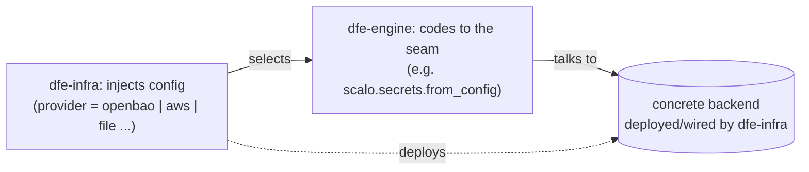
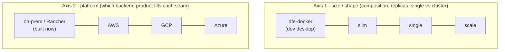
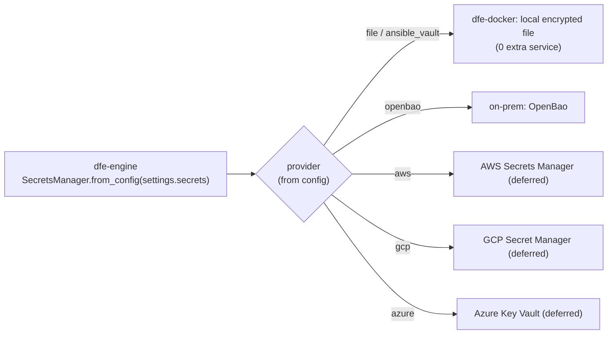
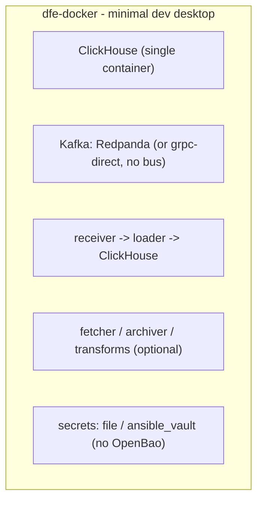

<!--
  Project:   dfe-engine
  File:      docs/deployment/backing-services.md
  Purpose:   DFE backing services - every backend swaps at a seam
  License:   BUSL-1.1
  Copyright: (c) 2026 HYPERI PTY LIMITED
-->

# DFE Backing Services - swap every backend at a seam

DFE is a generic product that ships into clusters we never touch. So every backing
service it stands on - the secrets store, the streaming bus, the object store, the
load balancer, the IdP - has to be swappable without rewriting the product. This
document is the itemised list of those backing services, the seam each one swaps
at, and which concrete backend fills that seam per target.

("Backing services" is the Twelve-Factor term: attached resources treated as
swappable, bound by config, never hardcoded.)

## The one rule

**Every backing service has its own seam, so each swaps without touching the others
or the engine.** There is no monolithic "on-prem build" vs "cloud build" - there is
a per-service choice, and any mix is valid ("hybrid" is not a special case, it is
just picking cells from different columns).

Two ownership lanes, applied to every backing service:

- **dfe-infra** deploys or wires the concrete backend, and injects the config that
  selects it.
- **dfe-engine** codes only to the seam (a standard interface + config), never to a
  named product.

## Design FOR, build WITH (on-prem only, now) - strict YAGNI

- **Design FOR** the swap: pick a seam that is *already* a standard, multi-backend
  interface (scalo.secrets, the S3 API, OTel, the cert-manager Issuer, the k8s
  Gateway API, Argo). Choosing the standard interface and not hardcoding a product
  IS most of the design work - there is almost no bespoke abstraction to build.
- **Build WITH** on-prem only, now: implement and wire just the on-prem column. The
  cloud cells are real seams with deferred implementations - we fill them when we
  actually do AWS, then GCP, then Azure, not before.
- **YAGNI**: no speculative plugin framework, no factory-of-factories, no cloud code
  paths for clouds we have not built. The seam is the thinnest thing that makes the
  swap a *config* change.
- **The engine carries no per-cloud branches.** Any `if aws: ... elif gcp: ...`
  belongs in dfe-infra config/wiring, never in dfe-engine. The engine stays
  platform-agnostic; the exception handling lives where the platform is known.

## Two axes (do not conflate them)

Size and platform are orthogonal. Size sets *composition*; platform sets *which
product* fills each seam.

- **Size** = the three dfe-infra profiles (`argocd/values/profile-slim|single|scale.yaml`)
  plus the non-k8s `dfe-docker`. It changes replica counts, single-node vs cluster,
  which optional apps run - not which product a seam binds to.
- **Platform** = the swap dimension (`argocd/values/local|aws|gcp|azure.yaml`).
  `terraform/environments/` has only `local` today: on-prem is the one built target.

## The matrix

Rows are backing services; the seam is what the engine/infra codes to; the platform
columns are the concrete backend. On-prem is built now; cloud cells are seam-ready,
implementation deferred (YAGNI).

| Backing service | Seam | on-prem / Rancher (now) | AWS | GCP | Azure | dfe-docker |
|---|---|---|---|---|---|---|
| Cluster / compute | k8s API | RKE2 / Rancher | EKS | GKE | AKS | single host |
| Secrets | `scalo.secrets` provider | **OpenBao** | Secrets Manager | Secret Manager | Key Vault | `file` / `ansible_vault` |
| Data store (CH) | CH gateway + `effective_data_database` | DFE CH (single/cluster) | ClickHouse Cloud / self-mgd | ClickHouse Cloud / self-mgd | ClickHouse Cloud / self-mgd | CH container |
| Streaming | `scalo.kafka` | Strimzi / Redpanda | MSK / Confluent | Confluent / Pub-Sub bridge | Event Hubs (Kafka API) | Redpanda (or grpc-direct) |
| Object store | S3 API | MinIO | S3 | GCS | Blob | MinIO / local FS |
| Auth / IdP | `X-Oidc-*` header contract | Keycloak / Authentik / local | Cognito | Google Identity | Entra ID | local-auth / oauth2-proxy |
| Ingress / LB | Gateway API / Service | MetalLB + Envoy Gateway | ALB / NLB | GCLB | Azure LB / App Gateway | host ports / Caddy |
| TLS / PCA | cert-manager Issuer | cert-manager + OpenBao PKI | ACM / Private CA | Google-managed / CAS | Key Vault / App Gateway certs | self-signed / mkcert |
| GitOps repo | git remote URL | in-cluster Forgejo | CodeCommit / keep Forgejo | keep Forgejo | keep Forgejo | local git / bind-mount |
| Reconciler (CD) | Argo Application / AppSet | Argo CD | Argo CD | Argo CD | Argo CD | compose render (none) |
| Registry | OCI ref | Harbor | ECR | GAR | ACR | Docker Hub / local |
| Block storage | StorageClass | Longhorn / local-path | EBS | PD | Azure Disk | docker volumes |
| DNS | external-dns / zone | CoreDNS / devex DNS | Route 53 | Cloud DNS | Azure DNS | /etc/hosts |
| Observability sink | OTel exporter -> dest | HyperDX + CH | HyperDX (keep) or CloudWatch | HyperDX (keep) or Cloud Monitoring | HyperDX (keep) or Azure Monitor | HyperDX / console |

Priority backing services for the first swap passes (per Derek): secrets, DNS,
PCA/TLS, k8s, Kafka, ClickHouse. The rest are mostly dfe-infra config with little or
no engine code.

## Worked seam - secrets (the pattern for all of them)

The engine builds one manager from config and never names a product. dfe-infra sets
the provider per target. This is the whole trick, applied to every row above.

Secrets decisions (settled): OpenBao everywhere on k8s (external-first, in-cluster
Layer-0 fallback, joins the existing bootstrap stage; static-key auto-unseal), ESO
projects to a short-lived k8s Secret cache with etcd encryption on, cloud swaps to
the managed manager. dfe-docker uses the `file`/`ansible_vault` provider - no
OpenBao, ~0 added memory. The engine's mint/write path moves off the local dir onto
`scalo.secrets` (this is the Class B gitops-authority fix).

## The dfe-docker special case - keep it small

dfe-docker is the primary developer-desktop use case and is Kaz's repo (changes go
via branch + PR). It must stay as small as possible: it is never production, so
every seam takes its lightest backend - no OpenBao, no ESO, no Argo, no HyperDX
dependency unless a dev opts in.

Levers that keep it small: Redpanda over Strimzi (or grpc-direct to skip the bus
entirely), single-node ClickHouse, the `file` secrets provider, host ports instead
of a gateway, self-signed TLS. Adding a heavier backend to dfe-docker is a smell -
push weight to the k8s profiles, not the desktop.

## Build order + seam status

| Backing service | Seam status | Now (on-prem) | Deferred (cloud) |
|---|---|---|---|
| Secrets | ready (scalo.secrets) - engine mint-path rewrite pending | OpenBao / file | aws/gcp/azure providers |
| ClickHouse | partial - the CH gateway consolidation is the seam | DFE CH modes | Cloud endpoints |
| Kafka | ready (scalo.kafka) | Strimzi / Redpanda | MSK / Confluent / Event Hubs |
| Object store | ready (S3 API) | MinIO | S3 / GCS / Blob |
| Auth / OIDC | ready (X-Oidc-* contract) | Keycloak / local | cloud IdPs |
| Ingress, TLS, DNS, storage, registry, reconciler | ready (standard k8s interfaces) | on-prem wiring | cloud wiring in dfe-infra |
| Observability | ready (OTel exporter) | HyperDX + CH | keep HyperDX or cloud sink |

Only two rows need real engine work: the ClickHouse gateway (the consolidation that
also carries RBAC + audit) and routing the secrets mint-path through scalo.secrets.
Everything else is "use the standard interface + dfe-infra config".

## Next - reduce swap complexity and exception handling

With the seams itemised, the follow-on work is to drive down the cost of a swap:
keep every swap a config change, not a code branch; centralise the few genuine
per-platform exceptions in dfe-infra values, not in dfe-engine; and delete any
existing per-product coupling that bypasses a seam. That design pass is tracked
separately.
