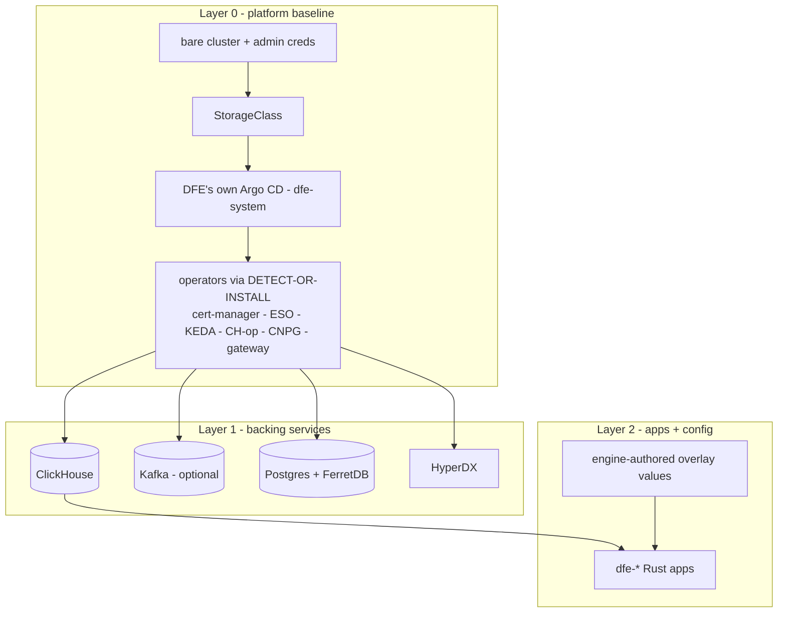

# Deployment seam

How DFE gets onto a cluster and how the engine's dials reach it. The engine
never deploys backing services and never authors Argo Applications - it
writes config, DDL, and overlay values into the deploy repo; dfe-infra's
charts and ApplicationSets do the deploying. This page carries the layered
model, the tiers, the deploy-repo providers, the backing-service modes, and
the network model. The system map is [../architecture.md](../architecture.md).

## Documents in this area

| Doc | Covers |
|---|---|
| [backing-services.md](backing-services.md) | per-backend swap-seam matrix |
| [transports.md](transports.md) | profile x transport, the Kafka provider swap, the mesh tier's Envoy balancer and receiver buffers |
| [keda-scaling.md](keda-scaling.md) | CPU-default + opt-in ScalingPressure via dfe-keda-shim |
| [managed-kafka-lifecycle.md](managed-kafka-lifecycle.md) | managed-Kafka cost + delete-to-empty lifecycle |
| [observability-standard.md](observability-standard.md) | one OTel destination, modes, log schema |
| [supply-chain-pinning.md](supply-chain-pinning.md) | pick-latest-per-rules then SHA-pin |
| [e2e-acceptance.md](e2e-acceptance.md) | the two sign-off scenarios (k8s + docker) |

## Layered deployment model

### Layer 0 - platform baseline

The deployment assumes ONLY a bare cluster. `bootstrap/bootstrap.sh` (in
dfe-infra) lays down the baseline with a **detect-or-install** probe for every
dependency: if a healthy controller + CRDs are present, ADOPT it (create only
DFE's own CRs); if absent, INSTALL a DFE-owned copy. Covered: a default
StorageClass (local-path fallback), cert-manager, External Secrets, and Argo
CD itself.

**Two Argo instances coexist.** DFE installs its own Argo into `dfe-system`,
scoped via `--application-namespaces` + an instance label so it reconciles
only `dfe-*` namespaces and DFE-labelled apps. On a bare cluster it is the
only Argo; on a cluster that already runs Argo/Rancher it sits beside the
host's untouched. Cluster-singleton operators (one CRD, one controller) are
exactly what detect-or-install handles.

### Layer 1 - backing services

ClickHouse, optionally Kafka, Postgres+FerretDB, and HyperDX, deployed by
DFE's Argo via ApplicationSets. DFE deploys its OWN backing services; it
never piggybacks a shared one. The backing services are decoupled from the
deploy repo: layer2-data is a single source (base chart + profile/cloud
values only), so they come up before any external git or in-cluster git host
exists. (Validated live: the full set reaches Healthy on a bare cluster with
no deploy repo present.)

### Layer 2 - apps + config

The dfe-* Rust apps, each as a base chart in dfe-infra plus an
engine-authored overlay from the deploy repo, merged base-then-overlay so the
engine's values win. The layer2-apps ApplicationSet is a matrix of (clusters
x git-files over `values/*-values.yaml`) - one Application per service
instance.

**Base + overlay merge (ONE mechanism).** An ApplicationSet whose
Applications are multi-source: source 1 is the pinned dfe-infra base chart at
a target revision, source 2 is the deploy repo's overlay file layered last
via `$values`. The engine turns dials through the overlay; it never authors
Applications. The crux: base charts must expose every dial as a Helm value.

App shapes: singleton-scaled (receiver/loader/engine/ui - one values file
each) vs multi-instance (fetcher and optional archiver/transforms - N files,
each its own config). KEDA scaling is folded into each app chart - see
[keda-scaling.md](keda-scaling.md).

## Deployment tiers

Five tiers, smallest to largest. The first is Docker; the rest are Kubernetes
profiles selected by the cluster secret's `dfe.hyperi.io/profile`. Transport
and the balancer per tier: [transports.md](transports.md).

| Tier | Platform | Transport | Kafka | Sizing | Shape |
|------|----------|-----------|-------|--------|-------|
| **dfe-docker** | Docker Compose (NOT k8s) | per compose profile: `slim` is gRPC, `single` is Kafka | per profile | minimal | SME / single-host; anything smaller than `slim` |
| **slim** | k8s | gRPC (receiver->loader direct) | **no** | minimum-viable + safety | bare-minimum k8s; smallest |
| **single** | k8s | Kafka | **yes** (single broker) | reliability | one node of everything, with Kafka |
| **scale** | k8s | Kafka | **yes** (multi-broker cluster) | reliability | everything clustered (ReplicatedMergeTree + dedicated Keeper) |
| **mesh** | k8s | gRPC, Envoy listener per stage pool | **no** | reliability | scale's replicas and ClickHouse cluster with no broker; the receiver buffers instead |

A tier sets defaults; a deployer overrides any single dial. `mesh`
composes as `scale` below with Kafka and Kafbat off.

## Default composition per k8s tier

`on` = deployed and enabled; `opt` = shipped but off by default, enable via
the overlay; `off` = not deployed.

| Component | dfe-docker | slim | single | scale |
|-----------|:---:|:---:|:---:|:---:|
| dfe-engine (control plane) | on | on | on | on |
| dfe-ui | on | on | on | on |
| HyperDX (explore UI + self-telemetry sink) | on | on | on | on |
| dfe-receiver (ingest) | on | on | on | on |
| dfe-loader (ingest) | on | on | on | on |
| dfe-hunt-runner (detection hunts) | on [1] | **off** | on [2] | on [2] |
| dfe-fetcher | off | off | on | on |
| dfe-archiver | off | off | opt | opt |
| transform workers (vrl / vector; wasm / elastic / splunk) | off | off | opt [3] | opt [3] |
| ClickHouse | single | single | single | cluster |
| Postgres + FerretDB | on | on | on | on |
| Kafka | off | off | single | cluster |
| Kafbat | off | off | on | on |
| Layer 0 (Argo CD + operators + StorageClass/LB) | n/a [4] | on | on | on |

- **[1]** dfe-docker / SME runs the hunt runner as a single always-on worker
  (no KEDA); hunts are core single-host value, so it is on.
- **[2]** KEDA scale-to-zero: the runner idles at 0 replicas when the backlog
  is empty and wakes on the next due fire (see
  [../data-plane/hunt-runner-scaling.md](../data-plane/hunt-runner-scaling.md)).
  Disabling it entirely is one dial - set the app's replica dial off in the
  deploy overlay; the schedule + watermarks stay in ClickHouse so it resumes
  cleanly.
- **[3]** `vrl` / `vector` are published and can be enabled per deploy; the
  `wasm` / `elastic` / `splunk` transforms are not yet published - do not
  deploy by default.
- **[4]** dfe-docker is Compose, not k8s - no Argo/operators layer; the
  container brings its own minimal wiring.

### Admin UI links

The deployer lists the admin UIs it stood up in `DFE_ADMIN_LINKS`, a JSON array of `{name, purpose, url, probe_url}`, and `GET /api/v1/deployment/admin-links` serves it to `admin` and `infra_admin`. The engine never discovers one. Any answer below 500 from the optional `probe_url` is `up`; a 5xx, timeout or refusal is `down`; no `probe_url` is `unknown`. A bad entry is dropped and counted on `admin_links_dropped_total`, and a URL carrying credentials is refused.

## Why the tiers compose that way

`dfe-hunt-runner` is OFF for slim because slim is the bare-minimum k8s tier -
the ingest path (receiver -> loader -> ClickHouse) plus the engine, UI, and
HyperDX. Scheduled detection is real recurring ClickHouse load, so it is
opt-in there and on-by-default everywhere else. Enabling it is one overlay
dial because the runner is deployed-capable on every tier.

**HyperDX is ALWAYS present, in EVERY tier - never optional.** Two purposes,
which is why DFE ships an extended fork: (1) a separate self-monitoring
telemetry sink, deliberately independent of the data pipeline; (2) the
data-discovery UI over ALL DFE data in ClickHouse, embedded in dfe-ui - the
fork exists precisely to point HyperDX at the DFE tables, not only its own
telemetry schema.

Implementation: tier behaviour lives in `argocd/values/profile-<tier>.yaml`
(dfe-infra). Kafka+Kafbat are gated by those values (`kafka.mode` + kafbat
`enabled`). The full app set is the deploy repo's `values/*-values.yaml` set,
so slim's omission of archiver/fetcher/transforms is a deploy-repo
composition, not a chart change.

Kafka on tier `single` takes the non-operator path: `kafka.mode: single`
renders a single-broker KRaft StatefulSet (dfe-infra `kafka-single.yaml`,
SCRAM-512 at format time), so the Strimzi operator stays scale-only. A cluster
still annotated with the retired `standard` profile must move to `slim` (gRPC)
or `single` (Kafka).

## Deploy-repo providers (provider-agnostic seam)

The deploy repo is just `config_repo_url` + revision + credentials. There is
NO hard git-server dependency (the backing services do not depend on it).

- **External git PRIMARY** (GitHub / GitLab) - the deployer sets
  `DFE_CONFIG_REPO_URL` + creds (`DFE_CONFIG_REPO_TOKEN`+`_USER` for HTTPS,
  or `DFE_CONFIG_REPO_SSH_KEY`). bootstrap creates the Argo `repo-deploy`
  repository secret. No in-cluster git is deployed.
- **Forgejo FALLBACK** (in-cluster) - deployed ONLY when no external URL is
  given, gated on the cluster label
  `dfe.hyperi.io/bundled-deploy-repo: "true"`. Forgejo (chosen over Gitea for
  community governance + maintenance; Gitea-API-compatible) hosts the deploy
  repo for tyre-kicking / air-gapped use, pulled from the canonical
  `code.forgejo.org` registry. Never a hard dependency.

All providers use the same downstream mechanism (an Argo repository
credential + a git-files generator); from Argo's perspective GitLab and
GitHub are identical external remotes.

## Data backing-service modes

DFE deploys its own data layer, mode-driven (`argocd/values/*.yaml` +
cluster-secret annotations). Full swap matrix:
[backing-services.md](backing-services.md).

- **ClickHouse** - `single` (keeperless, MergeTree, small/test), `cluster`
  (DFE-owned Keeper, ReplicatedMergeTree), or `external` (BYO / ClickHouse
  Cloud; connect only, deploy nothing). Admin password generated in-cluster
  by an ESO Password generator - no external secret backend required.
- **Kafka** - Strimzi by default, Redpanda opt-in (BSL licence gate), or
  external (incl. MSK IAM). With gRPC transport, Kafka is omitted entirely.
- **Postgres + FerretDB** - via CloudNativePG; FerretDB provides the Mongo
  wire protocol on a DocumentDB-extension Postgres backend.

## Network model

- **Pod / service CIDRs** are a config value with a sensible non-conflicting
  default: pods `198.18.0.0/16`, services `198.19.0.0/16` (RFC 2544
  benchmarking space - non-RFC1918, non-CGNAT, low corporate overlap). Any
  other range is accepted at initial deploy; CIDRs are immutable once the
  cluster is started. Canal IP-masquerades pod egress to the node IP, so the
  customer needs no NAT or route change.
- **CGNAT `100.64.0.0/10` is reserved SOLELY for edge-VPN clients**, never
  for DFE pod/service ranges. The opt-in edge-fleet VPN (culvert) carves its
  tunnel subnets out of it.
- **Receiver exposure is a values-driven seam.** `receiver.exposure:
  internal | public | vpn`. Public renders a second LoadBalancer Service
  (deployer supplies serviceType, annotations, loadBalancerSourceRanges) in a
  public subnet as the only public surface - a single-homed airlock, NOT
  dual-homing. Vpn keeps the receiver on a ClusterIP with no public address
  and admits the tunnel pods instead, for a fleet that dials in. The receiver
  then talks to internal Kafka (ClusterIP, private); isolation is by
  NetworkPolicy. The deployer applies whatever ingress-path controls they
  prefer.
