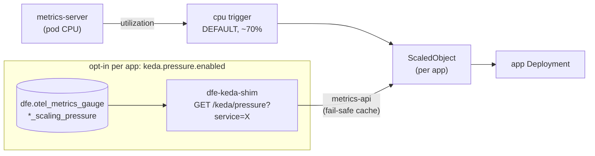

# KEDA scaling patterns

CPU is the fleet default, scalo ScalingPressure is opt-in per app via the
owned fail-safe `dfe-keda-shim`. On any shim or ClickHouse failure the
last-good value is returned, so scaling freezes at current replicas rather
than running up. There is no Kedify OTEL Scaler and no Prometheus fallback
in the stack.

## The two triggers

**Fleet default: CPU.** Every KEDA-scaled app uses KEDA's native `cpu`
scaler (~70% utilisation, metrics-server) as its DEFAULT trigger - zero
extra code, zero upstream risk.

**scalo ScalingPressure is OPT-IN per app** (`keda.pressure.enabled`), read
via the owned, fail-safe `dfe-keda-shim` (folded into the dfe-engine chart,
runs the engine container image as `dfe-keda-shim run`) rather than any
Prometheus/Kedify path. The signal is read from the OTel pipeline's
ClickHouse table (`otel_metrics_gauge`). Full fail-safe mechanics:
[hunt-runner-scaling](../data-plane/hunt-runner-scaling.md).

### Which gauge rows the shim reads

scalo registers the composite as a bare `scaling_pressure` gauge and each app
chooses whether to put its own metrics namespace in front of it, so the same
signal arrives as `scaling_pressure` (dfe-archiver, dfe-transform-vrl),
`dfe_scaling_pressure` (dfe-receiver), `dfe_loader_scaling_pressure` or
`dfe_fetcher_scaling_pressure`. The matching rule is therefore:

- **Name:** the bare `scaling_pressure`, plus any `<prefix>_scaling_pressure`.
  Nothing else matches, so a metric that merely ends in the words does not.
- **Service:** `ServiceName` is the app instance, matched exactly.
- **Reduction:** each series - one metric name with one attribute set - is
  averaged over the 60s window, then the MAX across series is returned.
  dfe-fetcher tags its rows `name="fetch"` and the others tag nothing, so
  averaging across attribute sets would report a busy series and an idle one as
  one lukewarm number.

The rule lives in `src/dfe_engine/scaling_pressure.py` and is substituted into
both query catalogues (the shim's and the app-management reader's), so the
autoscaler and the console can never disagree about what pressure an app is
under. Converging the apps on one wire name is tracked in dfe-infra#302; this
reads whatever they emit today.

## Per-app defaults

| App | Default trigger | Opt-in trigger |
|-----|------------------|-----------------|
| dfe-receiver / dfe-loader / dfe-archiver | CPU ~70% | scalo ScalingPressure (shim) |
| dfe-transform-elastic/vector/wasm/vrl/splack | CPU ~70% | scalo ScalingPressure (shim) |
| dfe-ui | CPU ~70% | - |
| dfe-engine | KEDA disabled by default (control-plane singleton) | CPU (opt-in) |
| dfe-fetcher | KEDA disabled by default | - |
| dfe-hunt-runner | no KEDA - one static pod | BETA: due-hunt backlog via the shim (`metrics-api`, `AverageValue`) - see [hunt-runner-scaling](../data-plane/hunt-runner-scaling.md) |

All ScaledObjects default `minReplicaCount: 1` - there is no scale-to-zero on
the fleet baseline today (`idleReplicaCount` support exists in `_keda.tpl` for
a later opt-in, e.g. the Kafka-pipeline apps once that is wired). A per-app
`keda.triggers` override still exists for a bespoke scaler (e.g. Kafka
consumer lag) where one is genuinely needed, passed through verbatim.
