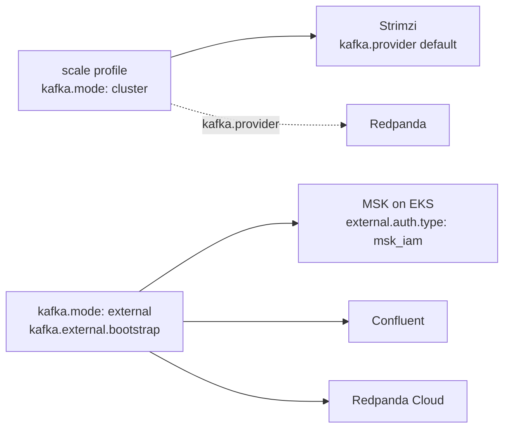
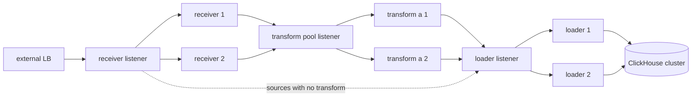

<!--
  Project:   dfe-engine
  File:      docs/deployment/transports.md
  Purpose:   Choosing a profile and a transport; the bus providers; the mesh balancer
  License:   BUSL-1.1
  Copyright: (c) 2026 HYPERI PTY LIMITED
-->

# Transports and profiles

DFE moves records between stages on one of two transports: a data bus, or direct gRPC. The profile picks which one, and every stage is bound to it at deploy - on the bus the loader consumes the topic, on direct it listens for a push, and no stage does both. So a deployment carries one transport, `GET /api/v1/system/deployment` reports that one, and a source naming the other is refused at save rather than accepted into a flow that lands nowhere. The flow itself is [../data-plane/source-flow.md](../data-plane/source-flow.md).

## Pick the profile by what you need to survive

| Need | Profile | Why |
|---|---|---|
| smallest footprint, a stage may drop records while another is down | slim | one pod per stage, direct gRPC, no broker |
| records survive a stage outage on one node | single | one broker holds them |
| records survive outages and the stack scales out | scale | broker cluster, replicated ClickHouse, KEDA |
| scale out without running a broker | mesh | HA pools behind per-pool listeners; the receiver buffers instead of a bus |

## The bus is Kafka, the broker is a swap

Two values in the deploy repo select the broker. `kafka.provider` chooses which operator deploys it in-cluster: Strimzi by default, Redpanda behind a licence gate. `kafka.mode: external` with `kafka.external.bootstrap` points the stack at a broker you already run: MSK on EKS, Confluent, Redpanda Cloud. Deployed brokers always use SCRAM-SHA-512, so the apps' client config is identical across them; an external broker that mandates IAM sets `external.auth.type: msk_iam`. Nothing in the engine changes for any of these. Sizing and the swap matrix: [backing-services.md](backing-services.md).

## The mesh tier balances between pools with a listener per pool

Every stage on `mesh` is a pool of replicas. A Kubernetes Service in front of a pool balances per connection, and gRPC holds long connections, so one sender would pin one pod. The profile places a listener in front of each pool; senders address the listener and every request is balanced. One chart helper renders the same listener for every pool as Gateway API resources (a Gateway listener plus a GRPCRoute), so the balancer is a GatewayClass value: Envoy Gateway by default, because the deployment already runs it for its external routes, or a cloud provider's Gateway API class where the swap is the class name alone.

The transform pool is drawn as the profile provides it. dfe-transform-vrl and dfe-transform-vector carry a Push listener; dfe-transform-elastic does not yet, so a direct source that names it is refused at save - see [../data-plane/source-flow.md](../data-plane/source-flow.md).

## Buffering without a bus

On the direct transport no stage stores records, so what the receiver and the fetcher hold is the only slack in the chain. The fetcher needs no tuning: it stops fetching while its output is unhealthy and resumes where its cursor left off. The receiver has senders it cannot pause. Its default buffer takes 85% of the pod's memory limit and back-pressures at 80% of that, so the `mesh` profile raises `buffer.memory_limit` and turns on `buffer.spillover` to a volume, and the values file states the trade: a loader outage shorter than the buffer is invisible to senders, a longer one back-pressures them. The knobs are the receiver's own (`config.example.yaml`, `buffer:`), so a deployer tunes them in the overlay like any other dial.
